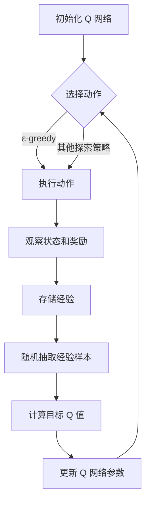

# 大语言模型原理与工程实践：DQN 训练：探索策略

作者：禅与计算机程序设计艺术

## 1. 背景介绍

### 1.1 大语言模型的崛起

近年来，随着深度学习技术的飞速发展，大语言模型（Large Language Models, LLMs）逐渐走进大众视野，并在各个领域展现出惊人的能力。从最初的机器翻译、文本生成，到如今的代码生成、对话系统，LLMs 的应用范围不断扩大，其强大的学习能力和泛化能力令人惊叹。

### 1.2 强化学习与 LLM 的结合

强化学习（Reinforcement Learning, RL）作为机器学习的一个重要分支，其目标是让智能体（Agent）在与环境的交互过程中，通过不断试错来学习最优策略，从而最大化累积奖励。将强化学习应用于 LLM 训练，可以赋予 LLM 更强的决策能力和交互能力，使其能够在更加复杂的任务中表现出色。

### 1.3 DQN：深度 Q 网络

DQN（Deep Q-Network）是一种经典的强化学习算法，它结合了深度学习和 Q-learning 的优势，能够有效地解决高维状态空间和动作空间下的决策问题。DQN 通过神经网络来逼近状态-动作值函数（Q 函数），并利用经验回放机制来提高样本效率。

## 2. 核心概念与联系

### 2.1 强化学习基本要素

* **智能体（Agent）**:  与环境进行交互并执行动作的学习主体。
* **环境（Environment）**:  智能体所处的外部世界，为智能体提供状态信息和奖励信号。
* **状态（State）**:  环境在某个时刻的描述，包含了智能体做出决策所需的信息。
* **动作（Action）**:  智能体在某个状态下可以采取的操作。
* **奖励（Reward）**:  环境对智能体动作的反馈，用于评估动作的好坏。
* **策略（Policy）**:  智能体根据当前状态选择动作的规则。
* **值函数（Value Function）**:  用于评估状态或状态-动作对的长期价值。

### 2.2 DQN 算法核心思想

DQN 算法的核心思想是利用深度神经网络来逼近 Q 函数，然后根据 Q 函数来选择最优动作。具体来说，DQN 算法维护两个神经网络：

* **目标网络 (Target Network)**：用于计算目标 Q 值，其参数更新频率较低。
* **预测网络 (Prediction Network)**：用于计算当前 Q 值，其参数更新频率较高。

在训练过程中，DQN 算法通过最小化目标 Q 值和预测 Q 值之间的差异来更新网络参数。

### 2.3 探索策略

在强化学习中，探索（Exploration）是指智能体尝试不同的动作，以获取更多关于环境的信息。探索策略决定了智能体如何在已知信息和未知信息之间进行权衡。常见的探索策略包括：

* **ε-贪婪策略 (ε-greedy)**：以 ε 的概率随机选择动作，以 1-ε 的概率选择当前 Q 值最大的动作。
* **Softmax 策略**:  根据 Q 值的分布，以一定的概率选择不同的动作。
* **UCB 策略 (Upper Confidence Bound)**：选择具有最大 UCB 值的动作，UCB 值综合考虑了 Q 值和动作被选择的次数。

## 3. 核心算法原理具体操作步骤

### 3.1 算法流程图



### 3.2 算法步骤详解

1. **初始化 Q 网络**：随机初始化预测网络和目标网络的参数。
2. **选择动作**:  根据当前状态和探索策略选择要执行的动作。
3. **执行动作**:  在环境中执行选择的动作，并观察环境返回的下一个状态和奖励。
4. **观察状态和奖励**:  获取环境返回的下一个状态和奖励信息。
5. **存储经验**:  将当前状态、执行的动作、获得的奖励和下一个状态存储到经验回放池中。
6. **随机抽取经验样本**:  从经验回放池中随机抽取一批经验样本。
7. **计算目标 Q 值**:  
    * 对于非终止状态，目标 Q 值为：$r + γ * max_{a'} Q_{target}(s', a')$，其中 r 为当前奖励，γ 为折扣因子，s' 为下一个状态，a' 为下一个状态下所有可能的动作。
    * 对于终止状态，目标 Q 值为：$r$。
8. **更新 Q 网络参数**:  使用梯度下降算法最小化目标 Q 值和预测 Q 值之间的差异，从而更新预测网络的参数。
9. **更新目标网络参数**:  每隔一定的步数，将预测网络的参数复制到目标网络中。

## 4. 数学模型和公式详细讲解举例说明

### 4.1 Q 函数

Q 函数用于评估在某个状态下采取某个动作的长期价值。对于状态-动作对 (s, a)，其 Q 值表示为 Q(s, a)，表示在状态 s 下采取动作 a 后，智能体期望获得的累积奖励。

### 4.2 Bellman 方程

Bellman 方程是强化学习中的一个基本方程，它描述了当前状态的价值与未来状态的价值之间的关系。对于 Q 函数，其 Bellman 方程可以表示为：

$$Q(s, a) = E[r + γ * max_{a'} Q(s', a')]$$

其中，E 表示期望，r 表示当前奖励，γ 表示折扣因子，s' 表示下一个状态，a' 表示下一个状态下所有可能的动作。

### 4.3 DQN 损失函数

DQN 算法使用如下损失函数来更新预测网络的参数：

$$L(θ) = E[(r + γ * max_{a'} Q_{target}(s', a') - Q(s, a))^2]$$

其中，θ 表示预测网络的参数，$Q_{target}(s', a')$ 表示目标网络输出的 Q 值，Q(s, a) 表示预测网络输出的 Q 值。

### 4.4 举例说明

假设有一个迷宫游戏，智能体需要从起点走到终点。迷宫中有障碍物和奖励，智能体每走一步会消耗一定的能量。我们可以使用 DQN 算法来训练一个智能体，让它能够找到最短路径并获得最多的奖励。

* **状态**:  智能体在迷宫中的位置。
* **动作**:  智能体可以向上、下、左、右移动。
* **奖励**:  
    * 到达终点获得 +10 的奖励。
    * 遇到障碍物获得 -1 的奖励。
    * 每走一步消耗 -0.1 的能量。

我们可以使用神经网络来逼近 Q 函数，网络的输入是智能体的位置，输出是每个动作对应的 Q 值。通过不断地训练，智能体就可以学会在不同的状态下选择最优的动作，从而以最小的代价到达终点。

## 5. 项目实践：代码实例和详细解释说明

```python
import torch
import torch.nn as nn
import torch.optim as optim
import gym

# 定义 DQN 网络
class DQN(nn.Module):
    def __init__(self, input_dim, output_dim):
        super(DQN, self).__