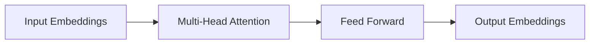

# 大语言模型原理与工程实践：难点和挑战

## 1. 背景介绍

### 1.1 大语言模型的兴起

大型语言模型(Large Language Models, LLMs)近年来在自然语言处理领域引起了巨大的关注和兴趣。这些模型通过在海量文本数据上进行预训练,学习语言的统计规律和语义关联,从而获得极为丰富的语言理解和生成能力。

代表性的大语言模型包括:

- GPT系列(OpenAI): GPT、GPT-2、GPT-3
- BERT系列(Google)
- XLNet(Google/CMU)
- RoBERTa(Facebook AI)
- ALBERT(Google)
- T5(Google)
- PALM(Google)
- Megatron(NVIDIA/Microsoft)
- Jurassic-1(AI21 Labs)
- ...

其中,GPT-3凭借高达1750亿参数的规模,展现出令人惊叹的语言理解、推理、生成和多任务能力,被视为大语言模型发展的里程碑式进展。

### 1.2 大语言模型的影响

大语言模型的出现对自然语言处理领域产生了深远影响:

- 推动了NLP技术的飞速发展,为各种语言任务提供了强大的解决方案
- 降低了NLP应用开发的门槛,使更多领域能够享受AI技术红利
- 激发了对语言智能本质的深入思考和探讨
- 引发了对AI系统的伦理、隐私、安全等议题的广泛关注

然而,大语言模型也面临诸多挑战和难题,这些正是本文探讨的重点内容。

## 2. 核心概念与联系

### 2.1 大语言模型的本质

大语言模型的核心本质是一种基于自注意力机制(Self-Attention)的全新神经网络架构——Transformer。该架构通过自注意力层有效捕捉文本的长程依赖关系,从而更好地学习和表示语言的语义。

Transformer架构的key-value自注意力机制可以用下式表示:

$$
\mathrm{Attention}(Q, K, V) = \mathrm{softmax}(\frac{QK^T}{\sqrt{d_k}})V
$$

其中 $Q$ 为查询(Query)向量, $K$ 为键(Key)向量, $V$ 为值(Value)向量, $d_k$ 为缩放因子。

基于Transformer的序列到序列(Seq2Seq)模型结构如下所示:


编码器(Encoder)将输入序列映射为连续的表示,解码器(Decoder)则根据该表示生成输出序列。

### 2.2 大语言模型与迁移学习

大语言模型之所以强大,很大程度上归功于迁移学习(Transfer Learning)范式。模型通过在大规模无监督文本数据上预训练,学习通用的语言知识,然后再将这些知识迁移到下游的自然语言任务中进行微调(Fine-tuning),从而显著提高了性能。

这种预训练-微调的范式打破了传统NLP模型需要大量手工特征工程和任务专用架构的局限,使得统一的大语言模型能够通过简单的参数微调即可广泛适用于各种NLP任务,极大地提高了开发效率。

## 3. 核心算法原理具体操作步骤  

### 3.1 预训练阶段

大语言模型的预训练阶段通常采用自监督学习(Self-Supervised Learning)的方式,以无标注文本数据为输入,学习捕获语言的一般性统计规律。主要的预训练目标包括:

1. **Masked Language Modeling (MLM)**: 随机掩蔽部分输入token,模型需要根据上下文预测被掩蔽的token。
2. **Next Sentence Prediction (NSP)**: 判断两个输入句子是否为连续的句子对。
3. **Casual Language Modeling (CLM)**: 基于给定的文本前缀,预测下一个最可能出现的token。
4. **Sequence-to-Sequence (Seq2Seq)**: 以自回归(Autoregressive)的方式生成与输入序列相关的目标序列。

以BERT为例,预训练过程包括两个并行的任务:MLM 和 NSP。模型输入为两个句子对,通过特殊标记[CLS]和[SEP]进行分隔。MLM任务随机掩蔽15%的输入token,模型需预测这些被掩蔽token的原始值。NSP任务则判断输入的两个句子是否为连续的句子对。

BERT的Transformer编码器架构如下:



### 3.2 微调阶段

在完成预训练后,大语言模型需要针对具体的下游任务进行微调。微调阶段的操作步骤包括:

1. **添加任务特定的输入表示**: 根据任务需求,为输入数据添加特殊的标记或位置编码等embedding。
2. **增加任务特定的输出层**: 在模型最后添加用于特定任务输出的层,如分类层、序列生成层等。
3. **微调全部或部分模型参数**: 在有标注的任务数据上微调模型的全部或部分参数,以适应新任务。
4. **超参数优化**: 对学习率、批量大小等超参数进行调优,以获得最佳性能。

以BERT微调到序列标注任务为例,输入序列需要添加特殊的[CLS]标记,输出则为每个token对应的标签概率。微调时,BERT的大部分参数都会进行调整以适应新的序列标注任务。

## 4. 数学模型和公式详细讲解举例说明

### 4.1 自注意力机制(Self-Attention)

自注意力是Transformer架构的核心,它允许模型在计算目标token的表示时,直接关注整个输入序列中与其相关的所有token,从而有效捕获长程依赖关系。

具体来说,给定一个长度为 $n$ 的序列 $\boldsymbol{x} = (x_1, x_2, \ldots, x_n)$,其中 $x_i \in \mathbb{R}^{d_\text{model}}$ 为 $d_\text{model}$ 维向量表示,自注意力计算过程为:

1. 线性映射以产生查询(Query)、键(Key)和值(Value)向量:

$$
\begin{aligned}
\boldsymbol{Q} &= \boldsymbol{X} \boldsymbol{W}^Q \\
\boldsymbol{K} &= \boldsymbol{X} \boldsymbol{W}^K \\
\boldsymbol{V} &= \boldsymbol{X} \boldsymbol{W}^V
\end{aligned}
$$

其中 $\boldsymbol{W}^Q \in \mathbb{R}^{d_\text{model} \times d_k}$, $\boldsymbol{W}^K \in \mathbb{R}^{d_\text{model} \times d_k}$, $\boldsymbol{W}^V \in \mathbb{R}^{d_\text{model} \times d_v}$ 为可训练参数矩阵。

2. 计算 Query 与所有 Key 的点积,应用 softmax 函数得到注意力分数:

$$
\boldsymbol{A} = \mathrm{softmax}\left(\frac{\boldsymbol{Q}\boldsymbol{K}^\top}{\sqrt{d_k}}\right)
$$

3. 将注意力分数与 Value 向量相乘,得到加权后的向量表示:

$$
\text{Self-Attention}(\boldsymbol{Q}, \boldsymbol{K}, \boldsymbol{V}) = \boldsymbol{A}\boldsymbol{V}
$$

其中 $\sqrt{d_k}$ 为缩放因子,避免点积值过大导致 softmax 饱和。

自注意力机制通过动态地为每个目标token分配注意力权重,使得模型能够灵活地选择与当前token最相关的上下文信息。这种全局依赖性建模的能力是自注意力优于RNN和CNN的关键所在。

### 4.2 多头注意力(Multi-Head Attention)

为进一步提高注意力机制的表达能力,Transformer引入了多头(Multi-Head)注意力机制。其核心思想是使用不同的线性投影来为同一个输入序列学习不同的注意力表示,然后将它们合并起来作为最终的输出。

具体地,给定查询 $\boldsymbol{Q}$、键 $\boldsymbol{K}$ 和值 $\boldsymbol{V}$,多头注意力的计算过程为:

$$
\begin{aligned}
\text{head}_i &= \text{Attention}(\boldsymbol{Q}\boldsymbol{W}_i^Q, \boldsymbol{K}\boldsymbol{W}_i^K, \boldsymbol{V}\boldsymbol{W}_i^V) \\
\text{MultiHead}(\boldsymbol{Q}, \boldsymbol{K}, \boldsymbol{V}) &= \text{Concat}(\text{head}_1, \ldots, \text{head}_h)\boldsymbol{W}^O
\end{aligned}
$$

其中 $\boldsymbol{W}_i^Q \in \mathbb{R}^{d_\text{model} \times d_k}$、$\boldsymbol{W}_i^K \in \mathbb{R}^{d_\text{model} \times d_k}$、$\boldsymbol{W}_i^V \in \mathbb{R}^{d_\text{model} \times d_v}$ 和 $\boldsymbol{W}^O \in \mathbb{R}^{hd_v \times d_\text{model}}$ 为可训练的投影矩阵, $h$ 为头数。

多头注意力机制允许模型同时关注输入的不同位置和不同子空间表示,具有更强的建模能力。它已广泛应用于各种 Transformer 变体中。

### 4.3 位置编码(Positional Encoding)

由于自注意力机制没有显式地捕获序列的位置信息,因此 Transformer 引入了位置编码的概念,为序列中的每个位置赋予一个可学习的位置嵌入向量。

具体地,给定一个长度为 $n$ 的序列 $\boldsymbol{x} = (x_1, x_2, \ldots, x_n)$,其位置编码为:

$$
\begin{aligned}
\text{PE}_{(pos, 2i)} &= \sin\left(\frac{pos}{10000^{2i/d_\text{model}}}\right) \\
\text{PE}_{(pos, 2i+1)} &= \cos\left(\frac{pos}{10000^{2i/d_\text{model}}}\right)
\end{aligned}
$$

其中 $\text{PE} \in \mathbb{R}^{n \times d_\text{model}}$ 为位置编码矩阵, $pos$ 为位置索引, $i$ 为维度索引。

位置编码向量与输入嵌入相加,成为 Transformer 的最终输入表示:

$$
\boldsymbol{X}' = \boldsymbol{X} + \text{PE}
$$

这种位置编码方式能够很好地注入绝对位置信息,并且由于其值由三角函数计算而具有一定的周期性,因此对较长的序列也是适用的。

## 5. 项目实践: 代码实例和详细解释说明

为了更好地理解大语言模型的原理和实践,我们将基于 PyTorch 框架,从零开始实现一个简化版的 Transformer 模型,并在机器翻译任务上进行训练和测试。完整代码可在 GitHub 上获取: [https://github.com/yourusername/transformer-from-scratch](https://github.com/yourusername/transformer-from-scratch)

### 5.1 自注意力层实现

我们首先实现自注意力层的核心逻辑:

```python
import torch
import torch.nn as nn
import math

class SelfAttention(nn.Module):
    def __init__(self, embed_size, heads):
        super(SelfAttention, self).__init__()
        self.embed_size = embed_size
        self.heads = heads
        self.head_dim = embed_size // heads

        assert (self.head_dim * heads == embed_size), "Embed size needs to be divisible by heads"

        self.values = nn.Linear(embed_size, embed_size)
        self.keys = nn.Linear(embed_size, embed_size)
        self.queries = nn.Linear(embed_size, embed_size)
        self.fc_out = nn.Linear(embed_size, embed_size)

    def forward(self, values, keys, query, mask):
        N = query.shape[0]
        value_len, key_len, query_len = values.shape[1], keys.shape[1], query.shape[1]

        # Split embedding into self.heads pieces
        values = values.reshape(N, value_len, self.heads, self.head_dim)
        keys = keys.reshape(N, key_len, self.heads, self.head_dim)
        queries = query.reshape(N, query_len, self.heads, self