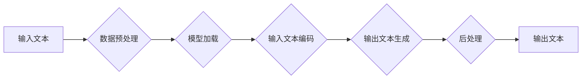

# 大语言模型原理基础与前沿 不需要额外训练即可利用预训练模型

作者：禅与计算机程序设计艺术

## 1. 背景介绍

### 1.1 大语言模型的兴起

近年来，随着深度学习技术的飞速发展，大语言模型（LLM，Large Language Model）逐渐成为人工智能领域的研究热点。这些模型通常拥有数十亿甚至数千亿的参数，能够在海量文本数据上进行训练，并展现出惊人的语言理解和生成能力。例如，OpenAI 的 GPT-3 模型可以生成逼真的对话、编写创意故事、翻译语言，甚至编写代码。

### 1.2 预训练模型的优势

预训练模型的一大优势在于，它们已经在大规模数据集上进行了训练，具备了强大的泛化能力。这意味着，我们可以直接利用这些预训练模型，而不需要进行额外的训练，从而节省大量的时间和计算资源。

### 1.3 本文的意义

本文旨在深入探讨大语言模型的原理基础和前沿技术，重点介绍如何利用预训练模型，而不需要进行额外的训练。我们将涵盖以下内容：

* 大语言模型的核心概念与联系
* 核心算法原理和具体操作步骤
* 数学模型和公式详细讲解举例说明
* 项目实践：代码实例和详细解释说明
* 实际应用场景
* 工具和资源推荐
* 总结：未来发展趋势与挑战
* 附录：常见问题与解答

## 2. 核心概念与联系

### 2.1 自然语言处理（NLP）

自然语言处理（NLP，Natural Language Processing）是人工智能的一个重要分支，旨在让计算机理解和处理人类语言。NLP 的应用范围非常广泛，包括机器翻译、文本摘要、情感分析、问答系统等等。

### 2.2 深度学习（Deep Learning）

深度学习是机器学习的一个子领域，其灵感来源于人脑神经网络的结构和功能。深度学习模型通常由多个神经元层组成，能够学习复杂的非线性关系，从而实现对数据的精准预测和分析。

### 2.3 大语言模型（LLM）

大语言模型是基于深度学习的自然语言处理模型，其特点是拥有庞大的参数规模和强大的语言理解能力。大语言模型通常采用 Transformer 架构，该架构能够有效地捕捉文本数据中的长距离依赖关系。

### 2.4 预训练模型

预训练模型是指在大规模数据集上已经训练好的模型，可以用于各种下游 NLP 任务，例如文本分类、情感分析、问答系统等等。

### 2.5 核心概念之间的联系

自然语言处理为大语言模型提供了应用场景，深度学习为大语言模型提供了技术基础，而预训练模型则为大语言模型的应用提供了便利。

## 3. 核心算法原理具体操作步骤

### 3.1 Transformer 架构

Transformer 架构是大语言模型的核心组件，其主要特点是采用了自注意力机制（Self-Attention Mechanism）。自注意力机制能够捕捉文本数据中不同位置之间的语义联系，从而实现对文本的精准理解。

#### 3.1.1 自注意力机制

自注意力机制的核心思想是，对于输入文本中的每个单词，计算其与其他所有单词之间的相关性，并根据相关性的大小为每个单词分配不同的权重。这样，模型就能更加关注与当前单词语义相关的其他单词，从而提高文本理解的精度。

#### 3.1.2 多头注意力机制

为了进一步提升模型的表达能力，Transformer 架构还引入了多头注意力机制（Multi-Head Attention Mechanism）。多头注意力机制是指，将自注意力机制应用于多个不同的子空间，从而捕捉文本数据中不同方面的语义信息。

### 3.2 编码器-解码器结构

Transformer 架构通常采用编码器-解码器结构，其中编码器负责将输入文本编码成语义向量，解码器则负责根据语义向量生成输出文本。

#### 3.2.1 编码器

编码器由多个 Transformer 模块堆叠而成，每个模块都包含自注意力层、前馈神经网络层和残差连接。自注意力层负责捕捉文本数据中的长距离依赖关系，前馈神经网络层负责对文本进行非线性变换，残差连接则有助于缓解梯度消失问题。

#### 3.2.2 解码器

解码器与编码器类似，也由多个 Transformer 模块堆叠而成。不同的是，解码器还包含一个掩码多头注意力层，该层用于防止模型在生成输出文本时看到未来的信息。

### 3.3 具体操作步骤

#### 3.3.1 数据预处理

在使用预训练模型之前，需要对输入文本进行预处理，例如分词、去除停用词、转换为数字表示等等。

#### 3.3.2 模型加载

加载预训练模型，例如 GPT-3、BERT 等等。

#### 3.3.3 输入文本编码

将预处理后的输入文本输入到编码器，得到语义向量。

#### 3.3.4 输出文本生成

将语义向量输入到解码器，生成输出文本。

#### 3.3.5 后处理

对生成的输出文本进行后处理，例如去除重复内容、修正语法错误等等。

## 4. 数学模型和公式详细讲解举例说明

### 4.1 自注意力机制的数学公式

自注意力机制的数学公式如下：

$$
Attention(Q, K, V) = softmax(\frac{QK^T}{\sqrt{d_k}})V
$$

其中：

* $Q$ 表示查询矩阵，维度为 $[N, d_k]$。
* $K$ 表示键矩阵，维度为 $[M, d_k]$。
* $V$ 表示值矩阵，维度为 $[M, d_v]$。
* $d_k$ 表示键和查询向量的维度。
* $softmax$ 表示 softmax 函数。

### 4.2 多头注意力机制的数学公式

多头注意力机制的数学公式如下：

$$
MultiHead(Q, K, V) = Concat(head_1, ..., head_h)W^O
$$

其中：

* $head_i = Attention(QW_i^Q, KW_i^K, VW_i^V)$ 表示第 $i$ 个头的注意力输出。
* $W_i^Q$、$W_i^K$ 和 $W_i^V$ 表示第 $i$ 个头的线性变换矩阵。
* $W^O$ 表示输出线性变换矩阵。
* $Concat$ 表示拼接操作。

### 4.3 举例说明

假设输入文本为 "The quick brown fox jumps over the lazy dog"，我们使用一个 2 头的 Transformer 模型进行编码。

#### 4.3.1 第 1 个头

* 查询矩阵 $Q$ 为 "The" 的词向量。
* 键矩阵 $K$ 为所有单词的词向量。
* 值矩阵 $V$ 为所有单词的词向量。

通过自注意力机制，模型计算 "The" 与其他所有单词之间的相关性，并根据相关性的大小为每个单词分配不同的权重。例如，"The" 与 "quick" 的相关性较高，因此 "quick" 的权重较大。

#### 4.3.2 第 2 个头

* 查询矩阵 $Q$ 为 "quick" 的词向量。
* 键矩阵 $K$ 为所有单词的词向量。
* 值矩阵 $V$ 为所有单词的词向量。

通过自注意力机制，模型计算 "quick" 与其他所有单词之间的相关性，并根据相关性的大小为每个单词分配不同的权重。例如，"quick" 与 "brown" 的相关性较高，因此 "brown" 的权重较大。

#### 4.3.3 多头注意力输出

将两个头的注意力输出拼接起来，得到最终的编码向量。

## 5. 项目实践：代码实例和详细解释说明

### 5.1 使用 Hugging Face Transformers 库

Hugging Face Transformers 库是一个开源的自然语言处理库，提供了各种预训练模型和工具，方便用户进行 NLP 任务。

#### 5.1.1 安装 Transformers 库

```python
pip install transformers
```

#### 5.1.2 加载预训练模型

```python
from transformers import pipeline

# 加载 GPT-3 模型
generator = pipeline('text-generation', model='gpt3')
```

#### 5.1.3 生成文本

```python
# 输入文本
input_text = "The quick brown fox jumps over the lazy dog."

# 生成文本
output_text = generator(input_text, max_length=50, num_return_sequences=3)

# 打印输出文本
print(output_text)
```

### 5.2 代码实例详细解释说明

* `pipeline` 函数用于创建一个 NLP 任务管道。
* `text-generation` 表示文本生成任务。
* `gpt3` 表示 GPT-3 模型。
* `max_length` 参数指定生成文本的最大长度。
* `num_return_sequences` 参数指定生成文本的数量。

## 6. 实际应用场景

### 6.1 文本生成

大语言模型可以用于生成各种类型的文本，例如：

* 对话生成
* 故事创作
* 新闻报道
* 代码编写

### 6.2 文本理解

大语言模型可以用于理解文本的语义，例如：

* 文本分类
* 情感分析
* 问答系统
* 关键词提取

### 6.3 代码生成

大语言模型可以用于生成代码，例如：

* 代码补全
* 代码生成
* 代码翻译

## 7. 工具和资源推荐

### 7.1 Hugging Face Transformers 库

Hugging Face Transformers 库是一个开源的自然语言处理库，提供了各种预训练模型和工具，方便用户进行 NLP 任务。

### 7.2 OpenAI API

OpenAI API 提供了对 GPT-3 模型的访问接口，用户可以通过 API 调用 GPT-3 模型进行文本生成、代码生成等任务。

### 7.3 Google Colab

Google Colab 是一个免费的云端 Python 开发环境，提供了 GPU 和 TPU 资源，方便用户进行深度学习模型的训练和测试。

## 8. 总结：未来发展趋势与挑战

### 8.1 未来发展趋势

* 模型规模将继续扩大，参数规模将达到数万亿甚至更高。
* 模型的泛化能力将进一步提升，能够处理更加复杂的任务。
* 模型的效率将不断提高，训练和推理速度将更快。

### 8.2 挑战

* 模型的可解释性仍然是一个挑战，我们需要更好地理解模型的决策过程。
* 模型的安全性需要得到保障，防止模型被用于恶意目的。
* 模型的伦理问题需要得到重视，确保模型的应用符合伦理道德规范。

## 9. 附录：常见问题与解答

### 9.1 如何选择合适的预训练模型？

选择合适的预训练模型需要考虑以下因素：

* 任务类型
* 数据集规模
* 计算资源

### 9.2 如何评估预训练模型的性能？

可以使用以下指标评估预训练模型的性能：

* 准确率
* 精确率
* 召回率
* F1 值

### 9.3 如何 fine-tune 预训练模型？

fine-tune 预训练模型是指在特定任务的数据集上对预训练模型进行微调，从而提高模型在该任务上的性能。fine-tune 的步骤如下：

* 加载预训练模型
* 在特定任务的数据集上训练模型
* 评估模型性能

## 10. Mermaid 流程图


