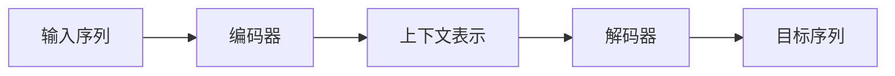

# 大语言模型原理基础与前沿：偏见

## 1. 背景介绍

### 1.1 大语言模型的兴起

近年来，自然语言处理领域取得了突破性进展，特别是大语言模型（LLM）的出现，如 OpenAI 的 GPT-3、Google 的 BERT 和 Facebook 的 RoBERTa 等。这些模型在海量文本数据上进行训练，展现出惊人的语言理解和生成能力，并在机器翻译、文本摘要、问答系统等任务中取得了显著成果。

### 1.2 偏见问题：不可忽视的阴影

然而，随着大语言模型的广泛应用，其潜在的风险也逐渐暴露出来，其中最引人关注的便是模型的“偏见”问题。由于训练数据中不可避免地存在社会偏见，导致模型在学习过程中也吸收了这些偏见，并在生成文本时将其反映出来，例如性别歧视、种族歧视等。

### 1.3 本文目标：剖析偏见，探索未来

本文旨在深入探讨大语言模型中的偏见问题。首先，我们将介绍大语言模型的核心概念、原理以及训练过程，帮助读者建立起对该领域的初步认识。接着，我们将重点分析大语言模型产生偏见的原因，并介绍几种常见的偏见类型。然后，我们将探讨如何评估和缓解大语言模型中的偏见问题，并介绍一些最新的研究进展。最后，我们将展望大语言模型的未来发展趋势，并提出一些思考和挑战。

## 2. 核心概念与联系

### 2.1 什么是大语言模型？

大语言模型本质上是一种基于深度学习的语言模型，其特点是模型参数量巨大，通常包含数十亿甚至数千亿个参数。这些模型通过在海量文本数据上进行自监督学习，学习语言的统计规律和语义信息，从而具备强大的语言理解和生成能力。

### 2.2 大语言模型的关键技术

#### 2.2.1 Transformer 架构

Transformer 是一种基于自注意力机制的神经网络架构，其特点是能够并行处理序列数据，并且可以捕捉长距离依赖关系，因此在大语言模型中得到了广泛应用。

#### 2.2.2 自监督学习

自监督学习是一种机器学习范式，其特点是利用数据自身的结构信息进行学习，而不需要人工标注标签。在大语言模型中，通常采用掩码语言模型（MLM）和下一句预测（NSP）等自监督学习任务进行训练。

### 2.3 大语言模型与偏见的联系

大语言模型的训练数据通常来源于互联网，而互联网上的文本数据不可避免地包含着各种社会偏见。例如，在描述某些职业时，可能会更多地使用男性化的词汇，而在描述某些种族时，可能会使用带有负面色彩的词汇。这些偏见信息会被模型在训练过程中学习到，并在生成文本时反映出来，从而导致模型输出带有偏见的文本。

## 3. 核心算法原理具体操作步骤

### 3.1 Transformer 架构详解

#### 3.1.1 自注意力机制

自注意力机制是 Transformer 架构的核心，其作用是让模型能够关注输入序列中不同位置的信息，从而捕捉长距离依赖关系。

具体来说，自注意力机制首先将输入序列中的每个词向量分别乘以三个不同的矩阵，得到查询向量（Query）、键向量（Key）和值向量（Value）。然后，计算每个查询向量与所有键向量的点积，并进行缩放和 Softmax 操作，得到每个词在所有词上的注意力权重。最后，将所有值向量按照注意力权重加权求和，得到每个词的上下文表示。

```
# 自注意力机制计算过程
def self_attention(Q, K, V):
    # 计算注意力权重
    attention_scores = tf.matmul(Q, K, transpose_b=True)
    attention_scores /= tf.math.sqrt(tf.cast(tf.shape(K)[-1], tf.float32))
    attention_weights = tf.nn.softmax(attention_scores, axis=-1)
    
    # 加权求和
    context_vector = tf.matmul(attention_weights, V)
    
    return context_vector
```

#### 3.1.2 多头注意力机制

为了捕捉不同类型的语义信息，Transformer 架构中通常使用多头注意力机制。多头注意力机制将自注意力机制重复多次，每次使用不同的参数矩阵，并将多个注意力头的输出拼接在一起，从而获得更丰富的上下文表示。

```
# 多头注意力机制计算过程
def multi_head_attention(Q, K, V, num_heads):
    # 将输入向量分割成多个头
    Q_heads = tf.split(Q, num_heads, axis=-1)
    K_heads = tf.split(K, num_heads, axis=-1)
    V_heads = tf.split(V, num_heads, axis=-1)
    
    # 计算每个头的自注意力
    attention_heads = []
    for i in range(num_heads):
        attention_head = self_attention(Q_heads[i], K_heads[i], V_heads[i])
        attention_heads.append(attention_head)
    
    # 拼接所有头的输出
    multi_head_output = tf.concat(attention_heads, axis=-1)
    
    return multi_head_output
```

#### 3.1.3 位置编码

由于 Transformer 架构本身并不能捕捉序列的位置信息，因此需要引入位置编码来表示词在句子中的位置。位置编码通常是一个与词向量维度相同的向量，可以通过正弦函数和余弦函数生成。

```
# 位置编码计算过程
def positional_encoding(position, d_model):
    # 计算角度
    angle_rads = get_angles(np.arange(position)[:, np.newaxis],
                          np.arange(d_model)[np.newaxis, :],
                          d_model)
    
    # 应用正弦函数和余弦函数
    angle_rads[:, 0::2] = np.sin(angle_rads[:, 0::2])
    angle_rads[:, 1::2] = np.cos(angle_rads[:, 1::2])
    
    pos_encoding = angle_rads[np.newaxis, ...]
    
    return tf.cast(pos_encoding, dtype=tf.float32)
```

#### 3.1.4 Transformer 编码器-解码器结构

Transformer 架构通常由编码器和解码器两部分组成。编码器负责将输入序列编码成上下文表示，解码器则根据上下文表示生成目标序列。



### 3.2 掩码语言模型（MLM）

掩码语言模型是一种自监督学习任务，其目标是预测被掩盖的词。具体来说，MLM 首先随机掩盖输入序列中的一部分词，然后训练模型根据上下文信息预测被掩盖的词。

```
# 掩码语言模型训练过程
def train_mlm(model, input_sequence, masked_positions, masked_tokens):
    # 将被掩盖的词替换成特殊标记
    masked_input_sequence = input_sequence.copy()
    masked_input_sequence[masked_positions] = MASK_TOKEN
    
    # 将输入序列输入模型，得到预测结果
    predictions = model(masked_input_sequence)
    
    # 计算损失函数
    loss = compute_loss(predictions, masked_tokens)
    
    # 更新模型参数
    update_model_parameters(model, loss)
```

### 3.3 下一句预测（NSP）

下一句预测也是一种自监督学习任务，其目标是判断两个句子是否是连续的。具体来说，NSP 首先从语料库中随机抽取两个句子，然后将这两个句子拼接在一起，并训练模型判断这两个句子是否是连续的。

```
# 下一句预测训练过程
def train_nsp(model, sentence_a, sentence_b, is_next):
    # 将两个句子拼接在一起
    input_sequence = [CLS_TOKEN] + sentence_a + [SEP_TOKEN] + sentence_b + [SEP_TOKEN]
    
    # 将输入序列输入模型，得到预测结果
    prediction = model(input_sequence)
    
    # 计算损失函数
    loss = compute_loss(prediction, is_next)
    
    # 更新模型参数
    update_model_parameters(model, loss)
```

## 4. 数学模型和公式详细讲解举例说明

### 4.1 Softmax 函数

Softmax 函数用于将一个向量转换成概率分布，其公式如下：

$$
\text{softmax}(x_i) = \frac{e^{x_i}}{\sum_{j=1}^{n} e^{x_j}}
$$

其中，$x_i$ 表示向量 $x$ 中的第 $i$ 个元素，$n$ 表示向量 $x$ 的长度。

**举例说明：**

假设有一个向量 $x = [1, 2, 3]$，则其 Softmax 函数值为：

$$
\begin{aligned}
\text{softmax}(x) &= [\text{softmax}(1), \text{softmax}(2), \text{softmax}(3)] \\
&= [\frac{e^1}{e^1 + e^2 + e^3}, \frac{e^2}{e^1 + e^2 + e^3}, \frac{e^3}{e^1 + e^2 + e^3}] \\
&\approx [0.090, 0.245, 0.665]
\end{aligned}
$$

### 4.2 交叉熵损失函数

交叉熵损失函数用于衡量两个概率分布之间的差异，其公式如下：

$$
H(p, q) = -\sum_{i=1}^{n} p_i \log q_i
$$

其中，$p$ 表示真实概率分布，$q$ 表示预测概率分布，$n$ 表示类别数。

**举例说明：**

假设真实标签为 $[0, 1, 0]$，模型预测概率分布为 $[0.1, 0.7, 0.2]$，则交叉熵损失函数值为：

$$
\begin{aligned}
H(p, q) &= -(0 \log 0.1 + 1 \log 0.7 + 0 \log 0.2) \\
&\approx 0.357
\end{aligned}
$$

## 5. 项目实践：代码实例和详细解释说明

### 5.1 使用 TensorFlow 实现 Transformer 模型

```python
import tensorflow as tf

# 定义 Transformer 模型
class Transformer(tf.keras.Model):
    def __init__(self, num_layers, d_model, num_heads, dff, input_vocab_size, target_vocab_size, maximum_position_encoding):
        super(Transformer, self).__init__()

        self.encoder = Encoder(num_layers, d_model, num_heads, dff, input_vocab_size, maximum_position_encoding)
        self.decoder = Decoder(num_layers, d_model, num_heads, dff, target_vocab_size, maximum_position_encoding)

        self.final_layer = tf.keras.layers.Dense(target_vocab_size)

    def call(self, inp, tar, training, enc_padding_mask, look_ahead_mask, dec_padding_mask):