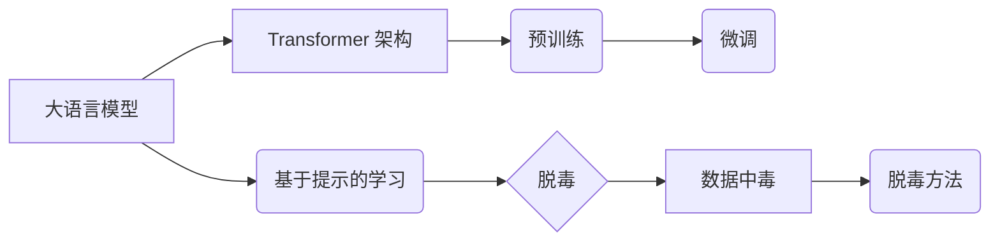

# 大语言模型原理基础与前沿 基于提示的脱毒

作者：禅与计算机程序设计艺术

## 1. 背景介绍

1.1 大语言模型的兴起与安全挑战
1.2 基于提示的学习方法
1.3 脱毒：提升大语言模型安全性的关键

近年来，大语言模型 (LLM) 凭借其强大的文本生成能力在各个领域取得了显著成果。然而，LLM 的安全问题也日益凸显，例如生成有害内容、泄露敏感信息等。为了应对这些挑战，研究人员提出了基于提示的学习方法，通过设计特定的提示来引导 LLM 生成安全、可靠的文本。脱毒作为一种重要的安全技术，旨在消除 LLM 中的有害信息，从而提升其安全性。

## 2. 核心概念与联系

2.1 大语言模型 (LLM)
2.1.1 Transformer 架构
2.1.2 预训练与微调
2.2 基于提示的学习
2.2.1 提示工程
2.2.2 提示链
2.3 脱毒
2.3.1 数据中毒
2.3.2 脱毒方法

**核心概念之间的联系:**



## 3. 核心算法原理具体操作步骤

3.1 基于提示的脱毒方法
3.1.1 提示设计
3.1.2 模型微调
3.2 基于对抗训练的脱毒方法
3.2.1 对抗样本生成
3.2.2 模型鲁棒性提升

**基于提示的脱毒方法操作步骤:**

1. **设计脱毒提示:**  根据目标任务和安全需求，设计特定的提示，引导 LLM 生成安全内容。
2. **使用脱毒提示微调 LLM:** 使用包含脱毒提示的数据集对 LLM 进行微调，使其学习生成安全内容。

**基于对抗训练的脱毒方法操作步骤:**

1. **生成对抗样本:**  使用攻击算法生成对抗样本，这些样本包含有害信息，但对人类来说难以察觉。
2. **使用对抗样本训练 LLM:**  使用对抗样本对 LLM 进行训练，使其学习识别和抵御有害信息。

## 4. 数学模型和公式详细讲解举例说明

4.1 语言模型的概率表示
4.1.1 条件概率
4.1.2 概率分布
4.2 Transformer 模型的数学原理
4.2.1 自注意力机制
4.2.2 位置编码

**语言模型的概率表示:**

语言模型可以表示为一个条件概率分布 $P(y|x)$，其中 $x$ 表示输入文本序列，$y$ 表示输出文本序列。

**Transformer 模型的自注意力机制:**

自注意力机制计算输入序列中每个词与其他词之间的相关性，并生成一个注意力矩阵，用于表示每个词对其他词的关注程度。

$$
Attention(Q, K, V) = softmax(\frac{QK^T}{\sqrt{d_k}})V
$$

其中，$Q$、$K$、$V$ 分别表示查询矩阵、键矩阵和值矩阵，$d_k$ 表示键矩阵的维度。

## 5. 项目实践：代码实例和详细解释说明

5.1 基于提示的脱毒代码示例
5.1.1 Python 代码实现
5.1.2 参数设置与结果分析
5.2 基于对抗训练的脱毒代码示例
5.2.1 Python 代码实现
5.2.2 攻击算法与防御策略

**基于提示的脱毒代码示例 (Python):**

```python
import transformers

# 加载预训练模型
model = transformers.AutoModelForCausalLM.from_pretrained("gpt2")

# 设计脱毒提示
prompt = "Please write a safe and harmless sentence."

# 使用脱毒提示微调模型
model.train(
    input_ids=...,
    attention_mask=...,
    labels=...,
)

# 使用微调后的模型生成文本
output = model.generate(
    input_ids=...,
    attention_mask=...,
    max_length=...,
)
```

## 6. 实际应用场景

6.1 内容审核
6.1.1 社交媒体平台
6.1.2 在线论坛
6.2 安全助手
6.2.1 智能客服
6.2.2 个人助理
6.3 教育领域
6.3.1 教学辅助
6.3.2 考试评估

## 7. 总结：未来发展趋势与挑战

7.1 可解释性与可控制性
7.2 跨语言和跨模态脱毒
7.3 持续学习与自适应脱毒

## 8. 附录：常见问题与解答

8.1 如何选择合适的脱毒方法?
8.2 如何评估脱毒效果?
8.3 如何应对新的安全威胁?

**如何选择合适的脱毒方法?**

选择脱毒方法需要考虑目标任务、安全需求、数据规模、计算资源等因素。

**如何评估脱毒效果?**

可以使用指标如攻击成功率、毒性评分等来评估脱毒效果。

**如何应对新的安全威胁?**

需要持续关注安全研究进展，并不断改进脱毒方法，以应对新的安全威胁。
