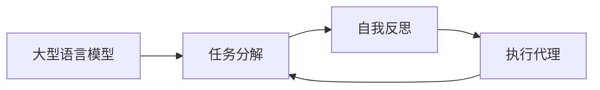

# 大语言模型应用指南：BabyAGI

作者：禅与计算机程序设计艺术

## 1. 背景介绍

### 1.1 引言

近年来，人工智能（AI）取得了显著的进展，尤其是在自然语言处理（NLP）领域。大型语言模型（LLMs）的出现，如 OpenAI 的 GPT-4、Google 的 PaLM 2，标志着 AI 发展的一个重要里程碑。这些模型能够理解和生成人类水平的文本，为各种应用打开了大门，从聊天机器人和内容创作到代码生成和科学发现。

然而，LLMs 的强大功能也伴随着巨大的复杂性。有效地利用这些模型需要深入的技术理解和熟练的工程实践。为了弥合这一差距，出现了 BabyAGI 等新工具和技术，旨在简化和自动化 LLM 的应用。

### 1.2 BabyAGI 的诞生背景

BabyAGI 的出现是为了解决 LLM 应用中的一个关键挑战：**如何将高级目标转化为可执行的步骤序列**。传统的 LLM 应用通常依赖于人工提示工程（prompt engineering）来引导模型生成期望的输出。这种方法既费时又容易出错，需要反复试验才能获得理想的结果。

BabyAGI 采用了一种不同的方法，利用**递归**和**自我反思**的概念来自动化任务分解和执行过程。它将 LLM 作为核心推理引擎，并结合了任务管理和执行代理，创建了一个能够自主地将目标分解为子任务、执行子任务并根据结果调整其行为的系统。

### 1.3 BabyAGI 的意义

BabyAGI 的出现标志着 LLM 应用的一个重要转变，即从人工驱动转向自动化和智能化。它提供了一种更有效、更可靠的方式来利用 LLM 的强大功能，为解决现实世界中的复杂问题开辟了新的可能性。

## 2. 核心概念与联系

### 2.1  大型语言模型（LLMs）

大型语言模型是经过海量文本数据训练的深度学习模型，能够理解和生成自然语言。它们的核心能力包括：

* **文本生成:**  生成流畅、连贯且语法正确的文本。
* **语言理解:**  理解文本的含义、情感和意图。
* **知识表示:**  存储和检索大量信息。
* **推理:**  根据现有信息进行逻辑推理和预测。

### 2.2 任务分解

任务分解是将复杂任务分解成更小、更易于管理的子任务的过程。在 BabyAGI 中，LLM 被用来识别和定义完成高级目标所需的子任务。

### 2.3  自我反思

自我反思是指系统能够监控自身的性能并根据需要进行调整的能力。BabyAGI 利用 LLM 来评估其自身的输出，并根据结果改进其后续行为。

### 2.4  执行代理

执行代理是负责执行 BabyAGI 生成的子任务的软件组件。这些代理可以是简单的脚本，也可以是连接到外部 API 或服务的更复杂的程序。

### 2.5 核心概念联系

下图展示了 BabyAGI 中的核心概念及其联系：



## 3. 核心算法原理具体操作步骤

### 3.1  BabyAGI 的工作流程

BabyAGI 的工作流程可以概括为以下几个步骤：

1. **定义目标：** 用户向 BabyAGI 提供一个高级目标，例如“计划一次去夏威夷的旅行”。
2. **任务分解：** BabyAGI 使用 LLM 将目标分解成更小的子任务，例如“预订航班”、“查找住宿”、“计划行程”。
3. **执行子任务：** BabyAGI 调用执行代理来完成每个子任务。
4. **结果评估：** BabyAGI 使用 LLM 评估每个子任务的结果，并确定是否需要采取进一步的行动。
5. **自我反思：** BabyAGI 根据结果评估更新其内部状态和策略，以便在将来更好地执行任务。
6. **重复步骤 2-5，直到目标达成。**

### 3.2  具体操作步骤

以下是一个使用 BabyAGI 计划夏威夷旅行的示例：

1. **用户输入目标：** “计划一次去夏威夷的旅行。”
2. **任务分解：**
   * LLM 生成子任务列表：
     * 查找航班信息
     * 查找住宿信息
     * 创建行程安排
3. **执行子任务：**
   * 执行代理调用航班搜索 API，找到合适的航班。
   * 执行代理调用酒店预订网站，找到合适的住宿。
   * 执行代理根据用户的兴趣生成行程安排。
4. **结果评估：**
   * LLM 检查航班和酒店预订是否成功。
   * LLM 评估行程安排是否符合用户的喜好。
5. **自我反思：**
   * 如果有任何子任务失败，BabyAGI 将尝试找到替代解决方案。
   * BabyAGI 将根据用户的反馈调整其策略，例如优先考虑更便宜的航班或更靠近海滩的酒店。
6. **重复步骤 2-5，直到旅行计划完成。**

## 4. 数学模型和公式详细讲解举例说明

### 4.1  无数学模型

BabyAGI 主要依赖于 LLM 的能力，而不是复杂的数学模型。它利用 LLM 的语言理解和生成能力来执行任务分解、结果评估和自我反思等步骤。

### 4.2  举例说明

为了更好地理解 BabyAGI 的工作原理，让我们考虑一个更简单的例子：**写一篇关于人工智能的博客文章**。

1. **用户输入目标：** “写一篇关于人工智能的博客文章。”
2. **任务分解：**
   * LLM 生成子任务列表：
     * 研究人工智能的最新趋势
     * 撰写文章大纲
     * 撰写每个部分的内容
     * 校对和编辑文章
3. **执行子任务：**
   * 执行代理使用网络搜索引擎收集关于人工智能的信息。
   * 执行代理根据收集到的信息生成文章大纲。
   * 执行代理使用 LLM 撰写每个部分的内容。
   * 执行代理使用语法检查器和拼写检查器校对和编辑文章。
4. **结果评估：**
   * LLM 检查文章是否涵盖了所有关键主题。
   * LLM 评估文章的清晰度、连贯性和准确性。
5. **自我反思：**
   * 如果文章有任何不足之处，BabyAGI 将尝试改进它们，例如添加更多信息或澄清某些概念。
6. **重复步骤 2-5，直到博客文章完成。**

## 5. 项目实践：代码实例和详细解释说明

### 5.1 代码实例

以下是一个使用 Python 实现 BabyAGI 的简单示例：

```python
from typing import List, Dict
import openai

# 初始化 OpenAI API 密钥
openai.api_key = "YOUR_API_KEY"

# 定义 LLM 函数
def llm(prompt: str) -> str:
    response = openai.Completion.create(
        engine="text-davinci-003",
        prompt=prompt,
        temperature=0.7,
        max_tokens=500,
    )
    return response.choices[0].text.strip()

# 定义 BabyAGI 类
class BabyAGI:
    def __init__(self):
        self.objective = ""
        self.tasks = []

    def set_objective(self, objective: str):
        self.objective = objective

    def generate_tasks(self):
        prompt = f"""
        你是一个人工智能任务规划代理。
        目标：{self.objective}
        生成一个任务列表来完成目标。
        """
        task_list = llm(prompt)
        self.tasks = [{"task": task} for task in task_list.split("\n")]

    def execute_task(self, task: Dict):
        # 在这里添加执行任务的逻辑
        print(f"执行任务：{task['task']}")

    def run(self):
        self.generate_tasks()
        for task in self.tasks:
            self.execute_task(task)

# 创建 BabyAGI 实例
baby_agi = BabyAGI()

# 设置目标
baby_agi.set_objective("写一篇关于人工智能的博客文章")

# 运行 BabyAGI
baby_agi.run()
```

### 5.2  详细解释说明

* 该代码首先初始化了 OpenAI API 密钥，并定义了一个名为 `llm()` 的函数，该函数使用 OpenAI API 调用 LLM。
* 然后，它定义了一个名为 `BabyAGI` 的类，该类具有以下方法：
    * `__init__()`：初始化 BabyAGI 对象。
    * `set_objective()`：设置 BabyAGI 的目标。
    * `generate_tasks()`：使用 LLM 生成任务列表。
    * `execute_task()`：执行给定的任务。
    * `run()`：运行 BabyAGI 的主循环。
* `generate_tasks()` 方法使用 LLM 生成一个任务列表，该列表存储在 `self.tasks` 中。
* `execute_task()` 方法是一个占位符，需要根据具体的任务进行实现。
* `run()` 方法首先调用 `generate_tasks()` 生成任务列表，然后迭代执行每个任务。

## 6. 实际应用场景

### 6.1  自动化内容创作

BabyAGI 可以用于自动生成各种类型的内容，例如博客文章、社交媒体帖子、产品描述和电子邮件。它可以帮助内容创作者节省时间和精力，同时提高内容的质量和一致性。

### 6.2  代码生成

BabyAGI 可以用于生成不同编程语言的代码，例如 Python、Java 和 C++。它可以帮助开发人员更快地构建应用程序，并减少代码中的错误。

### 6.3  客户服务

BabyAGI 可以用于构建能够回答客户问题、解决问题和提供支持的聊天机器人。它可以帮助企业提高客户满意度，并降低客户支持成本。

### 6.4  研究和开发

BabyAGI 可以用于自动化研究和开发任务，例如数据收集、分析和实验。它可以帮助研究人员更快地获得洞察力，并加速科学发现。

## 7. 总结：未来发展趋势与挑战

### 7.1 未来发展趋势

* **更强大的 LLM：** 随着 LLM 的不断发展，BabyAGI 将能够处理更复杂的任务，并生成更准确和更有创意的输出。
* **更广泛的应用：** BabyAGI 的应用领域将不断扩展，涵盖医疗保健、金融、教育等各个行业。
* **更智能的代理：** 执行代理将变得更加智能，能够处理更广泛的任务，并与现实世界进行更复杂的交互。

### 7.2  挑战

* **安全性和伦理：** 确保 BabyAGI 的安全性和伦理使用至关重要，因为它有可能被用于恶意目的。
* **可解释性和可控性：** 了解 BabyAGI 的决策过程并控制其行为非常重要。
* **数据依赖性：** BabyAGI 的性能依赖于训练数据的质量和数量。

## 8. 附录：常见问题与解答

### 8.1  BabyAGI 与 Auto-GPT 的区别是什么？

BabyAGI 和 Auto-GPT 都是利用 LLM 来自动化任务的工具，但它们之间存在一些关键区别：

* **架构：** BabyAGI 采用更简单的架构，使用 LLM 作为核心推理引擎，并结合了任务管理和执行代理。Auto-GPT 则采用更复杂的架构，使用多个 LLM 代理进行协作。
* **功能：** Auto-GPT 提供了比 BabyAGI 更广泛的功能，例如互联网访问、文件存储和代码执行。
* **易用性：** BabyAGI 比 Auto-GPT 更易于使用和理解。

### 8.2  如何开始使用 BabyAGI？

要开始使用 BabyAGI，您需要：

1. 拥有 OpenAI API 密钥。
2. 安装 Python 和所需的库。
3. 复制并运行提供的代码示例。
4. 根据您的需要修改代码。

### 8.3  BabyAGI 的局限性是什么？

BabyAGI 仍然是一个相对较新的工具，它有一些局限性：

* **性能：** BabyAGI 的性能取决于 LLM 的能力，而 LLM 可能会受到偏见、幻觉和推理能力的限制。
* **可控性：** 控制 BabyAGI 的行为可能很困难，因为它可能会生成意想不到的输出或采取意想不到的行动。
* **成本：** 使用 LLM 的成本可能很高，尤其是在处理复杂任务时。