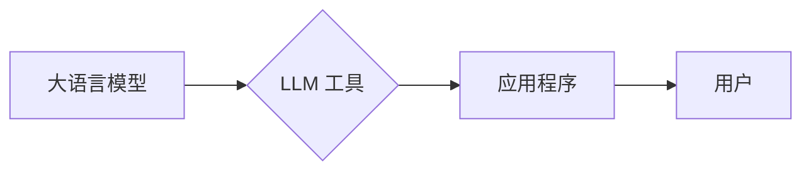

# 大语言模型应用指南：工具

作者：禅与计算机程序设计艺术

## 1. 背景介绍

### 1.1  人工智能的新纪元：大语言模型的崛起
近年来，人工智能领域目睹了一场由大语言模型（LLM）引发的革命。这些模型，如 GPT-3、LaMDA 和 BERT，拥有数十亿甚至数万亿的参数，经过海量文本数据的训练，展现出惊人的文本生成、理解和推理能力。从自动生成引人入胜的故事、撰写不同风格的电子邮件，到翻译语言、编写代码，LLM 正在迅速改变我们与信息交互的方式，为各行各业带来前所未有的机遇。

### 1.2  释放 LLM 潜力的关键：工具与应用
然而，要想充分释放 LLM 的巨大潜力，仅仅依靠模型本身是不够的。合适的工具和应用如同桥梁，将 LLM 的强大能力转化为解决实际问题的有效方案。试想一下，一位技艺精湛的工匠如果没有趁手的工具，也难以发挥其全部才能。

### 1.3  本文的目标：指引读者了解 LLM 工具
本文旨在为读者提供一份关于 LLM 工具的全面指南，帮助读者了解当前 LLM 工具的概况、选择合适的工具、以及如何利用这些工具构建强大的应用程序。无论您是经验丰富的开发者、领域专家，还是对 LLM 感兴趣的新手，本文都将为您提供有价值的见解。

## 2. 核心概念与联系

### 2.1  大语言模型（LLM）：能力与局限
LLM 的核心能力在于其对自然语言的理解和生成。它们能够识别文本中的模式、提取关键信息、理解语义，并生成流畅、连贯的文本。然而，LLM 也存在一些局限性：

* **缺乏常识推理能力**:  LLM 难以理解现实世界的常识性知识，例如“水是湿的”或“鸟会飞”。
* **对输入信息敏感**:  LLM 的输出结果容易受到输入信息的影响，例如轻微的措辞变化就可能导致截然不同的结果。
* **可解释性不足**:  LLM 的决策过程如同一个“黑盒子”，难以解释其输出结果背后的逻辑。

### 2.2  LLM 工具：弥合差距的桥梁
LLM 工具旨在解决上述局限性，并扩展 LLM 的应用范围。它们通常提供以下功能：

* **任务特定的接口**:  将 LLM 封装成易于使用的 API，方便用户完成特定任务，例如文本摘要、问答系统、代码生成等。
* **提示工程**:  提供工具和技术，帮助用户设计有效的提示词，引导 LLM 生成更准确、符合预期的结果。
* **模型微调**:  允许用户使用特定领域的数据对预训练的 LLM 进行微调，提高模型在特定任务上的性能。
* **结果评估与优化**:  提供评估指标和工具，帮助用户评估 LLM 的输出结果，并进行优化。

### 2.3  LLM 生态系统的核心要素
下图展示了 LLM 生态系统的核心要素：



* **大语言模型**:  提供底层的自然语言处理能力。
* **LLM 工具**:  将 LLM 的能力转化为易于使用的工具和接口。
* **应用程序**:  利用 LLM 工具构建的实际应用，例如聊天机器人、写作助手、代码生成器等。
* **用户**:  最终使用 LLM 应用程序的人。

## 3. 核心算法原理具体操作步骤

### 3.1  提示工程：引导 LLM 生成期望结果的关键

#### 3.1.1  提示词的构成
提示词是用户与 LLM 交互的桥梁，它包含了用户希望 LLM 完成的任务信息和相关背景知识。一个典型的提示词通常包含以下部分：

* **任务描述**:  清晰简洁地描述 LLM 需要完成的任务，例如“翻译这段英文到中文”、“总结这篇文章的要点”等。
* **示例**:  提供一些任务相关的示例，帮助 LLM 理解任务要求，例如“英文：The cat sat on the mat. 中文：猫坐在垫子上。”
* **上下文信息**:  提供与任务相关的背景知识，例如“这篇文章是关于人工智能的最新进展”。

#### 3.1.2  提示工程的技巧
设计有效的提示词是 LLM 应用的关键，以下是一些常用的提示工程技巧：

* **使用清晰简洁的语言**:  避免使用模糊的词语或复杂的句式。
* **提供足够的上下文信息**:  帮助 LLM 理解任务背景和目标。
* **使用示例**:  通过示例引导 LLM 生成符合预期格式和内容的结果。
* **迭代优化**:  不断尝试不同的提示词，观察 LLM 的输出结果，并进行优化。

### 3.2  模型微调：定制化 LLM 以适应特定任务

#### 3.2.1  微调的原理
模型微调是指使用特定领域的数据对预训练的 LLM 进行进一步训练，以提高模型在特定任务上的性能。微调的过程包括以下步骤：

1. **准备数据集**:  收集和标注与特定任务相关的数据。
2. **初始化模型**:  使用预训练的 LLM 作为初始模型。
3. **训练模型**:  使用准备好的数据集对模型进行训练，调整模型参数。
4. **评估模型**:  使用测试集评估微调后的模型性能。

#### 3.2.2  微调的优势
* **提高模型性能**:  微调后的模型能够更好地理解特定领域的知识，并在相关任务上取得更好的性能。
* **减少数据需求**:  微调可以使用相对较少的数据量，降低数据收集和标注的成本。
* **定制化模型**:  可以根据实际需求定制化 LLM，使其更符合特定应用场景。

## 4. 数学模型和公式详细讲解举例说明

### 4.1  Transformer 模型：LLM 的基石

#### 4.1.1  模型结构
Transformer 模型是一种基于自注意力机制的神经网络架构，它抛弃了传统的循环神经网络（RNN）结构，能够并行处理序列数据，显著提高了训练效率。Transformer 模型主要由编码器和解码器两部分组成：

* **编码器**:  将输入序列编码成一个上下文向量，捕捉序列中各个元素之间的关系。
* **解码器**:  根据上下文向量生成输出序列。

#### 4.1.2  自注意力机制
自注意力机制是 Transformer 模型的核心，它允许模型关注输入序列中不同位置的信息，捕捉元素之间的长距离依赖关系。自注意力机制的计算过程如下：

1. **计算查询向量（Query）、键向量（Key）和值向量（Value）**:  将输入序列中的每个元素映射到三个向量空间。
2. **计算注意力得分**:  计算查询向量与所有键向量之间的点积，得到注意力得分，表示查询向量与各个键向量之间的相关性。
3. **归一化注意力得分**:  使用 Softmax 函数对注意力得分进行归一化，得到注意力权重。
4. **加权求和**:  将值向量与注意力权重进行加权求和，得到最终的输出向量。

### 4.2  语言模型的评估指标：困惑度（Perplexity）

#### 4.2.1  困惑度的定义
困惑度是衡量语言模型性能的常用指标，它表示模型对测试集的预测能力。困惑度越低，表示模型的预测能力越强。

#### 4.2.2  困惑度的计算公式
困惑度的计算公式如下：

$$
Perplexity = 2^{Entropy}
$$

其中，$Entropy$ 表示模型的交叉熵，计算公式如下：

$$
Entropy = -\frac{1}{N} \sum_{i=1}^{N} \log_2 P(w_i | w_{1:i-1})
$$

其中，$N$ 表示测试集中的词语数量，$w_i$ 表示第 $i$ 个词语，$P(w_i | w_{1:i-1})$ 表示模型预测第 $i$ 个词语的概率。

## 5. 项目实践：代码实例和详细解释说明

### 5.1  使用 Hugging Face Transformers 库进行文本摘要

```python
from transformers import pipeline

# 加载预训练的文本摘要模型
summarizer = pipeline("summarization", model="facebook/bart-large-cnn")

# 输入文本
text = """
This is a long article about the latest advancements in artificial intelligence.
It covers topics such as natural language processing, computer vision, and robotics.
The article also discusses the potential impact of AI on society and the economy.
"""

# 生成摘要
summary = summarizer(text, max_length=100, min_length=30, do_sample=False)[0]['summary_text']

# 打印摘要
print(summary)
```

**代码解释:**

1. 首先，我们使用 `pipeline()` 函数加载预训练的文本摘要模型 `facebook/bart-large-cnn`。
2. 然后，我们定义了一个长文本作为输入。
3. 接下来，我们调用 `summarizer()` 函数生成摘要，并设置 `max_length` 和 `min_length` 参数来控制摘要的长度。
4. 最后，我们打印生成的摘要。

### 5.2  使用 OpenAI API 进行文本生成

```python
import os
import openai

# 设置 OpenAI API 密钥
openai.api_key = os.getenv("OPENAI_API_KEY")

# 定义提示词
prompt = "Write a short story about a cat and a dog who become friends."

# 生成文本
response = openai.Completion.create(
    engine="text-davinci-003",
    prompt=prompt,
    max_tokens=1024,
    n=1,
    stop=None,
    temperature=0.7,
)

# 打印生成的文本
print(response.choices[0].text)
```

**代码解释:**

1. 首先，我们设置 OpenAI API 密钥。
2. 然后，我们定义了一个提示词，要求模型生成一个关于猫和狗成为朋友的短篇故事。
3. 接下来，我们调用 `openai.Completion.create()` 函数生成文本，并设置 `engine`、`prompt`、`max_tokens`、`n`、`stop` 和 `temperature` 参数来控制生成过程。
4. 最后，我们打印生成的文本。

## 6. 工具和资源推荐

### 6.1  LLM 模型库

* **Hugging Face Transformers**:  提供大量预训练的 LLM 模型，并提供易于使用的 API。
* **OpenAI API**:  提供 OpenAI 开发的 LLM 模型的 API，例如 GPT-3。
* **Google AI Platform**:  提供 Google 开发的 LLM 模型的 API，例如 LaMDA。

### 6.2  LLM 工具

* **LangChain**:  一个用于构建 LLM 应用的框架，提供数据连接、提示工程、模型集成等功能。
* **Prompt Engineering Guide**:  提供关于提示工程的全面指南，包括技巧、最佳实践和示例。
* **Scale Spellbook**:  提供用于 LLM 应用开发的工具和资源，例如数据标注、模型评估和部署。

### 6.3  学习资源

* **Stanford CS224N: Natural Language Processing with Deep Learning**:  斯坦福大学的自然语言处理课程，涵盖 LLM 的基础知识和最新研究进展。
* **Deep Learning for Natural Language Processing (NLP) - with Python**:  Udemy 上的自然语言处理课程，使用 Python 教授 LLM 的原理和应用。

## 7. 总结：未来发展趋势与挑战

### 7.1  LLM 的未来发展趋势
* **更大、更强大的模型**:  随着计算能力的提升和训练数据的增加，LLM 的规模和能力将继续增长。
* **多模态 LLM**:  未来的 LLM 将能够处理多种类型的数据，例如文本、图像、音频和视频。
* **个性化 LLM**:  LLM 将能够根据用户的个人喜好和需求进行定制化。
* **负责任的 LLM**:  研究人员和开发者将更加关注 LLM 的伦理和社会影响，开发更负责任的 LLM 应用。

### 7.2  LLM 面临的挑战
* **计算成本**:  训练和部署大型 LLM 需要巨大的计算资源，这限制了 LLM 的应用范围。
* **数据偏见**:  LLM 的训练数据可能存在偏见，导致模型输出结果也存在偏见。
* **可解释性**:  LLM 的决策过程难以解释，这阻碍了人们对 LLM 的信任和应用。
* **伦理和社会影响**:  LLM 的应用引发了人们对其伦理和社会影响的担忧，例如就业、隐私和安全等方面。

## 8. 附录：常见问题与解答

### 8.1  什么是 LLM？

LLM 指的是大型语言模型，它是一种深度学习模型，经过海量文本数据的训练，能够理解和生成自然语言。

### 8.2  LLM 可以用来做什么？

LLM 可以用于各种自然语言处理任务，例如：

* 文本生成
* 文本摘要
* 机器翻译
* 问答系统
* 代码生成

### 8.3  如何选择合适的 LLM 工具？

选择 LLM 工具时，需要考虑以下因素：

* 任务需求
* 模型性能
* 易用性
* 成本

### 8.4  如何学习 LLM？

学习 LLM 可以参考以下资源：

* 在线课程
* 教科书
* 开源项目
* 研究论文

### 8.5  LLM 的未来发展方向是什么？

LLM 的未来发展方向包括：

* 更大、更强大的模型
* 多模态 LLM
* 个性化 LLM
* 负责任的 LLM