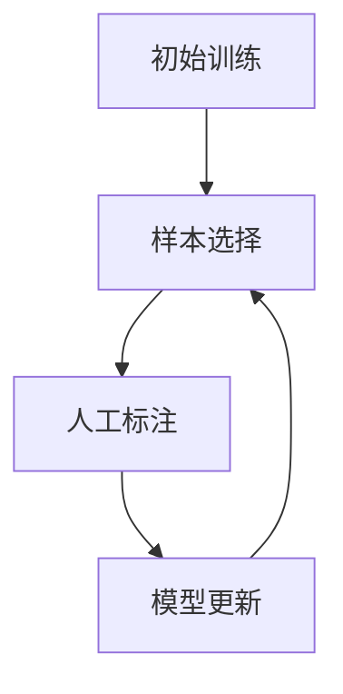

# 大语言模型的主动学习策略:高效利用人工标注数据

## 1.背景介绍

### 1.1 大语言模型的重要性

在当今的人工智能领域,大语言模型(Large Language Models, LLMs)已经成为一个不可忽视的关键技术。这些模型通过在海量文本数据上进行训练,展现出令人惊叹的自然语言理解和生成能力,在诸如机器翻译、文本摘要、问答系统、内容创作等广泛应用场景中发挥着重要作用。

大语言模型的出现,标志着人工智能技术向通用人工智能(Artificial General Intelligence, AGI)迈进了一大步。与传统的机器学习模型相比,大语言模型具有更强的语义理解能力和知识迁移能力,可以在不同领域之间灵活应用所学知识。这使得大语言模型在解决复杂任务时展现出了巨大的潜力。

### 1.2 数据标注的挑战

然而,训练一个高质量的大语言模型需要大量高质量的标注数据。传统的数据标注方式主要依赖于人工,这是一个极其昂贵且耗时的过程。以自然语言处理任务为例,为了获得足够多的高质量标注数据,需要雇佣大量的人力资源来手动标注文本数据,这不仅成本高昂,而且效率低下。

此外,人工标注数据的质量也存在一定的局限性。由于人工标注过程中难免会存在主观性和不一致性,导致标注质量参差不齐,进而影响模型的训练效果。因此,如何高效利用有限的人工标注资源,成为提高大语言模型性能的关键挑战之一。

### 1.3 主动学习的概念

主动学习(Active Learning)是一种有望解决上述挑战的机器学习范式。与传统的监督学习不同,主动学习允许模型主动选择需要标注的数据样本,从而最大限度地利用有限的标注资源。

在主动学习过程中,模型会根据一定的策略从未标注的数据集中选择最有价值的样本,并将这些样本提交给人工标注者进行标注。通过这种方式,模型可以更有效地获取对其训练最有帮助的数据,从而提高数据利用效率,减少标注成本。

### 1.4 主动学习在大语言模型中的应用

将主动学习策略应用于大语言模型的训练过程中,可以极大地提高数据标注效率,降低成本。由于大语言模型需要处理海量文本数据,采用主动学习策略可以有效地识别出对模型训练最有价值的数据样本,从而避免浪费宝贵的人力资源在标注无关紧要的数据上。

本文将深入探讨如何将主动学习策略应用于大语言模型的训练过程中,介绍一些常见的主动学习策略及其在大语言模型场景下的实现方法。我们还将讨论主动学习在实际应用中可能面临的挑战,并提出一些潜在的解决方案。

## 2.核心概念与联系

### 2.1 主动学习的基本流程

主动学习的基本流程可以概括为以下几个步骤:

1. **初始训练**: 使用少量标注数据对模型进行初始训练,获得初始模型。

2. **样本选择**: 根据一定的策略从未标注的数据集中选择最有价值的样本。

3. **人工标注**: 将选择的样本提交给人工标注者进行标注。

4. **模型更新**: 使用新标注的数据对模型进行增量训练,获得更新后的模型。

5. **迭代**: 重复步骤2-4,直到达到预期的模型性能或耗尽标注资源。

该流程可以形象地表示为以下循环:

### 2.2 主动学习策略

主动学习策略决定了在每个迭代中如何选择最有价值的样本进行标注。不同的策略会导致不同的样本选择结果,进而影响模型的训练效果。常见的主动学习策略包括但不限于:

1. **不确定性采样(Uncertainty Sampling)**: 选择模型对其预测结果最不确定的样本进行标注。

2. **查询by委员会(Query by Committee)**: 训练多个不同的模型,并选择这些模型在预测结果上存在最大分歧的样本进行标注。

3. **期望梯度长度(Expected Gradient Length)**: 选择对模型参数的梯度长度最大的样本进行标注,这些样本被认为对模型的更新有最大贡献。

4. **密度加权(Density-Weighted)**: 综合考虑样本的不确定性和数据分布密度,倾向于选择位于高密度区域且不确定性高的样本。

5. **核转移集(Core-Set)**: 通过优化一个子集来近似表示整个未标注数据集,并选择该子集中的样本进行标注。

这些策略各有优缺点,在实际应用中需要根据具体场景和任务特点进行选择和调整。

### 2.3 大语言模型与主动学习的关系

将主动学习策略应用于大语言模型的训练过程中,可以带来诸多好处:

1. **数据利用效率提高**: 通过主动学习,模型可以更有效地利用有限的人工标注资源,避免浪费在无关紧要的数据上。

2. **标注成本降低**: 由于只需要标注最有价值的数据样本,因此可以显著降低整体的标注成本。

3. **模型性能提升**: 通过主动学习获取的高质量标注数据,可以帮助模型更好地捕捉数据的内在模式,从而提升模型的泛化能力。

4. **标注质量提高**: 相比于随机标注,主动学习可以确保标注的数据样本更加具有代表性和信息量,从而提高标注质量。

然而,将主动学习应用于大语言模型训练也面临一些独特的挑战,例如:

1. **计算复杂度高**: 大语言模型通常具有巨大的参数空间,计算主动学习策略的代价较高。

2. **样本选择偏差**: 由于主动学习过程中存在样本选择偏差,可能导致模型在某些数据区域的表现不佳。

3. **标注成本仍然可观**: 尽管主动学习可以降低标注成本,但对于大语言模型而言,由于需要处理海量数据,标注成本仍然可观。

4. **策略选择困难**: 不同的主动学习策略适用于不同的场景,选择合适的策略对于大语言模型的训练至关重要。

在后续章节中,我们将深入探讨如何有效地应用主动学习策略来训练大语言模型,并讨论一些潜在的解决方案来应对上述挑战。

## 3.核心算法原理具体操作步骤

在本节中,我们将详细介绍几种常见的主动学习策略及其在大语言模型训练中的具体实现方法。

### 3.1 不确定性采样 (Uncertainty Sampling)

不确定性采样是最直观和最广泛使用的主动学习策略之一。其基本思想是选择模型对其预测结果最不确定的样本进行标注,因为这些样本被认为对模型的更新有最大贡献。

对于大语言模型而言,不确定性采样的具体操作步骤如下:

1. **初始训练**:使用少量标注数据对大语言模型进行初始训练,获得初始模型。

2. **不确定性计算**:对于未标注的数据集中的每个样本,计算模型对其预测结果的不确定性得分。对于分类任务,可以使用模型预测概率的最大值作为不确定性得分;对于回归任务,可以使用模型预测值的方差作为不确定性得分。

3. **样本选择**:根据不确定性得分,选择得分最高(即模型最不确定)的 $N$ 个样本作为待标注样本。

4. **人工标注**:将选择的 $N$ 个样本提交给人工标注者进行标注。

5. **模型更新**:使用新标注的数据对大语言模型进行增量训练,获得更新后的模型。

6. **迭代**:重复步骤2-5,直到达到预期的模型性能或耗尽标注资源。

不确定性采样的优点是实现简单、计算高效,适用于大多数场景。然而,它也存在一些局限性,例如可能会选择一些异常值或噪声样本,导致标注质量下降。为了解决这个问题,我们可以结合其他策略进行改进,例如将不确定性采样与密度加权策略相结合。

### 3.2 查询by委员会 (Query by Committee)

查询by委员会策略的基本思想是训练多个不同的模型,并选择这些模型在预测结果上存在最大分歧的样本进行标注。这种策略能够更好地捕捉数据的多样性,避免模型陷入局部最优解。

对于大语言模型而言,查询by委员会策略的具体操作步骤如下:

1. **初始训练**:使用少量标注数据对多个大语言模型进行初始训练,获得一组初始模型。这些模型可以通过不同的初始化、不同的训练数据或不同的训练策略等方式获得。

2. **不一致性计算**:对于未标注的数据集中的每个样本,计算模型委员会对其预测结果的不一致性得分。常见的不一致性度量包括投票熵(Vote Entropy)和预测向量之间的disagreement等。

3. **样本选择**:根据不一致性得分,选择得分最高(即模型委员会对其预测结果存在最大分歧)的 $N$ 个样本作为待标注样本。

4. **人工标注**:将选择的 $N$ 个样本提交给人工标注者进行标注。

5. **模型更新**:使用新标注的数据对模型委员会中的所有模型进行增量训练,获得更新后的模型集合。

6. **迭代**:重复步骤2-5,直到达到预期的模型性能或耗尽标注资源。

查询by委员会策略的优点是能够更好地捕捉数据的多样性,避免模型陷入局部最优解。然而,它也存在一些缺点,例如计算复杂度较高(需要训练和维护多个模型)、存在样本选择偏差等。为了应对这些挑战,我们可以采用一些改进策略,例如通过集成学习或co-training等方法来减轻计算负担,或者结合其他策略(如密度加权)来减少样本选择偏差。

### 3.3 期望梯度长度 (Expected Gradient Length)

期望梯度长度策略的基本思想是选择对模型参数的梯度长度最大的样本进行标注,因为这些样本被认为对模型的更新有最大贡献。

对于大语言模型而言,期望梯度长度策略的具体操作步骤如下:

1. **初始训练**:使用少量标注数据对大语言模型进行初始训练,获得初始模型。

2. **梯度计算**:对于未标注的数据集中的每个样本,计算该样本对模型参数的期望梯度长度。具体做法是:
   - 对该样本进行伪标注(Pseudo-Labeling),获得伪标签 $\hat{y}$。
   - 计算该样本在当前模型下的损失函数 $\mathcal{L}(y, \hat{y})$,其中 $y$ 为真实标签。
   - 计算损失函数相对于模型参数 $\theta$ 的梯度 $\nabla_\theta \mathcal{L}(y, \hat{y})$。
   - 将梯度的 $L_2$ 范数作为期望梯度长度得分: $\text{score} = \|\nabla_\theta \mathcal{L}(y, \hat{y})\|_2$。

3. **样本选择**:根据期望梯度长度得分,选择得分最高的 $N$ 个样本作为待标注样本。

4. **人工标注**:将选择的 $N$ 个样本提交给人工标注者进行标注。

5. **模型更新**:使用新标注的数据对大语言模型进行增量训练,获得更新后的模型。

6. **迭代**:重复步骤2-5,直到达到预期的模