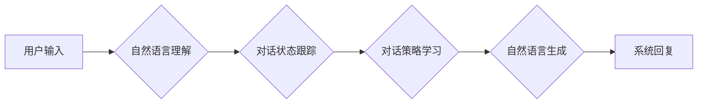

# 大语言模型的开放域对话:从基础到前沿应用

作者：禅与计算机程序设计艺术

## 1. 背景介绍

### 1.1 对话系统的演进

自计算机诞生以来，人类就梦想着能够与机器进行自然、流畅的对话。早期的对话系统主要基于规则和模板，只能处理有限的对话场景。随着人工智能技术的不断发展，特别是自然语言处理（NLP）技术的进步，对话系统逐渐从基于规则的系统转向基于数据驱动的系统，能够处理更加复杂和开放的对话场景。

### 1.2 大语言模型的兴起

近年来，深度学习技术的突破，特别是 Transformer 模型的提出，极大地推动了自然语言处理领域的发展。基于 Transformer 架构的大语言模型（LLM）在各种 NLP 任务上都取得了显著的成果，例如机器翻译、文本摘要、问答系统等。大语言模型的出现，为构建更加智能、流畅的对话系统提供了新的可能性。

### 1.3 开放域对话的挑战

与传统的任务型对话系统不同，开放域对话系统不需要预先定义好的对话流程和目标，用户可以随意地与系统进行交谈，讨论任何话题。这种开放性给对话系统带来了巨大的挑战，例如：

* **语言的歧义性:** 自然语言本身存在着大量的歧义性，同一个词语或句子在不同的语境下可能会有不同的含义。
* **常识和背景知识的缺失:** 对话系统需要理解用户的意图，而这往往需要依赖于大量的常识和背景知识。
* **情感和情绪的理解:** 人类对话中充满了情感和情绪，对话系统需要能够识别和理解这些情感，并作出相应的回应。

## 2. 核心概念与联系

### 2.1 大语言模型

大语言模型是指基于深度学习技术训练得到的、拥有海量参数的语言模型。这些模型通常使用 Transformer 架构，并在海量文本数据上进行训练，能够学习到丰富的语言知识和世界知识。

#### 2.1.1 Transformer 架构

Transformer 是一种基于自注意力机制的神经网络架构，它能够捕捉句子中不同词语之间的远程依赖关系。与传统的循环神经网络（RNN）相比，Transformer 能够更好地处理长文本序列，并且更容易进行并行计算，因此训练速度更快。

#### 2.1.2 预训练语言模型

预训练语言模型是指在大规模文本数据上进行预先训练的语言模型。这些模型已经学习到了丰富的语言知识，可以作为其他 NLP 任务的基础模型。常见的预训练语言模型包括 BERT、GPT 等。

### 2.2 开放域对话

开放域对话是指没有预先定义好的对话流程和目标的对话，用户可以随意地与系统进行交谈，讨论任何话题。

#### 2.2.1 任务型对话

与开放域对话相对的是任务型对话，例如订机票、订餐等。任务型对话通常有明确的对话目标，并且需要收集用户的特定信息才能完成任务。

#### 2.2.2 多轮对话

开放域对话通常是多轮的，即用户和系统之间会进行多轮交互。对话系统需要能够理解对话的历史信息，并根据上下文进行回复。

### 2.3  核心概念之间的联系

大语言模型为构建开放域对话系统提供了强大的技术支持。通过在大规模对话数据上进行微调，可以使大语言模型学习到开放域对话的模式和规律，从而生成更加自然、流畅的对话。

## 3. 核心算法原理具体操作步骤

### 3.1 基于大语言模型的开放域对话系统架构

典型的基于大语言模型的开放域对话系统架构如下图所示:



* **自然语言理解（NLU）：** 负责将用户的自然语言输入转换成计算机可以理解的语义表示。
* **对话状态跟踪（DST）：** 负责跟踪对话的历史信息，维护当前对话的状态。
* **对话策略学习（DPL）：** 负责根据对话状态选择合适的对话策略，例如提问、回答、澄清等。
* **自然语言生成（NLG）：** 负责将系统选择的对话策略转换成自然语言回复。

### 3.2 具体操作步骤

1. **数据收集和预处理:** 收集大量的对话数据，并进行清洗、分词、标注等预处理操作。
2. **大语言模型微调:** 使用预训练的语言模型作为基础模型，在对话数据上进行微调，使模型学习到开放域对话的模式和规律。
3. **对话状态跟踪:** 使用规则或模型来跟踪对话的历史信息，维护当前对话的状态。
4. **对话策略学习:** 使用强化学习或其他机器学习算法来训练对话策略模型，使模型能够根据对话状态选择合适的对话策略。
5. **自然语言生成:** 使用语言模型或模板来生成自然语言回复，可以使用 beam search 等算法来提高回复的质量。

## 4. 数学模型和公式详细讲解举例说明

### 4.1 语言模型

语言模型用于计算一个句子出现的概率，可以使用以下公式表示:

$$
P(w_1, w_2, ..., w_n) = \prod_{i=1}^n P(w_i | w_1, w_2, ..., w_{i-1})
$$

其中，$w_1, w_2, ..., w_n$ 表示句子中的词语，$P(w_i | w_1, w_2, ..., w_{i-1})$ 表示在已知前面词语的情况下，当前词语出现的概率。

### 4.2 Transformer 模型

Transformer 模型使用自注意力机制来捕捉句子中不同词语之间的远程依赖关系。自注意力机制可以使用以下公式表示:

$$
Attention(Q, K, V) = softmax(\frac{QK^T}{\sqrt{d_k}})V
$$

其中，$Q$ 表示查询矩阵，$K$ 表示键矩阵，$V$ 表示值矩阵，$d_k$ 表示键的维度。

### 4.3 举例说明

假设我们有一个对话系统，用户输入 "你好"，系统需要回复 "你好，请问有什么可以帮您？"。

1. **NLU:** 将用户输入 "你好" 转换成语义表示，例如 {"intent": "greet"}。
2. **DST:** 将当前对话状态更新为 {"intent": "greet"}。
3. **DPL:** 根据当前对话状态，选择对话策略 "greet"。
4. **NLG:** 根据对话策略 "greet"，生成回复 "你好，请问有什么可以帮您？"。

## 5. 项目实践：代码实例和详细解释说明

```python
import transformers

# 加载预训练的语言模型
model_name = "gpt2"
tokenizer = transformers.AutoTokenizer.from_pretrained(model_name)
model = transformers.AutoModelForCausalLM.from_pretrained(model_name)

# 定义对话历史记录
dialogue_history = []

# 定义对话函数
def chat(user_input):
    # 将用户输入添加到对话历史记录中
    dialogue_history.append(user_input)

    # 将对话历史记录转换成模型输入
    input_text = " ".join(dialogue_history)
    input_ids = tokenizer.encode(input_text, return_tensors="pt")

    # 生成系统回复
    output = model.generate(input_ids, max_length=100, num_beams=5, no_repeat_ngram_size=2)
    response = tokenizer.decode(output[0], skip_special_tokens=True)

    # 将系统回复添加到对话历史记录中
    dialogue_history.append(response)

    # 返回系统回复
    return response

# 进行对话
while True:
    user_input = input("用户：")
    response = chat(user_input)
    print("系统：" + response)
```

**代码解释:**

* 首先，我们使用 `transformers` 库加载预训练的 GPT-2 语言模型。
* 然后，我们定义了一个 `chat()` 函数，用于处理用户输入并生成系统回复。
* 在 `chat()` 函数中，我们首先将用户输入添加到对话历史记录中。
* 然后，我们将对话历史记录转换成模型输入，并使用 `model.generate()` 方法生成系统回复。
* 最后，我们将系统回复添加到对话历史记录中，并返回系统回复。

**运行结果:**

```
用户：你好
系统：你好，请问有什么可以帮您？
用户：我想了解一下大语言模型
系统：大语言模型是近年来自然语言处理领域的一个热门话题，它们是基于深度学习技术训练得到的、拥有海量参数的语言模型。
```

## 6. 实际应用场景

### 6.1  智能客服

大语言模型可以用于构建更加智能的客服机器人，能够处理更加复杂的用户咨询，提供更加个性化的服务。

### 6.2  虚拟助手

大语言模型可以用于构建更加智能的虚拟助手，例如 Siri、Alexa 等，能够理解用户的自然语言指令，完成各种任务。

### 6.3  教育和娱乐

大语言模型可以用于构建教育和娱乐应用，例如聊天机器人、故事生成器等，为用户提供更加个性化和有趣的体验。

## 7. 总结：未来发展趋势与挑战

### 7.1  未来发展趋势

* **更加强大的语言模型:** 随着计算能力的提升和数据量的增加，我们可以训练更加强大的语言模型，从而构建更加智能的对话系统。
* **多模态对话系统:** 未来的对话系统将不仅仅局限于文本，而是会整合语音、图像、视频等多种模态的信息，提供更加自然和丰富的交互体验。
* **个性化和情感化的对话系统:** 未来的对话系统将更加注重个性化和情感化，能够理解用户的个性和情绪，提供更加贴心的服务。

### 7.2  挑战

* **数据稀疏问题:** 开放域对话的数据非常稀疏，难以收集到足够多的高质量数据来训练模型。
* **模型的可解释性:** 大语言模型通常是一个黑盒，难以理解模型是如何做出决策的，这给模型的调试和改进带来了困难。
* **伦理和社会问题:** 随着对话系统变得越来越智能，我们需要考虑其潜在的伦理和社会问题，例如隐私泄露、歧视等。

## 8. 附录：常见问题与解答

### 8.1  什么是 Beam Search？

Beam Search 是一种搜索算法，用于在生成文本时找到最优的候选词序列。它通过维护一个候选词序列集合，并在每一步扩展其中得分最高的 k 个序列来进行搜索。

### 8.2  如何评估开放域对话系统的性能？

评估开放域对话系统的性能是一个复杂的问题，目前还没有一个统一的标准。常用的指标包括：

* **BLEU:** 用于评估机器翻译和文本摘要等任务的指标，可以用来评估对话系统回复的流畅度和语法正确性。
* **ROUGE:** 用于评估文本摘要任务的指标，可以用来评估对话系统回复的信息含量。
* **人工评估:** 最终的评估标准还是需要人工来判断对话系统的质量，例如自然度、流畅度、逻辑性等。
