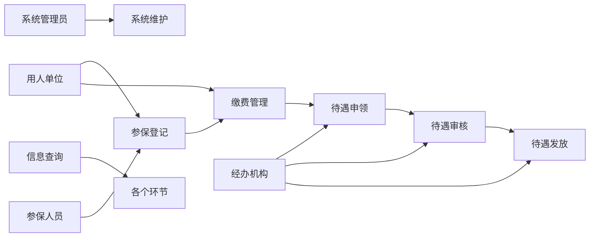

##  失业保险管理系统详细设计与具体代码实现

作者：禅与计算机程序设计艺术

## 1. 背景介绍

### 1.1 失业保险概述

失业保险是社会保障体系的重要组成部分，旨在保障失业人员的基本生活，促进其再就业。它是一种社会保险制度，通过建立失业保险基金，对非因本人意愿中断就业的劳动者提供一定的物质帮助和再就业服务。

### 1.2 失业保险管理系统的意义

传统的失业保险管理模式存在着效率低下、信息不透明、服务水平低等问题。随着信息技术的快速发展，构建一个高效、便捷、安全的失业保险管理系统显得尤为重要。失业保险管理系统可以实现以下目标：

* **提高工作效率:** 自动化处理业务流程，减少人工操作，提高工作效率。
* **增强数据安全性:**  保障数据安全，防止数据泄露和篡改。
* **提高服务质量:** 为失业人员提供更加便捷、高效、优质的服务。
* **加强监管力度:**  实现对失业保险基金的实时监控和管理，提高资金使用效率。

### 1.3 系统设计目标

本系统的设计目标是构建一个功能完善、安全可靠、易于维护的失业保险管理系统，以满足以下需求：

* **功能全面:**  涵盖失业保险业务的各个环节，包括参保登记、缴费管理、待遇申领、待遇发放、信息查询等。
* **操作简便:**  系统界面友好，操作流程简单易懂，方便用户使用。
* **安全可靠:**  采用多重安全措施，保障系统和数据的安全。
* **易于维护:**  系统架构清晰，代码规范，易于维护和扩展。


## 2. 核心概念与联系

### 2.1 系统用户角色

本系统主要涉及以下用户角色：

* **参保人员:**  参加失业保险的劳动者。
* **用人单位:**  与劳动者建立劳动关系的单位。
* **经办机构:**  负责失业保险经办服务的机构。
* **系统管理员:**  负责系统的维护和管理。

### 2.2 核心业务流程

失业保险管理系统的主要业务流程包括：

* **参保登记:** 用人单位为职工办理参保登记手续，并按规定缴纳失业保险费。
* **缴费管理:**  用人单位按月缴纳失业保险费，系统记录缴费信息，并生成缴费报表。
* **待遇申领:**  失业人员符合条件后，可以向经办机构申领失业保险待遇。
* **待遇审核:**  经办机构对失业人员的申领材料进行审核，确定待遇资格和标准。
* **待遇发放:**  经办机构将失业保险金发放到失业人员的个人账户。
* **信息查询:**  参保人员、用人单位和经办机构可以查询相关信息，如缴费记录、待遇领取情况等。

### 2.3 核心概念关系图



## 3. 核心算法原理具体操作步骤

### 3.1 失业保险金计算算法

失业保险金的计算方法因地区而异，一般来说，失业保险金的计算公式如下：

```
失业保险金 = 当地上年度职工月平均工资 × 缴费年限 ×  计发比例
```

其中：

* **当地上年度职工月平均工资:**  指失业人员失业前12个月所在单位职工的月平均工资。
* **缴费年限:**  指失业人员累计缴纳失业保险费的年限。
* **计发比例:**  根据失业人员的缴费年限和当地政策确定。

### 3.2 待遇申领审核流程

失业人员申领失业保险待遇的流程如下：

1. 失业人员提交申领材料，包括身份证、失业登记证、离职证明等。
2. 经办机构对申领材料进行初审，核实失业人员的身份信息、失业状态、缴费情况等。
3. 初审通过后，经办机构进行复审，核实失业原因、离职时间等信息。
4. 复审通过后，经办机构根据失业保险金计算公式计算失业保险金，并确定待遇资格和标准。
5. 经办机构将审核结果告知失业人员，并办理相关手续。

## 4. 数学模型和公式详细讲解举例说明

### 4.1 失业保险金计算公式举例

假设某地区 2023 年职工月平均工资为 10000 元，失业人员张三的缴费年限为 5 年，当地政策规定计发比例为 60%，则张三每月可以领取的失业保险金为：

```
失业保险金 = 10000 × 5 × 60% = 3000 元
```

### 4.2  失业保险基金收入预测模型

失业保险基金的收入主要来源于用人单位和劳动者缴纳的失业保险费。为了更好地管理失业保险基金，可以建立失业保险基金收入预测模型。常用的预测模型有时间序列分析模型、回归分析模型等。

#### 4.2.1 时间序列分析模型

时间序列分析模型是根据历史数据，分析数据变化趋势，预测未来数据的一种方法。常用的时间序列分析模型有移动平均模型、指数平滑模型、ARIMA 模型等。

#### 4.2.2 回归分析模型

回归分析模型是研究自变量与因变量之间关系的一种统计方法。在失业保险基金收入预测中，可以将影响失业保险基金收入的因素作为自变量，如当地经济发展水平、就业形势、失业保险政策等，将失业保险基金收入作为因变量，建立回归分析模型，预测未来失业保险基金收入。

## 5. 项目实践：代码实例和详细解释说明

### 5.1 技术架构

本系统采用前后端分离的架构，前端使用 Vue.js 框架，后端使用 Spring Boot 框架，数据库使用 MySQL。

### 5.2 代码实例

以下是一个简单的失业保险金计算接口的代码示例：

```java
@RestController
@RequestMapping("/api/insurance")
public class InsuranceController {

    @Autowired
    private InsuranceService insuranceService;

    @PostMapping("/calculate")
    public BigDecimal calculateInsurance(@RequestBody InsuranceCalculationRequest request) {
        // 获取参数
        BigDecimal averageSalary = request.getAverageSalary();
        int paymentYears = request.getPaymentYears();
        BigDecimal paymentRatio = request.getPaymentRatio();

        // 调用service层计算失业保险金
        BigDecimal insuranceAmount = insuranceService.calculateInsuranceAmount(averageSalary, paymentYears, paymentRatio);

        // 返回计算结果
        return insuranceAmount;
    }
}
```

### 5.3 代码解释

* `@RestController` 注解表示该类是一个控制器类。
* `@RequestMapping("/api/insurance")` 注解表示该控制器处理`/api/insurance`路径下的请求。
* `@Autowired` 注解用于自动注入`InsuranceService`类的实例。
* `@PostMapping("/calculate")` 注解表示该方法处理`/api/insurance/calculate`路径下的 POST 请求。
* `@RequestBody` 注解表示将请求体中的 JSON 数据绑定到`InsuranceCalculationRequest`对象中。
* `insuranceService.calculateInsuranceAmount()` 方法调用 `InsuranceService` 类中的方法计算失业保险金。

## 6. 实际应用场景

失业保险管理系统可以应用于以下场景：

* **政府部门:**  社会保障部门可以使用该系统管理失业保险业务，提高工作效率和服务质量。
* **用人单位:**  用人单位可以使用该系统为职工办理参保登记、缴纳失业保险费等业务。
* **失业人员:**  失业人员可以使用该系统查询个人缴费记录、申领失业保险待遇等。

## 7. 总结：未来发展趋势与挑战

### 7.1 未来发展趋势

* **智能化:**  利用人工智能技术，实现失业保险业务的智能化处理，如智能客服、智能审核等。
* **数字化:**  推进失业保险业务的数字化转型，实现数据共享和业务协同。
* **人性化:**  提供更加人性化的服务，如个性化推荐、在线咨询等。

### 7.2 面临的挑战

* **数据安全:**  如何保障系统和数据的安全，防止数据泄露和篡改。
* **技术更新:**  如何应对技术快速更新的挑战，保持系统的先进性。
* **服务能力:**  如何提高系统的服务能力，满足不断增长的业务需求。


## 8. 附录：常见问题与解答

### 8.1  问：失业保险金领取条件是什么？

**答:**  失业保险金领取条件一般包括：

* **非因本人意愿中断就业:**  如被单位辞退、单位倒闭等。
* **已办理失业登记:**  在户籍所在地或居住地公共就业服务机构办理失业登记。
* **累计缴纳失业保险费满一年:**  部分地区要求累计缴纳失业保险费满一年以上。

### 8.2  问：失业保险金可以领取多久？

**答:**  失业保险金领取期限根据失业人员的缴费年限和当地政策确定，一般不超过 24 个月。

### 8.3  问：如何查询个人失业保险缴费记录？

**答:**  可以通过以下方式查询个人失业保险缴费记录：

* **登录当地社会保险网站查询。**
* **拨打当地社会保险服务热线查询。**
* **前往当地社会保险经办机构查询。**
