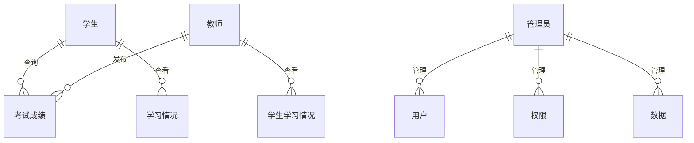

## 学生学习情况考试查询小程序

作者：禅与计算机程序设计艺术

## 1. 背景介绍

### 1.1 教育信息化浪潮

近年来，随着互联网技术的快速发展和普及，教育信息化已经成为全球教育改革的重要趋势。在线教育、移动学习、大数据分析等新兴技术正在深刻地改变着传统的教育模式和教学方式，为学生提供更加个性化、智能化、便捷化的学习体验。

### 1.2 学生学习情况查询需求

在传统的教育模式下，学生获取考试成绩、了解学习情况通常需要通过线下查询、电话咨询等方式进行，效率低下且信息滞后。随着教育信息化的推进，学生和家长对于及时、准确、便捷地查询学习情况的需求日益迫切。

### 1.3 小程序技术优势

小程序作为一种轻量级的应用程序，具有无需下载安装、使用方便快捷、开发成本低等优势，非常适合用于开发学生学习情况考试查询小程序。

## 2. 核心概念与联系

### 2.1 用户角色

* 学生：使用小程序查询个人考试成绩、分析学习情况。
* 教师：使用小程序发布考试成绩、查看班级学生学习情况。
* 管理员：负责小程序的系统管理、数据维护等工作。

### 2.2 功能模块

* 登录注册模块：用户通过手机号或账号密码进行登录注册。
* 成绩查询模块：学生可以查询个人考试成绩，包括科目、分数、排名等信息。
* 学习情况分析模块：学生可以查看个人学习情况分析报告，包括学习进度、知识点掌握情况、薄弱环节等。
* 考试安排查询模块：学生可以查询考试安排信息，包括考试时间、考试地点、考试科目等。
* 消息通知模块：系统可以向用户推送考试成绩发布、学习情况更新等消息通知。
* 系统管理模块：管理员可以进行用户管理、权限管理、数据管理等操作。

### 2.3 数据关系图



## 3. 核心算法原理具体操作步骤

### 3.1 成绩查询算法

1. 学生输入学号和密码登录小程序。
2. 小程序向服务器发送成绩查询请求，包括学号、考试名称等参数。
3. 服务器根据学号和考试名称查询数据库，获取学生考试成绩信息。
4. 服务器将查询结果返回给小程序。
5. 小程序将考试成绩信息展示给学生。

### 3.2 学习情况分析算法

1. 小程序收集学生学习数据，包括考试成绩、作业完成情况、课堂表现等。
2. 小程序对学习数据进行统计分析，生成学习情况分析报告。
3. 学习情况分析报告包括学习进度、知识点掌握情况、薄弱环节等信息。

## 4. 数学模型和公式详细讲解举例说明

### 4.1 排名计算公式

假设某次考试共有 $n$ 名学生参加，学生 $i$ 的考试成绩为 $s_i$，则学生 $i$ 的排名 $r_i$ 可以通过以下公式计算：

$$
r_i = 1 + \sum_{j=1}^{n} I(s_j > s_i)
$$

其中，$I(x)$ 为指示函数，当 $x$ 为真时，$I(x)=1$，否则 $I(x)=0$。

**举例说明：**

假设某次考试共有 5 名学生参加，考试成绩分别为：80、90、70、85、95，则排名计算如下：

| 学生 | 成绩 | 排名 |
|---|---|---|
| A | 80 | 3 |
| B | 90 | 2 |
| C | 70 | 5 |
| D | 85 | 2 |
| E | 95 | 1 |

### 4.2 知识点掌握情况分析

可以使用统计学中的频率分析方法来分析学生对各个知识点的掌握情况。

**举例说明：**

假设某次考试共有 100 道题目，涵盖 10 个知识点，每个知识点对应 10 道题目。统计每个知识点学生的答题正确率，可以得到如下表格：

| 知识点 | 正确率 |
|---|---|
| 知识点 1 | 80% |
| 知识点 2 | 90% |
| 知识点 3 | 70% |
| ... | ... |
| 知识点 10 | 85% |

## 5. 项目实践：代码实例和详细解释说明

### 5.1 小程序端开发

**技术选型：**

* 开发框架：uni-app
* UI 组件库：uView UI
* 数据请求库：flyio

**代码示例：**

```javascript
// 查询成绩页面
<template>
  <view>
    <u-cell-group>
      <u-cell title="考试名称" :value="examName"></u-cell>
    </u-cell-group>
    <u-table :border="true" :data="scoreList">
      <u-table-column prop="subject" label="科目"></u-table-column>
      <u-table-column prop="score" label="成绩"></u-table-column>
    </u-table>
  </view>
</template>

<script>
export default {
  data() {
    return {
      examName: '',
      scoreList: [],
    };
  },
  onLoad(options) {
    this.examName = options.examName;
    this.getScoreList();
  },
  methods: {
    async getScoreList() {
      const res = await this.$http.get('/score', {
        params: {
          examName: this.examName,
        },
      });
      this.scoreList = res.data;
    },
  },
};
</script>
```

### 5.2 服务器端开发

**技术选型：**

* 编程语言：Node.js
* Web 框架：Express
* 数据库：MySQL

**代码示例：**

```javascript
// 查询成绩接口
router.get('/score', async (req, res) => {
  const { examName } = req.query;
  const sql = `SELECT * FROM score WHERE examName = ?`;
  const result = await query(sql, [examName]);
  res.json(result);
});
```

## 6. 实际应用场景

### 6.1 学校场景

* 学生可以使用小程序查询考试成绩、了解学习情况、制定学习计划。
* 教师可以使用小程序发布考试成绩、分析班级学生学习情况、进行教学调整。

### 6.2 培训机构场景

* 学员可以使用小程序查询课程成绩、了解学习进度、进行在线学习。
* 教师可以使用小程序发布课程成绩、分析学员学习情况、提供个性化辅导。

## 7. 总结：未来发展趋势与挑战

### 7.1 未来发展趋势

* 个性化学习：根据学生的学习情况和学习目标，提供个性化的学习内容和学习路径推荐。
* 智能化评估：利用人工智能技术，对学生的学习情况进行更加精准和全面的评估。
* 数据可视化：将学生的学习数据进行可视化展示，帮助学生更好地了解自己的学习情况。

### 7.2 面临挑战

* 数据安全和隐私保护：学生学习数据涉及个人隐私，需要加强数据安全和隐私保护措施。
* 技术更新迭代快：小程序技术发展迅速，需要不断学习和掌握新技术。

## 8. 附录：常见问题与解答

### 8.1 问：小程序如何实现登录功能？

答：小程序可以通过微信官方提供的登录接口获取用户的微信openid，然后根据openid在数据库中查询用户信息，实现用户登录。

### 8.2 问：小程序如何与服务器进行数据交互？

答：小程序可以通过网络请求与服务器进行数据交互，常用的网络请求方式包括：

* wx.request()
* flyio
* axios
