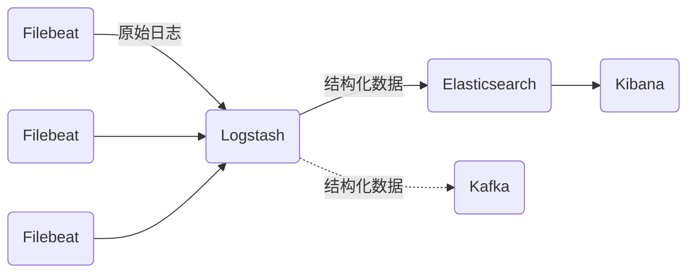

# 实战：使用Filebeat采集Nginx访问日志

作者：禅与计算机程序设计艺术

## 1. 背景介绍

### 1.1 日志采集的重要性
在现代互联网应用中,日志数据扮演着至关重要的角色。它记录了系统运行过程中的关键信息,包括用户行为、系统性能、异常错误等,是问题排查、业务分析的基础。高效、可靠地采集日志并集中存储和分析,已成为一项核心诉求。

### 1.2 ELK日志采集架构
ELK是当前主流的日志采集、存储和分析架构,由Elasticsearch、Logstash、Kibana三大开源组件组成:

- Elasticsearch: 分布式搜索和分析引擎,提供准实时的全文搜索能力
- Logstash: 数据处理管道,可从多个来源采集数据,进行过滤转换后输出到多种存储
- Kibana: 数据可视化平台,以图表形式展现 Elasticsearch 中的数据

### 1.3 Filebeat在其中的角色
ELK架构中,日志的采集环节一般由轻量的Beats系工具担当。Beats是一个开源的单一用途数据采集平台,包括多个数据采集器。
Filebeat就是专门用于采集文件数据如日志的工具,具有资源占用低、配置简单、适合大规模部署等优点。本文将详细介绍使用Filebeat采集Nginx访问日志并发送到ELK的完整实战过程。

## 2. 核心概念与关联

### 2.1 Nginx访问日志
Nginx作为高性能的Web服务器,访问日志记录了关于客户端请求的重要信息,默认存储在access.log文件中。典型的日志格式类似:

```
127.0.0.1 - - [21/Apr/2023:13:25:43 +0800] "GET /index HTTP/1.1" 200 612 "-" "Mozilla/5.0 ..."
```
包含了客户端IP、请求时间、请求方法、URL、响应状态码、响应大小等 内容。

### 2.2 Filebeat工作原理
Filebeat由两个主要组件组成:input和harvester。Input负责管理harvester并找到所有要读取的源。Harvester负责读取单个文件的内容,并将其发送到output。
Filebeat的工作流程可总结为:
1. Filebeat启动一个或多个input
2. 对于每个input,启动一个harvester
3. 每个harvester读取一个文件,将新内容发送到libbeat
4. Libbeat聚合事件并将聚合的数据发送到output
5. Filebeat一旦完成关闭所有的harvesters,并且完成发送所有事件

### 2.3 ELK组件间的数据流转
Filebeat采集到数据后,作为输入发送给Logstash进行过滤处理。Logstash的处理结果一方面可以输出给Elasticsearch存储和检索,一方面输出给Kafka等消息队列以供其他系统消费。Kibana则针对Elasticsearch中的数据进行可视化呈现。

## 3. 核心实现步骤

### 3.1 规划部署结构
一个典型的ELK部署结构:


多个Filebeat实例分布在各Nginx节点上,采集日志汇总发送给Logstash集群。Logstash进行解析过滤,将结果发送给Elasticsearch和Kafka。Kibana负责可视化展示。

### 3.2 配置Nginx日志格式
首先需要配置Nginx的访问日志格式,使其便于Filebeat解析。例如:

```
log_format main '$remote_addr - $remote_user [$time_local] '
                '"$request" $status $body_bytes_sent '
                '"$http_referer" "$http_user_agent"';
access_log /var/log/nginx/access.log main;                
```

### 3.3 部署和配置Filebeat
在Nginx节点上安装Filebeat:

```sh
# 安装公钥
$ rpm --import https://packages.elastic.co/GPG-KEY-elasticsearch

# 添加yum源
$ cat >filebeat.repo <<EOF
[elastic-7.x]
name=Elastic repository for 7.x packages
baseurl=https://artifacts.elastic.co/packages/7.x/yum
gpgcheck=1
gpgkey=https: //artifacts.elastic.co/GPG-KEY-elasticsearch
enabled=1
autorefresh=1
type=rpm-md
EOF
$ mv filebeat.repo /etc/yum.repos.d/

# 安装filebeat
$ yum install -y filebeat
```
在/etc/filebeat/目录下创建filebeat.yml配置文件:

```yaml
filebeat.inputs:
- type: log
  enabled: true
  paths:
    - /var/log/nginx/access.log
  tags: ["nginx"] 

output.logstash:
  hosts: ["10.10.0.5:5044"] 
```
主要配置项:
- filebeat.inputs设置日志源路径,并打上tag
- output.logstash设置logstash输出地址

### 3.4 配置和启动Logstash
Logstash作为中间处理组件,一方面接收filebeat输入,另一方面输出到ES存储。配置示例:

```
input {
    beat {
        port => "5044"
    }
}

filter {
   grok {
     match => { "message" => "%{IPORHOST:clientip} - %{DATA:user} \[%{HTTPDATE:time}\] \"%{WORD:verb} %{DATA:request} HTTP/%{NUMBER:httpversion}\" %{NUMBER:response:int} (?:-|%{NUMBER:bytes:int}) %{QS:referrer} %{QS:agent}" }
     remove_field => [ "message" ]
   }
   date {
     match => ["timestamp", "dd/MMM/YYYY:HH:mm:ss Z"]
   }
   useragent {
     source => "agent"
     target => "useragent"
   }
   geoip {
     source => "clientip"
   }
}

output {
    elasticsearch {
        hosts => "http://10.10.0.10:9200"
        index => "nginx-access-%{+YYYY.MM.dd}"
    }
}
```

- input插件接收filebeat以5044端口发送的数据
- filter插件中,grok解析原始日志,date处理时间戳,useragent和geoip增加地理信息字段
- output输出到ES,按天创建索引 

在logstash.yml配置文件中加入:
```yaml
http.host: "0.0.0.0"
xpack.monitoring.elasticsearch.hosts: [ "http://10.10.0.10:9200" ]
```
启用监控并允许远程访问。

### 3.5 可视化查询和分析
Kibana连接ES后,即可对采集的Nginx日志数据进行查询分析。一些常用的操作:

- 搜索关键词,快速定位相关日志
- 以图表形式统计展示不同维度数据,如访问次数排名、状态码占比等
- 设置告警条件,及时感知系统异常

## 4. 数学模型和公式详解

### 4.1 grok表达式
grok采用正则表达式提取日志中的字段,常用语法:

- %{SYNTAX:SEMANTIC} 匹配指定语法并赋予字段名
- (?<field>pattern) 将匹配模式命名为field
- ^ $ 行首、行尾
- [\w_.]+ 匹配词组

如日志解析grok:

```
%{IPORHOST:clientip} - %{DATA:user} \[%{HTTPDATE:time}\] \"%{WORD:verb} %{DATA:request} HTTP/%{NUMBER:httpversion}\" %{NUMBER:response:int} (?:-|%{NUMBER:bytes:int}) %{QS:referrer} %{QS:agent}
```
匹配了clientip,user,time,verb等常用HTTP字段。

### 4.2 tdigest算法

Elasticsearch支持使用tdigest算法计算百分位数。tdigest基于概率分布,以少量内存和较高的准确度近似大数据集的分位数。

给定分位点$q\in[0,1]$, tdigest生成有限的集中点$X=\{x_1,\dots,x_n\}$。每个$x_i$有一个权重$w_i$,所有权重之和为1,但权重不要求相等。tdigest的累积分布函数定义为:

$$
F(x)=
\begin{cases}
0 & x<\min(X)\\  
\sum\limits_{x_i<x}w_i & \min(X)\leq x<\max(X)\\
1 & x\geq \max(X)\\
\end{cases}
$$

tdigest算法的核心是将集中点合并压缩,以固定的内存开销表示任意大小的数据。

## 5. 项目实践: 代码实例详解

以下是一些配置和使用ELK工具链的代码实例。 

**配置文件样例**

Nginx log_format:
```
log_format main '$remote_addr - $remote_user [$time_local] '
                '"$request" $status $body_bytes_sent '
                '"$http_referer" "$http_user_agent"';
```

Filebeat配置:

```yaml
filebeat.inputs:
- type: log
  enabled: true
  paths:
    - /var/log/nginx/access.log

output.logstash:
  hosts: ["10.10.0.5:5044"]
```

Logstash配置:

```
input {
    beats {
        port => "5044"
    }

filter {
   grok {   
     match => {"message"=>"%{IPORHOST:clientip} - %{DATA:user} .."}
   }  
}

output {
    elasticsearch {
        hosts => "http://10.0.0.10:9200" 
        index => "nginx-access-%{+YYYY.MM.dd}"
    }
}
```

**常用操作命令**

- 启动Filebeat: `systemctl start filebeat`
- 查看Filebeat状态: `filebeat test output` 
- 启动Logstash: `bin/logstash -f nginx.conf`
- 查看ES索引: `curl http://10.10.0.10:9200/_cat/indices`

**Kibana查询DSL**

在Kibana的DevTool中可以使用Query DSL进行强大的查询分析,示例:

```json
GET nginx-access-*/_search
{
   "query": {
        "bool": {
            "must": [
                { "match": { "verb":   "GET" }},
                { "match": { "response":   "200" }}  
            ],
            "filter":[
                { "range": { "@timestamp": {
                    "gte": "now-1h",
                    "lte": "now" 
                }}}
            ]  
        }
    },
    "aggs": {
        "clientip_count": {
            "terms": {
                "field": "clientip"
            }
        }
    }    
}
```

这个查询统计最近1小时内,状态码为200的GET请求,按客户端IP聚合计数。返回结果类似:

```json
{
  "hits": [...]
  "aggregations": {
    "clientip_count": {
       "buckets": [
          {
             "key": "10.24.1.103",
             "doc_count": 25
          },
          {
             "key": "10.28.0.14",  
             "doc_count": 13
          }
       ]
    }
  }
}
```

## 6. 实际应用场景

- 排查HTTP 5XX错误

通过分析Nginx访问日志,统计5XX请求占比并查看详情,可以快速定位系统错误和故障。

示例查询:

```json
GET nginx-access-*/_search
{
  "query": {
      "bool": {
          "filter": [
              {"range": {
                  "response": {"gte": 500}
              }}
           ]
      }  
  }
}
```

- 分析用户访问行为

  通过地理IP、浏览器UA等维度分析用户的访问特征、偏好,为产品优化提供数据支撑。

- 评估系统性能

  统计接口响应时间、并发请求量等指标。分析流量模式,合理调配系统资源。

- 安全威胁检测

  通过异常请求(如频繁的扫描、登录尝试)分析,结合威胁情报数据,及时发现潜在的安全风险。

## 7. 工具和资源推荐  

ELK相关:
- Elasticsearch官方文档: https://www.elastic.co/guide/en/elasticsearch/reference/current/index.html
- Logstash Grok插件: https://www.elastic.co/guide/en/logstash/current/plugins-filters-grok.html 
- Kibana Query DSL: https://www.elastic.co/guide/en/elasticsearch/reference/current/query-dsl.html

Nginx日志配置:
- Nginx log_format 指令: http://nginx.org/en/docs/http/ngx_http_log_module.html#log_format
- HTTP核心字段: https://en.wikipedia.org/wiki/List_of_HTTP_header_fields

正则表达式:
- 正则表达式速查: https://www.rexegg.com/regex-quickstart.html
- 在线正则测试: https://regex101.com/

## 8. 总结

### 8.1 ELK用于日志采集分析的优势
- 开源免费,拥有活跃社区支持
- 三大组件各司其职,灵活