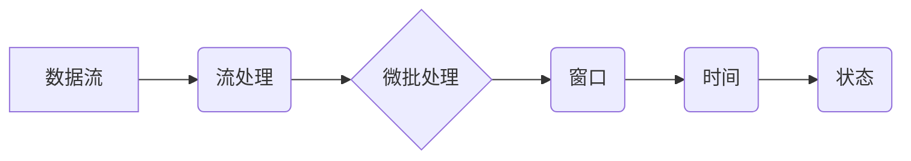
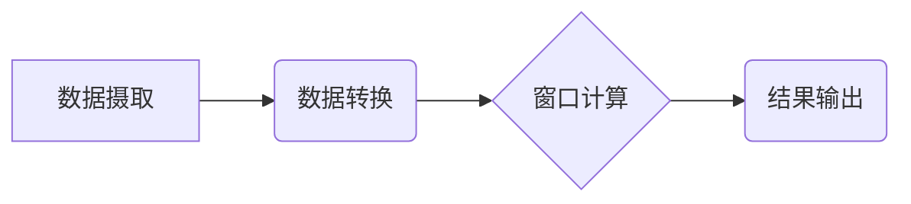

## 1. 背景介绍

### 1.1 大数据时代的数据处理挑战
随着互联网、物联网、移动互联网的快速发展，全球数据量呈爆炸式增长，我们正在步入一个前所未有的大数据时代。海量的数据蕴藏着巨大的价值，但也给数据的存储、处理和分析带来了前所未有的挑战。传统的批处理方式已经无法满足实时性要求高的应用场景，例如实时风险控制、实时推荐系统、实时欺诈检测等。

### 1.2 实时数据处理的兴起
为了应对大数据时代的数据处理挑战，实时数据处理技术应运而生。实时数据处理是指数据产生后，能够被立即捕获、处理和分析，并在毫秒级别内得到结果的技术。与传统的批处理相比，实时数据处理具有以下优势：

* **低延迟:** 数据处理结果能够在毫秒级别内返回，满足实时性要求高的应用场景。
* **高吞吐:** 能够处理高容量的数据流，满足大规模数据处理的需求。
* **持续性:** 数据处理过程是持续进行的，能够及时响应数据的变化。

### 1.3 实时数据处理的应用场景
实时数据处理技术已经广泛应用于各个领域，例如：

* **电子商务:** 实时推荐系统、实时欺诈检测、实时库存管理
* **金融:** 实时风险控制、实时交易监控、实时反洗钱
* **物联网:** 实时设备监控、实时环境监测、实时数据采集
* **社交媒体:** 实时趋势分析、实时用户行为分析、实时内容推荐

## 2. 核心概念与联系

### 2.1 数据流
数据流是指连续不断的数据记录序列，例如传感器数据、用户点击流数据、交易数据等。数据流的特点是数据量大、速度快、持续性强。

### 2.2 流处理
流处理是指对数据流进行实时处理的技术，其核心思想是将数据流切分成一个个小的数据块，然后对每个数据块进行实时处理，并将处理结果输出。

### 2.3 微批处理
微批处理是一种介于批处理和流处理之间的技术，它将数据流切分成一个个小的数据块，然后对每个数据块进行批处理，并将处理结果输出。微批处理兼具批处理的高吞吐量和流处理的低延迟特性。

### 2.4 窗口
窗口是指对数据流进行切分的时间段，例如最近1分钟、最近1小时、最近1天等。窗口可以是固定大小的，也可以是滑动大小的。

### 2.5 时间
时间是实时数据处理中非常重要的概念，因为数据流中的数据是按时间顺序产生的。实时数据处理需要考虑数据的产生时间、处理时间和输出时间。

### 2.6 状态
状态是指实时数据处理过程中需要保存的中间结果，例如数据统计结果、模型参数等。状态可以保存在内存中，也可以保存在外部存储系统中。

### 2.7 核心概念联系图


## 3. 核心算法原理具体操作步骤

### 3.1 流处理框架
目前主流的流处理框架包括 Apache Flink、Apache Spark Streaming、Apache Kafka Streams 等。这些框架都提供了丰富的 API 和工具，方便用户进行实时数据处理。

### 3.2 数据摄取
数据摄取是指将数据流从数据源读取到流处理框架中。数据源可以是数据库、消息队列、传感器等。

### 3.3 数据转换
数据转换是指对数据流进行清洗、过滤、格式转换等操作，以便于后续的处理和分析。

### 3.4 窗口计算
窗口计算是指对数据流进行切分，然后对每个窗口内的数据进行聚合、统计、分析等操作。

### 3.5 结果输出
结果输出是指将实时数据处理的结果输出到外部系统中，例如数据库、消息队列、仪表盘等。

### 3.6 核心算法操作步骤流程图


## 4. 数学模型和公式详细讲解举例说明

### 4.1 窗口函数
窗口函数是指对窗口内的数据进行聚合、统计、分析的函数，例如：

* `sum(x)`: 计算窗口内所有数据的总和
* `avg(x)`: 计算窗口内所有数据的平均值
* `max(x)`: 计算窗口内所有数据的最大值
* `min(x)`: 计算窗口内所有数据的最小值
* `count(x)`: 计算窗口内数据的个数

### 4.2 举例说明
假设有一个数据流，包含用户访问网站的日志信息，每条日志信息包含用户 ID、访问时间、访问页面等信息。现在需要统计每个用户在最近1分钟内访问网站的次数。

可以使用如下代码实现：

```sql
SELECT userId, count(*) AS visitCount
FROM website_log
GROUP BY userId
WINDOW TUMBLING (size 1 minute)
```

其中，`WINDOW TUMBLING (size 1 minute)` 表示使用大小为1分钟的固定窗口。

## 5. 项目实践：代码实例和详细解释说明

### 5.1 项目背景
假设有一个电商网站，需要实时统计每个商品的销量和销售额。

### 5.2 数据源
数据源是订单数据流，每条订单数据包含订单 ID、商品 ID、商品数量、商品单价等信息。

### 5.3 代码实例
```python
from pyspark.sql import SparkSession
from pyspark.sql.functions import window, col, sum

# 创建 SparkSession
spark = SparkSession.builder.appName("RealTimeDataProcessing").getOrCreate()

# 读取订单数据流
orderStream = spark.readStream.format("kafka").option("kafka.bootstrap.servers", "kafka:9092").option("subscribe", "order_topic").load()

# 将订单数据转换为 DataFrame
orderDF = orderStream.selectExpr("CAST(value AS STRING)").selectExpr("split(value, ',')[0] as orderId", "split(value, ',')[1] as productId", "CAST(split(value, ',')[2] AS INTEGER) as quantity", "CAST(split(value, ',')[3] AS DOUBLE) as price")

# 使用窗口函数统计每个商品的销量和销售额
windowedCounts = orderDF.groupBy(window(col("timestamp"), "1 minute"), "productId").agg(sum("quantity").alias("salesVolume"), sum(col("quantity") * col("price")).alias("salesAmount"))

# 将结果输出到控制台
query = windowedCounts.writeStream.outputMode("complete").format("console").start()

# 等待查询结束
query.awaitTermination()
```

### 5.4 代码解释
* `from pyspark.sql import SparkSession`：导入 SparkSession 类，用于创建 Spark 应用程序。
* `from pyspark.sql.functions import window, col, sum`：导入窗口函数、列函数和聚合函数。
* `spark = SparkSession.builder.appName("RealTimeDataProcessing").getOrCreate()`：创建 SparkSession 对象。
* `orderStream = spark.readStream.format("kafka").option("kafka.bootstrap.servers", "kafka:9092").option("subscribe", "order_topic").load()`：从 Kafka 中读取订单数据流。
* `orderDF = orderStream.selectExpr("CAST(value AS STRING)").selectExpr("split(value, ',')[0] as orderId", "split(value, ',')[1] as productId", "CAST(split(value, ',')[2] AS INTEGER) as quantity", "CAST(split(value, ',')[3] AS DOUBLE) as price")`：将订单数据转换为 DataFrame。
* `windowedCounts = orderDF.groupBy(window(col("timestamp"), "1 minute"), "productId").agg(sum("quantity").alias("salesVolume"), sum(col("quantity") * col("price")).alias("salesAmount"))`：使用窗口函数统计每个商品的销量和销售额。
* `query = windowedCounts.writeStream.outputMode("complete").format("console").start()`：将结果输出到控制台。
* `query.awaitTermination()`：等待查询结束。

## 6. 实际应用场景

### 6.1 实时推荐系统
实时推荐系统是指根据用户的实时行为数据，实时推荐用户可能感兴趣的商品或内容。实时推荐系统需要使用实时数据处理技术，对用户的实时行为数据进行分析，并实时更新推荐模型。

### 6.2 实时欺诈检测
实时欺诈检测是指利用实时数据处理技术，对交易数据进行实时分析，识别潜在的欺诈行为。实时欺诈检测系统需要能够处理高吞吐量的交易数据，并能够在毫秒级别内识别欺诈行为。

### 6.3 实时风险控制
实时风险控制是指利用实时数据处理技术，对金融交易数据进行实时分析，识别潜在的风险。实时风险控制系统需要能够处理高吞吐量的交易数据，并能够在毫秒级别内识别风险。

## 7. 工具和资源推荐

### 7.1 Apache Flink
Apache Flink 是一个开源的流处理框架，它提供了丰富的 API 和工具，方便用户进行实时数据处理。

### 7.2 Apache Spark Streaming
Apache Spark Streaming 是 Apache Spark 的一个扩展，它提供了流处理的功能。

### 7.3 Apache Kafka Streams
Apache Kafka Streams 是 Apache Kafka 的一个扩展，它提供了流处理的功能。

### 7.4 Amazon Kinesis
Amazon Kinesis 是一项完全托管的流数据服务，它可以轻松收集、处理和分析实时流数据。

### 7.5 Google Cloud Dataflow
Google Cloud Dataflow 是一项完全托管的流数据处理服务，它可以轻松构建和运行批处理和流处理管道。

## 8. 总结：未来发展趋势与挑战

### 8.1 未来发展趋势
* **实时机器学习:** 将机器学习模型应用于实时数据处理，实现实时预测和决策。
* **边缘计算:** 将实时数据处理能力推向网络边缘，降低数据传输成本和延迟。
* **云原生:** 将实时数据处理应用部署到云原生平台，提高可扩展性和可靠性。

### 8.2 面临的挑战
* **数据质量:** 实时数据处理需要处理大量的数据，数据质量问题可能会影响处理结果的准确性。
* **系统复杂性:** 实时数据处理系统通常比较复杂，需要专业的技术人员进行开发和维护。
* **成本:** 实时数据处理需要使用大量的计算资源，成本较高。

## 9. 附录：常见问题与解答

### 9.1 什么是实时数据处理？
实时数据处理是指数据产生后，能够被立即捕获、处理和分析，并在毫秒级别内得到结果的技术。

### 9.2 实时数据处理有哪些优势？
实时数据处理的优势包括低延迟、高吞吐、持续性等。

### 9.3 实时数据处理有哪些应用场景？
实时数据处理的应用场景包括实时推荐系统、实时欺诈检测、实时风险控制等。

### 9.4 主流的流处理框架有哪些？
主流的流处理框架包括 Apache Flink、Apache Spark Streaming、Apache Kafka Streams 等。