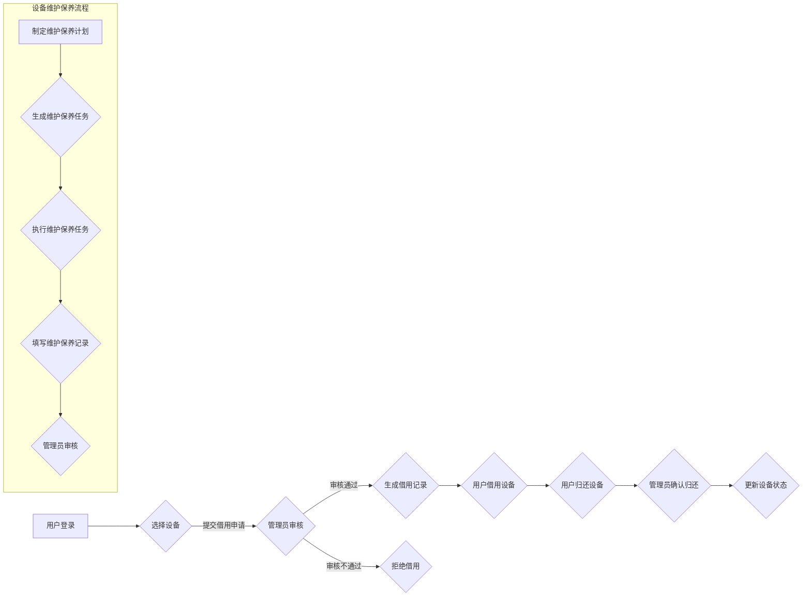

# 实验室设备仪器管理系统详细设计与具体代码实现

作者：禅与计算机程序设计艺术

## 1. 背景介绍

### 1.1. 实验室设备仪器管理现状与挑战

传统的实验室设备仪器管理模式主要依靠人工记录和管理，存在着诸多弊端：

* **信息记录不完整、不准确:**  人工记录容易出现遗漏、错误等问题，导致数据不完整、不准确。
* **查询统计困难:**  查找和统计设备信息需要耗费大量时间和人力。
* **资源利用率低:**  缺乏对设备使用情况的有效监控，导致设备闲置或重复购置，资源利用率低下。
* **维护保养不及时:**  缺乏对设备维护保养记录的管理，容易造成设备故障和安全隐患。

### 1.2.  实验室设备仪器管理系统的设计目标

为了解决上述问题，提高实验室设备仪器管理效率，设计开发一套高效、便捷、安全的实验室设备仪器管理系统势在必行。该系统应具备以下功能：

* **设备信息管理:**  对实验室所有设备仪器进行统一的信息化管理，包括设备名称、型号、规格、购置日期、存放地点、使用状态等。
* **设备借用管理:**  实现设备的在线预约、审批、借用和归还，并记录完整的借用历史。
* **设备维护保养管理:**  制定设备维护保养计划，记录维护保养记录，并进行提醒和预警。
* **报表统计分析:**  提供设备使用情况、维护保养情况等多维度报表统计分析功能。
* **系统安全与权限控制:**  确保系统数据安全，并对不同角色的用户进行权限控制。

## 2. 核心概念与联系

### 2.1. 系统架构

本系统采用B/S架构，主要包括以下模块：

* **数据访问层:**  负责与数据库交互，进行数据的增删改查操作。
* **业务逻辑层:**  处理业务逻辑，实现系统的核心功能。
* **表示层:**  负责与用户交互，展示数据和接收用户操作。

#### 2.1.1. 数据访问层

数据访问层采用MyBatis框架实现，通过XML文件配置SQL语句，将数据库操作封装成Java方法，方便业务逻辑层调用。

#### 2.1.2. 业务逻辑层

业务逻辑层采用Spring框架实现，通过依赖注入和面向切面编程等技术，实现业务逻辑的解耦和代码复用。

#### 2.1.3. 表示层

表示层采用Spring MVC框架实现，通过控制器、视图解析器等组件，实现用户请求的处理和响应。

### 2.2. 数据库设计

系统数据库采用MySQL数据库，主要包括以下数据表：

* **设备信息表:**  存储设备的基本信息，包括设备编号、名称、型号、规格、购置日期、存放地点、使用状态等。
* **设备借用记录表:**  存储设备的借用记录，包括借用人、借用时间、归还时间、借用用途等。
* **设备维护保养记录表:**  存储设备的维护保养记录，包括维护保养时间、维护保养内容、维护保养人等。
* **用户表:**  存储用户信息，包括用户名、密码、角色等。
* **角色表:**  存储角色信息，包括角色名称、权限等。

### 2.3. 核心业务流程

#### 2.3.1. 设备借用流程

1. 用户登录系统，选择需要借用的设备，提交借用申请。
2. 系统管理员审核借用申请，审核通过后，生成借用记录。
3. 用户借用设备，并在归还时填写归还信息。
4. 系统管理员确认设备归还，更新设备状态。

#### 2.3.2. 设备维护保养流程

1. 系统管理员制定设备维护保养计划。
2. 系统根据维护保养计划自动生成维护保养任务。
3. 维护保养人员执行维护保养任务，并填写维护保养记录。
4. 系统管理员审核维护保养记录。

### 2.4.  Mermaid 流程图



## 3. 核心算法原理具体操作步骤

### 3.1.  设备借用算法

#### 3.1.1.  算法描述

设备借用算法主要用于判断设备是否可以借用，并更新设备状态。

#### 3.1.2.  算法步骤

1. 检查设备当前状态是否为“空闲”。
2. 如果设备状态为“空闲”，则将设备状态更新为“借用中”，并生成借用记录。
3. 如果设备状态不为“空闲”，则提示用户设备已被借用。

#### 3.1.3.  代码实现

```java
public boolean borrowDevice(String deviceId, String userId) {
    // 获取设备信息
    Device device = deviceMapper.selectByPrimaryKey(deviceId);
    // 检查设备状态
    if (device.getStatus() == DeviceStatus.FREE) {
        // 更新设备状态
        device.setStatus(DeviceStatus.BORROWED);
        deviceMapper.updateByPrimaryKeySelective(device);
        // 生成借用记录
        BorrowRecord borrowRecord = new BorrowRecord();
        borrowRecord.setDeviceId(deviceId);
        borrowRecord.setUserId(userId);
        borrowRecord.setBorrowTime(new Date());
        borrowRecordMapper.insertSelective(borrowRecord);
        return true;
    } else {
        return false;
    }
}
```

### 3.2.  设备维护保养算法

#### 3.2.1.  算法描述

设备维护保养算法主要用于生成设备维护保养任务，并提醒相关人员。

#### 3.2.2.  算法步骤

1. 根据设备维护保养计划，计算出下次维护保养时间。
2. 如果下次维护保养时间小于等于当前时间，则生成维护保养任务，并发送提醒消息给相关人员。

#### 3.2.3.  代码实现

```java
public void generateMaintenanceTask() {
    // 获取所有设备
    List<Device> deviceList = deviceMapper.selectAll();
    // 遍历设备列表
    for (Device device : deviceList) {
        // 获取设备维护保养计划
        MaintenancePlan maintenancePlan = maintenancePlanMapper.selectByDeviceId(device.getId());
        // 计算下次维护保养时间
        Date nextMaintenanceTime = calculateNextMaintenanceTime(device.getLastMaintenanceTime(), maintenancePlan.getMaintenanceCycle());
        // 如果下次维护保养时间小于等于当前时间，则生成维护保养任务
        if (nextMaintenanceTime.compareTo(new Date()) <= 0) {
            // 生成维护保养任务
            MaintenanceTask maintenanceTask = new MaintenanceTask();
            maintenanceTask.setDeviceId(device.getId());
            maintenanceTask.setStatus(MaintenanceTaskStatus.PENDING);
            maintenanceTaskMapper.insertSelective(maintenanceTask);
            // 发送提醒消息给相关人员
            sendMessage(device.getId(), "设备需要维护保养");
        }
    }
}

// 计算下次维护保养时间
private Date calculateNextMaintenanceTime(Date lastMaintenanceTime, int maintenanceCycle) {
    // TODO: 根据维护周期计算下次维护保养时间
}
```

## 4. 数学模型和公式详细讲解举例说明

本系统中未使用复杂的数学模型和公式。

## 5. 项目实践：代码实例和详细解释说明

### 5.1.  项目环境搭建

#### 5.1.1.  开发工具

* IntelliJ IDEA
* Maven
* MySQL
* Navicat

#### 5.1.2.  项目依赖

```xml
<dependencies>
    <!-- Spring框架 -->
    <dependency>
        <groupId>org.springframework</groupId>
        <artifactId>spring-context</artifactId>
        <version>${spring.version}</version>
    </dependency>
    <dependency>
        <groupId>org.springframework</groupId>
        <artifactId>spring-webmvc</artifactId>
        <version>${spring.version}</version>
    </dependency>
    <!-- MyBatis框架 -->
    <dependency>
        <groupId>org.mybatis</groupId>