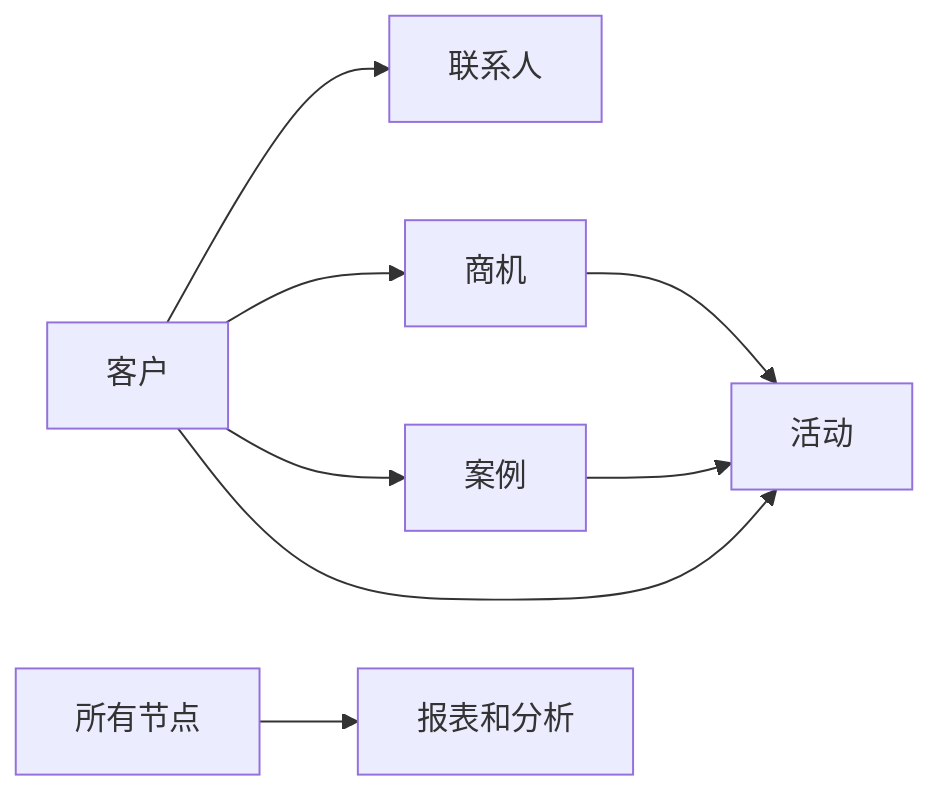

## 1. 背景介绍

### 1.1  客户关系管理(CRM)概述
在当今竞争日益激烈的商业环境中，企业要想取得成功，就必须建立并维护良好的客户关系。客户关系管理(CRM)应运而生，它是一种以客户为中心的商业策略，旨在通过优化客户互动来提高客户忠诚度和盈利能力。CRM系统则成为了实现这一目标的关键工具，它通过自动化和整合销售、营销和客户服务等业务流程，帮助企业更好地了解客户需求、提供个性化服务、提高客户满意度。

### 1.2  客户管理系统的重要性
客户管理系统对于企业发展的重要性不言而喻，它能够帮助企业:

* **提高客户满意度和忠诚度:** 通过提供个性化服务、快速响应客户需求，提升客户体验，进而提高客户满意度和忠诚度。
* **提高销售效率和业绩:** 通过自动化销售流程、提供销售线索、分析销售数据，帮助销售人员更有效地进行销售，提高销售业绩。
* **优化营销活动效果:**  通过分析客户数据，进行精准营销，提高营销活动的转化率。
* **降低运营成本:** 通过自动化流程、提高效率，降低运营成本。
* **提升企业竞争力:**  通过建立以客户为中心的企业文化，提升企业的核心竞争力。

### 1.3  客户管理系统的演变
客户管理系统经历了从简单到复杂、从单一功能到集成化、从本地部署到云端部署的演变过程。早期的CRM系统主要用于记录客户信息，随着技术的进步和企业需求的不断变化，CRM系统逐渐发展成为集销售、营销、客户服务等功能于一体的综合性平台。

## 2. 核心概念与联系

### 2.1  客户管理系统核心概念
* **客户:**  企业最宝贵的资产，CRM系统围绕客户构建所有业务流程。
* **联系人:** 与客户相关的个人，例如企业的决策者、使用者等。
* **商机:**  潜在的销售机会，CRM系统可以跟踪商机从线索到成交的整个过程。
* **案例:**  客户提出的问题或请求，CRM系统可以跟踪案例的处理过程。
* **活动:** 与客户相关的活动，例如会议、电话、邮件等。
* **报表和分析:**  CRM系统提供强大的报表和分析功能，帮助企业分析客户数据，制定更好的商业决策。

### 2.2  核心概念之间的联系

下图展示了客户管理系统中各个核心概念之间的联系:



## 3. 核心算法原理具体操作步骤

### 3.1  数据挖掘与分析

客户管理系统中蕴藏着大量的客户数据，通过数据挖掘和分析技术，可以从中发现隐藏的规律和价值，为企业决策提供支持。

#### 3.1.1  客户细分

客户细分是根据客户的特征和行为将客户划分为不同的群体，以便企业可以针对不同的客户群体制定不同的营销策略。常用的客户细分方法包括：

* **人口统计学细分:**  根据客户的年龄、性别、收入、职业等人口统计学特征进行细分。
* **地理位置细分:**  根据客户的地理位置进行细分。
* **行为细分:**  根据客户的购买行为、网站浏览行为、社交媒体行为等进行细分。
* **价值细分:**  根据客户的终身价值、购买频率、平均订单金额等进行细分。

#### 3.1.2  预测模型

预测模型可以根据历史数据预测未来的趋势，例如客户流失率、产品销量等。常用的预测模型包括：

* **回归分析:**  用于预测连续型变量，例如销售额。
* **分类算法:**  用于预测离散型变量，例如客户是否会流失。
* **时间序列分析:**  用于预测随时间变化的趋势，例如产品销量。

### 3.2  个性化推荐

个性化推荐是根据用户的历史行为和兴趣偏好，向用户推荐其可能感兴趣的产品或服务。常用的个性化推荐算法包括：

* **协同过滤算法:**  根据用户的历史行为和其他用户的历史行为进行推荐。
* **基于内容的推荐算法:** 根据用户的历史行为和产品的特征进行推荐。
* **混合推荐算法:**  结合多种推荐算法的优点进行推荐。

### 3.3  营销自动化

营销自动化是指利用软件平台来自动化执行营销任务，例如发送电子邮件、管理社交媒体和跟踪营销活动。常用的营销自动化功能包括：

* **电子邮件营销:**  自动发送电子邮件，例如欢迎邮件、促销邮件、生日邮件等。
* **社交媒体管理:**  自动发布社交媒体内容，跟踪社交媒体互动，分析社交媒体数据等。
* **营销活动管理:**  创建和管理营销活动，例如网络研讨会、线下活动等。

## 4. 数学模型和公式详细讲解举例说明

### 4.1  RFM模型

RFM模型是一种常用的客户价值分析模型，它根据客户最近一次消费(Recency)、消费频率(Frequency)和消费金额(Monetary)三个维度对客户进行分类。

* **R(Recency):**  客户最近一次消费的时间距离现在的时间间隔。
* **F(Frequency):**  客户在一段时间内的消费次数。
* **M(Monetary):**  客户在一段时间内的消费总金额。

根据RFM模型，可以将客户分为以下几类:

| 客户类型 | 特征 | 营销策略 |
|---|---|---|
| 重要保持客户 | RFM值都很高 | 提供个性化服务，维护客户关系 |
| 重要发展客户 | F值和M值较高，R值较低 | 鼓励再次消费 |
| 重要挽留客户 | R值和F值较低，M值较高 | 提供优惠活动，挽回客户 |
| 一般客户 | RFM值都比较平均 |  |
| 流失客户 | R值很低 |  |

### 4.2  客户生命周期价值(CLTV)

客户生命周期价值(CLTV)是指一个客户在未来一段时间内为企业创造的总价值。计算CLTV的公式如下：

$$
CLTV = \sum_{t=0}^{T} \frac{M_t}{(1+d)^t}
$$

其中，

* $M_t$ 表示客户在第 $t$ 年的利润贡献。
* $d$ 表示折现率。
* $T$ 表示客户的生命周期。

CLTV可以帮助企业识别高价值客户，并制定相应的营销策略。

## 5. 项目实践：代码实例和详细解释说明

### 5.1  技术选型

* **后端:**  Spring Boot
* **数据库:**  MySQL
* **缓存:**  Redis
* **消息队列:**  Kafka

### 5.2  数据库设计

```sql
CREATE TABLE customer (
  id INT PRIMARY KEY AUTO_INCREMENT,
  name VARCHAR(255) NOT NULL,
  phone VARCHAR(20) NOT NULL,
  email VARCHAR(255),
  address VARCHAR(255)
);

CREATE TABLE contact (
  id INT PRIMARY KEY AUTO_INCREMENT,
  customer_id INT NOT NULL,
  name VARCHAR(255) NOT NULL,
  phone VARCHAR(20) NOT NULL,
  email VARCHAR(255),
  position VARCHAR(255)
);

CREATE TABLE opportunity (
  id INT PRIMARY KEY AUTO_INCREMENT,
  customer_id INT NOT NULL,
  name VARCHAR(255) NOT NULL,
  amount DECIMAL(10,2) NOT NULL,
  stage VARCHAR(255) NOT NULL
);
```

### 5.3  核心代码示例

```java
@RestController
@RequestMapping("/api/customers")
public class CustomerController {

  @Autowired
  private CustomerService customerService;

  @GetMapping
  public List<Customer> getAllCustomers() {
    return customerService.getAllCustomers();
  }

  @GetMapping("/{id}")
  public Customer getCustomerById(@PathVariable int id) {
    return customerService.getCustomerById(id);
  }

  @PostMapping
  public Customer createCustomer(@RequestBody Customer customer) {
    return customerService.createCustomer(customer);
  }
}
```

## 6. 实际应用场景

### 6.1  销售管理

* 销售线索管理
* 商机管理
* 报价管理
* 订单管理
* 销售预测

### 6.2  营销管理

* 客户细分
* 营销活动管理
* 邮件营销
* 短信营销
* 社交媒体营销

### 6.3  客户服务

* 案例管理
* 知识库
* 在线客服
* 客户满意度调查

## 7. 总结：未来发展趋势与挑战

### 7.1  未来发展趋势

* **人工智能(AI):** AI技术将越来越多地应用于CRM系统中，例如智能客服、智能推荐等。
* **大数据:**  CRM系统将收集和分析越来越多的客户数据，为企业提供更精准的决策支持。
* **云计算:**  越来越多的CRM系统将部署在云端，提供更灵活、更便捷的服务。
* **移动化:**  移动CRM将成为趋势，方便销售人员随时随地访问客户信息。

### 7.2  挑战

* **数据安全:**  CRM系统存储了大量的客户数据，数据安全是一个重要的挑战。
* **系统集成:**  CRM系统需要与企业内部的其他系统进行集成，例如ERP系统、财务系统等。
* **用户体验:**  CRM系统的用户体验至关重要，需要不断优化用户界面和操作流程。

## 8. 附录：常见问题与解答

### 8.1  如何选择合适的CRM系统？

选择合适的CRM系统需要考虑以下因素：

* 企业规模和需求
* 预算
* 功能需求
* 集成需求
* 用户体验

### 8.2  CRM系统的实施难点有哪些？

CRM系统的实施难点包括：

* 数据迁移
* 流程改造
* 用户培训
* 系统维护

### 8.3  如何提高CRM系统的利用率？

提高CRM系统的利用率可以采取以下措施：

* 加强用户培训
* 制定合理的业务流程
* 提供数据分析支持
* 不断优化系统功能
