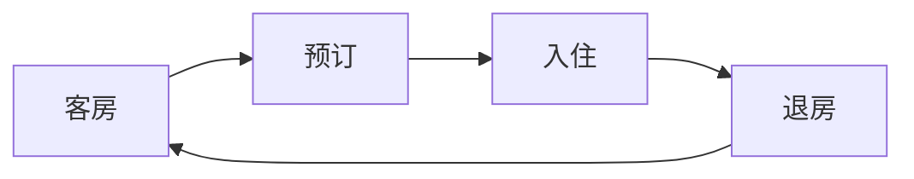
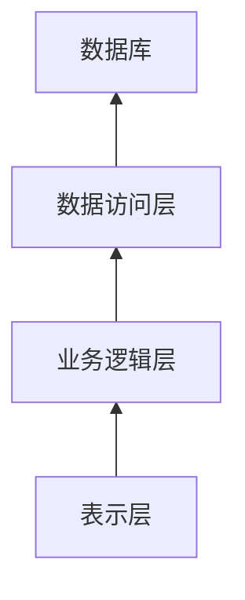

# 客房管理系统详细设计与具体代码实现

## 1.背景介绍

### 1.1 酒店业发展现状

随着旅游业的蓬勃发展和人们生活水平的不断提高,酒店业也呈现出了前所未有的繁荣景象。然而,传统的人工管理模式已经无法满足酒店日益增长的管理需求,客房管理系统(Hotel Room Management System,HRMS)应运而生。

### 1.2 客房管理系统的重要性

客房管理系统是酒店运营管理的核心系统,涵盖了客房预订、入住登记、客房状态管理、计费结算等多个环节。高效可靠的客房管理系统可以:

1. 提高工作效率,减少人工操作差错
2. 优化客房使用率,提升酒店收益
3. 改善客户体验,提升品牌形象

### 1.3 客房管理系统的发展历程

早期的客房管理系统主要采用大型机或小型机架构,系统庞大且昂贵。随着互联网和分布式计算技术的发展,基于B/S或C/S架构的客房管理系统逐渐普及,降低了系统部署和维护成本。近年来,云计算、大数据等新兴技术为客房管理系统注入了新的活力。

## 2.核心概念与联系

### 2.1 客房管理系统的核心概念

1. **客房(Room)**: 系统的核心管理对象,包括房间类型、房价、状态等属性。
2. **预订(Reservation)**: 客户提前预定客房的过程,涉及客户信息、预订时间等。
3. **入住(Check-in)**: 客户实际入住酒店,将预订转化为实际入住记录。
4. **退房(Check-out)**: 客户离店时,结清费用并办理退房手续。
5. **房态(Room Status)**: 客房的状态,如空闲、占用、打扫等,影响客房调度。

### 2.2 核心概念的关联关系

这些核心概念之间存在着密切的关联关系,如下图所示:



1. 客户根据客房信息进行预订
2. 预订转化为实际入住记录
3. 入住记录产生费用,客户办理退房结算费用
4. 客房状态更新为空闲,可供下一位客户预订

## 3.核心算法原理具体操作步骤

### 3.1 客房状态管理算法

客房状态管理是客房管理系统的核心功能之一,需要高效准确地跟踪和维护每个客房的状态。常用的客房状态包括:空闲(Vacant)、占用(Occupied)、打扫(Cleaning)、维修(Maintenance)等。

算法的基本思路是:根据预订、入住、退房等操作,实时更新对应客房的状态。具体步骤如下:

1. 初始化所有客房状态为空闲
2. 当有新的预订时,将对应客房的状态设置为"已预订"
3. 当客户实际入住时,将客房状态设置为"占用"
4. 当客户退房后,将客房状态设置为"打扫",等待房务人员清理
5. 当清理完毕后,将客房状态设置为"空闲",可供新客人预订

该算法的时间复杂度为O(1),可以高效地响应客房状态的实时查询和更新操作。

### 3.2 客房调度算法

当有新的预订或入住请求时,系统需要根据一定策略为客户分配合适的客房。这就需要一个高效的客房调度算法。

最简单的调度算法是"先到先得"(First Come First Served),按照预订或入住的时间顺序,依次分配空闲的客房。但这种算法存在一些问题,如无法满足客户对房型的特殊要求、导致客房使用率不均衡等。

更优化的客房调度算法需要考虑多个因素,如:

1. 客户预订的房型要求
2. 客房的实时状态和价格信息 
3. 客房使用率均衡
4. 客户会员级别和特殊要求

我们可以设计一种基于优先级的最佳适配调度算法:

1. 根据上述多个因素,为每个空闲客房计算一个综合优先级分数
2. 按优先级分数从高到低,为客户分配最高优先级的客房
3. 如果多个客房优先级相同,则按"先到先得"原则分配

该算法可以在满足客户要求的前提下,最大限度地提高客房使用率和收益。当然,具体的优先级计算方法需要根据酒店的实际经营策略进行调整和优化。

## 4.数学模型和公式详细讲解举例说明

### 4.1 客房定价模型

合理的客房定价对于酒店的盈利能力至关重要。我们可以建立一个基于多元线性回归的客房定价模型,从而预测不同因素对客房价格的影响程度。

设客房价格 $y$ 为因变量,影响因素 $x_1,x_2,...,x_n$ 为自变量,则回归方程为:

$$y = \beta_0 + \beta_1x_1 + \beta_2x_2 + ... + \beta_nx_n + \epsilon$$

其中:

- $y$ 为客房价格
- $x_i$ 为影响因素,如房型、星级、地理位置等
- $\beta_i$ 为对应影响因素的回归系数,反映该因素对价格的影响程度
- $\epsilon$ 为随机误差项

我们可以使用历史数据,通过最小二乘法等方法估计出每个回归系数 $\beta_i$,从而得到定价模型。

例如,假设我们考虑三个影响因素:房型($x_1$)、星级($x_2$)和地理位置($x_3$),通过回归分析得到的定价模型为:

$$y = 200 + 50x_1 + 100x_2 + 30x_3$$

其中:
- $x_1$为0(标准房)或1(套房)
- $x_2$为3(三星级)、4(四星级)或5(五星级)  
- $x_3$为0(市中心)或1(市郊)

根据这个模型,我们可以计算出不同房型、星级和地理位置的客房价格。比如,一间四星级市中心的标准房,其价格为:

$$y = 200 + 50 \times 0 + 100 \times 4 + 30 \times 0 = 600(元/晚)$$

该模型为酒店提供了科学的定价依据,有助于提高客房收益和盈利能力。

### 4.2 客房需求预测模型

准确预测未来一段时间内的客房需求量,对于做好客房调度和营销策略至关重要。我们可以建立一个基于时间序列分析的客房需求预测模型。

设时间 $t$ 的客房需求量为 $y_t$,我们使用加法模型对其进行分解:

$$y_t = T_t + S_t + I_t + \epsilon_t$$

其中:

- $T_t$ 为趋势分量,反映需求量的长期上升或下降趋势
- $S_t$ 为周期分量,反映需求量的周期性波动(如季节性等)
- $I_t$ 为不规则分量,反映随机波动
- $\epsilon_t$ 为随机误差项

我们可以使用移动平均法、指数平滑法等方法分别估计趋势分量和周期分量,从而对未来需求量进行预测。

例如,使用12个月移动平均法估计趋势分量和周期分量,预测未来1个月的需求量为:

$$\hat{y}_{t+1} = \hat{T}_{t+1} + \hat{S}_{t+1}$$

其中,
$$\hat{T}_{t+1} = \frac{1}{12}\sum_{i=0}^{11}y_{t-i}$$
为趋势分量预测值,
$$\hat{S}_{t+1} = y_{t+1-L} - \hat{T}_{t+1-L}$$
为周期分量预测值,L为周期长度(这里为12个月)。

通过这种方式,我们可以合理预测酒店在未来一段时间内的客房需求量,为制定营销和客房调度策略提供依据。

## 5. 项目实践:代码实例和详细解释说明

为了更好地理解客房管理系统的实现细节,我们将使用Java语言,基于面向对象编程思想开发一个简单的客房管理系统原型。

### 5.1 系统架构设计

我们将采用经典的三层架构设计,包括表示层(UI)、业务逻辑层和数据访问层,如下所示:



其中:

- **表示层**:提供用户界面,接收用户输入并显示操作结果。
- **业务逻辑层**:实现系统的核心业务逻辑,如客房管理、预订管理等。
- **数据访问层**:负责与数据库交互,执行数据持久化和查询操作。

### 5.2 核心类设计

根据上述架构,我们可以设计如下核心类:

- `Room`: 表示客房的实体类,包含房间号、房型、价格等属性。
- `RoomStatus`: 枚举类,表示客房的各种状态。
- `Reservation`: 表示预订记录的实体类,包含客户信息、预订日期等属性。
- `RoomManager`: 客房管理的业务逻辑类,提供客房查询、预订、入住、退房等方法。
- `ReservationManager`: 预订管理的业务逻辑类,提供预订查询、添加、修改等方法。
- `RoomDao`和`ReservationDao`: 数据访问对象接口,定义对客房和预订记录的持久化操作。

### 5.3 关键代码实现

#### 5.3.1 客房状态管理

我们使用`RoomStatus`枚举类表示客房的各种状态:

```java
public enum RoomStatus {
    VACANT,        // 空闲
    OCCUPIED,      // 占用
    RESERVED,      // 已预订
    CLEANING,      // 打扫
    MAINTENANCE    // 维修
}
```

在`RoomManager`类中,我们可以实现客房状态的更新方法:

```java
public void updateRoomStatus(int roomNo, RoomStatus newStatus) {
    Room room = getRoomByNo(roomNo);
    if (room != null) {
        room.setStatus(newStatus);
        roomDao.update(room); // 持久化状态更新
    }
}
```

该方法根据房间号获取对应的`Room`对象,更新其状态属性,并将更新持久化到数据库中。

#### 5.3.2 客房预订

在`ReservationManager`类中,我们可以实现客房预订的方法:

```java
public Reservation makeReservation(Customer customer, Date checkinDate, Date checkoutDate, RoomType roomType) {
    // 1. 查找符合条件的空闲客房
    List<Room> availableRooms = roomManager.getAvailableRooms(checkinDate, checkoutDate, roomType);
    
    if (availableRooms.isEmpty()) {
        // 无空闲客房,预订失败
        return null;
    }
    
    // 2. 根据某种调度策略选择一间客房
    Room selectedRoom = selectRoomByStrategy(availableRooms);
    
    // 3. 创建预订记录并持久化
    Reservation reservation = new Reservation(customer, selectedRoom, checkinDate, checkoutDate);
    reservationDao.insert(reservation);
    
    // 4. 更新客房状态为"已预订"
    roomManager.updateRoomStatus(selectedRoom.getRoomNo(), RoomStatus.RESERVED);
    
    return reservation;
}
```

该方法首先查找符合条件的空闲客房列表,如果列表为空则预订失败。否则,根据某种调度策略(这里未实现)选择一间客房,创建预订记录并持久化,最后更新选中客房的状态为"已预订"。

#### 5.3.3 客房入住

在`RoomManager`类中,我们可以实现客房入住的方法:

```java
public void checkin(int reservationId) {
    // 1. 获取预订记录
    Reservation reservation = reservationManager.getReservationById(reservationId);
    if (reservation == null) {
        // 无效预订记录
        return;
    }
    
    // 2. 更新客房状态为"占用"
    int roomNo = reservation.getRoomNo();
    updateRoomStatus(roomNo, RoomStatus.OCCUPIED);
    
    // 3. 更新预订记录状态为"已入住"
    reservation.setStatus(ReservationStatus.CHECKED_IN);