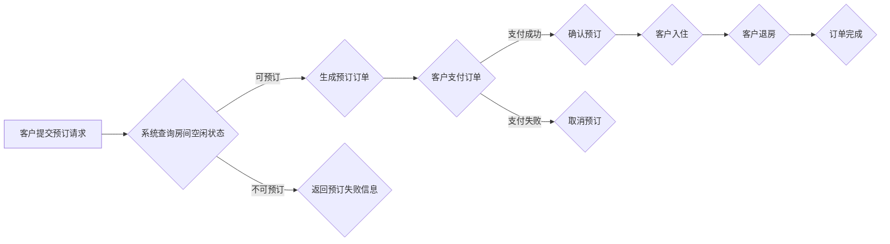

##  客房预订系统详细设计与具体代码实现

**作者：禅与计算机程序设计艺术**

## 1. 背景介绍

### 1.1 酒店行业信息化趋势

随着互联网和移动互联网的快速发展，酒店行业正经历着前所未有的变革。传统的线下预订模式逐渐被在线预订平台所取代，客户对酒店服务体验和效率的要求也越来越高。为了应对这些挑战，酒店行业的信息化建设显得尤为重要。

### 1.2 客房预订系统的重要性

客房预订系统作为酒店信息化的核心模块之一，承担着连接酒店与客户的桥梁作用。一个高效、稳定、安全的客房预订系统不仅能够提升酒店的运营效率和客户满意度，还能为酒店管理决策提供数据支持。

### 1.3 本文目的和意义

本文旨在详细介绍客房预订系统的需求分析、系统设计、数据库设计、代码实现以及实际应用等方面的内容，为酒店行业信息化建设提供参考和借鉴。

## 2. 核心概念与联系

### 2.1 系统用户角色

* **客户:**  通过系统查询房间信息、预订房间、取消预订、支付订单等。
* **酒店管理员:**  管理酒店信息、房间类型、价格策略、订单信息、客户信息等。
* **系统管理员:**  负责系统的维护、更新、安全等工作。

### 2.2  核心实体及联系

* **客户(Customer):**  存储客户的基本信息，例如姓名、联系方式、会员等级等。
* **房间类型(RoomType):**  定义不同的房间类型，例如单人间、双人间、套房等，并设置房间的基本信息，例如面积、床型、价格等。
* **房间(Room):**  表示酒店中的每一个具体的房间，与房间类型关联，并记录房间的状态，例如空闲、已预订、已入住等。
* **订单(Order):**  记录客户的预订信息，例如预订时间、入住时间、离店时间、房间数量、总金额等。
* **支付(Payment):**  记录客户的支付信息，例如支付方式、支付金额、支付时间等。

### 2.3 系统核心流程



## 3. 核心算法原理具体操作步骤

### 3.1 房间查询算法

* **步骤 1:**  获取客户的入住时间、离店时间、房间类型等查询条件。
* **步骤 2:**  查询数据库中所有符合条件的房间。
* **步骤 3:**  根据房间的状态筛选出可预订的房间。
* **步骤 4:**  将可预订的房间信息返回给客户。

### 3.2  价格计算算法

* **步骤 1:**  获取房间类型、入住时间、离店时间等信息。
* **步骤 2:**  根据酒店设置的价格策略计算房间价格，例如根据淡旺季、节假日、会员等级等进行价格调整。
* **步骤 3:**  计算总价 = 房间价格 * 入住天数 * 房间数量。

### 3.3  订单生成算法

* **步骤 1:**  生成唯一的订单号。
* **步骤 2:**  将客户信息、房间信息、预订信息、价格信息等保存到订单表中。
* **步骤 3:**  更新房间状态为“已预订”。

## 4. 数学模型和公式详细讲解举例说明

本系统中未使用复杂的数学模型，主要涉及一些简单的计算，例如：

* **入住天数 = 离店日期 - 入住日期**
* **总价 = 房间价格 * 入住天数 * 房间数量**

## 5. 项目实践：代码实例和详细解释说明

### 5.1 技术选型

* **后端:**  Spring Boot
* **数据库:** MySQL
* **前端:**  Vue.js

### 5.2 代码示例

#### 5.2.1 房间查询接口

```java
@RestController
@RequestMapping("/api/rooms")
public class RoomController {

    @Autowired
    private RoomService roomService;

    @GetMapping("/search")
    public List<Room> searchRooms(@RequestParam("checkInDate") String checkInDate,
                                    @RequestParam("checkOutDate") String checkOutDate,
                                    @RequestParam("roomTypeId") Long roomTypeId) {
        // 参数校验
        // ...

        // 调用service层查询房间
        List<Room> rooms = roomService.searchRooms(checkInDate, checkOutDate, roomTypeId);

        // 返回查询结果
        return rooms;
    }
}
```

#### 5.2.2  预订房间接口

```java
@RestController
@RequestMapping("/api/orders")
public class OrderController {

    @Autowired
    private OrderService orderService;

    @PostMapping
    public Order createOrder(@RequestBody Order order) {
        // 参数校验
        // ...

        // 调用service层创建订单
        Order createdOrder = orderService.createOrder(order);

        // 返回创建的订单信息
        return createdOrder;
    }
}
```

## 6. 实际应用场景

* **酒店官网:**  客户可以通过酒店官网查询房间信息、预订房间、取消预订、支付订单等。
* **移动App:**  客户可以通过酒店移动App随时随地进行房间预订和管理。
* **OTA平台:**  酒店可以将房间信息同步到各大OTA平台，例如携程、艺龙等，扩大销售渠道。

## 7. 工具和资源推荐

* **Spring Boot官网:**  https://spring.io/projects/spring-boot
* **MySQL官网:**  https://www.mysql.com/
* **Vue.js官网:**  https://vuejs.org/

## 8. 总结：未来发展趋势与挑战

### 8.1 未来发展趋势

* **个性化推荐:**  根据客户的喜好和历史行为，为客户推荐更符合其需求的房间和服务。
* **智能客服:**  利用人工智能技术，为客户提供7*24小时的在线客服服务。
* **大数据分析:**  通过对客户数据、运营数据的分析，为酒店经营决策提供支持。

### 8.2 面临的挑战

* **数据安全:**  如何保障客户信息和交易数据的安全。
* **系统稳定性:**  如何保证系统在高并发访问下的稳定运行。
* **技术更新迭代:**  如何应对不断更新的技术，保持系统的先进性。

## 9. 附录：常见问题与解答

### 9.1 如何保证系统安全性？

* **数据加密:**  对敏感数据进行加密存储和传输。
* **访问控制:**  对不同用户角色设置不同的访问权限。
* **安全测试:**  定期进行安全测试，及时发现和修复安全漏洞。

### 9.2 如何提高系统并发性能？

* **数据库优化:**  对数据库进行优化，例如添加索引、使用缓存等。
* **代码优化:**  优化代码逻辑，减少数据库访问次数。
* **负载均衡:**  使用负载均衡技术，将请求分发到多台服务器处理。