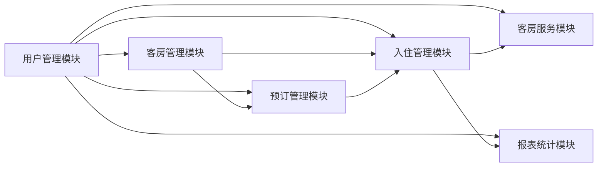
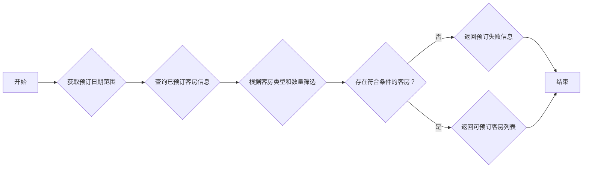
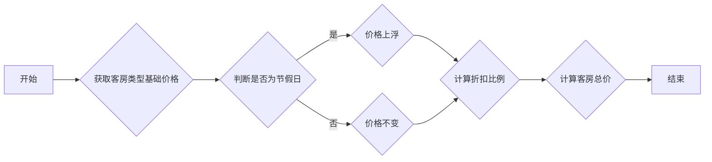

## 1. 背景介绍

### 1.1 酒店行业信息化现状与趋势

随着信息技术的快速发展和互联网的普及，酒店行业正在经历着深刻的变革。传统的酒店管理模式已经无法满足日益增长的客户需求和激烈的市场竞争。为了提高效率、降低成本、提升服务质量，越来越多的酒店开始寻求信息化解决方案。

### 1.2  客房管理系统的重要性

客房管理系统作为酒店信息化的核心组成部分，承担着客房预订、入住登记、退房结算、客房服务等重要功能。一个高效、稳定、安全的客房管理系统可以帮助酒店：

* 提高客房利用率，增加酒店收入
* 优化服务流程，提升客户满意度
* 降低运营成本，提高管理效率
* 加强数据分析，为经营决策提供支持

### 1.3 本文研究目的和意义

本文旨在设计和实现一个功能完善、性能优越、安全可靠的宾馆客房管理系统，以满足现代酒店的管理需求。通过本系统的开发，可以：

* 研究和应用先进的软件工程技术，例如面向对象编程、数据库设计、Web开发等。
* 提升软件开发的实践能力，积累项目经验。
* 为酒店行业提供一个可行的信息化解决方案，推动行业发展。

## 2. 核心概念与联系

### 2.1 系统用户角色

* **管理员:** 拥有最高权限，可以管理系统的所有功能，包括用户管理、客房管理、预订管理、报表统计等。
* **前台接待员:** 负责处理客户的入住登记、退房结算、客房服务等业务。
* **客房服务员:** 负责客房的清洁、整理、补充用品等工作。
* **客户:** 通过系统进行客房预订、入住登记、退房结算等操作。

### 2.2 系统功能模块

* **用户管理模块:**  包括用户注册、登录、权限管理等功能。
* **客房管理模块:**  包括客房类型管理、客房状态管理、客房价格管理等功能。
* **预订管理模块:**  包括客房预订、预订查询、预订修改、预订取消等功能。
* **入住管理模块:**  包括入住登记、换房、续住、退房等功能。
* **客房服务模块:**  包括客房清洁、客房服务、维修报修等功能。
* **报表统计模块:**  提供各种报表统计功能，例如客房入住率统计、收入统计等。

### 2.3  模块间关系图



## 3. 核心算法原理具体操作步骤

### 3.1 客房预订算法

#### 3.1.1 算法描述

客房预订算法用于判断在指定日期范围内是否有符合客户需求的空闲客房。其基本思路是：

1. 获取指定日期范围内的所有已预订客房信息。
2. 根据客户选择的客房类型和数量，筛选出符合条件的空闲客房。
3. 如果存在符合条件的空闲客房，则返回可预订的客房列表；否则，返回预订失败信息。

#### 3.1.2  流程图



### 3.2 客房价格计算算法

#### 3.2.1 算法描述

客房价格计算算法根据客房类型、入住日期、入住天数等因素计算客房总价。其基本思路是：

1. 获取客房类型的基础价格。
2. 根据入住日期判断是否为节假日，如果是节假日，则价格上浮一定比例。
3. 根据入住天数计算折扣比例，入住天数越多，折扣越大。
4. 将基础价格乘以节假日上浮比例和折扣比例，得到最终的客房总价。

#### 3.2.2 流程图



## 4. 数学模型和公式详细讲解举例说明

### 4.1  客房入住率计算

#### 4.1.1  公式

$$客房入住率 = \frac{已入住客房数}{总客房数} \times 100\% $$

#### 4.1.2  举例说明

假设某酒店共有100间客房，某日已入住客房数为80间，则该酒店当天的客房入住率为：

$$客房入住率 = \frac{80}{100} \times 100\% = 80\% $$

### 4.2  平均每间客房收入计算

#### 4.2.1  公式

$$平均每间客房收入 = \frac{客房总收入}{已出租客房数} $$

#### 4.2.2  举例说明

假设某酒店某日客房总收入为8000元，已出租客房数为80间，则该酒店当天的平均每间客房收入为：

$$平均每间客房收入 = \frac{8000}{80} = 100元 $$

## 5. 项目实践：代码实例和详细解释说明

### 5.1  技术栈选择

本项目采用以下技术栈进行开发：

* **后端:** Spring Boot + MyBatis Plus
* **数据库:** MySQL
* **前端:** Vue + Element UI

### 5.2  数据库设计

#### 5.2.1  ER图

```mermaid
erDiagram
    CUSTOMER ||--o{ ORDER : places
    ORDER ||--|{ ROOM : contains
    ROOM ||--|{ ROOM_TYPE : has
    STAFF ||--o{ ORDER : manages

    CUSTOMER {
        string customer_id PK
        string name
        string phone
        string id_card
    }

    ORDER {
        string order_id PK
        string customer_id FK
        string room_id FK
        datetime check_in_date
        datetime check_out_date
        decimal total_price
        enum status ["预订", "入住", "完成"]
    }

    ROOM {
        string room_id PK
        string room_number
        string room_type_id FK
        enum status ["空闲", "已入住", "维修中"]
    }

    ROOM_TYPE {
        string room_type_id PK
        string name
        decimal price
        int capacity
    }

    STAFF {
        string staff_id PK
        string name
        string password
        enum role ["管理员", "前台接待员", "客房服务员"]
    }
```

#### 5.2.2  表结构

##### 用户表 (customer)

| 字段名 | 数据类型 | 是否为空 | 主键 | 注释 |
|---|---|---|---|---|
| customer_id | varchar(32) | 否 | 是 | 用户ID |
| name | varchar(50) | 否 |  | 姓名 |
| phone | varchar(20) |  |  | 电话号码 |
| id_card | varchar(20) |  |  | 身份证号码 |

##### 客房类型表 (room_type)

| 字段名 | 数据类型 | 是否为空 | 主键 | 注释 |
|---|---|---|---|---|
| room_type_id | varchar(32) | 否 | 是 | 客房类型ID |
| name | varchar(50) | 否 |  | 客房类型名称 |
| price | decimal(10,2) | 否 |  | 客房类型价格 |
| capacity | int | 否 |  | 客房类型可容纳人数 |

##### 客房表 (room)

| 字段名 | 数据类型 | 是否为空 | 主键 | 注释 |
|---|---|---|---|---|
| room_id | varchar(32) | 否 | 是 | 客房ID |
| room_number | varchar(20) | 否 |  | 客房号码 |
| room_type_id | varchar(32) | 否 |  | 客房类型ID |
| status | varchar(20) | 否 |  | 客房状态（空闲、已入住、维修中） |

##### 订单表 (order)

| 字段名 | 数据类型 | 是否为空 | 主键 | 注释 |
|---|---|---|---|---|
| order_id | varchar(32) | 否 | 是 | 订单ID |
| customer_id | varchar(32) | 否 |  | 用户ID |
| room_id | varchar(32) | 否 |  | 客房ID |
| check_in_date | datetime | 否 |  | 入住日期 |
| check_out_date | datetime | 否 |  | 退房日期 |
| total_price | decimal(10,2) | 否 |  | 订单总价 |
| status | varchar(20) | 否 |  | 订单状态（预订、入住、完成） |

##### 员工表 (staff)

| 字段名 | 数据类型 | 是否为空 | 主键 | 注释 |
|---|---|---|---|---|
| staff_id | varchar(32) | 否 | 是 | 员工ID |
| name | varchar(50) | 否 |  | 员工姓名 |
| password | varchar(100) | 否 |  | 密码 |
| role | varchar(20) | 否 |  | 角色（管理员、前台接待员、客房服务员） |

### 5.3  核心代码实现

#### 5.3.1  客房预订接口

```java
@PostMapping("/orders")
public Result createOrder(@RequestBody OrderDto orderDto) {
    // 1. 参数校验
    // ...

    // 2. 查询符合条件的空闲客房
    List<Room> availableRooms = roomService.findAvailableRooms(
            orderDto.getCheckInDate(),
            orderDto.getCheckOutDate(),
            orderDto.getRoomTypeId(),
            orderDto.getRoomCount()
    );

    // 3. 判断是否有足够的空闲客房
    if (availableRooms.size() < orderDto.getRoomCount()) {
        return Result.fail("没有足够的空闲客房！");
    }

    // 4. 创建订单
    Order order = orderService.createOrder(orderDto, availableRooms);

    // 5. 返回结果
    return Result.success(order);
}
```

#### 5.3.2  客房价格计算接口

```java
@GetMapping("/rooms/{roomId}/price")
public Result calculateRoomPrice(
        @PathVariable String roomId,
        @RequestParam("checkInDate") @DateTimeFormat(pattern = "yyyy-MM-dd") LocalDate checkInDate,
        @RequestParam("checkOutDate") @DateTimeFormat(pattern = "yyyy-MM-dd") LocalDate checkOutDate
) {
    // 1. 参数校验
    // ...

    // 2. 查询客房信息
    Room room = roomService.getById(roomId);

    // 3. 计算客房总价
    BigDecimal totalPrice = roomService.calculateRoomPrice(
            room,
            checkInDate,
            checkOutDate
    );

    // 4. 返回结果
    return Result.success(totalPrice);
}
```


## 6. 实际应用场景

### 6.1  小型宾馆

小型宾馆可以部署简化版的客房管理系统，例如只包含客房管理、预订管理、入住管理等基本功能。

### 6.2  连锁酒店

连锁酒店可以部署功能完善的客房管理系统，实现集团化管理，例如统一的会员管理、中央预订系统、财务管理系统等。

### 6.3  民宿客栈

民宿客栈可以根据自身特点，选择适合的客房管理系统，例如可以与在线旅游平台对接，实现线上预订、支付等功能。

## 7. 工具和资源推荐

### 7.1  开发工具

* IntelliJ IDEA: Java开发IDE
* Navicat: 数据库管理工具
* Postman: API测试工具

### 7.2 学习资源

* Spring Boot官方文档: https://spring.io/projects/spring-boot
* MyBatis Plus官方文档: https://baomidou.com/
* Vue.js官方文档: https://vuejs.org/
* Element UI官方文档: https://element.eleme.cn/#/zh-CN

## 8. 总结：未来发展趋势与挑战

### 8.1  未来发展趋势

* **智能化:**  利用人工智能技术，实现智能客房控制、智能推荐、智能客服等功能。
* **移动化:**  开发移动端应用程序，方便客户随时随地进行预订、入住、退房等操作。
* **个性化:**  根据客户的消费习惯和偏好，提供个性化的服务和推荐。

### 8.2  挑战

* **数据安全:**  如何保障客户隐私和数据安全。
* **系统稳定性:**  如何保证系统在高并发访问的情况下稳定运行。
* **技术更新迭代:**  如何应对不断更新的技术和市场需求。

## 9.  附录：常见问题与解答

### 9.1  如何解决客房预订冲突？

为了避免客房预订冲突，系统需要进行严格的校验，例如：

* 在预订客房时，需要判断该客房在指定日期范围内是否已经被预订。
* 在修改预订信息时，需要判断修改后的日期范围内该客房是否已经被预订。
* 在取消预订时，需要及时释放该客房的预订状态。

### 9.2  如何提高客房入住率？

提高客房入住率是酒店经营的核心目标之一，可以采取以下措施：

* 制定合理的客房价格策略，吸引更多客户预订。
* 加强市场推广，提升酒店知名度和品牌影响力。
* 提供优质的客房服务，提升客户满意度和忠诚度。
* 利用数据分析，优化客房结构和经营策略。