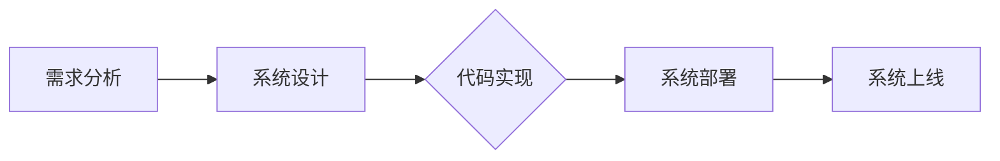
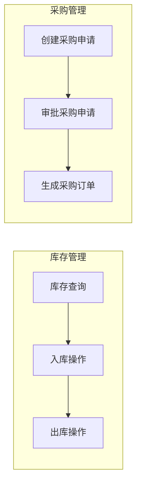

# 小型企业办公耗材库存管理软件的设计与实现

作者：禅与计算机程序设计艺术

## 1. 背景介绍

### 1.1 小型企业办公耗材管理现状

随着经济的快速发展和企业规模的不断扩大，办公耗材作为企业日常运营中不可或缺的一部分，其种类和数量也越来越多。然而，许多小型企业在办公耗材管理方面仍然存在着诸多问题，例如：

* **库存信息不准确:**  由于缺乏有效的管理工具，很多企业依靠人工记录和统计库存，容易出现数据错误和遗漏，导致库存信息不准确。
* **库存积压和浪费:**  由于无法及时掌握库存情况，企业容易采购过量或不足的办公耗材，造成库存积压或物资短缺，影响工作效率。
* **采购流程繁琐:**  传统的办公耗材采购流程通常需要经过多个部门的审批，耗时耗力，效率低下。
* **成本控制困难:**  缺乏对办公耗材使用情况的有效监控，难以进行成本分析和控制。

### 1.2 办公耗材库存管理软件的必要性

为了解决上述问题，越来越多的小型企业开始寻求信息化解决方案，办公耗材库存管理软件应运而生。通过使用专业的软件系统，企业可以实现以下目标：

* **提高库存管理效率:**  自动化库存管理流程，减少人工操作，提高数据准确性和工作效率。
* **优化库存结构:**  实时监控库存情况，及时补充和清理库存，降低库存成本。
* **简化采购流程:**  实现线上采购申请、审批和跟踪，提高采购效率。
* **加强成本控制:**  提供详细的耗材使用统计分析，帮助企业进行成本控制。

## 2. 核心概念与联系

### 2.1 核心概念

* **库存:** 指企业在一定时期内，为了满足生产经营需要而储存的各种物资的总称。
* **办公耗材:** 指企业在日常办公过程中所消耗的各种物资，例如纸张、墨盒、文件夹等。
* **库存管理:**  指企业为了保证生产经营活动的正常进行，对仓库内各种物资进行的计划、组织、协调和控制等一系列活动。
* **库存管理软件:**  指利用计算机技术对企业库存进行管理的软件系统。

### 2.2 概念之间的联系

库存管理是企业运营中非常重要的一环，而办公耗材作为企业库存的重要组成部分，其管理水平直接影响着企业的运营效率和成本控制。办公耗材库存管理软件通过信息化手段，帮助企业实现对办公耗材的精细化管理，提高库存管理效率，优化库存结构，降低库存成本。

## 3. 核心算法原理具体操作步骤

### 3.1 需求分析

在设计和开发办公耗材库存管理软件之前，首先需要进行详细的需求分析，明确软件的功能需求、性能需求和用户需求。例如：

* **功能需求:**  包括库存管理、入库管理、出库管理、采购管理、报表统计等功能模块。
* **性能需求:**  包括系统的稳定性、安全性、响应速度等方面的要求。
* **用户需求:**  包括用户界面设计、操作流程、数据权限等方面的要求。

### 3.2 系统设计

根据需求分析的结果，进行系统设计，确定软件的架构、数据库设计、模块划分、接口设计等。

#### 3.2.1 系统架构

本系统采用B/S架构，即浏览器/服务器架构，用户可以通过浏览器访问系统，无需安装客户端软件。

#### 3.2.2 数据库设计

数据库设计采用关系型数据库，例如MySQL，主要数据表包括：

* **用户表:**  存储用户信息，包括用户名、密码、权限等。
* **供应商表:**  存储供应商信息，包括供应商名称、联系人、联系电话等。
* **商品表:**  存储办公耗材信息，包括商品名称、规格型号、单位、库存数量等。
* **入库单表:**  存储入库单信息，包括入库单号、入库日期、供应商、商品、数量等。
* **出库单表:**  存储出库单信息，包括出库单号、出库日期、领用部门、商品、数量等。

### 3.3 代码实现

根据系统设计，使用Java、Python等编程语言进行代码实现，开发各个功能模块，并进行单元测试和集成测试。

### 3.4 系统部署

将开发完成的软件系统部署到服务器上，并进行系统配置和测试，确保系统能够正常运行。

## 4. 数学模型和公式详细讲解举例说明

### 4.1 库存预警模型

库存预警模型用于预测未来一段时间内的库存情况，并及时发出预警，提醒企业进行采购或清理库存。常用的库存预警模型包括：

* **固定订货量模型:**  当库存量低于设定的安全库存量时，发出采购申请，采购量为固定值。
* **定期订货量模型:**  定期进行库存盘点，根据当前库存量和预计需求量，计算出需要采购的数量。
* **经济订货批量模型 (EOQ):**  根据订货成本、储存成本和需求量，计算出最佳的订货批量，以最小化总库存成本。

#### 4.1.1 EOQ 模型公式

$$EOQ = \sqrt{\frac{2DS}{H}}$$

其中：

* D:  年需求量
* S:  每次订货成本
* H:  单位库存持有成本

#### 4.1.2  EOQ 模型应用举例

假设某企业每年需要采购 1000 盒 A4 纸，每次订货成本为 50 元，每盒 A4 纸的年储存成本为 2 元。根据 EOQ 模型，可以计算出该企业的最佳订货批量为：

$$EOQ = \sqrt{\frac{2 \times 1000 \times 50}{2}} = 500 盒$$

### 4.2 库存周转率

库存周转率是衡量企业库存管理效率的重要指标，表示企业在一定时期内库存的周转次数。计算公式如下：

$$库存周转率 = \frac{销售成本}{平均库存}$$

其中：

* 销售成本:  指企业在一定时期内销售产品的总成本。
* 平均库存:  指企业在一定时期内期初库存与期末库存的平均值。

库存周转率越高，说明企业库存管理效率越高，资金周转速度越快。

## 5. 项目实践：代码实例和详细解释说明

### 5.1 库存管理模块

#### 5.1.1 查询库存

```java
// 查询所有商品库存信息
@GetMapping("/inventory")
public List<Inventory> getInventoryList() {
    return inventoryService.getInventoryList();
}

// 根据商品ID查询库存信息
@GetMapping("/inventory/{id}")
public Inventory getInventoryById(@PathVariable("id") Long id) {
    return inventoryService.getInventoryById(id);
}
```

#### 5.1.2 入库操作

```java
// 新增入库单
@PostMapping("/inboundOrder")
public InboundOrder createInboundOrder(@RequestBody InboundOrder inboundOrder) {
    return inboundOrderService.createInboundOrder(inboundOrder);
}

// 确认入库
@PutMapping("/inboundOrder/{id}/confirm")
public InboundOrder confirmInboundOrder(@PathVariable("id") Long id) {
    return inboundOrderService.confirmInboundOrder(id);
}
```

#### 5.1.3 出库操作

```java
// 新增出库单
@PostMapping("/outboundOrder")
public OutboundOrder createOutboundOrder(@RequestBody OutboundOrder outboundOrder) {
    return outboundOrderService.createOutboundOrder(outboundOrder);
}

// 确认出库
@PutMapping("/outboundOrder/{id}/confirm")
public OutboundOrder confirmOutboundOrder(@PathVariable("id") Long id) {
    return outboundOrderService.confirmOutboundOrder(id);
}
```

### 5.2 采购管理模块

#### 5.2.1 创建采购申请

```java
// 创建采购申请
@PostMapping("/purchaseRequest")
public PurchaseRequest createPurchaseRequest(@RequestBody PurchaseRequest purchaseRequest) {
    return purchaseRequestService.createPurchaseRequest(purchaseRequest);
}
```

#### 5.2.2 审批采购申请

```java
// 审批采购申请
@PutMapping("/purchaseRequest/{id}/approve")
public PurchaseRequest approvePurchaseRequest(@PathVariable("id") Long id) {
    return purchaseRequestService.approvePurchaseRequest(id);
}
```

#### 5.2.3 生成采购订单

```java
// 生成采购订单
@PostMapping("/purchaseOrder")
public PurchaseOrder createPurchaseOrder(@RequestBody PurchaseOrder purchaseOrder) {
    return purchaseOrderService.createPurchaseOrder(purchaseOrder);
}
```

## 6. 实际应用场景

### 6.1 企业行政部门

企业行政部门可以使用办公耗材库存管理软件对各种办公用品进行管理，例如纸张、打印机墨盒、文件夹等，提高办公用品的采购和领用效率，减少浪费。

### 6.2 学校后勤部门

学校后勤部门可以使用办公耗材库存管理软件对教学和办公所需的各种耗材进行管理，例如粉笔、笔记本、实验器材等，确保教学和办公工作的顺利进行。

### 6.3 其他需要进行耗材管理的机构

任何需要对各种耗材进行管理的机构或个人都可以使用办公耗材库存管理软件，例如医院、图书馆、政府机关等。

## 7. 工具和资源推荐

### 7.1 开发工具

* **Eclipse:**  一款功能强大的 Java 集成开发环境。
* **IntelliJ IDEA:**  另一款流行的 Java 集成开发环境。
* **Visual Studio Code:**  一款轻量级的代码编辑器，支持多种编程语言。

### 7.2 数据库

* **MySQL:**  一款开源的关系型数据库管理系统。
* **PostgreSQL:**  另一款开源的关系型数据库管理系统。

### 7.3 前端框架

* **React:**  一款流行的 JavaScript 前端框架。
* **Vue.js:**  另一款流行的 JavaScript 前端框架。
* **Angular:**  由 Google 开发的 JavaScript 前端框架。

## 8. 总结：未来发展趋势与挑战

随着信息技术的不断发展，办公耗材库存管理软件将会朝着更加智能化、自动化和移动化的方向发展。

### 8.1 智能化

未来，办公耗材库存管理软件将更加智能化，例如：

* **智能预警:**  系统可以根据历史数据和算法模型，自动预测库存情况，并及时发出预警。
* **智能采购:**  系统可以根据库存情况和预设的采购策略，自动生成采购计划和订单。

### 8.2 自动化

办公耗材库存管理软件的自动化程度也将越来越高，例如：

* **自动盘点:**  系统可以通过 RFID 等技术，实现库存的自动盘点，提高盘点效率和准确性。
* **自动补货:**  系统可以根据预设的规则，自动进行补货操作，确保库存充足。

### 8.3 移动化

随着移动互联网的发展，办公耗材库存管理软件也将更加移动化，例如：

* **移动审批:**  管理人员可以通过手机等移动设备，随时随地审批采购申请和入库单。
* **移动盘点:**  库管人员可以通过手机等移动设备，进行库存盘点操作。

## 9. 附录：常见问题与解答

### 9.1 如何选择合适的办公耗材库存管理软件？

选择办公耗材库存管理软件时，需要考虑以下因素：

* **软件功能:**  软件是否满足企业的功能需求，例如库存管理、采购管理、报表统计等。
* **易用性:**  软件的操作界面是否简洁易懂，操作流程是否方便快捷。
* **安全性:**  软件是否具备完善的安全机制，能够保障企业数据的安全。
* **成本:**  软件的购买成本、实施成本和维护成本是否合理。

### 9.2 如何保证办公耗材库存数据的准确性？

为了保证办公耗材库存数据的准确性，需要做到以下几点：

* **规范操作流程:**  制定严格的入库、出库、盘点等操作流程，并严格执行。
* **加强数据审核:**  对入库、出库、盘点等数据进行严格审核，确保数据的准确性。
* **定期盘点:**  定期进行库存盘点，核对库存数据，及时发现和纠正数据错误。


## 10. 附录：Mermaid 流程图



**图 1. 小型企业办公耗材库存管理软件开发流程**



**图 2. 小型企业办公耗材库存管理软件功能模块**
