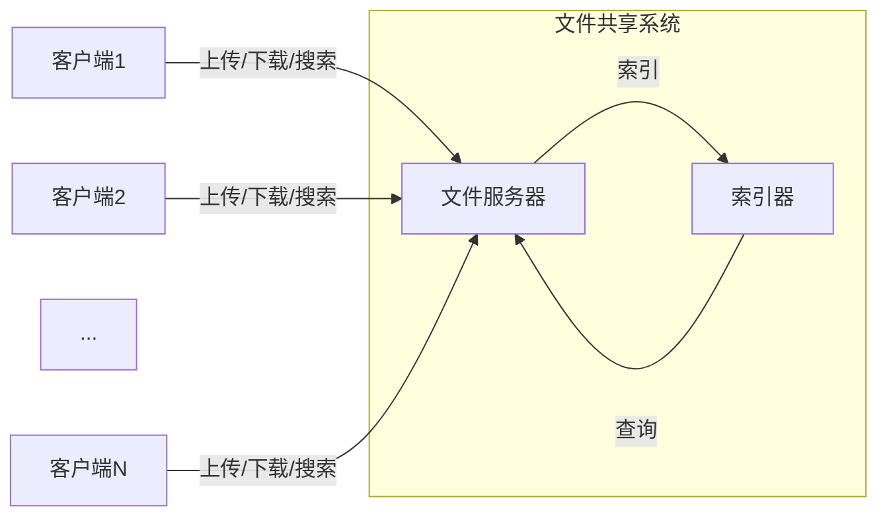

好的,我会按照您的要求,以专业的技术语言撰写这篇文章。

# 局域网文件共享及检索系统详细设计与具体代码实现

## 1.背景介绍

### 1.1 文件共享的重要性

在当今信息时代,数据和文件是企业和个人的宝贵资源。有效地共享和管理这些资源对于提高工作效率和促进协作至关重要。无论是在办公环境中还是家庭环境中,人们都需要方便快捷地访问和交换文件。

### 1.2 局域网环境的优势

局域网(LAN)提供了一种理想的环境来实现文件共享。与广域网(WAN)相比,局域网具有较高的带宽、更低的延迟和更好的安全性。这使得在局域网环境中共享和传输大量数据成为可能。

### 1.3 现有解决方案的不足

虽然现有的文件共享解决方案(如FTP、Samba等)能够满足基本需求,但它们往往缺乏高级功能,例如文件索引、搜索、版本控制等。此外,这些解决方案通常需要手动配置和维护,给用户带来了不便。

## 2.核心概念与联系  

### 2.1 文件共享

文件共享是指在多个用户或系统之间交换和访问文件的过程。它允许授权用户读取、修改或删除共享文件,从而实现协作和资源共享。

### 2.2 文件索引和搜索

文件索引是指对文件系统中的文件进行分类和建立索引,以便于快速检索。文件搜索则是根据用户提供的关键词或条件,在索引中查找相关文件。高效的索引和搜索功能可以大大提高文件管理的效率。

### 2.3 版本控制

版本控制系统能够跟踪文件的变更历史,允许用户查看、比较或恢复到之前的版本。这对于协作编辑和数据备份至关重要。

### 2.4 安全性和权限控制

在共享文件时,必须考虑安全性和访问控制。系统应该能够限制未经授权的用户访问敏感文件,并为不同用户或用户组分配不同的权限。

## 3.核心算法原理具体操作步骤

### 3.1 文件索引算法

#### 3.1.1 倒排索引

倒排索引是一种常用的文件索引技术。它将文件内容拆分为单词(或词元),并为每个单词建立一个倒排列表,记录包含该单词的所有文件。这种结构可以高效地响应包含特定单词的文件查询。

具体步骤如下:

1. 对文件进行分词(Tokenization),将文件内容拆分为单词序列。
2. 去除停用词(Stop Words),如"the"、"and"等高频但无实际意义的单词。
3. 对单词进行归一化(Normalization),如将所有单词转换为小写。
4. 为每个单词创建一个倒排列表,记录包含该单词的文件ID。
5. 可选地计算每个单词在每个文件中出现的频率,用于排序和相关性评分。

#### 3.1.2 压缩和优化

为了节省存储空间和提高查询性能,可以对倒排索引进行压缩和优化,例如:

- 使用变长编码(如霍夫曼编码)压缩文件ID列表。
- 对单词进行排序,以提高查询效率。
- 使用位向量压缩文件ID列表。
- 将索引分块存储,以支持并行查询。

### 3.2 文件搜索算法

#### 3.2.1 布尔模型

布尔模型是一种简单但有效的文件搜索方法。用户可以使用布尔运算符(如AND、OR、NOT)组合多个查询词,系统将返回与查询条件完全匹配的文件。

例如,查询"apple AND computer"将返回同时包含"apple"和"computer"两个单词的文件。

#### 3.2.2 向量空间模型

向量空间模型将文件和查询表示为向量,计算它们之间的相似度分数。相似度越高,文件与查询就越相关。

具体步骤如下:

1. 将文件和查询表示为向量,每个维度对应一个单词,值为该单词的权重(如TF-IDF)。
2. 计算文件向量和查询向量之间的相似度,常用方法包括余弦相似度、欧几里得距离等。
3. 根据相似度分数对文件进行排序,返回最相关的文件。

此外,还可以使用更复杂的模型,如概率模型(BM25)、语言模型等,以提高搜索质量。

### 3.3 版本控制算法

#### 3.3.1 差分算法

差分算法通过比较文件的不同版本,计算并存储它们之间的差异(增量)。这种方法可以节省存储空间,并加快版本之间的切换速度。

一种常用的差分算法是Diff算法,它可以高效地计算两个文件之间的行级差异。具体步骤如下:

1. 将两个文件拆分为行序列。
2. 使用最长公共子序列(LCS)算法找到两个序列之间的相同部分。
3. 剩余的行就是两个文件之间的差异,可以用于重构任何一个版本。

#### 3.3.2 内容寻址存储

内容寻址存储(Content-Addressable Storage,CAS)是一种基于内容而不是路径来存储和检索数据的方式。每个文件或文件块都被赋予一个唯一的密钥(如SHA-256哈希值),作为其地址。

在版本控制中,CAS可以有效地避免重复存储相同的文件块,从而节省空间。具体步骤如下:

1. 将文件拆分为固定大小的块(如4KB)。
2. 为每个块计算一个唯一的密钥(哈希值)。
3. 只存储那些不存在于存储系统中的新块。
4. 保存每个版本的元数据,包括块列表和其他元信息。

通过这种方式,相同的文件块只需存储一次,不同版本之间可以共享块,从而大大节省存储空间。

## 4.数学模型和公式详细讲解举例说明

### 4.1 TF-IDF模型

TF-IDF(Term Frequency-Inverse Document Frequency)是一种常用的文本挖掘模型,用于评估单词对文件的重要性。它综合考虑了单词在文件中出现的频率(TF)和单词在整个文件集中的稀有程度(IDF)。

TF-IDF权重通常用于文本索引和搜索,可以帮助系统更好地评估文件与查询的相关性。

TF-IDF的计算公式如下:

$$\mathrm{tfidf}(t, d, D) = \mathrm{tf}(t, d) \times \mathrm{idf}(t, D)$$

其中:

- $\mathrm{tf}(t, d)$ 表示单词 $t$ 在文件 $d$ 中出现的频率,可以使用原始计数、归一化计数或其他变体。
- $\mathrm{idf}(t, D)$ 表示单词 $t$ 在文件集 $D$ 中的逆向文件频率,用于衡量单词的稀有程度。

$\mathrm{idf}(t, D)$ 的计算公式如下:

$$\mathrm{idf}(t, D) = \log \frac{|D|}{|\{d \in D : t \in d\}|}$$

其中 $|D|$ 表示文件集的总数,分母表示包含单词 $t$ 的文件数。

例如,假设我们有一个包含5个文件的文件集 $D$,单词"apple"出现在3个文件中,单词"computer"出现在2个文件中。那么它们的IDF分别为:

$$\begin{aligned}
\mathrm{idf}(\text{"apple"}, D) &= \log \frac{5}{3} \approx 0.22 \\
\mathrm{idf}(\text{"computer"}, D) &= \log \frac{5}{2} \approx 0.40
\end{aligned}$$

可以看出,"computer"这个单词比"apple"更加稀有,因此具有更高的IDF值。

在实际应用中,TF-IDF模型还可以进行各种扩展和改进,例如考虑单词位置、同现词等因素。

### 4.2 编辑距离

编辑距离(Edit Distance)是一种衡量两个字符串之间差异的方法,常用于拼写检查、DNA序列比对等场景。在版本控制系统中,编辑距离可以用于比较文件的不同版本,识别它们之间的差异。

莱文斯坦距离(Levenshtein Distance)是编辑距离的一种常见变体,它定义为将一个字符串转换为另一个字符串所需的最小编辑操作数。允许的编辑操作包括插入、删除和替换单个字符。

设字符串 $s$ 和 $t$ 的长度分别为 $m$ 和 $n$,则它们的莱文斯坦距离 $\mathrm{lev}(s, t)$ 可以使用动态规划算法计算,具体公式如下:

$$\mathrm{lev}(s, t) = \begin{cases}
\max(m, n) & \text{if } \min(m, n) = 0 \\
\min \begin{cases}
\mathrm{lev}(s[0 \ldots m-1], t[0 \ldots n]) + 1 \\
\mathrm{lev}(s[0 \ldots m], t[0 \ldots n-1]) + 1 \\
\mathrm{lev}(s[0 \ldots m-1], t[0 \ldots n-1]) + \delta(s[m], t[n])
\end{cases} & \text{otherwise}
\end{cases}$$

其中 $\delta(a, b)$ 是指示函数,当 $a \neq b$ 时取值为1,否则为0。

例如,计算字符串"apple"和"apply"之间的莱文斯坦距离:

$$\begin{aligned}
\mathrm{lev}(\text{"apple"}, \text{"apply"}) &= \min \begin{cases}
\mathrm{lev}(\text{"appl"}, \text{"apply"}) + 1 = 2 \\
\mathrm{lev}(\text{"apple"}, \text{"appl"}) + 1 = 2 \\
\mathrm{lev}(\text{"appl"}, \text{"appl"}) + \delta(\text{"e"}, \text{"y"}) = 1
\end{cases} \\
&= 1
\end{aligned}$$

因此,通过替换一个字符就可以将"apple"转换为"apply",它们的编辑距离为1。

在版本控制系统中,可以使用编辑距离来快速识别文件的变更部分,从而优化存储和传输。

## 4.项目实践:代码实例和详细解释说明

在这一部分,我们将通过一个简单的Python示例项目,演示如何实现一个基本的局域网文件共享和搜索系统。

### 4.1 系统架构

我们的系统由以下几个主要组件组成:

1. **文件服务器(FileServer)**: 负责存储和管理共享文件,提供文件上传、下载和搜索等功能。
2. **索引器(Indexer)**: 使用倒排索引技术为文件建立搜索索引。
3. **客户端(Client)**: 用户可以通过客户端上传、下载和搜索文件。

系统架构如下所示:



### 4.2 文件服务器实现

我们使用Python的`http.server`模块创建一个简单的HTTP文件服务器。服务器支持以下API:

- `GET /files`: 列出所有共享文件。
- `POST /files`: 上传新文件。
- `GET /files/<filename>`: 下载指定文件。
- `GET /search?q=<query>`: 搜索包含查询词的文件。

```python
import http.server
import socketserver
import os
import urllib.parse
from indexer import Indexer

# 创建索引器实例
indexer = Indexer()

# 定义请求处理器
class FileServerHandler(http.server.BaseHTTPRequestHandler):
    def do_GET(self):
        # 处理文件列表请求
        if self.path == '/files':
            self.send_file_list