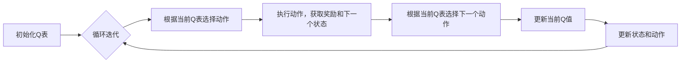

# 常见的强化学习算法：DQN、SARSA、A3C

作者：禅与计算机程序设计艺术

## 1. 背景介绍

### 1.1 强化学习的起源与发展

强化学习(Reinforcement Learning, RL)作为机器学习的一个重要分支，其思想起源于心理学中的行为主义理论，即智能体通过与环境的交互学习到最优的行为策略。自20世纪50年代以来，强化学习经历了漫长的发展历程，从早期的尝试与探索，到深度学习的兴起为其注入新的活力，强化学习在理论和应用领域都取得了令人瞩目的成就。

### 1.2 强化学习的基本概念

强化学习关注的是智能体如何在环境中通过试错学习最优策略。其基本要素包括：

* **智能体(Agent)**：学习和决策的主体，通过与环境交互获取经验并改进策略。
* **环境(Environment)**：智能体所处的外部世界，智能体的行为会影响环境的状态。
* **状态(State)**：对环境的描述，包含了智能体决策所需的所有信息。
* **动作(Action)**：智能体在特定状态下做出的选择。
* **奖励(Reward)**：环境对智能体动作的反馈，用于评估动作的好坏。
* **策略(Policy)**：智能体根据当前状态选择动作的规则。

强化学习的目标是找到一个最优策略，使得智能体在与环境交互的过程中能够获得最大的累积奖励。

### 1.3 强化学习的应用领域

强化学习作为一种通用的学习框架，在许多领域都有着广泛的应用，例如：

* **游戏**: AlphaGo、AlphaZero等人工智能在围棋、象棋等游戏领域战胜了人类顶尖选手，展现了强化学习在复杂决策问题上的强大能力。
* **机器人控制**: 强化学习可以用于训练机器人的运动控制、路径规划等任务，使机器人能够在复杂环境中自主完成任务。
* **推荐系统**: 强化学习可以根据用户的历史行为和偏好，动态地推荐商品或服务，提升用户体验和平台收益。
* **金融交易**: 强化学习可以用于构建自动交易系统，根据市场行情变化做出最优的交易决策。
* **医疗诊断**: 强化学习可以辅助医生进行疾病诊断和治疗方案的选择，提高医疗水平和效率。


## 2. 核心概念与联系

### 2.1 值函数(Value Function)

值函数用于评估状态或状态-动作对的长期价值。它表示从当前状态开始，遵循某个策略，智能体期望获得的累积奖励。值函数分为两种：

* **状态值函数(State Value Function)**：表示从状态 $s$ 开始，遵循策略 $\pi$，智能体期望获得的累积奖励，记作 $V^\pi(s)$。
* **动作值函数(Action Value Function)**：表示从状态 $s$ 开始，采取动作 $a$，然后遵循策略 $\pi$，智能体期望获得的累积奖励，记作 $Q^\pi(s, a)$。

### 2.2  贝尔曼方程(Bellman Equation)

贝尔曼方程是强化学习的核心方程，它描述了值函数之间的递归关系。

* 状态值函数的贝尔曼方程：

$$V^\pi(s) = \sum_{a \in A} \pi(a|s) \sum_{s' \in S} p(s'|s,a)[r(s,a,s') + \gamma V^\pi(s')]$$

* 动作值函数的贝尔曼方程：

$$Q^\pi(s,a) = \sum_{s' \in S} p(s'|s,a)[r(s,a,s') + \gamma \sum_{a' \in A} \pi(a'|s') Q^\pi(s',a')]$$

其中：

* $\pi(a|s)$ 表示在状态 $s$ 下采取动作 $a$ 的概率。
* $p(s'|s,a)$ 表示在状态 $s$ 下采取动作 $a$ 后转移到状态 $s'$ 的概率。
* $r(s,a,s')$ 表示在状态 $s$ 下采取动作 $a$ 后转移到状态 $s'$ 获得的奖励。
* $\gamma$ 是折扣因子，用于平衡当前奖励和未来奖励的重要性。

### 2.3 强化学习算法分类

强化学习算法可以根据是否需要对环境进行建模分为两类：

* **模型无关方法(Model-Free)**：这类算法不需要对环境进行建模，直接从与环境交互的经验中学习策略。常见的模型无关方法包括：
    * **蒙特卡洛方法(Monte Carlo Methods)**
    * **时间差方法(Temporal Difference Methods)**
* **模型相关方法(Model-Based)**：这类算法需要对环境进行建模，利用模型预测环境的行为，并基于预测结果进行策略优化。常见的模型相关方法包括：
    * **动态规划(Dynamic Programming)**
    * **规划方法(Planning Methods)**

DQN、SARSA、A3C 都属于模型无关方法中的时间差方法。

## 3. 核心算法原理具体操作步骤

### 3.1 DQN (Deep Q-Network)

#### 3.1.1 算法原理

DQN 是一种基于深度学习的强化学习算法，它使用神经网络来逼近动作值函数 $Q(s,a)$。DQN 的核心思想是利用经验回放(Experience Replay)和目标网络(Target Network)来解决数据相关性和非平稳性问题。

#### 3.1.2 算法步骤

1. **初始化经验回放池(Experience Replay Buffer)**：存储智能体与环境交互的经验数据，包括状态、动作、奖励、下一个状态等。
2. **初始化当前 Q 网络和目标 Q 网络**：两个网络结构相同，参数不同。
3. **循环迭代**：
    *   **根据当前 Q 网络选择动作**：使用 ε-greedy 策略，以 ε 的概率随机选择动作，以 1-ε 的概率选择当前 Q 网络预测值最大的动作。
    *   **执行动作，获取奖励和下一个状态**。
    *   **将经验数据存储到经验回放池**。
    *   **从经验回放池中随机抽取一批数据**。
    *   **计算目标 Q 值**：使用目标 Q 网络计算目标 Q 值，目标 Q 值的计算方式为：

        $$y_j = \begin{cases}
        r_j & \text{if episode terminates at step } j+1, \\
        r_j + \gamma \max_{a'} Q(s_{j+1}, a'; \theta^-) & \text{otherwise,}
        \end{cases}$$

        其中：

        * $r_j$ 表示第 j 步获得的奖励。
        * $\gamma$ 是折扣因子。
        * $s_{j+1}$ 表示第 j 步后的状态。
        * $\theta^-$ 表示目标 Q 网络的参数。

    * **使用目标 Q 值更新当前 Q 网络**：最小化当前 Q 网络的预测值与目标 Q 值之间的均方误差。
    * **每隔一段时间，将当前 Q 网络的参数复制到目标 Q 网络**。

#### 3.1.3  算法流程图


### 3.2 SARSA (State-Action-Reward-State-Action)

#### 3.2.1 算法原理

SARSA 是一种在线时间差分学习算法，它直接使用当前策略估计动作值函数 $Q(s,a)$。SARSA 的更新方式与 Q learning 类似，区别在于 SARSA 使用的是下一个状态和下一个动作的值函数来更新当前状态和动作的值函数。

#### 3.2.2 算法步骤

1. **初始化 Q 表**：为每个状态-动作对建立一个 Q 值。
2. **循环迭代**：
    *   **根据当前 Q 表选择动作**：使用 ε-greedy 策略。
    *   **执行动作，获取奖励和下一个状态**。
    *   **根据当前 Q 表选择下一个动作**：使用 ε-greedy 策略。
    *   **更新当前 Q 值**：

        $$Q(s,a) \leftarrow Q(s,a) + \alpha [r + \gamma Q(s',a') - Q(s,a)]$$

        其中：

        * $\alpha$ 是学习率。
        * $r$ 是当前奖励。
        * $\gamma$ 是折扣因子。
        * $s'$ 是下一个状态。
        * $a'$ 是下一个动作。

    *   **更新状态和动作**。

#### 3.2.3 算法流程图



### 3.3 A3C (Asynchronous Advantage Actor-Critic)

#### 3.3.1 算法原理

A3C 是一种基于异步梯度的强化学习算法，它使用多个并行的智能体同时与环境交互，并异步地更新参数。A3C 使用 Actor-Critic 架构，其中 Actor 网络负责选择动作，Critic 网络负责评估状态的价值。

#### 3.3.2 算法步骤

1. **初始化全局 Actor 网络和 Critic 网络**。
2. **创建多个并行的智能体**。
3. **每个智能体循环迭代**：
    *   **从全局网络同步参数**。
    *   **与环境交互，收集经验数据**。
    *   **计算优势函数(Advantage Function)**：

        $$A(s,a) = Q(s,a) - V(s)$$

        其中：

        * $Q(s,a)$ 是动作值函数。
        * $V(s)$ 是状态值函数。

    *   **计算 Actor 网络和 Critic 网络的梯度**。
    *   **将梯度上传到全局网络，更新全局网络的参数**。

#### 3.3.3 算法流程图


## 4. 数学模型和公式详细讲解举例说明

### 4.1 DQN 

#### 4.1.1 损失函数

DQN 使用均方误差作为损失函数，目标是最小化当前 Q 网络的预测值与目标 Q 值之间的差异：

$$L(\theta) = \frac{1}{N} \sum_{j=1}^N (y_j - Q(s_j, a_j; \theta))^2$$

其中：

* $N$ 是批大小。
* $y_j$ 是目标 Q 值。
* $Q(s_j, a_j; \theta)$ 是当前 Q 网络对状态 $s_j$ 和动作 $a_j$ 的预测值。
* $\theta$ 是当前 Q 网络的参数。

#### 4.1.2 目标 Q 值计算

目标 Q 值的计算方式为：

$$y_j = \begin{cases}
r_j & \text{if episode terminates at step } j+1, \\
r_j + \gamma \max_{a'} Q(s_{j+1}, a'; \theta^-) & \text{otherwise,}
\end{cases}$$

其中：

* $r_j$ 表示第 j 步获得的奖励。
* $\gamma$ 是折扣因子。
* $s_{j+1}$ 表示第 j 步后的状态。
* $\theta^-$ 表示目标 Q 网络的参数。

#### 4.1.3  举例说明

假设有一个游戏，智能体可以采取两个动作：左移和右移。游戏的状态空间为 {0, 1, 2}，表示智能体的位置。当智能体位于位置 2 时，游戏结束。奖励函数如下：

* 在位置 0 采取左移动作，奖励为 -1。
* 在位置 0 采取右移动作，奖励为 0。
* 在位置 1 采取左移动作，奖励为 0。
* 在位置 1 采取右移动作，奖励为 1。

假设当前 Q 网络的参数为 $\theta$，目标 Q 网络的参数为 $\theta^-$，经验回放池中存储了以下经验数据：

| 状态 | 动作 | 奖励 | 下一个状态 |
|---|---|---|---|
| 0 | 右移 | 0 | 1 |
| 1 | 右移 | 1 | 2 |

现在要更新当前 Q 网络的参数。首先从经验回放池中随机抽取一条数据，例如 (0, 右移, 0, 1)。

* 计算目标 Q 值：

$$y_1 = r_1 + \gamma \max_{a'} Q(s_2, a'; \theta^-) = 0 + 0.9 \max \{Q(1, 左移; \theta^-), Q(1, 右移; \theta^-)\}$$

* 计算当前 Q 网络的预测值：

$$Q(0, 右移; \theta)$$

* 计算损失函数：

$$L(\theta) = (y_1 - Q(0, 右移; \theta))^2$$

* 使用梯度下降法更新当前 Q 网络的参数 $\theta$。

### 4.2 SARSA

#### 4.2.1 Q 值更新公式

SARSA 的 Q 值更新公式为：

$$Q(s,a) \leftarrow Q(s,a) + \alpha [r + \gamma Q(s',a') - Q(s,a)]$$

其中：

* $\alpha$ 是学习率。
* $r$ 是当前奖励。
* $\gamma$ 是折扣因子。
* $s'$ 是下一个状态。
* $a'$ 是下一个动作。

#### 4.2.2 举例说明

假设有一个迷宫游戏，智能体可以采取四个动作：上移、下移、左移、右移。迷宫地图如下：

```
S...
.X.G
....
```

其中：

* S 表示起点。
* G 表示终点。
* X 表示障碍物。
* . 表示空地。

奖励函数如下：

* 到达终点，奖励为 1。
* 撞到障碍物，奖励为 -1。
* 其他情况，奖励为 0。

假设学习率 $\alpha = 0.1$，折扣因子 $\gamma = 0.9$。智能体初始状态为起点 S，初始 Q 表所有元素都为 0。

1. 智能体根据 ε-greedy 策略选择动作，假设选择向上移动。
2. 智能体执行动作，状态变为 (0, 1)，奖励为 0。
3. 智能体根据 ε-greedy 策略选择下一个动作，假设选择向右移动。
4. 更新 Q 值：

$$Q((0,0), 上移) \leftarrow Q((0,0), 上移) + 0.1 [0 + 0.9 \times Q((0,1), 右移) - Q((0,0), 上移)] = 0$$

1. 更新状态和动作，智能体状态变为 (0, 1)，当前动作为右移。

### 4.3 A3C

#### 4.3.1 优势函数

A3C 使用优势函数来评估动作的好坏，优势函数定义为：

$$A(s,a) = Q(s,a) - V(s)$$

其中：

* $Q(s,a)$ 是动作值函数。
* $V(s)$ 是状态值函数。

优势函数表示在状态 $s$ 下采取动作 $a$ 相对于采取平均动作的优势。

#### 4.3.2 损失函数

A3C 使用以下损失函数来更新 Actor 网络和 Critic 网络：

$$L = L_{actor} + L_{critic} + L_{entropy}$$

其中：

* $L_{actor}$ 是 Actor 网络的损失函数，用于更新策略 $\pi$。
* $L_{critic}$ 是 Critic 网络的损失函数，用于更新状态值函数 $V$。
* $L_{entropy}$ 是熵正则化项，用于鼓励探索。

#### 4.3.3 举例说明

假设有一个游戏，智能体可以采取两个动作：左移和右移。游戏的状态空间为 {0, 1, 2}，表示智能体的位置。当智能体位于位置 2 时，游戏结束。奖励函数如下：

* 在位置 0 采取左移动作，奖励为 -1。
* 在位置 0 采取右移动作，奖励为 0。
* 在位置 1 采取左移动作，奖励为 0。
* 在位置 1 采取右移动作，奖励为 1。

假设全局 Actor 网络的参数为 $\