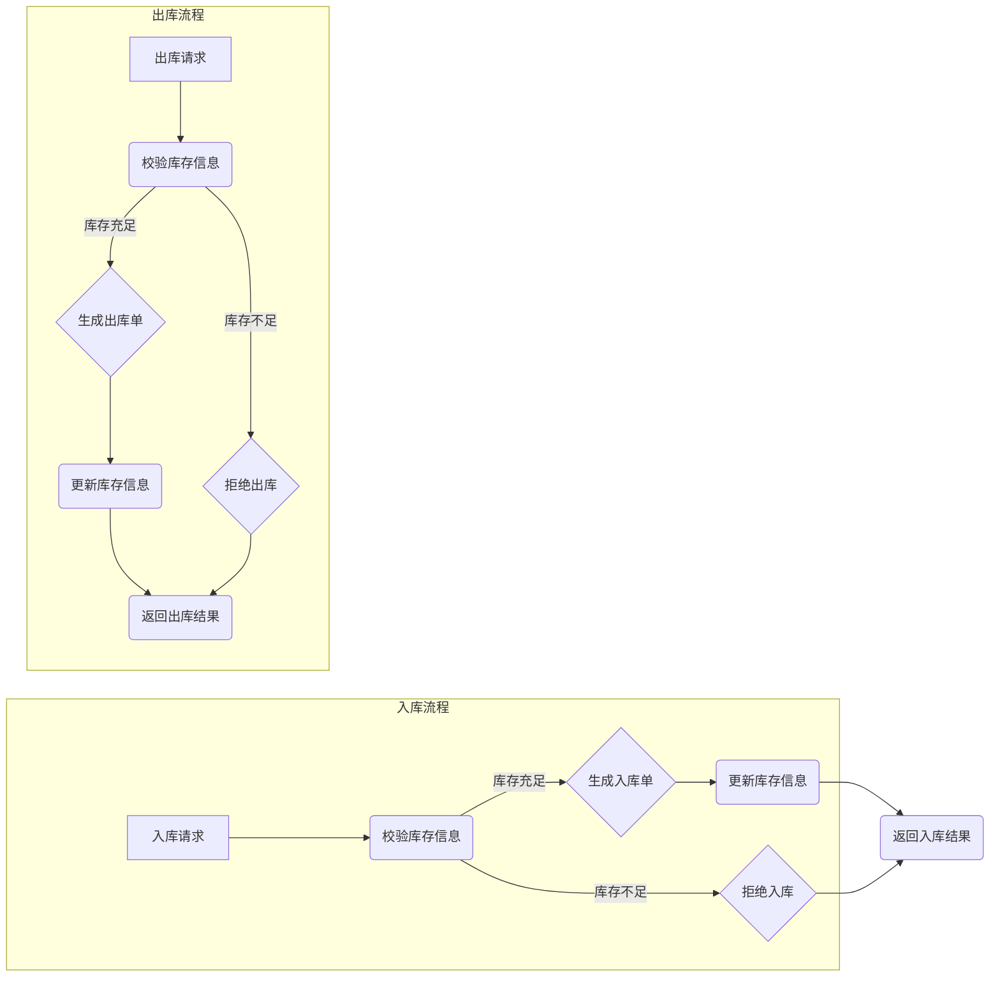

##  库存管理系统设计与实现

作者：禅与计算机程序设计艺术

## 1. 背景介绍

### 1.1 库存管理的重要性

库存是企业的重要资产之一，高效的库存管理能够帮助企业：

* **降低成本:**  减少库存积压，降低仓储成本和货物损耗。
* **提高效率:**  加速库存周转，提高订单处理速度和客户满意度。
* **增强竞争力:**  实时掌握库存信息，灵活应对市场变化，提高企业竞争力。

### 1.2  传统库存管理的弊端

传统的库存管理方式主要依赖人工记录和计算，存在着许多弊端：

* **效率低下:**  人工操作容易出错，效率低下。
* **信息不透明:**  库存数据分散，难以实时掌握库存状况。
* **决策滞后:**  缺乏数据分析，难以做出科学的库存决策。

### 1.3  库存管理系统的发展趋势

随着信息技术的不断发展，现代库存管理系统朝着以下趋势发展：

* **信息化:**  利用计算机技术实现库存信息的自动化管理。
* **智能化:**  利用数据分析和人工智能技术实现库存预测和智能决策。
* **集成化:**  与企业其他系统集成，实现信息共享和协同管理。


## 2. 核心概念与联系

### 2.1 库存管理系统的核心概念

* **SKU (Stock Keeping Unit):**  库存量单位，用于区分不同的产品或商品。
* **仓库:**  存储货物的场所，可以是实体仓库或虚拟仓库。
* **入库:**  货物进入仓库的过程。
* **出库:**  货物离开仓库的过程。
* **库存盘点:** 定期对仓库中的实际库存进行清点和核对。
* **安全库存:**  为防止缺货而设置的最低库存量。
* **订货点:**  当库存量低于该值时，需要进行补货。

### 2.2  核心概念之间的联系

* SKU 是库存管理的基本单位，所有库存操作都围绕 SKU 展开。
* 仓库是存储 SKU 的场所，入库和出库操作都需要指定仓库。
* 库存盘点用于核对实际库存和系统库存，确保数据准确性。
* 安全库存和订货点是库存控制的重要参数，用于指导企业进行合理的库存管理。


## 3. 核心算法原理具体操作步骤

### 3.1  库存管理系统的核心算法

* **先进先出法 (FIFO):**  假设先入库的货物先出库，适用于保质期较短的商品。
* **后进先出法 (LIFO):**  假设后入库的货物先出库，适用于保质期较长的商品。
* **加权平均法:**  根据不同批次入库货物的成本和数量计算加权平均成本，适用于价值波动较大的商品。

### 3.2  具体操作步骤

以先进先出法为例，入库和出库操作步骤如下：

**入库操作:**

1. 记录入库单据信息，包括入库日期、供应商、SKU、数量、成本等。
2. 更新库存信息，将入库数量添加到对应 SKU 的库存中。

**出库操作:**

1. 记录出库单据信息，包括出库日期、客户、SKU、数量等。
2. 根据先进先出原则，从最早入库的批次开始扣减库存，直到满足出库数量。
3. 更新库存信息，将出库数量从对应 SKU 的库存中扣减。

### 3.3  Mermaid 流程图



## 4. 数学模型和公式详细讲解举例说明

### 4.1  安全库存的计算

安全库存是为了应对需求波动和交货期不确定性而设置的最低库存量。安全库存的计算公式如下：

```
安全库存 = (最大日消耗量 - 平均日消耗量) × 安全库存天数
```

其中：

* 最大日消耗量：历史最高日销量。
* 平均日消耗量：历史平均日销量。
* 安全库存天数：根据经验或行业标准设定的天数。

**举例说明：**

假设某商品的历史最高日销量为 100 件，平均日销量为 50 件，安全库存天数设定为 7 天，则安全库存为：

```
安全库存 = (100 - 50) × 7 = 350 件
```

### 4.2  订货点的计算

订货点是指当库存量低于该值时，需要进行补货的临界值。订货点的计算公式如下：

```
订货点 = 平均日消耗量 × 订货周期 + 安全库存
```

其中：

* 订货周期：从下单到货物入库所需的天数。

**举例说明：**

假设某商品的平均日销量为 50 件，订货周期为 3 天，安全库存为 350 件，则订货点为：

```
订货点 = 50 × 3 + 350 = 500 件
```

## 5. 项目实践：代码实例和详细解释说明

### 5.1 技术选型

* **编程语言:** Python
* **数据库:** MySQL
* **Web框架:** Django

### 5.2  数据库设计

```sql
-- 创建数据库
CREATE DATABASE inventory_management;

-- 使用数据库
USE inventory_management;

-- 创建产品表
CREATE TABLE product (
  id INT PRIMARY KEY AUTO_INCREMENT,
  name VARCHAR(255) NOT NULL,
  description TEXT,
  price DECIMAL(10, 2) NOT NULL,
  quantity INT NOT NULL
);

-- 创建仓库表
CREATE TABLE warehouse (
  id INT PRIMARY KEY AUTO_INCREMENT,
  name VARCHAR(255) NOT NULL,
  address TEXT
);

-- 创建库存记录表
CREATE TABLE inventory_record (
  id INT PRIMARY KEY AUTO_INCREMENT,
  product_id INT NOT NULL,
  warehouse_id INT NOT NULL,
  quantity INT NOT NULL,
  type ENUM('入库', '出库') NOT NULL,
  created_at TIMESTAMP DEFAULT CURRENT_TIMESTAMP,
  FOREIGN KEY (product_id) REFERENCES product(id),
  FOREIGN KEY (warehouse_id) REFERENCES warehouse(id)
);
```

### 5.3 代码示例

**models.py**

```python
from django.db import models

class Product(models.Model):
    name = models.CharField(max_length=255)
    description = models.TextField(blank=True)
    price = models.DecimalField(max_digits=10, decimal_places=2)
    quantity = models.IntegerField()

    def __str__(self):
        return self.name


class Warehouse(models.Model):
    name = models.CharField(max_length=255)
    address = models.TextField()

    def __str__(self):
        return self.name


class InventoryRecord(models.Model):
    INVENTORY_TYPE_CHOICES = (
        ('入库', '入库'),
        ('出库', '出库'),
    )

    product = models.ForeignKey(Product, on_delete=models.CASCADE)
    warehouse = models.ForeignKey(Warehouse, on_delete=models.CASCADE)
    quantity = models.IntegerField()
    type = models.CharField(max_length=2, choices=INVENTORY_TYPE_CHOICES)
    created_at = models.DateTimeField(auto_now_add=True)

    def __str__(self):
        return f"{self.product} - {self.warehouse} - {self.quantity} - {self.type}"
```

**views.py**

```python
from django.shortcuts import render, redirect
from .models import Product, Warehouse, InventoryRecord

def inventory_list(request):
    products = Product.objects.all()
    context = {'products': products}
    return render(request, 'inventory/list.html', context)


def inventory_detail(request, product_id):
    product = Product.objects.get(pk=product_id)
    records = InventoryRecord.objects.filter(product=product).order_by('-created_at')
    context = {'product': product, 'records': records}
    return render(request, 'inventory/detail.html', context)


def inventory_add(request):
    if request.method == 'POST':
        product_id = request.POST.get('product')
        warehouse_id = request.POST.get('warehouse')
        quantity = int(request.POST.get('quantity'))

        product = Product.objects.get(pk=product_id)
        warehouse = Warehouse.objects.get(pk=warehouse_id)

        InventoryRecord.objects.create(
            product=product,
            warehouse=warehouse,
            quantity=quantity,
            type='入库'
        )

        product.quantity += quantity
        product.save()

        return redirect('inventory:list')

    products = Product.objects.all()
    warehouses = Warehouse.objects.all()
    context = {'products': products, 'warehouses': warehouses}
    return render(request, 'inventory/add.html', context)


def inventory_remove(request):
    if request.method == 'POST':
        product_id = request.POST.get('product')
        warehouse_id = request.POST.get('warehouse')
        quantity = int(request.POST.get('quantity'))

        product = Product.objects.get(pk=product_id)
        warehouse = Warehouse.objects.get(pk=warehouse_id)

        if product.quantity >= quantity:
            InventoryRecord.objects.create(
                product=product,
                warehouse=warehouse,
                quantity=quantity,
                type='出库'
            )

            product.quantity -= quantity
            product.save()

            return redirect('inventory:list')
        else:
            return redirect('inventory:detail', product_id=product_id)

    products = Product.objects.all()
    warehouses = Warehouse.objects.all()
    context = {'products': products, 'warehouses': warehouses}
    return render(request, 'inventory/remove.html', context)
```

## 6. 实际应用场景

### 6.1  电商平台

电商平台可以使用库存管理系统来管理商品库存，实时更新库存信息，防止超卖和缺货。

### 6.2  制造企业

制造企业可以使用库存管理系统来管理原材料、半成品和成品库存，优化生产计划，提高生产效率。

### 6.3  零售企业

零售企业可以使用库存管理系统来管理门店库存，进行商品配送和调拨，提高门店运营效率。

## 7. 工具和资源推荐

### 7.1  开源库存管理系统

* **Odoo:**  一款功能强大的开源 ERP 系统，包含库存管理模块。
* **Dolibarr ERP & CRM:**  一款开源的 ERP & CRM 系统，也包含库存管理模块。

### 7.2  云端库存管理服务

* **SAP Business One:**  一款面向中小企业的云端 ERP 软件，提供库存管理功能。
* **NetSuite:**  一款面向大型企业的云端 ERP 软件，提供全面的库存管理功能。

### 7.3  学习资源

* **《精益库存管理》:**  介绍精益生产理念在库存管理中的应用。
* **《供应链管理》:**  介绍供应链管理的基本概念和方法，其中包括库存管理。


## 8. 总结：未来发展趋势与挑战

### 8.1  未来发展趋势

* **人工智能和机器学习:**  利用人工智能和机器学习技术实现库存预测、智能补货和库存优化。
* **物联网技术:**  利用物联网技术实现库存数据的实时采集和监控。
* **区块链技术:**  利用区块链技术实现库存数据的安全存储和共享。

### 8.2  挑战

* **数据安全:**  库存数据是企业的核心资产，需要加强数据安全防护。
* **系统集成:**  库存管理系统需要与企业其他系统集成，才能发挥最大价值。
* **人才培养:**  需要培养专业的库存管理人才，才能应对未来发展趋势。


## 9. 附录：常见问题与解答

### 9.1  如何选择合适的库存管理系统？

选择库存管理系统需要考虑以下因素：

* 企业规模和业务需求
* 预算和成本
* 系统功能和性能
* 实施和维护成本

### 9.2  如何进行库存盘点？

库存盘点可以使用以下方法：

* **全面盘点:**  对仓库中所有货物进行盘点。
* **循环盘点:**  定期对部分货物进行盘点。
* **抽样盘点:**  随机抽取部分货物进行盘点。

### 9.3 如何提高库存周转率？

提高库存周转率可以采取以下措施：

* 优化采购策略，减少采购成本。
* 加快销售速度，提高产品周转率。
* 优化库存结构，减少库存积压。
