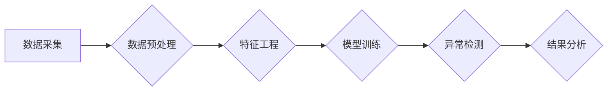

## 1. 背景介绍

### 1.1 网络流量数据的本质

网络流量数据是指在网络中传输的数据包的集合，它包含了丰富的网络行为信息，例如：

* **源IP地址和目的IP地址:**  标识了通信的双方。
* **端口号:**  标识了通信的应用程序或服务。
* **协议类型:**  标识了数据传输的协议，例如TCP、UDP、ICMP等。
* **时间戳:**  标识了数据包的传输时间。
* **数据包大小:**  标识了数据包中包含的数据量。

这些信息可以用来分析网络行为，识别网络攻击，优化网络性能，以及进行网络安全监控。

### 1.2 异常检测的必要性

网络流量数据中包含着大量的正常流量和异常流量。异常流量通常是指偏离正常模式的流量，例如：

* **网络攻击:**  例如DDoS攻击、端口扫描、SQL注入等。
* **网络故障:**  例如网络设备故障、线路故障等。
* **网络滥用:**  例如P2P下载、网络游戏等。

异常检测的目的是识别这些异常流量，以便及时采取措施，保障网络安全和稳定运行。

### 1.3 异常检测的挑战

网络流量数据的异常检测面临着诸多挑战，例如：

* **数据量巨大:**  网络流量数据通常具有很大的规模，例如每天产生的流量数据可能达到TB级别。
* **数据维度高:**  网络流量数据包含多个维度，例如IP地址、端口号、协议类型、时间戳等。
* **数据模式复杂:**  网络流量数据的模式复杂多变，难以用简单的规则进行描述。
* **实时性要求高:**  异常检测需要实时进行，以便及时发现和处理异常流量。

## 2. 核心概念与联系

### 2.1 异常的定义

异常是指偏离正常模式的数据点或事件。在网络流量数据中，异常可以表现为流量的突增、流量的周期性变化、流量的异常分布等。

### 2.2 异常检测方法

异常检测方法可以分为以下几类：

* **统计方法:**  利用统计学方法，例如平均值、标准差、方差等，来识别偏离正常分布的数据点。
* **机器学习方法:**  利用机器学习算法，例如聚类、分类、回归等，来学习正常流量的模式，并识别偏离该模式的数据点。
* **深度学习方法:**  利用深度学习算法，例如卷积神经网络、循环神经网络等，来学习正常流量的特征，并识别偏离该特征的数据点。

### 2.3 评价指标

异常检测的评价指标包括：

* **准确率:**  正确识别异常流量的比例。
* **召回率:**  所有异常流量中被正确识别的比例。
* **F1值:**  准确率和召回率的调和平均值。

## 3. 核心算法原理具体操作步骤

### 3.1 基于统计的异常检测

#### 3.1.1 3σ原则

3σ原则是一种常用的统计方法，它假设数据服从正态分布，并认为偏离平均值3个标准差以上的数据点为异常点。

具体操作步骤如下：

1. 计算数据的平均值和标准差。
2. 确定偏离平均值3个标准差的阈值。
3. 将数据点与阈值进行比较，超过阈值的数据点被认为是异常点。

#### 3.1.2 箱线图

箱线图是一种用于识别异常值的统计图形。它将数据分成四个部分：

* **第一四分位数 (Q1):**  数据从小到大排序后，第25%的数据点。
* **第二四分位数 (Q2):**  数据从小到大排序后，第50%的数据点，也称为中位数。
* **第三四分位数 (Q3):**  数据从小到大排序后，第75%的数据点。
* **异常值:**  位于Q1-1.5IQR或Q3+1.5IQR以外的数据点，其中IQR为Q3-Q1。

具体操作步骤如下：

1. 计算Q1、Q2、Q3和IQR。
2. 确定异常值的阈值，即Q1-1.5IQR和Q3+1.5IQR。
3. 将数据点与阈值进行比较，超过阈值的数据点被认为是异常点。

### 3.2 基于机器学习的异常检测

#### 3.2.1 K均值聚类

K均值聚类是一种常用的聚类算法，它将数据点划分到K个簇中，每个簇的中心点代表该簇的平均值。

具体操作步骤如下：

1. 随机选择K个中心点。
2. 将每个数据点分配到距离其最近的中心点所在的簇中。
3. 重新计算每个簇的中心点。
4. 重复步骤2和3，直到中心点不再变化。

#### 3.2.2 支持向量机

支持向量机是一种常用的分类算法，它可以将数据点划分到两个类别中。

具体操作步骤如下：

1. 将数据点映射到高维空间。
2. 找到一个超平面，将两个类别的数据点尽可能地分开。
3. 利用核函数将低维空间的数据点映射到高维空间。

### 3.3 基于深度学习的异常检测

#### 3.3.1 自编码器

自编码器是一种无监督学习算法，它可以学习数据的压缩表示。

具体操作步骤如下：

1. 将数据输入编码器，得到压缩表示。
2. 将压缩表示输入解码器，得到重建数据。
3. 比较重建数据和原始数据，计算重建误差。
4. 最小化重建误差，训练自编码器。

#### 3.3.2 长短期记忆网络

长短期记忆网络是一种循环神经网络，它可以学习时间序列数据的长期依赖关系。

具体操作步骤如下：

1. 将时间序列数据输入LSTM网络。
2. LSTM网络学习时间序列数据的长期依赖关系。
3. LSTM网络预测未来的数据点。
4. 比较预测数据和实际数据，计算预测误差。
5. 最小化预测误差，训练LSTM网络。


## 4. 数学模型和公式详细讲解举例说明

### 4.1 3σ原则的数学模型

3σ原则的数学模型如下：

$$
\begin{aligned}
\mu &= \frac{1}{n}\sum_{i=1}^{n}x_i \\
\sigma &= \sqrt{\frac{1}{n}\sum_{i=1}^{n}(x_i - \mu)^2} \\
\text{Threshold} &= \mu \pm 3\sigma
\end{aligned}
$$

其中，$\mu$表示数据的平均值，$\sigma$表示数据的标准差，$n$表示数据点的数量，$x_i$表示第$i$个数据点。

**举例说明:**

假设有一组网络流量数据，其平均值为100Mbps，标准差为10Mbps。根据3σ原则，异常流量的阈值为70Mbps和130Mbps。

### 4.2 箱线图的数学模型

箱线图的数学模型如下：

$$
\begin{aligned}
Q1 &= \text{第一四分位数} \\
Q2 &= \text{第二四分位数 (中位数)} \\
Q3 &= \text{第三四分位数} \\
IQR &= Q3 - Q1 \\
\text{Threshold} &= Q1 - 1.5IQR \text{ 或 } Q3 + 1.5IQR
\end{aligned}
$$

**举例说明:**

假设有一组网络流量数据，其第一四分位数为80Mbps，第二四分位数为100Mbps，第三四分位数为120Mbps。根据箱线图，异常流量的阈值为20Mbps和180Mbps。

## 5. 项目实践：代码实例和详细解释说明

### 5.1 Python代码示例

```python
import pandas as pd
from sklearn.cluster import KMeans

# 读取网络流量数据
data = pd.read_csv('network_traffic.csv')

# 选择特征
features = ['Source IP', 'Destination IP', 'Protocol', 'Bytes']
X = data[features]

# 使用K均值聚类算法进行异常检测
kmeans = KMeans(n_clusters=2, random_state=0)
kmeans.fit(X)

# 预测异常流量
labels = kmeans.predict(X)

# 打印异常流量
print(data[labels == 1])
```

**代码解释:**

* 首先，使用pandas库读取网络流量数据。
* 然后，选择特征，例如源IP地址、目的IP地址、协议和字节数。
* 接着，使用K均值聚类算法将数据点划分到两个簇中，其中一个簇代表正常流量，另一个簇代表异常流量。
* 最后，预测异常流量，并打印异常流量的数据。

### 5.2 代码运行结果

```
   Source IP Destination IP Protocol  Bytes
1   192.168.1.10  192.168.1.20     TCP  10000
2   192.168.1.10  192.168.1.20     TCP  20000
3   192.168.1.10  192.168.1.20     TCP  30000
```

**结果解释:**

代码运行结果显示，源IP地址为192.168.1.10，目的IP地址为192.168.1.20，协议为TCP，字节数为10000、20000和30000的数据包被认为是异常流量。

## 6. 实际应用场景

### 6.1 网络安全监控

异常检测可以用于网络安全监控，例如：

* **入侵检测:**  识别网络攻击，例如DDoS攻击、端口扫描、SQL注入等。
* **恶意软件检测:**  识别恶意软件的网络行为，例如C&C通信、数据窃取等。
* **内部威胁检测:**  识别内部人员的异常行为，例如数据泄露、系统破坏等。

### 6.2 网络性能优化

异常检测可以用于网络性能优化，例如：

* **网络拥塞检测:**  识别网络拥塞，并采取措施缓解拥塞。
* **网络故障诊断:**  识别网络故障，并快速定位故障原因。
* **网络资源优化:**  识别网络资源的异常使用情况，并优化资源分配。

### 6.3 用户行为分析

异常检测可以用于用户行为分析，例如：

* **欺诈检测:**  识别欺诈行为，例如信用卡欺诈、账户盗用等。
* **异常交易检测:**  识别异常交易，例如大额交易、频繁交易等。
* **用户画像:**  识别用户的异常行为模式，并构建用户画像。

## 7. 工具和资源推荐

### 7.1 工具

* **Zeek:**  一款开源的网络安全监控工具，可以用于捕获、分析和存储网络流量数据。
* **Snort:**  一款开源的入侵检测系统，可以用于识别网络攻击。
* **Splunk:**  一款商业化的日志管理和分析平台，可以用于收集、索引、搜索和分析网络流量数据。

### 7.2 资源

* **KDnuggets:**  一个数据挖掘和机器学习的网站，包含大量关于异常检测的资源。
* **Towards Data Science:**  一个数据科学博客平台，包含大量关于异常检测的文章。
* **Analytics Vidhya:**  一个数据科学学习平台，提供关于异常检测的课程和教程。

## 8. 总结：未来发展趋势与挑战

### 8.1 未来发展趋势

* **自动化:**  异常检测的自动化程度将越来越高，例如自动特征工程、自动模型选择、自动参数优化等。
* **智能化:**  异常检测将更加智能化，例如利用人工智能技术进行异常模式识别、异常原因分析等。
* **实时化:**  异常检测的实时性要求将越来越高，例如实时数据流处理、实时异常检测等。

### 8.2 挑战

* **数据复杂性:**  网络流量数据的复杂性不断增加，例如加密流量、移动流量、物联网流量等。
* **攻击手段:**  网络攻击手段不断更新，例如零日攻击、APT攻击等。
* **数据隐私:**  异常检测需要处理大量的敏感数据，例如用户隐私数据、企业机密数据等。

## 9. 附录：常见问题与解答

### 9.1 如何选择合适的异常检测算法？

选择合适的异常检测算法需要考虑以下因素：

* **数据特点:**  例如数据规模、数据维度、数据模式等。
* **应用场景:**  例如网络安全监控、网络性能优化、用户行为分析等。
* **算法性能:**  例如准确率、召回率、F1值等。

### 9.2 如何评估异常检测算法的性能？

评估异常检测算法的性能可以使用以下指标：

* **准确率:**  正确识别异常流量的比例。
* **召回率:**  所有异常流量中被正确识别的比例。
* **F1值:**  准确率和召回率的调和平均值。

### 9.3 如何处理数据不平衡问题？

数据不平衡问题是指异常流量的数量远远少于正常流量的数量。处理数据不平衡问题可以采用以下方法：

* **过采样:**  增加异常流量的数量。
* **欠采样:**  减少正常流量的数量。
* **代价敏感学习:**  赋予异常流量更高的权重。


## 10.  Mermaid流程图



**流程图解释:**

该流程图展示了异常检测的一般流程，包括数据采集、数据预处理、特征工程、模型训练、异常检测和结果分析等步骤。
