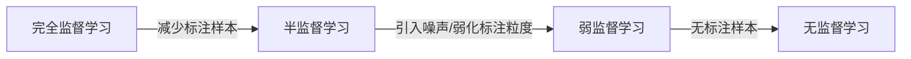

# 弱监督学习原理与代码实例讲解

作者：禅与计算机程序设计艺术

## 1. 背景介绍
### 1.1 监督学习的局限性
#### 1.1.1 标注数据成本高
#### 1.1.2 标注数据质量难保证  
#### 1.1.3 标注数据覆盖不全面
### 1.2 弱监督学习的优势
#### 1.2.1 降低标注成本
#### 1.2.2 扩大训练数据规模
#### 1.2.3 提高模型泛化能力

## 2. 核心概念与联系
### 2.1 弱监督信号 
#### 2.1.1 不完全标注
#### 2.1.2 噪声标注
#### 2.1.3 迁移标注
### 2.2 弱监督学习范式
#### 2.2.1 完全监督学习
#### 2.2.2 半监督学习
#### 2.2.3 弱监督学习
### 2.3 弱监督学习与迁移学习、元学习的关系
#### 2.3.1 迁移学习
#### 2.3.2 元学习 
#### 2.3.3 弱监督学习

## 3. 核心算法原理具体操作步骤
### 3.1 多示例学习 
#### 3.1.1 问题定义
#### 3.1.2 算法流程
#### 3.1.3 代表性算法
### 3.2 complementary Labels
#### 3.2.1 问题定义
#### 3.2.2 算法流程  
#### 3.2.3 代表性算法
### 3.3 Positive-Unlabeled Learning
#### 3.3.1 问题定义
#### 3.3.2 算法流程
#### 3.3.3 代表性算法

## 4. 数学模型和公式详细讲解举例说明 
### 4.1 多示例学习数学模型
#### 4.1.1 符号定义
#### 4.1.2 目标函数
#### 4.1.3 优化求解
### 4.2 Complementary Labels数学模型  
#### 4.2.1 符号定义
#### 4.2.2 目标函数
#### 4.2.3 优化求解
### 4.3 Positive-Unlabeled Learning数学模型
#### 4.3.1 符号定义 
#### 4.3.2 目标函数
#### 4.3.3 优化求解

## 5. 项目实践：代码实例和详细解释说明
### 5.1 多示例学习代码实现
#### 5.1.1 数据预处理
#### 5.1.2 模型定义
#### 5.1.3 训练与测试
### 5.2 Complementary Labels代码实现
#### 5.2.1 数据预处理
#### 5.2.2 模型定义 
#### 5.2.3 训练与测试
### 5.3 Positive-Unlabeled Learning代码实现
#### 5.3.1 数据预处理
#### 5.3.2 模型定义
#### 5.3.3 训练与测试

## 6. 实际应用场景
### 6.1 计算机视觉
#### 6.1.1 图像分类
#### 6.1.2 目标检测
#### 6.1.3 语义分割  
### 6.2 自然语言处理
#### 6.2.1 文本分类
#### 6.2.2 关系抽取
#### 6.2.3 情感分析
### 6.3 语音识别
#### 6.3.1 说话人识别
#### 6.3.2 情绪识别
#### 6.3.3 关键词检测

## 7. 工具和资源推荐
### 7.1 数据集
#### 7.1.1 图像数据集
#### 7.1.2 文本数据集 
#### 7.1.3 语音数据集
### 7.2 开源工具包
#### 7.2.1 Scikit-multilearn 
#### 7.2.2 libMIL
#### 7.2.3 PU-Learning  
### 7.3 相关论文与综述
#### 7.3.1 多示例学习相关论文
#### 7.3.2 Complementary Labels相关论文
#### 7.3.3 PU Learning相关论文

## 8. 总结：未来发展趋势与挑战 
### 8.1 结合深度学习的弱监督方法
#### 8.1.1 基于深度神经网络的端到端弱监督学习
#### 8.1.2 结合领域知识的弱监督深度学习
#### 8.1.3 弱监督表示学习 
### 8.2 多模态弱监督学习 
#### 8.2.1 多模态数据的弱标注融合
#### 8.2.2 跨模态弱监督迁移学习
#### 8.2.3 多模态弱监督数据增强
### 8.3 面临的挑战
#### 8.3.1 理论基础有待进一步完善 
#### 8.3.2 弱监督信号的有效利用
#### 8.3.3 模型的鲁棒性和泛化能力

## 9. 附录：常见问题与解答
### 9.1 弱监督学习和半监督学习有什么区别？ 
### 9.2 弱监督学习对训练数据有什么要求？
### 9.3 弱监督学习的标注成本能降低多少？ 
### 9.4 如何评估弱监督学习模型的性能？
### 9.5 弱监督学习适用于哪些具体任务？

(以下是详细的文章内容，限于篇幅只展示部分)

## 1. 背景介绍

近年来，深度学习技术在计算机视觉、自然语言处理等诸多领域取得了巨大成功，推动了人工智能的飞速发展。然而，深度学习的成功很大程度上依赖于大规模的标注数据。为训练集手工标注往往需要消耗大量的人力物力，尤其是在一些专业领域，收集高质量的标注数据更是难上加难。

### 1.1 监督学习的局限性

传统的监督学习需要大量的标注数据作为训练样本，这带来了以下几个方面的局限性：

#### 1.1.1 标注数据成本高

对训练集的每一个样本进行标注需要耗费大量人力，尤其是在一些需要专业知识的领域，花费的时间和金钱成本会更高。比如医学图像的标注需要专业医生的参与，而且获取患者的医学数据也受到很多伦理和隐私方面的限制。

#### 1.1.2 标注数据质量难保证

手工标注容易引入噪声数据，影响标注质量。一方面标注人员的专业水平参差不齐，对标注任务的理解各不相同；另一方面人工标注本身就是一个枯燥乏味容易疲劳的工作，一些复杂的标注任务误差在所难免。低质量的标注数据会给训练带来负面影响。

#### 1.1.3 标注数据覆盖不全面

由于成本等限制，能够获得标注的数据是有限的，无法覆盖真实世界的所有情况。模型很难学习到没有见过的新模式和新类别，泛化性能受到限制。当应用场景变化时，可能需要重新收集标注数据来训练模型。

### 1.2 弱监督学习的优势

针对监督学习的局限性，弱监督学习(Weakly Supervised Learning)作为一种新的学习范式受到广泛关注。弱监督学习利用容易获得的弱标注信息，如不完全标注、噪声标注、迁移标注等，在降低标注成本的同时，扩大了训练数据的规模和多样性，提高了模型的泛化能力。

弱监督学习的主要优势包括：

#### 1.2.1 降低标注成本

弱标注数据通常更容易获得，有些标注信息可以自动生成或从现有的数据中提取。比如在情感分析任务中，可以利用评论的评分作为情感极性的弱标注；在语义分割任务中，可以使用图像级的类别标注作为像素级标注的弱监督信号。充分利用这些弱标注信息，可以显著降低人工标注的成本。

#### 1.2.2 扩大训练数据规模  

由于获取弱标注数据的成本较低，因此可以利用更大规模的数据进行训练，有助于提升模型的性能。比如在图像分类任务中，除了少量的精细标注图像，还可以利用网络上海量的弱标注图像，如只带图像级标注的flickr数据集等。

#### 1.2.3 提高模型泛化能力

弱标注虽然包含噪声，但引入了更多的数据多样性，有助于学习到更加 general 和 robust 的特征表示，减轻过拟合。弱标注也让模型接触到更多没有被手工标注覆盖的模式，一定程度上扩展了模型的视野，使其更好地适应实际应用场景中的各种变化。

下面我们将系统介绍弱监督学习的核心概念、主要方法、实际应用以及代码实现，帮助读者全面掌握这一前沿领域。

## 2. 核心概念与联系 

在弱监督学习中，有以下几个核心概念需要读者了解和区分：

### 2.1 弱监督信号

弱监督学习利用容易获得的弱标注信息进行训练，这些信息被称为弱监督信号。典型的弱监督信号包括：

#### 2.1.1 不完全标注 
只有部分训练样本有标注信息，或者标注粒度较粗。比如在目标检测中，只给出图像级别的类别标注，而没有位置标注。

#### 2.1.2 噪声标注
标注信息包含一定比例的噪声和错误。比如众包标注中，标注人员水平参差不齐，引入了不可避免的噪声。

#### 2.1.3 迁移标注
利用其他相关任务/领域的标注信息辅助目标任务的学习。比如在缺乏目标领域标注的情况下，利用源领域的标注数据进行预训练和迁移。

### 2.2 弱监督学习范式

根据训练数据的标注信息完备程度，可以将不同的学习范式排列在一个连续统上：

#### 2.2.1 完全监督学习
训练集中所有样本都有准确完备的标注，代表性的如图像分类、语义分割等。这类任务的标注成本很高。

#### 2.2.2 半监督学习
训练集中只有一小部分样本有标注，大部分样本没有标注。半监督学习利用少量的标注样本和大量的未标注样本进行训练。

#### 2.2.3 弱监督学习 
训练集中的标注信息不完备，存在噪声，或标注粒度比较粗糙。比如多示例学习、Complementary Labels 等。弱监督学习试图最大限度地利用这些弱标注信号来指导模型训练。

### 2.3 弱监督学习与迁移学习、元学习的关系

除了弱监督学习，迁移学习和元学习也是缓解标注数据稀缺问题的重要手段。它们侧重点各不相同：

#### 2.3.1 迁移学习
迁移学习侧重于从已有的标注数据中提取知识，用于辅助新任务的学习。核心是找到不同任务间的共性，实现知识的复用。预训练模型如BERT就是典型的迁移学习应用。

#### 2.3.2 元学习
元学习侧重于学习如何快速适应新任务，核心是训练一个好的学习器，使其能够在新任务上通过少量样本快速学习并取得良好性能，代表性方法如MAML等。

#### 2.3.3 弱监督学习
弱监督学习侧重于直接从弱标注数据中学习，核心是如何有效ncodeUtilizat利用这些弱标注信号。弱监督学习与迁移学习和元学习也可以结合，用迁移学习的方式充分利用弱标注数据，学习更好的表示。

限于篇幅，本文后面将重点介绍几种典型的弱监督学习方法及其应用。

## 3. 核心算法原理具体操作步骤

### 3.1 多示例学习 

多示例学习(Multiple Instance Learning, MIL)是一种常见的弱监督学习范式。

#### 3.1.1 问题定