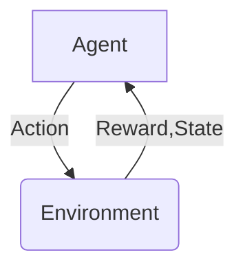
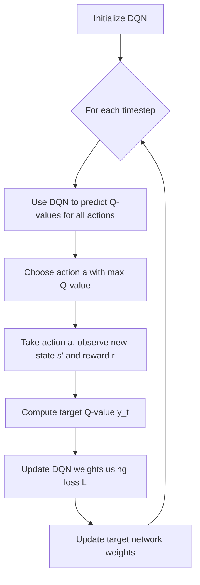
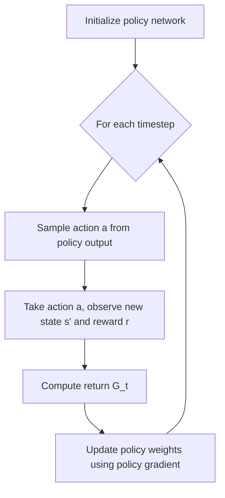

# 强化学习：在电子商务推荐系统中的应用

## 1.背景介绍

### 1.1 电子商务推荐系统的重要性

在当今竞争激烈的电子商务领域,为用户提供个性化和高质量的推荐服务已成为企业获取竞争优势的关键因素。有效的推荐系统不仅可以提高用户体验,增强用户粘性,还可以提高产品曝光率和销售额。然而,传统的协同过滤和基于内容的推荐算法存在一些固有的局限性,如冷启动问题、数据稀疏性和对动态用户偏好的适应性不足等。

### 1.2 强化学习在推荐系统中的应用潜力

近年来,强化学习(Reinforcement Learning,RL)作为一种全新的机器学习范式,在推荐系统领域引起了广泛关注。强化学习被认为是解决上述传统推荐算法缺陷的有力工具,可以通过与环境的互动来学习最优策略,动态地调整推荐策略以适应用户偏好的变化。

## 2.核心概念与联系

### 2.1 强化学习基本概念

强化学习是一种基于奖赏机制的机器学习技术,其核心思想是通过与环境的交互,不断尝试行为并获得反馈奖赏,从而学习到一个最优的决策策略。强化学习主要包括四个核心要素:

- 代理(Agent):执行行为并与环境交互的决策实体。
- 环境(Environment):代理所处的外部世界,包含代理的状态和奖励信息。
- 状态(State):环境的当前情况,描述了代理所处的位置和状态。
- 奖励(Reward):环境对代理行为的反馈,表示行为的好坏程度。

强化学习的目标是通过最大化预期的累积奖励,找到一个最优策略,指导代理在不同状态下采取最佳行为。



### 2.2 强化学习在推荐系统中的建模

在推荐系统中,我们可以将用户视为强化学习中的代理,推荐系统则扮演环境的角色。用户的行为(如点击、购买等)就是代理的行为,而系统根据这些行为给出的反馈(如是否喜欢该商品)就是奖励信号。推荐系统的目标是学习一个最优策略,为用户推荐最合适的商品,从而最大化用户的满意度和系统的收益。

具体来说,我们可以将推荐问题建模为马尔可夫决策过程(Markov Decision Process,MDP):

- 状态(State):包括用户的历史交互记录、个人资料等信息。
- 行为(Action):推荐系统向用户推荐的商品。
- 奖励(Reward):用户对推荐商品的反馈,如点击、购买等行为。
- 策略(Policy):推荐系统根据当前状态选择推荐商品的策略。

通过不断与用户交互并获取反馈,强化学习算法可以持续优化策略,从而提高推荐系统的性能。

## 3.核心算法原理具体操作步骤

强化学习在推荐系统中的应用主要包括以下几个核心算法:

### 3.1 Q-Learning算法

Q-Learning是强化学习中最经典和广泛使用的算法之一。它的核心思想是学习一个Q函数,用于评估在某个状态下采取某个行为的价值。通过不断更新Q函数,算法可以逐步找到最优策略。

Q-Learning算法的具体步骤如下:

1. 初始化Q表,所有状态-行为对的Q值设置为0或一个小的随机值。
2. 对于每个时间步:
    a. 根据当前状态,选择一个行为(通常采用ε-贪婪策略)。
    b. 执行选择的行为,观察到新的状态和获得的奖励。
    c. 更新Q表中相应的Q值,使用下式:

$$Q(s_t, a_t) \leftarrow Q(s_t, a_t) + \alpha \Big[r_t + \gamma \max_a Q(s_{t+1}, a) - Q(s_t, a_t)\Big]$$

其中,α是学习率,γ是折扣因子,用于权衡即时奖励和未来奖励的权重。

3. 重复步骤2,直到算法收敛或达到最大迭代次数。

在推荐系统中,我们可以将用户的历史交互记录作为状态,推荐商品作为行为,用户对推荐的反馈(如点击、购买)作为奖励。通过Q-Learning算法,推荐系统可以学习到一个最优策略,即在给定用户状态下推荐最合适的商品。

```mermaid
graph TD
    A[Initialize Q-table] --> B{For each timestep}
    B --> C[Choose action a based on current state s]
    C --> D[Take action a, observe new state s' and reward r]
    D --> E[Update Q(s,a) using Q-learning rule]
    E --> B
```

### 3.2 Deep Q-Network (DQN)算法

传统的Q-Learning算法存在一些局限性,如无法处理高维或连续的状态空间,并且需要维护一个巨大的Q表。Deep Q-Network (DQN)算法通过结合深度神经网络和Q-Learning,可以有效解决这些问题。

DQN算法的核心思路是使用一个神经网络来拟合Q函数,而不是维护一个Q表。具体步骤如下:

1. 初始化一个深度神经网络,其输入为当前状态,输出为每个可能行为的Q值。
2. 对于每个时间步:
    a. 根据当前状态,通过神经网络预测各个行为的Q值,选择Q值最大的行为执行。
    b. 执行选择的行为,观察到新的状态和获得的奖励。
    c. 计算目标Q值:

$$y_t = r_t + \gamma \max_{a'} Q(s_{t+1}, a'; \theta^-)$$

    其中,$\theta^-$表示目标网络的参数,用于估计下一状态的最大Q值,以提高训练稳定性。
    d. 使用损失函数$L = (y_t - Q(s_t, a_t; \theta))^2$,通过反向传播算法更新神经网络参数$\theta$。

3. 每隔一定步骤,将主网络的参数复制到目标网络参数$\theta^-$。
4. 重复步骤2,直到算法收敛或达到最大迭代次数。

在推荐系统中,我们可以将用户的历史交互记录、个人资料等信息编码为状态向量输入到神经网络,网络输出对应每个候选商品的Q值。通过不断与用户交互并更新网络参数,DQN算法可以学习到一个有效的Q函数,从而为用户推荐最合适的商品。



### 3.3 策略梯度算法

除了基于价值函数的算法(如Q-Learning和DQN),强化学习还有一类重要的算法是基于策略的算法,称为策略梯度(Policy Gradient)算法。这类算法直接学习一个策略函数,而不是学习价值函数。

策略梯度算法的核心思想是通过梯度上升的方式,不断调整策略参数,使得预期的累积奖励最大化。具体步骤如下:

1. 初始化一个策略网络,其输入为当前状态,输出为每个可能行为的概率分布。
2. 对于每个时间步:
    a. 根据当前状态,从策略网络输出的概率分布中采样一个行为执行。
    b. 执行选择的行为,观察到新的状态和获得的奖励。
    c. 计算该序列的累积奖励$G_t$。
    d. 使用策略梯度公式更新策略网络参数$\theta$:

$$\nabla_\theta J(\theta) \approx \sum_t \nabla_\theta \log \pi_\theta(a_t|s_t)G_t$$

其中,$\pi_\theta(a_t|s_t)$表示在状态$s_t$下选择行为$a_t$的概率,$G_t$为该序列的累积奖励。

3. 重复步骤2,直到算法收敛或达到最大迭代次数。

在推荐系统中,我们可以将用户的历史交互记录、个人资料等信息编码为状态向量输入到策略网络,网络输出对应每个候选商品被推荐的概率分布。通过不断与用户交互并更新策略网络参数,策略梯度算法可以学习到一个有效的推荐策略,为用户推荐最合适的商品。



## 4.数学模型和公式详细讲解举例说明

在强化学习算法中,数学模型和公式扮演着至关重要的角色。本节将详细介绍一些核心的数学模型和公式,并通过具体例子加深理解。

### 4.1 马尔可夫决策过程 (Markov Decision Process, MDP)

马尔可夫决策过程是强化学习算法的基础数学模型。一个MDP可以用一个元组$(S, A, P, R, \gamma)$来表示,其中:

- $S$是状态空间,表示所有可能的环境状态。
- $A$是行为空间,表示代理可以采取的所有行为。
- $P(s'|s,a)$是状态转移概率,表示在状态$s$执行行为$a$后,转移到状态$s'$的概率。
- $R(s,a)$是奖励函数,表示在状态$s$执行行为$a$后获得的即时奖励。
- $\gamma \in [0,1)$是折扣因子,用于权衡即时奖励和未来奖励的权重。

在推荐系统中,我们可以将用户的历史交互记录作为状态$s$,推荐商品作为行为$a$,用户对推荐的反馈(如点击、购买)作为奖励$R(s,a)$。状态转移概率$P(s'|s,a)$可以根据用户行为模式估计得到。

例如,假设我们有一个简单的电子商务网站,用户可以浏览不同类别的商品,如电子产品、服装、图书等。我们可以将用户浏览的商品类别作为状态$s$,推荐给用户的商品作为行为$a$,用户对推荐商品的点击或购买行为作为奖励$R(s,a)$。如果用户点击了推荐的商品,我们可以将其浏览记录更新为新的状态$s'$,并给予一定的正奖励。如果用户没有点击,我们可以保持原状态不变,并给予一个小的负奖励或零奖励。通过建模为MDP,我们可以使用强化学习算法来学习一个最优的推荐策略。

### 4.2 贝尔曼方程 (Bellman Equation)

贝尔曼方程是强化学习中另一个关键的数学模型,它描述了价值函数(Value Function)和最优策略之间的关系。

对于任意策略$\pi$,我们可以定义其在状态$s$下的价值函数$V^\pi(s)$为该策略下从状态$s$开始的预期累积奖励:

$$V^\pi(s) = \mathbb{E}_\pi \Big[\sum_{t=0}^\infty \gamma^t r_{t+1} \Big| s_0 = s\Big]$$

同样,我们可以定义在状态$s$执行行为$a$后的行为价值函数$Q^\pi(s,a)$:

$$Q^\pi(s,a) = \mathbb{E}_\pi \Big[\sum_{t=0}^\infty \gamma^t r_{t+1} \Big| s_0 = s, a_0 = a\Big]$$

贝尔曼方程给出了价值函数和行为价值函数之间的递推关系:

$$V^\pi(s) = \sum_{a \in A} \pi(a|s) \Big(R(s,a) + \gamma \sum_{s' \in S} P(s'|s,