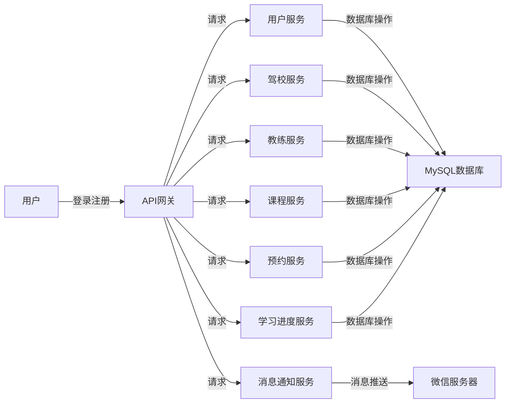

## 微信小程序乐学车驾校预约练车系统

作者：禅与计算机程序设计艺术

## 1. 背景介绍

### 1.1 驾培行业现状与痛点

随着我国经济的快速发展和人民生活水平的不断提高，汽车已经成为人们日常生活中不可或缺的交通工具。驾培行业作为汽车产业链的重要组成部分，近年来也得到了快速发展。然而，传统的驾培行业存在着诸多痛点，例如：

* **信息不对称：**学员获取驾校信息、教练信息、课程安排等信息不透明，难以做出最佳选择。
* **预约流程繁琐：**学员预约练车需要通过电话、短信等方式与驾校或教练进行沟通，效率低下且容易出错。
* **学习体验差：**传统驾培模式缺乏互动性，学员学习积极性不高，学习效果难以保证。
* **管理效率低下：**驾校管理学员信息、教练信息、车辆信息等工作量大，效率低下。

### 1.2 微信小程序的优势

微信小程序作为一种轻量级的应用程序，具有无需下载安装、使用方便、开发成本低等优势，非常适合用于解决驾培行业中的痛点。

### 1.3 乐学车驾校预约练车系统目标

为了解决传统驾培行业存在的痛点，提高驾培效率和学员学习体验，我们开发了基于微信小程序的乐学车驾校预约练车系统。该系统旨在为学员提供便捷的预约练车服务，同时帮助驾校提高管理效率。

## 2. 核心概念与联系

### 2.1 系统用户角色

乐学车驾校预约练车系统主要涉及三种用户角色：

* **学员：**注册系统后，可以浏览驾校信息、教练信息、课程安排，在线预约练车，查看学习进度等。
* **教练：**注册系统后，可以发布课程信息，管理学员预约，记录学员学习进度等。
* **管理员：**负责系统的日常维护和管理，包括审核驾校信息、教练信息、发布系统公告等。

### 2.2 系统功能模块

乐学车驾校预约练车系统主要包括以下功能模块：

* **用户登录注册模块：**提供用户登录注册功能，支持微信授权登录。
* **驾校信息管理模块：**管理员可以对驾校信息进行审核、编辑、删除等操作。
* **教练信息管理模块：**管理员可以对教练信息进行审核、编辑、删除等操作。
* **课程信息管理模块：**教练可以发布课程信息，包括课程类型、时间安排、价格等。
* **预约练车模块：**学员可以根据自身需求在线预约练车，选择教练、时间段、车辆等。
* **学习进度管理模块：**教练可以记录学员的学习进度，学员可以查看自己的学习记录。
* **消息通知模块：**系统会通过微信消息通知学员预约结果、课程变动等信息。
* **系统管理模块：**管理员可以对系统参数进行设置，查看系统日志等。

### 2.3 系统架构设计

乐学车驾校预约练车系统采用前后端分离的架构设计，前端使用微信小程序开发，后端使用 Spring Boot 框架开发，数据存储使用 MySQL 数据库。



## 3. 核心算法原理具体操作步骤

### 3.1 预约算法

乐学车驾校预约练车系统采用基于时间片的预约算法，将每天的练车时间划分为多个时间片，学员可以选择空闲的时间片进行预约。

**具体操作步骤如下：**

1. 学员选择练车日期和教练。
2. 系统查询该教练在该日期的空闲时间片。
3. 学员选择一个空闲时间片进行预约。
4. 系统将该时间片标记为已预约，并生成预约订单。

### 3.2 消息推送算法

乐学车驾校预约练车系统采用基于微信公众号的模板消息推送算法，将预约结果、课程变动等信息及时推送给学员。

**具体操作步骤如下：**

1. 系统将需要推送的消息内容和目标用户openid发送给微信服务器。
2. 微信服务器根据模板消息id和目标用户openid组装消息内容。
3. 微信服务器将消息推送给目标用户。

## 4. 数学模型和公式详细讲解举例说明

乐学车驾校预约练车系统中没有涉及复杂的数学模型和公式。

## 5. 项目实践：代码实例和详细解释说明

### 5.1 预约练车功能代码示例

```java
@RestController
@RequestMapping("/api/appointments")
public class AppointmentController {

    @Autowired
    private AppointmentService appointmentService;

    @PostMapping
    public Result<Appointment> createAppointment(@RequestBody AppointmentRequest request) {
        // 校验参数
        // ...

        // 创建预约订单
        Appointment appointment = appointmentService.createAppointment(request);

        // 返回预约订单信息
        return Result.success(appointment);
    }
}
```

**代码解释：**

* `@RestController` 注解表示该类是一个控制器类。
* `@RequestMapping("/api/appointments")` 注解表示该控制器处理 `/api/appointments` 路径的请求。
* `@PostMapping` 注解表示该方法处理 POST 请求。
* `@RequestBody` 注解表示将请求体中的 JSON 数据绑定到 `AppointmentRequest` 对象中。
* `appointmentService.createAppointment(request)` 调用 `AppointmentService` 的 `createAppointment()` 方法创建预约订单。
* `Result.success(appointment)` 返回预约订单信息。

### 5.2 消息推送功能代码示例

```java
@Component
public class MessagePushUtil {

    @Value("${wechat.appid}")
    private String appid;

    @Value("${wechat.secret}")
    private String secret;

    public void pushTemplateMessage(String openid, String templateId, Map<String, String> data) {
        // 获取 access_token
        String accessToken = getAccessToken();

        // 组装模板消息
        WxMpTemplateMessage templateMessage = WxMpTemplateMessage.builder()
                .toUser(openid)
                .templateId(templateId)
                .data(data)
                .build();

        // 发送模板消息
        WxMpService wxMpService = new WxMpServiceImpl();
        wxMpService.getTemplateMsgService().sendTemplateMsg(templateMessage);
    }

    // 获取 access_token
    private String getAccessToken() {
        // ...
    }
}
```

**代码解释：**

* `@Component` 注解表示该类是一个组件类。
* `@Value("${wechat.appid}")` 注解将配置文件中的 `wechat.appid` 属性值注入到 `appid` 字段中。
* `pushTemplateMessage()` 方法用于推送模板消息。
* `openid` 参数表示目标用户的 openid。
* `templateId` 参数表示模板消息id。
* `data` 参数表示模板消息数据。
* `WxMpService` 是微信公众号 Java SDK 提供的接口类。

## 6. 实际应用场景

乐学车驾校预约练车系统可以应用于以下场景：

* **驾校：**用于管理学员信息、教练信息、车辆信息、课程安排等，提高管理效率。
* **驾培机构：**用于为学员提供在线预约练车服务，提高学员学习体验。
* **互联网平台：**可以将该系统集成到互联网平台中，为用户提供更加便捷的驾培服务。

## 7. 工具和资源推荐

### 7.1 微信开发者工具

微信开发者工具是开发、调试和发布微信小程序的官方工具。

**下载地址：** https://developers.weixin.qq.com/miniprogram/dev/devtools/download.html

### 7.2 Spring Boot 框架

Spring Boot 框架可以帮助开发者快速构建 Spring 应用程序。

**官方网站：** https://spring.io/projects/spring-boot

### 7.3 MySQL 数据库

MySQL 是一种常用的关系型数据库管理系统。

**官方网站：** https://www.mysql.com/

## 8. 总结：未来发展趋势与挑战

### 8.1 未来发展趋势

* **个性化学习：**根据学员的学习进度和学习习惯，提供个性化的学习内容和学习计划。
* **智能推荐：**根据学员的需求和偏好，推荐合适的教练、课程和时间段。
* **数据分析：**通过对学员学习数据的分析，优化课程设置和教学方式。

### 8.2 面临的挑战

* **数据安全：**如何保障学员信息的安全性。
* **用户体验：**如何提高用户的预约体验和学习体验。
* **市场竞争：**如何应对来自其他驾培平台的竞争。

## 9. 附录：常见问题与解答

### 9.1 如何注册账号？

打开乐学车驾校预约练车小程序，点击“我的”->“登录/注册”，按照提示填写信息即可注册账号。

### 9.2 如何预约练车？

选择您想要学习的课程，选择教练和时间段，点击“立即预约”按钮即可预约练车。

### 9.3 如何取消预约？

在我的预约中找到您想要取消的预约订单，点击“取消预约”按钮即可取消预约。