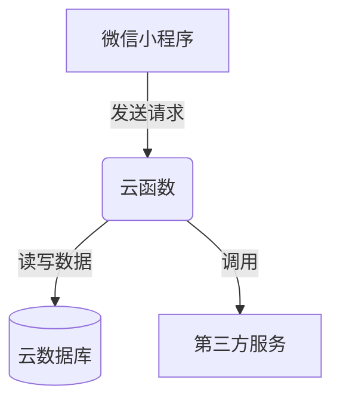

# 微信小程序茶园茶农文化交流系统

## 1. 背景介绍

### 1.1 茶文化的重要性

茶文化是中国传统文化的重要组成部分,凝聚了中华民族的智慧和精神追求。茶不仅仅是一种饮品,更是一种生活方式和审美情趣。茶文化蕴含着丰富的哲学思想、人文精神和审美情趣,体现了中国人对自然、生活和人生的独特理解和追求。

### 1.2 茶农文化交流的重要性

茶农是茶文化的重要传承者和实践者。他们不仅种植和加工茶叶,更重要的是承载着茶文化的精神内涵。然而,随着现代化进程的加快,传统茶文化面临着被遗忘和失传的风险。因此,加强茶农文化交流,促进茶文化的传承和发展,具有重要意义。

### 1.3 微信小程序的优势

微信小程序作为一种新兴的移动应用程序形式,具有开发和使用成本低、无需安装即可运行等优势。它可以有效降低茶农文化交流的技术门槛,为茶农提供一个低成本、高效率的文化交流平台。

## 2. 核心概念与联系

### 2.1 微信小程序

微信小程序是一种无需下载安装即可使用的小型应用程序,它基于微信官方提供的开发工具进行开发。小程序可以在微信客户端内运行,并与手机系统其他应用程序互通。

### 2.2 茶文化交流系统

茶文化交流系统是一个基于微信小程序的平台,旨在促进茶农之间以及茶农与茶文化爱好者之间的文化交流。它提供了多种交流功能,如论坛、聊天室、视频分享等,让用户可以分享茶文化知识、经验和见解。

### 2.3 核心技术

该系统的核心技术包括:

- 微信小程序开发技术栈 (JavaScript、WXML、WXSS等)
- 数据库技术 (云数据库等)
- 媒体处理技术 (图像、视频上传和处理)
- 社交网络技术 (用户系统、评论系统等)

## 3. 核心算法原理具体操作步骤

### 3.1 用户认证与授权

为了保护用户隐私和系统安全,该系统采用了微信官方提供的用户认证机制。用户可以使用微信账号直接登录系统,无需额外注册。具体步骤如下:

1. 用户打开小程序,点击"微信登录"按钮
2. 小程序向微信服务器发送登录请求,获取用户基本信息
3. 服务器验证用户身份,生成唯一的会话密钥
4. 用户信息和会话密钥存储在系统数据库中

### 3.2 内容发布与互动

用户可以在系统中发布各种内容,如文字、图片、视频等,并与其他用户进行互动。算法流程如下:

1. 用户创建新内容,填写标题、正文、标签等信息
2. 如有图片或视频,调用上传接口将媒体文件上传到服务器
3. 服务器对内容进行检查,如无违规则保存到数据库
4. 其他用户可以查看、评论、点赞该内容
5. 系统根据内容热度、用户关注等算法推荐相关内容

### 3.3 内容推荐算法

为了提高用户体验,系统采用了个性化内容推荐算法。算法基于协同过滤和内容过滤技术,具体步骤如下:

1. 收集用户浏览历史、点赞记录、评论等行为数据
2. 计算用户与其他用户之间的相似度
3. 根据相似用户的行为,预测当前用户可能感兴趣的内容
4. 结合内容标签、热度等因素,生成个性化推荐列表

该算法可以有效提高内容推荐的准确性和多样性,增强用户粘性。

## 4. 数学模型和公式详细讲解举例说明

### 4.1 协同过滤算法

协同过滤算法是推荐系统中常用的一种技术,基于该算法,可以预测用户对某个项目的喜好程度。在茶文化交流系统中,我们将用户视为 $u$,内容视为 $i$,用户对内容的喜好程度用评分 $r_{ui}$ 表示。

我们定义用户 $u$ 与用户 $v$ 之间的相似度为:

$$\text{sim}(u,v)=\frac{\sum_{i \in I_{uv}}(r_{ui}-\overline{r_u})(r_{vi}-\overline{r_v})}{\sqrt{\sum_{i \in I_{uv}}(r_{ui}-\overline{r_u})^2}\sqrt{\sum_{i \in I_{uv}}(r_{vi}-\overline{r_v})^2}}$$

其中 $I_{uv}$ 表示用户 $u$ 和 $v$ 均已评分的内容集合, $\overline{r_u}$ 和 $\overline{r_v}$ 分别表示用户 $u$ 和 $v$ 的平均评分。

基于相似度,我们可以预测用户 $u$ 对内容 $i$ 的评分:

$$\hat{r}_{ui}=\overline{r_u}+\frac{\sum_{v \in S(i,k)}\ \text{sim}(u,v)(r_{vi}-\overline{r_v})}{\sum_{v \in S(i,k)}|\text{sim}(u,v)|}$$

其中 $S(i,k)$ 表示与内容 $i$ 相关的 $k$ 个最相似的用户集合。

以上公式体现了协同过滤的核心思想:利用相似用户的喜好预测目标用户的喜好。在实际应用中,我们还需要考虑数据稀疏、冷启动等问题,通过引入基于内容的推荐等技术予以解决。

### 4.2 内容过滤算法

内容过滤算法是另一种常用的推荐技术,它根据内容的特征来预测用户的喜好程度。在茶文化交流系统中,我们可以将内容表示为一个特征向量 $\vec{x}$,用户偏好表示为一个权重向量 $\vec{w}$,则用户对内容的喜好程度可以用以下公式计算:

$$\hat{r}_{ui}=\vec{w}^T\vec{x}_i$$

我们可以使用机器学习算法(如逻辑回归、支持向量机等)基于已有的用户反馈数据(如点赞、评论等)来学习权重向量 $\vec{w}$。

以上两种算法各有优缺点,协同过滤算法无需了解内容本身的特征,但容易受到数据稀疏问题的影响;内容过滤算法则不受数据稀疏的影响,但需要对内容进行特征抽取。在实际系统中,我们通常会将两种算法相结合,发挥各自的优势,提高推荐的准确性和多样性。

## 5. 项目实践:代码实例和详细解释说明  

### 5.1 系统架构

茶文化交流系统采用了微信小程序 + 云开发的架构,前端使用微信小程序框架开发,后端使用云函数和云数据库提供服务。系统架构如下图所示:



该架构的优势在于:

- 前后端分离,降低了开发和维护的复杂度
- 云服务提供了可扩展的计算和存储资源
- 无需维护服务器,降低了运维成本

### 5.2 核心功能实现

#### 5.2.1 用户认证

微信小程序提供了 `wx.login()` 接口用于获取用户登录凭证,我们可以在云函数中调用该接口完成用户认证,示例代码如下:

```javascript
// 云函数入口文件
const cloud = require('wx-server-sdk')
cloud.init({
  env: cloud.DYNAMIC_CURRENT_ENV
})

exports.main = async (event, context) => {
  const { OPENID } = cloud.getWXContext()

  const result = await cloud.openapi.getUserInfo({
    openIdList: [OPENID]
  })

  return result
}
```

上述代码中,我们首先获取用户的 `OPENID`,然后调用微信开放接口获取用户信息,最后将用户信息存储到数据库中。

#### 5.2.2 内容发布

用户可以通过小程序界面发布文字、图片和视频内容,这些内容将被存储在云数据库中。以发布文字内容为例,前端代码如下:

```html
<!-- post.wxml -->
<view>
  <textarea bindinput="onInput" placeholder="请输入内容" />
  <button bindtap="onPublish">发布</button>
</view>
```

```javascript
// post.js
Page({
  data: {
    content: ''
  },
  onInput(e) {
    this.setData({
      content: e.detail.value
    })
  },
  onPublish() {
    const content = this.data.content
    if (!content) {
      return
    }
    wx.cloud.callFunction({
      name: 'publishPost',
      data: {
        content
      }
    })
  }
})
```

上述代码中,用户输入的内容被存储在 `content` 变量中,当点击"发布"按钮时,将调用云函数 `publishPost` 将内容存储到数据库。云函数代码如下:

```javascript
// 云函数入口文件
const cloud = require('wx-server-sdk')
cloud.init({
  env: cloud.DYNAMIC_CURRENT_ENV
})
const db = cloud.database()

exports.main = async (event, context) => {
  const { OPENID } = cloud.getWXContext()
  const { content } = event

  return await db.collection('posts').add({
    data: {
      content,
      userId: OPENID,
      createTime: new Date().getTime()
    }
  })
}
```

云函数从请求参数中获取内容,并将其与用户 ID 和创建时间一起存储到 `posts` 集合中。对于图片和视频内容,前端需要先将文件上传到云存储,然后将文件地址一并存储到数据库中。

#### 5.2.3 内容互动

用户可以对内容进行点赞、评论等互动操作。以点赞为例,前端代码如下:

```html
<!-- post.wxml -->
<view>
  <text>{{ post.content }}</text>
  <text>点赞数: {{ post.likeCount }}</text>
  <button bindtap="onLike" disabled="{{ liked }}">
    {{ liked ? '已点赞' : '点赞' }}
  </button>
</view>
```

```javascript
// post.js
Page({
  data: {
    post: null,
    liked: false
  },
  onLoad(options) {
    const postId = options.id
    this.getPostDetail(postId)
  },
  getPostDetail(postId) {
    wx.cloud.callFunction({
      name: 'getPostDetail',
      data: {
        postId
      }
    }).then(res => {
      const { post, liked } = res.result
      this.setData({
        post,
        liked
      })
    })
  },
  onLike() {
    const { postId } = this.data.post
    wx.cloud.callFunction({
      name: 'likePost',
      data: {
        postId
      }
    }).then(res => {
      this.setData({
        liked: true,
        'post.likeCount': res.result.likeCount
      })
    })
  }
})
```

上述代码中,首先从云函数获取内容详情,包括点赞数和当前用户是否已点赞。当用户点击"点赞"按钮时,将调用云函数 `likePost` 更新点赞数据。云函数代码如下:

```javascript
// 云函数入口文件
const cloud = require('wx-server-sdk')
cloud.init({
  env: cloud.DYNAMIC_CURRENT_ENV  
})
const db = cloud.database()

exports.main = async (event, context) => {
  const { OPENID } = cloud.getWXContext()
  const { postId } = event

  const dbRef = db.collection('posts').doc(postId)
  const post = (await dbRef.get()).data

  const { likeCount = 0, likeUsers = [] } = post
  const newLikeCount = likeUsers.includes(OPENID) ? likeCount : likeCount + 1
  const newLikeUsers = likeUsers.includes(OPENID) ? likeUsers : [...likeUsers, OPENID]

  return await dbRef.update({
    data: {
      likeCount: newLikeCount,
      likeUsers: newLikeUsers
    }
  })
}
```

云函数首先获取内容的当前点赞数据,然后根据用户是否已点赞来更新点赞数和点赞用户列表。评