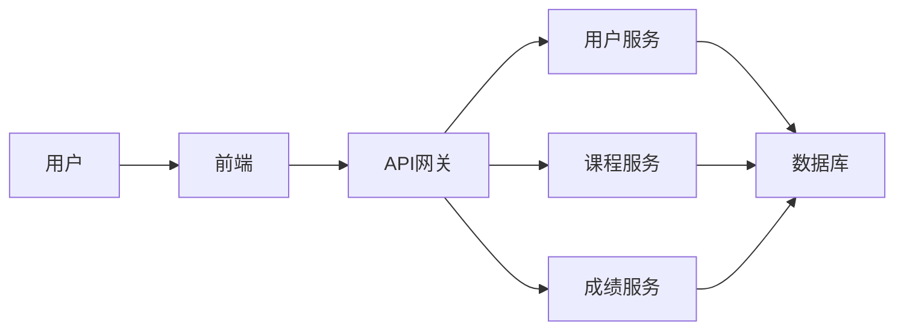

# 成绩查询系统详细设计与具体代码实现

作者：禅与计算机程序设计艺术

## 1. 背景介绍

### 1.1 成绩查询系统的需求分析

随着信息技术的快速发展，教育行业也逐渐向数字化、信息化方向转型。传统的成绩管理方式效率低下，容易出错，已经无法满足现代教育的需求。为了提高学校的教学管理水平，方便学生及时了解自己的学习情况，开发一个功能完善、安全可靠的成绩查询系统势在必行。

一个典型的成绩查询系统应该具备以下功能：

* **学生信息管理:**  包括学生基本信息录入、修改、删除等功能。
* **课程信息管理:** 包括课程基本信息录入、修改、删除等功能。
* **成绩录入与管理:** 包括成绩录入、修改、删除、查询、统计分析等功能。
* **学生成绩查询:**  学生可以通过多种方式查询自己的成绩，例如按学期查询、按课程查询等。
* **权限管理:**  系统应根据不同用户角色分配不同的操作权限，例如管理员拥有最高权限，教师可以录入和修改成绩，学生只能查询自己的成绩等。
* **数据安全与备份:** 系统应具备完善的数据安全机制，防止数据泄露和篡改，并定期进行数据备份，确保数据安全。


### 1.2 成绩查询系统的技术选型

为了满足上述需求，我们选择以下技术栈来开发成绩查询系统：

* **后端开发语言:**  Java (Spring Boot) -  Java 是一门成熟、稳定、可靠的编程语言，拥有庞大的开发者社区和丰富的第三方库，Spring Boot 框架可以帮助我们快速搭建企业级应用程序。
* **前端开发框架:**  Vue.js -  Vue.js 是一套构建用户界面的渐进式框架，易于上手且灵活性高，可以帮助我们快速构建美观、易用的用户界面。
* **数据库:**  MySQL -  MySQL 是一款开源的关系型数据库管理系统，性能优异、稳定可靠，并且拥有丰富的社区支持。
* **缓存:**  Redis -  Redis 是一款高性能的键值存储系统，可以用作数据库缓存、消息队列等，可以有效提高系统的性能和并发能力。


## 2. 核心概念与联系

### 2.1 系统架构设计

本成绩查询系统采用前后端分离的架构设计，前端负责展示数据和交互逻辑，后端负责处理业务逻辑和数据访问。前后端通过 RESTful API 进行通信。



* **用户服务:** 负责用户相关的业务逻辑，例如用户注册、登录、权限管理等。
* **课程服务:** 负责课程相关的业务逻辑，例如课程信息的增删改查等。
* **成绩服务:** 负责成绩相关的业务逻辑，例如成绩录入、修改、查询、统计分析等。
* **API 网关:** 负责统一管理 API 接口，实现 API 鉴权、限流、熔断等功能。
* **数据库:**  存储系统的数据，包括用户信息、课程信息、成绩信息等。

### 2.2 数据库设计

系统数据库设计如下：

**用户表 (user)**

| 字段名       | 数据类型    |  说明                                    |
| :----------- | :---------- | :--------------------------------------- |
| id           | int(11)      |  用户ID，主键，自增                     |
| username     | varchar(255) |  用户名                                    |
| password     | varchar(255) |  密码                                    |
| role         | varchar(255) |  用户角色，例如 admin, teacher, student |


**课程表 (course)**

| 字段名    | 数据类型    |  说明                             |
| :-------- | :---------- | :---------------------------------- |
| id        | int(11)      |  课程ID，主键，自增                 |
| name      | varchar(255) |  课程名称                             |
| teacher_id | int(11)      |  授课教师ID，外键关联 user 表的 id |


**成绩表 (score)**

| 字段名      | 数据类型    |  说明                                    |
| :---------- | :---------- | :--------------------------------------- |
| id          | int(11)      |  成绩ID，主键，自增                     |
| student_id  | int(11)      |  学生ID，外键关联 user 表的 id           |
| course_id   | int(11)      |  课程ID，外键关联 course 表的 id        |
| score       | decimal(5,2) |  成绩                                    |


## 3. 核心算法原理具体操作步骤

### 3.1 用户登录认证

1. 用户在登录页面输入用户名和密码。
2. 前端将用户名和密码发送到后端用户服务接口 (/user/login)。
3. 用户服务根据用户名查询数据库，如果用户不存在，则返回用户名错误。
4. 如果用户存在，则将用户输入的密码与数据库中存储的密码进行比对，如果密码错误，则返回密码错误。
5. 如果密码正确，则生成 JWT (JSON Web Token) 并返回给前端。
6. 前端将 JWT 保存到 localStorage 中，并在后续请求中携带 JWT 到后端进行身份验证。

### 3.2 学生成绩查询

1. 学生在成绩查询页面选择查询条件，例如学期、课程等。
2. 前端将查询条件发送到后端成绩服务接口 (/score/query)。
3. 成绩服务根据查询条件从数据库中查询成绩信息。
4. 成绩服务将查询结果返回给前端。
5. 前端将查询结果展示在页面上。


## 4. 数学模型和公式详细讲解举例说明

本系统中没有复杂的数学模型和公式，主要涉及数据库的增删改查操作。


## 5. 项目实践：代码实例和详细解释说明

### 5.1 后端代码示例 (Spring Boot)

#### 5.1.1 用户服务接口

```java
@RestController
@RequestMapping("/user")
public class UserController {

    @Autowired
    private UserService userService;

    @PostMapping("/login")
    public Result login(@RequestBody UserLoginRequest request) {
        String token = userService.login(request.getUsername(), request.getPassword());
        return Result.success(token);
    }

}
```

#### 5.1.2 成绩服务接口

```java
@RestController
@RequestMapping("/score")
public class ScoreController {

    @Autowired
    private ScoreService scoreService;

    @PostMapping("/query")
    public Result query(@RequestBody ScoreQueryRequest request) {
        List<Score> scores = scoreService.query(request);
        return Result.success(scores);
    }

}
```

### 5.2 前端代码示例 (Vue.js)

#### 5.2.1 用户登录页面

```html
<template>
  <div>
    <input type="text" v-model="username" placeholder="请输入用户名">
    <input type="password" v-model="password" placeholder="请输入密码">
    <button @click="login">登录</button>
  </