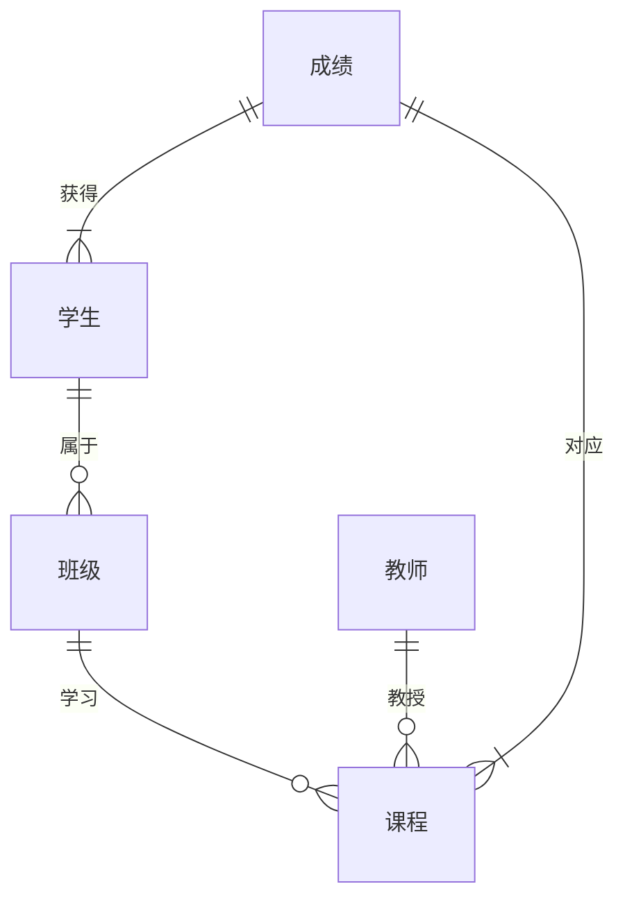

## 1. 背景介绍

### 1.1 教育信息化的发展趋势
随着信息技术的飞速发展和教育理念的不断更新，教育信息化已经成为教育改革和发展的重要方向。成绩管理系统作为教育信息化的重要组成部分，对于提高学校教学管理水平、减轻教师工作负担、促进学生全面发展具有重要意义。

### 1.2 传统成绩管理方式的弊端
传统的成绩管理方式主要依靠手工记录和计算，存在着效率低下、易出错、难以统计分析等弊端。例如，教师需要花费大量时间登记成绩、计算排名，学生也无法及时了解自己的学习情况。

### 1.3 成绩管理系统的优势和意义
成绩管理系统可以有效解决传统成绩管理方式存在的弊端，其优势主要体现在以下几个方面：
* **提高效率**: 自动化处理成绩录入、计算、统计分析等工作，大大提高工作效率。
* **减少错误**: 系统自动校验数据，避免人工操作带来的错误。
* **方便查询**: 教师和学生可以随时随地查询成绩信息。
* **数据分析**: 系统可以对成绩数据进行多维度分析，为教学管理提供决策依据。

## 2. 核心概念与联系

### 2.1 用户角色
成绩管理系统主要涉及以下用户角色：
* **管理员**: 负责系统维护、用户管理、权限设置等工作。
* **教师**: 负责录入成绩、查询成绩、打印报表等工作。
* **学生**: 负责查询成绩、查看排名等工作。

### 2.2 功能模块
成绩管理系统主要包括以下功能模块：
* **用户管理**:  包括用户注册、登录、密码修改、权限管理等功能。
* **课程管理**:  包括课程添加、删除、修改等功能。
* **班级管理**:  包括班级添加、删除、修改等功能。
* **学生管理**:  包括学生信息添加、删除、修改等功能。
* **成绩管理**:  包括成绩录入、修改、查询、统计分析等功能。
* **报表管理**:  包括生成各种成绩报表，如成绩单、排名表、分析报告等。

### 2.3 数据关系图


## 3. 核心算法原理具体操作步骤

### 3.1 成绩录入
* 教师选择要录入成绩的班级和课程。
* 系统显示该班级所有学生的名单。
* 教师输入每个学生的成绩。
* 系统自动计算学生的总分和平均分。

### 3.2 成绩查询
* 学生登录系统后，可以查看自己的所有课程的成绩。
* 教师可以根据班级、课程、学生姓名等条件查询学生的成绩。

### 3.3 成绩统计分析
* 系统可以根据班级、课程、考试类型等条件统计学生的平均分、最高分、最低分等信息。
* 系统可以生成各种图表，直观地展示学生的成绩分布情况。

## 4. 数学模型和公式详细讲解举例说明

### 4.1 加权平均分计算
假设某门课程的平时成绩占总成绩的 30%，期中考试成绩占 30%，期末考试成绩占 40%，则学生的加权平均分计算公式如下：

```
加权平均分 = 平时成绩 * 0.3 + 期中考试成绩 * 0.3 + 期末考试成绩 * 0.4
```

**举例说明:**
假设某学生的平时成绩为 80 分，期中考试成绩为 85 分，期末考试成绩为 90 分，则该学生的加权平均分为：

```
加权平均分 = 80 * 0.3 + 85 * 0.3 + 90 * 0.4 = 85.5
```

### 4.2 标准差计算
标准差是用来衡量数据波动程度的指标，计算公式如下：

```
标准差 = sqrt(∑(xi - x̄)² / (n - 1))
```

其中：
* xi 表示第 i 个数据
* x̄ 表示所有数据的平均值
* n 表示数据的个数

**举例说明:**
假设某班级 10 名学生的某门课程成绩分别为：80, 85, 90, 75, 80, 85, 90, 95, 80, 85，则该班级该门课程成绩的标准差为：

```
x̄ = (80 + 85 + 90 + 75 + 80 + 85 + 90 + 95 + 80 + 85) / 10 = 85

标准差 = sqrt(((80 - 85)² + (85 - 85)² + ... + (85 - 85)²) / (10 - 1)) ≈ 5.48
```

## 5. 项目实践：代码实例和详细解释说明

### 5.1 技术选型
本项目采用 Python 语言 + Django 框架 + MySQL 数据库进行开发。

### 5.2 数据库设计
| 表名 | 字段 | 数据类型 | 说明 |
|---|---|---|---|
| 用户 | id | int | 主键 |
|  | username | varchar(20) | 用户名 |
|  | password | varchar(100) | 密码 |
|  | role | int | 角色（1：管理员，2：教师，3：学生） |
| 课程 | id | int | 主键 |
|  | name | varchar(50) | 课程名称 |
|  | teacher_id | int | 教师 ID |
| 班级 | id | int | 主键 |
|  | name | varchar(50) | 班级名称 |
| 学生 | id | int | 主键 |
|  | name | varchar(20) | 学生姓名 |
|  | class_id | int | 班级 ID |
| 成绩 | id | int | 主键 |
|  | student_id | int | 学生 ID |
|  | course_id | int | 课程 ID |
|  | score | float | 成绩 |

### 5.3 代码实现

#### 5.3.1 成绩录入

```python
def record_score(request):
    if request.method == 'POST':
        # 获取表单数据
        class_id = request.POST.get('class_id')
        course_id = request.POST.get('course_id')
        scores = request.POST.getlist('score')

        # 获取班级学生列表
        students = Student.objects.filter(class_id=class_id)

        # 循环录入每个学生的成绩
        for i, student in enumerate(students):
            score = scores[i]

            # 创建成绩记录
            Score.objects.create(
                student_id=student.id,
                course_id=course_id,
                score=score
            )

        return HttpResponse('成绩录入成功！')

    else:
        # 获取所有班级和课程列表
        classes = Class.objects.all()
        courses = Course.objects.all()

        # 渲染模板
        return render(request, 'record_score.html', {'classes': classes, 'courses': courses})
```

#### 5.3.2 成绩查询

```python
def query_score(request):
    if request.method == 'POST':
        # 获取表单数据
        class_id = request.POST.get('class_id')
        course_id = request.POST.get('course_id')
        student_name = request.POST.get('student_name')

        # 根据条件查询成绩
        scores = Score.objects.all()
        if class_id:
            scores = scores.filter(student__class_id=class_id)
        if course_id:
            scores = scores.filter(course_id=course_id)
        if student_name:
            scores = scores.filter(student__name__icontains=student_name)

        # 渲染模板
        return render(request, 'score_list.html', {'scores': scores})

    else:
        # 获取所有班级和课程列表
        classes = Class.objects.all()
        courses = Course.objects.all()

        # 渲染模板
        return render(request, 'query_score.html', {'classes': classes, 'courses': courses})
```

## 6. 实际应用场景

### 6.1 学校
* 教师录入成绩，学生查询成绩，学校领导查看统计分析报表。
* 成绩管理系统可以与学校的其他信息化系统（如教务系统、学生管理系统等）进行集成，实现数据共享和业务协同。

### 6.2 教育培训机构
* 教师录入学员成绩，学员查询成绩，机构管理者查看统计分析报表。
* 成绩管理系统可以帮助教育培训机构更好地了解学员的学习情况，为学员提供个性化的学习指导。

### 6.3 企业
* 企业可以利用成绩管理系统对员工进行培训考核，跟踪员工的学习进度和成果。
* 成绩管理系统可以帮助企业建立人才梯队，提升员工的整体素质。

## 7. 工具和资源推荐

### 7.1 数据库管理工具
* **Navicat**:  一款功能强大的数据库管理工具，支持 MySQL、Oracle、SQL Server 等多种数据库。
* **DataGrip**: JetBrains 公司开发的一款数据库管理工具，功能强大，使用方便。

### 7.2 Python Web 框架
* **Django**:  一款功能强大的 Python Web 框架，适合开发大型 Web 应用。
* **Flask**:  一款轻量级的 Python Web 框架，适合开发小型 Web 应用。

### 7.3 前端框架
* **Vue.js**:  一款渐进式 JavaScript 框架，易学易用，适合开发交互式 Web 应用。
* **React**:  一款由 Facebook 开发的 JavaScript 库，适合开发大型 Web 应用。

## 8. 总结：未来发展趋势与挑战

### 8.1 未来发展趋势
* **智能化**:  随着人工智能技术的不断发展，未来的成绩管理系统将会更加智能化，例如自动识别学生身份、自动批改作业等。
* **个性化**:  未来的成绩管理系统将会更加注重学生的个性化需求，例如为学生提供个性化的学习建议、推荐合适的学习资源等。
* **移动化**:  随着移动互联网的普及，未来的成绩管理系统将会更加移动化，学生和教师可以通过手机、平板电脑等移动设备随时随地访问系统。

### 8.2 面临的挑战
* **数据安全**:  成绩管理系统中存储着大量的学生信息，如何保障数据的安全是一个重要的挑战。
* **系统性能**:  随着用户规模的扩大和数据量的增加，如何保证系统的性能是一个重要的挑战。
* **用户体验**:  如何设计出用户体验良好的成绩管理系统是一个重要的挑战。

## 9. 附录：常见问题与解答

### 9.1 如何保障成绩数据的安全？
* 对用户进行权限管理，不同角色的用户拥有不同的操作权限。
* 对敏感数据进行加密存储。
* 定期备份数据，防止数据丢失。

### 9.2 如何提高系统的性能？
* 使用缓存技术，减少数据库访问次数。
* 对数据库进行优化，提高查询效率。
* 使用负载均衡技术，将请求分发到多台服务器处理。

### 9.3 如何设计用户体验良好的系统？
* 界面简洁美观，操作方便快捷。
* 提供详细的操作指南和帮助文档。
* 及时响应用户反馈，解决用户问题。
