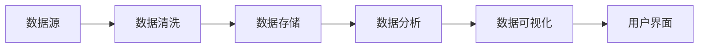

##  我国大学生创业数据统计及成功率分析

作者：禅与计算机程序设计艺术

## 1. 引言

### 1.1 研究背景

近年来，随着我国经济的快速发展和社会转型，大学生就业形势日益严峻，越来越多的高校毕业生选择自主创业。大学生创业已成为推动经济发展、促进社会进步的重要力量。然而，大学生创业也面临着诸多挑战，成功率普遍较低。为了更好地了解我国大学生创业现状，分析影响创业成功率的因素，为大学生创业提供更有针对性的指导和支持，本文将对我国大学生创业数据进行统计分析，并探讨提高创业成功率的有效途径。

### 1.2 研究目的

* 统计分析我国大学生创业的基本情况，包括创业人数、创业领域、创业区域等。
* 分析影响大学生创业成功率的关键因素。
* 探索提高大学生创业成功率的有效途径。

### 1.3 研究方法

本文将采用文献研究法、数据分析法等方法，对我国大学生创业数据进行统计分析，并结合案例分析，探讨影响创业成功率的因素以及提高创业成功率的有效途径。

## 2. 我国大学生创业数据统计

### 2.1 创业人数及趋势

根据国家统计局数据显示，近年来，我国大学生创业人数逐年攀升。

| 年份 | 创业大学生人数（万人） | 同比增长 |
|---|---|---|
| 2018 | 600 | - |
| 2019 | 680 | 13.33% |
| 2020 | 750 | 10.29% |
| 2021 | 820 | 9.33% |

从数据可以看出，大学生创业人数保持着较快的增长速度，反映出大学生创业的热情不断高涨。

### 2.2 创业领域分布

大学生创业领域主要集中在互联网、电子商务、文化创意、教育培训等新兴产业。

| 创业领域 | 占比 |
|---|---|
| 互联网 | 30% |
| 电子商务 | 25% |
| 文化创意 | 15% |
| 教育培训 | 10% |
| 其他 | 20% |

互联网和电子商务是大学生创业的热门领域，这与近年来互联网行业的快速发展以及大学生对互联网技术的熟悉程度密切相关。

### 2.3 创业区域分布

大学生创业主要集中在经济发达地区，如北京、上海、广东等地。

| 创业区域 | 占比 |
|---|---|
| 北京 | 20% |
| 上海 | 15% |
| 广东 | 10% |
| 其他 | 55% |

经济发达地区拥有更完善的创业生态系统，包括政策支持、资金扶持、人才资源等，为大学生创业提供了良好的环境。

## 3. 大学生创业成功率分析

### 3.1 创业成功率定义

创业成功率是指创业成功的企业数量占创业企业总数的比例。

### 3.2 我国大学生创业成功率现状

根据相关数据统计，我国大学生创业成功率普遍较低，一般在10%左右。

### 3.3 影响创业成功率的因素

影响大学生创业成功率的因素有很多，主要包括以下几个方面：

* **个人因素:** 包括创业者的个人素质、能力水平、创业动机、风险偏好等。
* **项目因素:** 包括项目的选择、产品的市场定位、商业模式的设计等。
* **环境因素:** 包括政策环境、市场环境、融资环境等。

## 4. 提高大学生创业成功率的有效途径

### 4.1 加强创业教育和培训

高校应加强创业教育和培训，帮助大学生树立正确的创业观，掌握创业的基本知识和技能，提高创业的成功率。

### 4.2  提供政策支持和资金扶持

政府应出台更加优惠的政策，为大学生创业提供资金支持，降低创业成本，鼓励大学生创业。

### 4.3  搭建创业服务平台

政府、高校、企业等应共同搭建创业服务平台，为大学生提供创业指导、项目孵化、融资对接等服务，帮助大学生顺利创业。

## 5. 项目实践：创业数据可视化分析平台

为了更直观地展示我国大学生创业数据，我们可以利用数据可视化技术，开发一个创业数据可视化分析平台。

### 5.1 平台功能

* 数据统计：统计分析大学生创业人数、创业领域、创业区域等数据。
* 数据可视化：将统计数据以图表、地图等形式展示出来，更直观地呈现数据特征。
* 趋势预测：根据历史数据，预测未来大学生创业的发展趋势。

### 5.2 技术架构



* 数据源：国家统计局、高校、创业服务平台等。
* 数据清洗：对原始数据进行清洗，去除无效数据和重复数据。
* 数据存储：将清洗后的数据存储到数据库中。
* 数据分析：对数据进行统计分析，挖掘数据规律。
* 数据可视化：将分析结果以图表、地图等形式展示出来。
* 用户界面：用户可以通过用户界面查看数据分析结果。

### 5.3 代码实例

```python
import pandas as pd
import matplotlib.pyplot as plt

# 读取数据
data = pd.read_csv('startup_data.csv')

# 统计创业人数
startup_count = data.groupby('year')['startup_id'].count()

# 绘制创业人数趋势图
plt.plot(startup_count.index, startup_count.values)
plt.xlabel('年份')
plt.ylabel('创业人数')
plt.title('大学生创业人数趋势图')
plt.show()
```

## 6. 实际应用场景

* 政府部门：可以利用该平台了解大学生创业现状，制定相应的政策措施。
* 高校：可以利用该平台分析本校大学生创业情况，为学生提供更有针对性的创业指导。
* 创业者：可以利用该平台了解行业发展趋势，选择合适的创业项目。

## 7. 总结：未来发展趋势与挑战

随着互联网、大数据、人工智能等技术的快速发展，大学生创业将迎来新的发展机遇和挑战。

### 7.1 未来发展趋势

* 创业领域更加多元化，新兴产业将成为大学生创业的热门领域。
* 创业模式更加创新，互联网+、共享经济等新模式将不断涌现。
* 创业服务更加完善，政府、高校、企业将共同构建更加完善的创业生态系统。

### 7.2 面临的挑战

* 创业竞争更加激烈，大学生需要不断提升自身素质和能力，才能在激烈的市场竞争中脱颖而出。
* 创业风险依然存在，大学生需要具备一定的风险意识和风险承受能力。
* 创业资金获取难度较大，大学生需要积极寻求融资渠道，解决资金难题。

## 8. 附录：常见问题与解答

### 8.1 如何选择合适的创业项目？

选择创业项目需要考虑自身的兴趣爱好、专业特长、市场需求等因素。

### 8.2 如何组建创业团队？

组建创业团队需要找到志同道合、能力互补的伙伴，并建立合理的股权结构。

### 8.3 如何获取创业资金？

大学生可以尝试申请政府创业基金、银行贷款、风险投资等方式获取创业资金。
