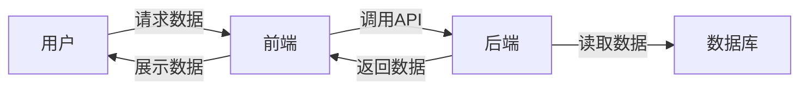

##  房地产信息管理系统详细设计与具体代码实现

**作者：禅与计算机程序设计艺术**

## 1. 背景介绍

### 1.1 房地产行业信息化现状

随着中国经济的快速发展和城市化进程的加快，房地产业作为国民经济的支柱产业之一，其规模不断扩大，市场竞争日益激烈。传统的房地产信息管理模式已经无法满足现代房地产企业对信息化、智能化的需求，主要体现在以下几个方面：

* **信息分散，难以整合:** 房地产信息涉及多个部门和环节，如销售、租赁、物业管理等，信息分散在不同的系统中，难以进行统一管理和分析。
* **效率低下，人工成本高:** 传统的信息管理模式依赖人工操作，效率低下，容易出错，且人工成本高昂。
* **数据分析能力不足:**  传统的信息管理系统缺乏数据分析功能，无法为企业决策提供有效的数据支持。
* **客户服务体验差:**  传统的客户服务模式被动响应，无法满足客户个性化、便捷化的服务需求。

### 1.2 房地产信息管理系统的意义

为了解决上述问题，提高房地产企业的市场竞争力，开发一套功能完善、性能优越的房地产信息管理系统势在必行。房地产信息管理系统可以帮助房地产企业实现以下目标：

* **提高信息管理效率:**  通过系统化、规范化的管理，提高信息处理效率，降低人工成本。
* **提升数据分析能力:**  通过数据挖掘和分析，为企业决策提供数据支持，提高决策的科学性和准确性。
* **增强客户服务体验:**  通过线上线下结合的服务模式，为客户提供更加便捷、高效、个性化的服务。
* **提高企业核心竞争力:**  通过信息化建设，提升企业的管理水平和服务质量，增强企业核心竞争力。

## 2. 核心概念与联系

### 2.1 系统架构

本系统采用前后端分离的架构设计，前端使用Vue.js框架实现，后端使用Spring Boot框架实现，数据库采用MySQL。



### 2.2 功能模块

本系统主要包括以下功能模块：

* **房源管理:**  包括房源信息录入、查询、修改、删除等功能。
* **客户管理:**  包括客户信息录入、查询、修改、删除等功能。
* **合同管理:**  包括合同签订、查询、修改、终止等功能。
* **财务管理:**  包括收款、付款、统计报表等功能。
* **系统管理:**  包括用户管理、角色管理、权限管理等功能。

### 2.3 数据库设计

本系统数据库设计如下：

**房源表 (house)**

| 字段名 | 数据类型 | 备注 |
|---|---|---|
| id | int | 主键 |
| title | varchar(255) | 房源标题 |
| address | varchar(255) | 房源地址 |
| area | decimal(10,2) | 房屋面积 |
| price | decimal(10,2) | 房屋价格 |
| status | int | 房源状态 (0: 未售, 1: 已售) |

**客户表 (customer)**

| 字段名 | 数据类型 | 备注 |
|---|---|---|
| id | int | 主键 |
| name | varchar(255) | 客户姓名 |
| phone | varchar(20) | 客户电话 |
| email | varchar(255) | 客户邮箱 |

**合同表 (contract)**

| 字段名 | 数据类型 | 备注 |
|---|---|---|
| id | int | 主键 |
| house_id | int | 房源ID |
| customer_id | int | 客户ID |
| sign_date | date | 签约日期 |
| amount | decimal(10,2) | 合同金额 |

## 3. 核心算法原理具体操作步骤

### 3.1 房源推荐算法

本系统采用基于内容的推荐算法，根据用户的搜索历史、浏览记录等信息，推荐用户可能感兴趣的房源。

**算法步骤:**

1.  **构建用户画像:**  根据用户的搜索历史、浏览记录等信息，构建用户的兴趣模型。
2.  **计算房源相似度:**  使用余弦相似度等算法，计算不同房源之间的相似度。
3.  **生成推荐列表:**  根据用户画像和房源相似度，生成用户的推荐列表。

### 3.2 价格预测算法

本系统采用线性回归算法，根据历史房源数据，预测未来房价走势。

**算法步骤:**

1.  **数据预处理:**  对历史房源数据进行清洗、转换等操作。
2.  **特征工程:**  提取影响房价的特征，如房屋面积、地理位置等。
3.  **模型训练:**  使用线性回归算法，训练房价预测模型。
4.  **模型评估:**  使用测试集数据，评估模型的预测精度。

## 4. 数学模型和公式详细讲解举例说明

### 4.1 余弦相似度

余弦相似度用于计算两个向量之间的相似度，其取值范围为 $[-1, 1]$，值越大表示相似度越高。

**公式:**

$$
similarity(A, B) = \frac{A \cdot B}{||A|| \times ||B||} = \frac{\sum_{i=1}^{n} A_i \times B_i}{\sqrt{\sum_{i=1}^{n} A_i^2} \times \sqrt{\sum_{i=1}^{n} B_i^2}}
$$

**例子:**

假设有两个房源 A 和 B，其特征向量分别为:

*   A: \[1, 0, 1, 1, 0]
*   B: \[1, 1, 0, 1, 1]

则其余弦相似度为:

$$
similarity(A, B) = \frac{1 \times 1 + 0 \times 1 + 1 \times 0 + 1 \times 1 + 0 \times 1}{\sqrt{1^2 + 0^2 + 1^2 + 1^2 + 0^2} \times \sqrt{1^2 + 1^2 + 0^2 + 1^2 + 1^2}} = 0.6
$$

### 4.2 线性回归

线性回归是一种用于建立自变量和因变量之间线性关系的统计模型。

**公式:**

$$
y = \beta_0 + \beta_1 x_1 + \beta_2 x_2 + ... + \beta_n x_n + \epsilon
$$

其中:

*   $y$ 是因变量
*   $x_1, x_2, ..., x_n$ 是自变量
*   $\beta_0, \beta_1, \beta_2, ..., \beta_n$ 是回归系数
*   $\epsilon$ 是误差项

**例子:**

假设要预测房价，可以使用以下线性回归模型:

$$
price = \beta_0 + \beta_1 \times area + \beta_2 \times location + \epsilon
$$

其中:

*   $price$ 是房价
*   $area$ 是房屋面积
*   $location$ 是地理位置

## 5. 项目实践：代码实例和详细解释说明

### 5.1 后端代码实现

**房源管理接口:**

```java
@RestController
@RequestMapping("/api/house")
public class HouseController {

    @Autowired
    private HouseService houseService;

    @PostMapping
    public House createHouse(@RequestBody House house) {
        return houseService.createHouse(house);
    }

    @GetMapping("/{id}")
    public House getHouseById(@PathVariable Long id) {
        return houseService.getHouseById(id);
    }

    @PutMapping("/{id}")
    public House updateHouse(@PathVariable Long id, @RequestBody House house) {
        return houseService.updateHouse(id, house);
    }

    @DeleteMapping("/{id}")
    public void deleteHouse(@PathVariable Long id) {
        houseService.deleteHouse(id);
    }
}
```

**房源服务层代码:**

```java
@Service
public class HouseServiceImpl implements HouseService {

    @Autowired
    private HouseRepository houseRepository;

    @Override
    public House createHouse(House house) {
        return houseRepository.save(house);
    }

    @Override
    public House getHouseById(Long id) {
        return houseRepository.findById(id).orElseThrow(() -> new ResourceNotFoundException("House not found"));
    }

    @Override
    public House updateHouse(Long id, House house) {
        House existingHouse = houseRepository.findById(id).orElseThrow(() -> new ResourceNotFoundException("House not found"));
        existingHouse.setTitle(house.getTitle());
        existingHouse.setAddress(house.getAddress());
        existingHouse.setArea(house.getArea());
        existingHouse.setPrice(house.getPrice());
        existingHouse.setStatus(house.getStatus());
        return houseRepository.save(existingHouse);
    }

    @Override
    public void deleteHouse(Long id) {
        houseRepository.deleteById(id);
    }
}
```

### 5.2 前端代码实现

**房源列表页面:**

```javascript
<template>
  <div>
    <table>
      <thead>
        <tr>
          <th>标题</th>
          <th>地址</th>
          <th>面积</th>
          <th>价格</th>
          <th>状态</th>
          <th>操作</th>
        </tr>
      </thead>
      <tbody>
        <tr v-for="house in houses" :key="house.id">
          <td>{{ house.title }}</td>
          <td>{{ house.address }}</td>
          <td>{{ house.area }}</td>
          <td>{{ house.price }}</td>
          <td>{{ house.status }}</td>
          <td>
            <button @click="editHouse(house.id)">编辑</button>
            <button @click="deleteHouse(house.id)">删除</button>
          </td>
        </tr>
      </tbody>
    </table>
  </div>
</template>

<script>
export default {
  data() {
    return {
      houses: [],
    };
  },
  mounted() {
    this.fetchHouses();
  },
  methods: {
    async fetchHouses() {
      try {
        const response = await fetch('/api/house');
        this.houses = await response.json();
      } catch (error) {
        console.error(error);
      }
    },
    editHouse(id) {
      // 跳转到编辑页面
    },
    deleteHouse(id) {
      // 删除房源
    },
  },
};
</script>
```

## 6. 实际应用场景

### 6.1 房地产中介公司

房地产中介公司可以使用该系统管理房源信息、客户信息、合同信息等，提高工作效率，提升客户服务体验。

### 6.2 房地产开发商

房地产开发商可以使用该系统管理楼盘信息、销售信息、客户信息等，为客户提供更加便捷的购房服务。

### 6.3 房地产租赁平台

房地产租赁平台可以使用该系统管理房源信息、租客信息、合同信息等，为用户提供更加便捷的租房服务。

## 7. 工具和资源推荐

### 7.1 后端开发工具

*   Spring Boot: https://spring.io/projects/spring-boot
*   MySQL: https://www.mysql.com/
*   IntelliJ IDEA: https://www.jetbrains.com/idea/

### 7.2 前端开发工具

*   Vue.js: https://vuejs.org/
*   Visual Studio Code: https://code.visualstudio.com/

## 8. 总结：未来发展趋势与挑战

### 8.1 未来发展趋势

*   **人工智能化:**  未来房地产信息管理系统将会更加智能化，例如利用人工智能技术进行房源推荐、价格预测等。
*   **移动化:**  随着移动互联网的普及，未来房地产信息管理系统将会更加移动化，方便用户随时随地进行操作。
*   **大数据化:**  未来房地产信息管理系统将会积累海量的房源数据、客户数据等，为企业决策提供更加精准的数据支持。

### 8.2 面临的挑战

*   **数据安全:**  房地产信息管理系统存储着大量的敏感数据，如何保障数据安全是一个重要的挑战。
*   **系统性能:**  随着数据量的不断增大，如何保证系统的性能是一个重要的挑战。
*   **用户体验:**  如何设计更加人性化的用户界面，提升用户体验是一个重要的挑战。

## 9. 附录：常见问题与解答

### 9.1 如何保证系统的数据安全？

*   对用户进行权限控制，不同用户拥有不同的数据访问权限。
*   对敏感数据进行加密存储，防止数据泄露。
*   定期备份数据，防止数据丢失。

### 9.2 如何提高系统的性能？

*   使用缓存技术，减少数据库访问次数。
*   使用消息队列，异步处理耗时操作。
*   对数据库进行优化，提高查询效率。

### 9.3 如何提升用户体验？

*   设计简洁明了的界面，方便用户操作。
*   提供完善的帮助文档，方便用户解决问题。
*   收集用户反馈，不断优化系统功能。
