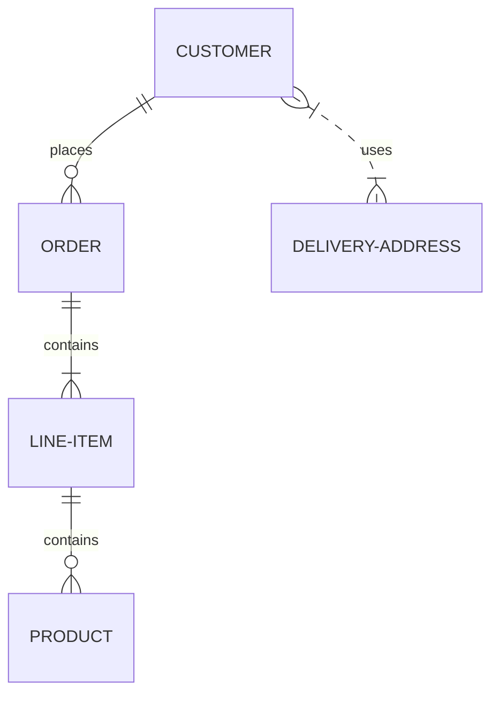

# 房地产销售(售楼)管理系统详细设计与具体代码实现

作者：禅与计算机程序设计艺术

## 1. 背景介绍

### 1.1 房地产行业信息化现状

随着我国经济的快速发展和城镇化进程的不断推进，房地产行业蓬勃发展，市场竞争日益激烈。传统的房地产销售模式已难以满足现代化管理的需求，信息化建设成为必然趋势。

### 1.2 房地产销售管理系统概述

房地产销售管理系统（Real Estate Sales Management System，RESMS）是针对房地产开发企业、代理公司和销售人员开发的一套信息化管理软件，旨在提高销售效率、降低运营成本、提升客户满意度。

### 1.3 系统目标

*   实现销售过程的自动化、规范化、智能化管理；
*   提供全面的数据分析和报表功能，为决策提供支持；
*   提升客户体验，增强客户粘性。

## 2. 核心概念与联系

### 2.1 系统架构

本系统采用B/S架构，分为表示层、业务逻辑层和数据访问层三层：

*   **表示层:** 负责用户界面展示和用户交互，使用HTML、CSS、JavaScript等技术实现；
*   **业务逻辑层:** 负责处理业务逻辑，包括客户管理、房源管理、合同管理、财务管理等模块，使用Java、Spring Boot等技术实现；
*   **数据访问层:** 负责与数据库交互，进行数据的增删改查操作，使用MyBatis等持久层框架实现。

### 2.2 核心实体

*   **客户:**  购房者信息，包括姓名、联系方式、购房需求等；
*   **房源:**  待售房屋信息，包括楼盘、户型、面积、价格等；
*   **合同:**  购房合同信息，包括甲方、乙方、房屋信息、付款方式等；
*   **财务:**  收款、付款、退款等财务信息。

### 2.3 实体关系图



## 3. 核心算法原理具体操作步骤

### 3.1 客户管理模块

#### 3.1.1 客户信息录入

销售人员可以通过系统录入客户信息，包括姓名、联系方式、购房需求等。系统会自动校验客户信息的完整性和有效性。

#### 3.1.2 客户信息查询

销售人员可以通过客户姓名、联系方式、购房需求等条件查询客户信息。

#### 3.1.3 客户跟进记录

销售人员可以记录与客户的沟通情况，包括沟通时间、沟通内容、下次跟进时间等。

### 3.2 房源管理模块

#### 3.2.1 房源信息录入

管理员可以录入房源信息，包括楼盘、户型、面积、价格等。系统会自动校验房源信息的完整性和有效性。

#### 3.2.2 房源信息查询

销售人员可以通过楼盘、户型、面积、价格等条件查询房源信息。

#### 3.2.3 房源状态管理

管理员可以修改房源状态，例如：待售、已售、锁定等。

### 3.3 合同管理模块

#### 3.3.1 合同生成

销售人员可以选择客户和房源，生成购房合同。系统会自动填充合同信息，并提供打印功能。

#### 3.3.2 合同审批

管理员可以对合同进行审批，审批通过后合同生效。

#### 3.3.3 合同查询

销售人员可以通过客户姓名、合同编号等条件查询合同信息。

### 3.4 财务管理模块

#### 3.4.1 收款管理

销售人员可以录入客户的收款信息，例如：收款金额、收款时间、收款方式等。

#### 3.4.2 付款管理

财务人员可以录入供应商的付款信息，例如：付款金额、付款时间、付款方式等。

#### 3.4.3 财务报表

系统提供各种财务报表，例如：销售报表、收款报表、付款报表等。

## 4. 数学模型和公式详细讲解举例说明

本系统中未使用复杂的数学模型和公式。

## 5. 项目实践：代码实例和详细解释说明

### 5.1 技术选型

*   后端：Spring Boot
*   数据库：MySQL
*   前端：Vue.js

### 5.2 代码实例

```java
// 客户实体类
@Entity
@Table(name = "customer")
public class Customer {

    @Id
    @GeneratedValue(strategy = GenerationType.IDENTITY)
    private Long id;

    @Column(nullable = false)
    private String name;

    @Column
    private String phone;

    // ...
}

// 客户服务接口
public interface CustomerService {

    List<Customer> findAll();

    Customer findById(Long id);

    Customer save(Customer customer);

    void deleteById(Long id);
}

// 客户服务实现类
@Service
public class CustomerServiceImpl implements CustomerService {

    @Autowired
    private CustomerRepository customerRepository;

    @Override
    public List<Customer> findAll() {
        return customerRepository.findAll();
    }

    // ...
}
```

### 5.3 代码解释

*   使用Spring Boot框架简化开发流程；
*   使用JPA持久层框架简化数据库操作；
*   使用面向接口编程，提高代码的可读性和可维护性。

## 6. 实际应用场景

### 6.1 房地产开发企业

*   提高销售效率，降低销售成本；
*   实时掌握销售动态，为决策提供支持；
*   提升客户服务质量，增强客户粘性。

### 6.2 房地产代理公司

*   规范销售流程，提高工作效率；
*   加强房源管理，避免资源浪费；
*   提供更优质的客户服务，提升企业形象。

## 7. 工具和资源推荐

### 7.1 开发工具

*   IntelliJ IDEA
*   Eclipse

### 7.2 数据库工具

*   Navicat Premium
*   DataGrip

### 7.3 前端框架

*   Vue.js
*   React
*   Angular

## 8. 总结：未来发展趋势与挑战

### 8.1 未来发展趋势

*   移动化应用
*   大数据分析
*   人工智能应用

### 8.2 面临的挑战

*   数据安全问题
*   系统性能优化
*   用户体验提升

## 9. 附录：常见问题与解答

### 9.1 问：系统如何保证数据安全？

答：系统采用多重安全措施，包括：

*   用户权限管理
*   数据加密存储
*   安全审计日志

### 9.2 问：系统如何提高性能？

答：系统采用多种性能优化措施，包括：

*   数据库索引优化
*   缓存机制
*   代码优化