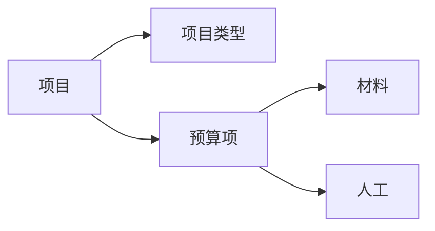

## 房屋装潢公司预算系统详细设计与具体代码实现

作者：禅与计算机程序设计艺术

## 1. 背景介绍

### 1.1 行业痛点

随着人们生活水平的提高，对居住环境的要求也越来越高，房屋装修行业迎来了蓬勃发展。然而，传统的装修预算方式存在诸多弊端：

* **人工计算易出错:**  人工计算容易出现遗漏、重复计算等问题，导致预算不准确。
* **效率低下:**  人工制作预算表耗时耗力，效率低下。
* **缺乏透明度:**  客户难以了解预算的构成细节，容易产生信任问题。

### 1.2 系统目标

为了解决上述问题，开发一套高效、准确、透明的房屋装潢公司预算系统势在必行。该系统应具备以下功能：

* **基础数据管理:**  管理项目类型、材料、人工等基础数据。
* **预算快速生成:**  根据客户需求快速生成详细的预算清单。
* **预算调整灵活:**  支持根据实际情况灵活调整预算项目和价格。
* **数据统计分析:**  提供预算数据统计分析功能，辅助经营决策。

### 1.3 目标用户

本系统主要面向房屋装潢公司、设计师、项目经理等用户群体。

## 2. 核心概念与联系

### 2.1 核心概念

* **项目:** 指的是一个完整的装修工程，例如：客厅装修、卧室装修等。
* **项目类型:** 对项目进行分类，例如：水电改造、墙面装修、地面装修等。
* **材料:** 装修过程中使用的各种材料，例如：瓷砖、地板、油漆等。
* **人工:**  装修过程中需要的人工成本，例如：泥工、木工、油漆工等。
* **预算项:** 预算的基本单位，例如：客厅铺贴地砖、卧室刷乳胶漆等。

### 2.2 概念联系



## 3. 核心算法原理具体操作步骤

### 3.1 预算计算流程

1. **选择项目类型:** 用户选择需要进行预算的项目类型。
2. **输入项目信息:** 用户输入项目的具体信息，例如：面积、数量等。
3. **选择材料和人工:** 用户根据项目需求选择相应的材料和人工。
4. **系统自动计算:** 系统根据预先设定的单价和计算规则自动计算每个预算项的费用。
5. **生成预算清单:** 系统生成详细的预算清单，包括每个预算项的名称、数量、单价、总价等信息。

### 3.2 关键算法

* **面积计算:** 对于涉及面积计算的项目，例如：铺贴地砖、刷乳胶漆等，系统需要根据用户输入的长度、宽度等信息自动计算面积。
* **价格计算:** 系统需要根据用户选择的材料、人工以及预先设定的单价计算每个预算项的总价。
* **汇总统计:** 系统需要对所有预算项的费用进行汇总统计，得出最终的预算总额。

## 4. 数学模型和公式详细讲解举例说明

### 4.1 面积计算公式

* 矩形面积 = 长 × 宽
* 三角形面积 = (底 × 高) ÷ 2
* 圆形面积 = π × 半径²

**举例说明:** 

例如，用户需要计算一个长5米、宽4米的客厅铺贴地砖的面积，则可以使用矩形面积公式计算：

```
客厅面积 = 长 × 宽 = 5米 × 4米 = 20平方米
```

### 4.2 价格计算公式

* 预算项总价 = 数量 × 单价

**举例说明:** 

例如，用户需要铺贴20平方米的地砖，该地砖的单价为100元/平方米，则可以使用价格计算公式计算该预算项的总价：

```
地砖铺贴总价 = 数量 × 单价 = 20平方米 × 100元/平方米 = 2000元
```

## 5. 项目实践：代码实例和详细解释说明

### 5.1 技术选型

* **编程语言:** Python
* **Web框架:** Django
* **数据库:** MySQL
* **前端框架:** Bootstrap

### 5.2 代码示例

```python
# models.py

class ProjectType(models.Model):
    name = models.CharField(max_length=100)

class Material(models.Model):
    name = models.CharField(max_length=100)
    unit_price = models.DecimalField(max_digits=10, decimal_places=2)

class Labor(models.Model):
    name = models.CharField(max_length=100)
    unit_price = models.DecimalField(max_digits=10, decimal_places=2)

class Project(models.Model):
    name = models.CharField(max_length=100)
    project_type = models.ForeignKey(ProjectType, on_delete=models.CASCADE)

class BudgetItem(models.Model):
    project = models.ForeignKey(Project, on_delete=models.CASCADE)
    name = models.CharField(max_length=100)
    quantity = models.DecimalField(max_digits=10, decimal_places=2)
    unit = models.CharField(max_length=10)
    material = models.ForeignKey(Material, on_delete=models.SET_NULL, null=True, blank=True)
    labor = models.ForeignKey(Labor, on_delete=models.SET_NULL, null=True, blank=True)

    @property
    def total_price(self):
        if self.material:
            return self.quantity * self.material.unit_price
        elif self.labor:
            return self.quantity * self.labor.unit_price
        else:
            return 0
```

### 5.3 代码解释

* `models.py` 文件定义了系统的数据模型，包括项目类型、材料、人工、项目、预算项等。
* 每个模型都包含了一些字段，例如：名称、单价、数量等。
* `BudgetItem` 模型中定义了一个 `total_price` 属性，用于计算每个预算项的总价。

## 6. 实际应用场景

### 6.1 房屋装潢公司

房屋装潢公司可以使用该系统快速生成详细的预算清单，提高预算的准确性和效率，并方便与客户进行沟通。

### 6.2 设计师

设计师可以使用该系统为客户提供更精准的预算方案，并根据客户需求灵活调整预算。

### 6.3 项目经理

项目经理可以使用该系统跟踪项目的预算执行情况，及时发现和解决预算超支等问题。

## 7. 工具和资源推荐

### 7.1 开发工具

* **PyCharm:** Python集成开发环境。
* **Navicat:** 数据库管理工具。

### 7.2 学习资源

* **Django官方文档:** https://www.djangoproject.com/
* **Python官方文档:** https://www.python.org/

## 8. 总结：未来发展趋势与挑战

### 8.1 未来发展趋势

* **智能化:** 利用人工智能技术，实现预算的自动生成、智能调整等功能。
* **可视化:**  提供更直观的可视化预算报表，方便用户查看和分析数据。
* **移动化:** 开发移动端预算系统，方便用户随时随地进行预算管理。

### 8.2 面临挑战

* **数据安全:**  如何保障预算数据的安全性和隐私性。
* **系统性能:**  如何提高系统的性能，应对大数据量的处理需求。
* **用户体验:**  如何设计更人性化的用户界面，提升用户体验。

## 9. 附录：常见问题与解答

### 9.1 如何添加新的材料或人工？

管理员可以在系统后台添加新的材料或人工信息，包括名称、单价等。

### 9.2 如何修改预算项的价格？

用户可以编辑预算项，修改其数量、单价等信息，系统会自动重新计算总价。

### 9.3 如何删除预算项？

用户可以删除预算项，系统会自动更新预算总额。
