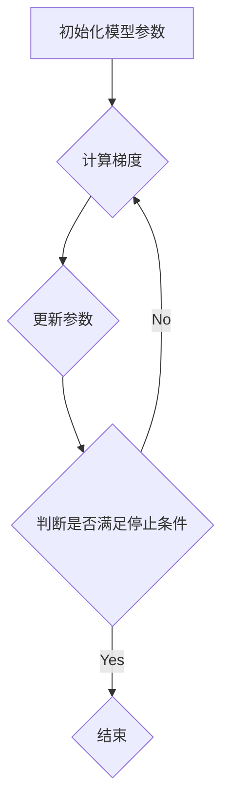

# 批量梯度下降法(BGD)原理与代码实战案例讲解

作者：禅与计算机程序设计艺术

## 1. 背景介绍

### 1.1 机器学习与优化算法

机器学习是人工智能的一个重要分支，其核心目标是从数据中学习规律，并利用这些规律进行预测或决策。在机器学习中，优化算法扮演着至关重要的角色，它们负责找到模型的最优参数，使得模型在训练数据上能够达到最佳性能。

### 1.2 梯度下降法的引入

梯度下降法是一类经典的优化算法，其基本思想是沿着目标函数梯度的反方向不断调整模型参数，直到找到函数的最小值。梯度下降法因其简单、高效的特点，被广泛应用于各种机器学习模型的训练过程中。

### 1.3 批量梯度下降法(BGD)

批量梯度下降法（Batch Gradient Descent，BGD）是梯度下降法的一种具体实现方式，其特点是在每次迭代中使用全部训练数据来计算目标函数的梯度。

## 2. 核心概念与联系

### 2.1 梯度

梯度是一个向量，表示函数在某一点的变化率最大的方向。对于多元函数，梯度是由各个偏导数组成的向量。

### 2.2 学习率

学习率是一个超参数，控制着每次迭代中参数更新的步长。学习率过大会导致参数在最优值附近震荡，学习率过小会导致收敛速度过慢。

### 2.3 代价函数

代价函数是用来衡量模型预测值与真实值之间差距的函数。梯度下降法的目标就是找到代价函数的最小值。

### 2.4 迭代

迭代是指循环执行梯度下降算法的步骤，直到满足停止条件。每次迭代都会更新模型参数，使得代价函数逐渐减小。

### 2.5 收敛

收敛是指梯度下降算法找到代价函数最小值的过程。当代价函数不再明显下降时，可以认为算法已经收敛。

## 3. 核心算法原理具体操作步骤

### 3.1 初始化模型参数

首先，需要随机初始化模型参数。

### 3.2 计算梯度

对于每个参数，计算其在所有训练数据上的平均梯度。

### 3.3 更新参数

使用计算得到的梯度和学习率更新模型参数。

### 3.4 重复步骤2和3

重复计算梯度和更新参数的步骤，直到满足停止条件。

## 4. 数学模型和公式详细讲解举例说明

### 4.1 线性回归模型

线性回归模型是一种简单的机器学习模型，其目标是找到一条直线来拟合数据。线性回归模型的代价函数是均方误差（Mean Squared Error，MSE）。

$$
MSE = \frac{1}{n}\sum_{i=1}^{n}(y_i - \hat{y_i})^2
$$

其中，$n$ 是训练数据的数量，$y_i$ 是第 $i$ 个样本的真实值，$\hat{y_i}$ 是模型对第 $i$ 个样本的预测值。

### 4.2 批量梯度下降法公式

批量梯度下降法的参数更新公式如下：

$$
\theta_j = \theta_j - \alpha \frac{1}{n}\sum_{i=1}^{n}(h_\theta(x_i) - y_i)x_{ij}
$$

其中，$\theta_j$ 是模型的第 $j$ 个参数，$\alpha$ 是学习率，$h_\theta(x_i)$ 是模型对第 $i$ 个样本的预测值，$x_{ij}$ 是第 $i$ 个样本的第 $j$ 个特征。

### 4.3 举例说明

假设有一个线性回归模型，其参数为 $\theta_0$ 和 $\theta_1$，训练数据如下：

| $x$ | $y$ |
|---|---|
| 1 | 2 |
| 2 | 4 |
| 3 | 6 |

学习率设置为 0.1。

**初始化参数：**

$\theta_0 = 0$

$\theta_1 = 0$

**第一次迭代：**

* 计算梯度：

```
d\theta_0 = (1/3) * ((0 + 0 * 1 - 2) + (0 + 0 * 2 - 4) + (0 + 0 * 3 - 6)) = -4
d\theta_1 = (1/3) * ((0 + 0 * 1 - 2) * 1 + (0 + 0 * 2 - 4) * 2 + (0 + 0 * 3 - 6) * 3) = -14
```

* 更新参数：

```
\theta_0 = 0 - 0.1 * (-4) = 0.4
\theta_1 = 0 - 0.1 * (-14) = 1.4
```

**第二次迭代：**

* 计算梯度：

```
d\theta_0 = (1/3) * ((0.4 + 1.4 * 1 - 2) + (0.4 + 1.4 * 2 - 4) + (0.4 + 1.4 * 3 - 6)) = -0.8
d\theta_1 = (1/3) * ((0.4 + 1.4 * 1 - 2) * 1 + (0.4 + 1.4 * 2 - 4) * 2 + (0.4 + 1.4 * 3 - 6) * 3) = -2.8
```

* 更新参数：

```
\theta_0 = 0.4 - 0.1 * (-0.8) = 0.48
\theta_1 = 1.4 - 0.1 * (-2.8) = 1.68
```

重复以上步骤，直到代价函数不再明显下降。

## 5. 项目实践：代码实例和详细解释说明

### 5.1 Python 代码实现

```python
import numpy as np

def batch_gradient_descent(X, y, learning_rate, epochs):
    """
    批量梯度下降法

    Args:
        X: 训练数据特征
        y: 训练数据标签
        learning_rate: 学习率
        epochs: 迭代次数

    Returns:
        theta: 模型参数
    """

    # 初始化参数
    theta = np.zeros(X.shape[1])

    # 迭代训练
    for epoch in range(epochs):
        # 计算梯度
        gradient = (1 / len(y)) * X.T @ (X @ theta - y)

        # 更新参数
        theta = theta - learning_rate * gradient

        # 打印代价函数值
        cost = (1 / (2 * len(y))) * np.sum(np.square(X @ theta - y))
        print(f"Epoch {epoch+1}: Cost = {cost}")

    return theta
```

### 5.2 代码解释

* `X` 是训练数据特征，`y` 是训练数据标签，`learning_rate` 是学习率，`epochs` 是迭代次数。
* `theta` 是模型参数，初始化为 0。
* `gradient` 是梯度，使用矩阵运算计算得到。
* `theta` 使用梯度和学习率更新。
* `cost` 是代价函数值，使用均方误差公式计算得到。

### 5.3 使用示例

```python
# 生成训练数据
X = np.array([[1, 1], [2, 2], [3, 3]])
y = np.array([2, 4, 6])

# 设置学习率和迭代次数
learning_rate = 0.1
epochs = 10

# 训练模型
theta = batch_gradient_descent(X, y, learning_rate, epochs)

# 打印模型参数
print(f"Model parameters: {theta}")
```

## 6. 实际应用场景

批量梯度下降法广泛应用于各种机器学习任务中，例如：

* 线性回归
* 逻辑回归
* 支持向量机
* 神经网络

## 7. 工具和资源推荐

* **Scikit-learn:** Python 机器学习库，提供了各种梯度下降算法的实现。
* **TensorFlow:** Google 开源的深度学习框架，支持批量梯度下降法等优化算法。
* **PyTorch:** Facebook 开源的深度学习框架，也支持批量梯度下降法等优化算法。

## 8. 总结：未来发展趋势与挑战

### 8.1 发展趋势

* **随机梯度下降法 (SGD):** 随机梯度下降法是批量梯度下降法的一种变体，其每次迭代只使用一个样本计算梯度，能够更快地收敛。
* **小批量梯度下降法 (MBGD):** 小批量梯度下降法是批量梯度下降法和随机梯度下降法的折中方案，其每次迭代使用一小批样本计算梯度。
* **自适应学习率优化算法:**  例如 Adam、RMSprop 等算法，能够自动调整学习率，提高收敛速度和稳定性。

### 8.2 挑战

* **局部最优解:** 梯度下降法可能会陷入局部最优解，无法找到全局最优解。
* **鞍点:** 梯度下降法在鞍点附近会变得非常缓慢。
* **超参数选择:** 学习率、迭代次数等超参数的选择对算法性能有很大影响。

## 9. 附录：常见问题与解答

### 9.1 为什么批量梯度下降法容易陷入局部最优解？

批量梯度下降法每次迭代都使用全部训练数据计算梯度，因此容易陷入代价函数的局部最优解。

### 9.2 如何选择合适的学习率？

学习率的选择需要根据具体问题进行调整。一般来说，可以先尝试一个较小的学习率，然后逐渐增加学习率，直到找到一个合适的学习率。

### 9.3 如何判断梯度下降算法是否收敛？

可以通过观察代价函数值的变化来判断梯度下降算法是否收敛。当代价函数值不再明显下降时，可以认为算法已经收敛。


## 10. Mermaid 流程图


