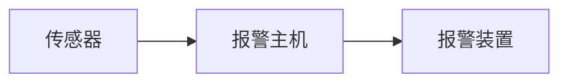
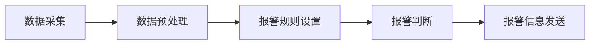

## 报警系统详细设计与具体代码实现

作者：禅与计算机程序设计艺术

## 1. 背景介绍

### 1.1. 报警系统概述

报警系统作为安全防范系统的重要组成部分，在现代社会中扮演着至关重要的角色。从家庭安全到企业安防，从城市交通到工业生产，报警系统的身影无处不在。其主要功能是在监测到异常情况时，及时发出警报信号，通知相关人员采取措施，从而最大程度地减少损失。

### 1.2. 报警系统发展历程

传统的报警系统主要依赖于物理线路连接，功能单一，可靠性较低。随着计算机技术、网络技术和传感器技术的快速发展，现代报警系统逐渐向智能化、网络化、集成化方向发展。

### 1.3. 本文研究目的及意义

本文旨在探讨现代报警系统的详细设计与具体代码实现，介绍报警系统的基本原理、架构设计、功能模块、算法实现以及实际应用场景，并提供代码示例和工具资源推荐，帮助读者深入理解报警系统的工作原理，掌握报警系统的开发方法，为实际应用提供参考。

## 2. 核心概念与联系

### 2.1. 传感器

传感器是报警系统的“眼睛”和“耳朵”，负责感知环境中的各种物理量变化，如温度、湿度、烟雾浓度、红外线强度等，并将这些物理量转换成电信号传输给报警主机。

### 2.2. 报警主机

报警主机是报警系统的“大脑”，负责接收传感器传输的信号，并根据预设的报警规则进行判断，如果判定为异常情况，则触发报警装置发出警报信号。

### 2.3. 报警装置

报警装置是报警系统的“嘴巴”，负责将报警信号以声光、短信、电话等形式通知相关人员。

### 2.4. 核心概念联系图



## 3. 核心算法原理具体操作步骤

### 3.1. 数据采集

报警系统首先需要通过传感器采集环境中的各种物理量数据。数据采集可以通过有线方式或无线方式进行。

### 3.2. 数据预处理

采集到的原始数据往往包含噪声和干扰，需要进行预处理才能用于后续分析。数据预处理包括滤波、去噪、平滑等操作。

### 3.3. 报警规则设置

报警规则定义了哪些情况属于异常情况，需要触发报警。报警规则可以根据实际需求进行设置，例如：

- 当温度超过设定阈值时，触发报警。
- 当烟雾浓度超过设定阈值时，触发报警。
- 当红外传感器检测到移动物体时，触发报警。

### 3.4. 报警判断

报警主机根据预设的报警规则对预处理后的数据进行判断，如果判定为异常情况，则触发报警装置发出警报信号。

### 3.5. 报警信息发送

报警信息可以通过多种方式发送，例如：

- 声光报警：通过警笛、警灯等发出声光信号。
- 短信报警：通过短信将报警信息发送到指定手机号码。
- 电话报警：通过电话将报警信息语音播报给指定联系人。

### 3.6. 核心算法流程图



## 4. 数学模型和公式详细讲解举例说明

### 4.1. 温度传感器数据处理

温度传感器输出的电压信号与温度之间存在线性关系，可以使用线性方程进行转换：

$$
T = aV + b
$$

其中：

- $T$ 表示温度，单位为摄氏度 (°C)。
- $V$ 表示电压信号，单位为伏特 (V)。
- $a$ 和 $b$ 为校准系数。

### 4.2. 烟雾传感器数据处理

烟雾传感器输出的电压信号与烟雾浓度之间存在非线性关系，可以使用如下公式进行转换：

$$
S = k \frac{V}{V_0 - V}
$$

其中：

- $S$ 表示烟雾浓度，单位为 ppm。
- $V$ 表示电压信号，单位为伏特 (V)。
- $V_0$ 为传感器在清洁空气中的输出电压，单位为伏特 (V)。
- $k$ 为灵敏度系数。

### 4.3. 红外传感器数据处理

红外传感器输出的信号表示检测到的红外线强度，可以使用阈值法进行判断：

- 当红外线强度超过设定阈值时，判定为检测到移动物体。

## 5. 项目实践：代码实例和详细解释说明

### 5.1. 基于Arduino的简单报警系统

本示例演示如何使用 Arduino 开发板、温度传感器、蜂鸣器和 LED 灯构建一个简单的温度报警系统。

**硬件清单：**

- Arduino Uno 开发板
- DHT11 温度湿度传感器
- 蜂鸣器
- LED 灯
- 面包板
- 跳线

**电路连接图：**

```
// DHT11 连接
const int DHTPIN = 2; // DHT11 数据引脚连接到数字引脚 2

// 蜂鸣器连接
const int buzzerPin = 8; // 蜂鸣器连接到数字引脚 8

// LED 灯连接
const int ledPin = 13; // LED 灯连接到数字引脚 13

// 温度阈值
const float temperatureThreshold = 30.0;

// DHT11 库
#include <DHT.h>

// DHT11 传感器类型
#define DHTTYPE DHT11

// 创建 DHT11 对象
DHT dht(DHTPIN, DHTTYPE);

void setup() {
  // 初始化串口
  Serial.begin(9600);

  // 初始化 DHT11 传感器
  dht.begin();

  // 初始化蜂鸣器引脚为输出模式
  pinMode(buzzerPin, OUTPUT);

  // 初始化 LED 灯引脚为输出模式
  pinMode(ledPin, OUTPUT);
}

void loop() {
  // 读取温度和湿度
  float h = dht.readHumidity();
  float t = dht.readTemperature();

  // 检查传感器是否读取成功
  if (isnan(h) || isnan(t)) {
    Serial.println("Failed to read from DHT sensor!");
    return;
  }

  // 打印温度值
  Serial.print("Temperature: ");
  Serial.print(t);
  Serial.println(" *C");

  // 如果温度超过阈值，则触发报警
  if (t > temperatureThreshold) {
    // 蜂鸣器响铃
    tone(buzzerPin, 1000);

    // LED 灯闪烁
    digitalWrite(ledPin, HIGH);
    delay(500);
    digitalWrite(ledPin, LOW);
    delay(500);
  } else {
    // 蜂鸣器停止响铃
    noTone(buzzerPin);

    // LED 灯熄灭
    digitalWrite(ledPin, LOW);
  }

  // 延时 2 秒
  delay(2000);
}
```

**代码解释：**

1. 首先，定义了 DHT11 传感器、蜂鸣器和 LED 灯的连接引脚，以及温度阈值。
2. 然后，在 `setup()` 函数中，初始化了串口、DHT11 传感器、蜂鸣器引脚和 LED 灯引脚。
3. 在 `loop()` 函数中，首先读取 DHT11 传感器的温度和湿度值。
4. 然后，检查传感器是否读取成功。如果读取失败，则打印错误信息并退出循环。
5. 如果读取成功，则打印温度值。
6. 接下来，判断温度是否超过阈值。如果超过阈值，则触发蜂鸣器响铃和 LED 灯闪烁。否则，停止蜂鸣器响铃并熄灭 LED 灯。
7. 最后，延时 2 秒钟，然后再次循环执行上述操作。

### 5.2. 基于Raspberry Pi的网络报警系统

本示例演示如何使用 Raspberry Pi、摄像头模块、PIR 运动传感器和 Telegram Bot 构建一个简单的网络报警系统。

**硬件清单：**

- Raspberry Pi 4 Model B
- Raspberry Pi 摄像头模块 V2
- PIR 运动传感器
- 面包板
- 跳线

**软件清单：**

- Raspberry Pi OS
- Python 3
- Telegram Bot API

**电路连接图：**

```
// PIR 传感器连接
const int pirPin = 4; // PIR 传感器连接到 GPIO 4

// Telegram Bot Token
const char* botToken = "YOUR_TELEGRAM_BOT_TOKEN";

// Telegram Chat ID
const char* chatId = "YOUR_TELEGRAM_CHAT_ID";

// 初始化 Telegram Bot
bot = telepot.Bot(botToken)

// 初始化 PIR 传感器引脚为输入模式
GPIO.setup(pirPin, GPIO.IN)

while True:
  # 检测 PIR 传感器状态
  if GPIO.input(pirPin) == GPIO.HIGH:
    # 拍摄照片
    camera.capture('/home/pi/image.jpg')

    # 发送报警信息到 Telegram
    bot.sendMessage(chatId, "Motion detected!")
    bot.sendPhoto(chatId, photo=open('/home/pi/image.jpg', 'rb'))

  # 延时 1 秒
  time.sleep(1)
```

**代码解释：**

1. 首先，定义了 PIR 传感器的连接引脚、Telegram Bot Token 和 Chat ID。
2. 然后，使用 `telepot` 库初始化 Telegram Bot。
3. 接下来，初始化 PIR 传感器引脚为输入模式。
4. 在主循环中，首先检测 PIR 传感器的状态。如果 PIR 传感器检测到运动，则执行以下操作：
    - 使用摄像头模块拍摄照片。
    - 使用 Telegram Bot 发送报警信息和照片到指定聊天窗口。
5. 最后，延时 1 秒钟，然后再次循环执行上述操作。

## 6. 实际应用场景

报警系统应用广泛，以下列举一些常见的应用场景：

### 6.1. 家庭安防

- 防盗报警：当有人非法入侵住宅时，触发报警系统，通知业主和保安人员。
- 火灾报警：当发生火灾时，烟雾传感器或温度传感器触发报警系统，及时通知消防部门。
- 燃气泄漏报警：当发生燃气泄漏时，燃气传感器触发报警系统，及时关闭燃气阀门并通知相关人员。

### 6.2. 企业安防

- 周界报警：在企业周界安装红外传感器、振动传感器等，当有人非法入侵时，触发报警系统。
- 视频监控联动报警：将视频监控系统与报警系统联动，当视频分析系统检测到异常情况时，触发报警系统。
- 门禁系统联动报警：将门禁系统与报警系统联动，当有人非法闯入时，触发报警系统。

### 6.3. 城市交通

- 交通违章抓拍：在道路上安装摄像头和传感器，对违反交通规则的车辆进行抓拍和报警。
- 交通事故自动报警：当发生交通事故时，车辆上的传感器自动触发报警系统，通知交警和救护车。

### 6.4. 工业生产

- 设备故障报警：在生产设备上安装传感器，当设备出现故障时，触发报警系统，通知维修人员。
- 环境监测报警：在生产车间安装传感器，对温度、湿度、有害气体浓度等进行监测，当超过设定阈值时，触发报警系统。

## 7. 工具和资源推荐

### 7.1. 硬件平台

- Arduino：开源电子原型平台，适合 DIY 爱好者和初学者。
- Raspberry Pi：低成本、高性能的单板计算机，适合构建各种物联网应用。

### 7.2. 软件工具

- Arduino IDE：Arduino 官方开发环境。
- Thonny Python IDE：适合 Raspberry Pi 的 Python 开发环境。
- Fritzing：电子电路设计软件，可以用于绘制电路连接图。

### 7.3. 传感器模块

- DHT11 温度湿度传感器
- HC-SR501 PIR 运动传感器
- MQ-2 烟雾传感器

### 7.4. 学习资源

- Arduino 官方网站：https://www.arduino.cc/
- Raspberry Pi 官方网站：https://www.raspberrypi.org/
- Adafruit 学习系统：https://learn.adafruit.com/

## 8. 总结：未来发展趋势与挑战

### 8.1. 未来发展趋势

- 智能化：随着人工智能技术的不断发展，未来的报警系统将更加智能化，能够自动识别各种异常情况，并采取相应的措施。
- 网络化：未来的报警系统将更加依赖于网络，可以通过互联网、移动互联网等方式实现远程监控和管理。
- 集成化：未来的报警系统将与其他安防系统更加紧密地集成，例如视频监控系统、门禁系统等，形成更加完善的安防体系。

### 8.2. 面临的挑战

- 数据安全：随着报警系统联网程度的提高，数据安全问题日益突出。
- 系统可靠性：报警系统必须具备高可靠性，才能在关键时刻发挥作用。
- 成本控制：智能化、网络化、集成化的报警系统成本较高，需要不断探索降低成本的途径。

## 9. 附录：常见问题与解答

### 9.1. 如何选择合适的报警系统？

选择报警系统需要考虑以下因素：

- 应用场景：不同的应用场景对报警系统的功能要求不同。
- 预算：报警系统的价格差异较大，需要根据预算选择合适的系统。
- 安装和维护：报警系统的安装和维护也需要考虑成本。

### 9.2. 如何提高报警系统的可靠性？

提高报警系统可靠性的措施包括：

- 选择高质量的硬件设备。
- 定期维护保养。
- 做好防雷防静电措施。

### 9.3. 如何保障报警系统的数据安全？

保障报警系统数据安全的措施包括：

- 使用强密码保护系统。
- 定期更新系统软件。
- 对敏感数据进行加密存储和传输。
