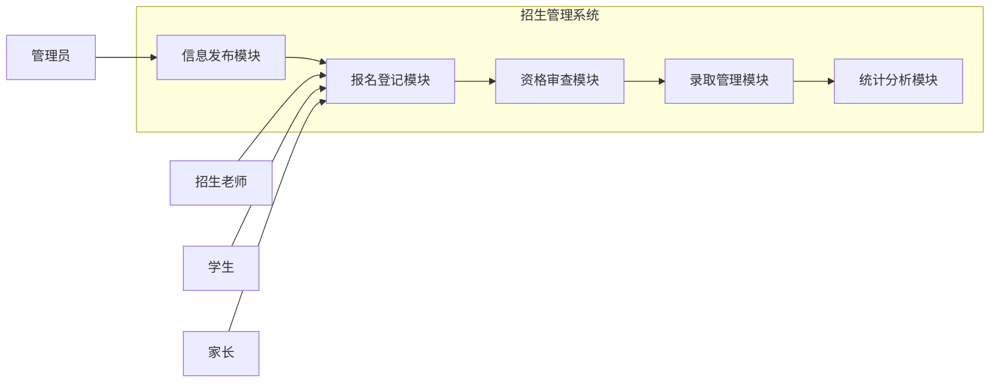

## 1. 背景介绍

### 1.1 教育信息化的浪潮

随着信息技术的飞速发展，教育领域也迎来了信息化的浪潮。传统的招生模式效率低下、信息不透明，已经难以满足现代教育的需求。招生管理系统的出现，为学校提供了一种高效、便捷、规范的招生管理方式，大大提升了招生工作效率和信息化水平。

### 1.2 招生管理系统的价值

招生管理系统能够有效解决传统招生模式中存在的诸多问题，例如：

* **信息不透明:**  传统招生模式下，学生和家长难以获取全面、准确的招生信息。
* **效率低下:**  人工操作繁琐，容易出错，效率低下。
* **缺乏规范性:**  招生流程缺乏统一规范，容易出现漏洞和不公正现象。

招生管理系统通过信息化手段，实现了招生信息发布、报名登记、资格审查、录取结果公布等全流程管理，提高了招生工作的效率和公平性。

## 2. 核心概念与联系

### 2.1 系统用户角色

招生管理系统涉及多个用户角色，包括：

* **管理员:**  负责系统的日常维护和管理，包括用户管理、权限设置、数据备份等。
* **招生老师:**  负责发布招生信息、审核学生报名资格、录取学生等。
* **学生:**  在线填写报名信息、查询录取结果等。
* **家长:**  可以查看学生的报名信息和录取结果。

### 2.2 核心功能模块

招生管理系统通常包括以下核心功能模块：

* **信息发布模块:**  用于发布招生简章、招生计划、招生政策等信息。
* **报名登记模块:**  学生在线填写报名信息，并上传相关证明材料。
* **资格审查模块:**  招生老师对学生的报名资格进行审核。
* **录取管理模块:**  招生老师根据招生计划和学生成绩进行录取，并公布录取结果。
* **统计分析模块:**  对招生数据进行统计分析，生成报表，为招生决策提供参考。

### 2.3  系统架构图



## 3. 核心算法原理具体操作步骤

### 3.1 资格审查算法

资格审查算法用于判断学生是否符合报名条件。算法的具体操作步骤如下:

1. 获取学生提交的报名信息，包括姓名、性别、出生日期、毕业学校、成绩等。
2. 根据招生简章中规定的报名条件，对学生的各项信息进行校验。
3. 如果学生所有信息都符合报名条件，则通过资格审查；否则，拒绝学生的报名申请。

### 3.2 录取算法

录取算法用于根据招生计划和学生成绩确定录取名单。算法的具体操作步骤如下:

1. 获取所有通过资格审查的学生名单。
2. 根据学生的入学考试成绩进行排序。
3. 根据招生计划，从高分到低分依次录取学生，直到录取满为止。

## 4. 数学模型和公式详细讲解举例说明

### 4.1 录取率计算

录取率是指录取人数占报名人数的比例。计算公式如下：

$$录取率 = \frac{录取人数}{报名人数} \times 100\%$$

例如，某学校招生计划招收100人，报名人数为200人，最终录取了80人，则录取率为：

$$录取率 = \frac{80}{200} \times 100\% = 40\%$$

### 4.2 平均成绩计算

平均成绩是指所有录取学生的平均入学考试成绩。计算公式如下：

$$平均成绩 = \frac{所有录取学生的入学考试成绩总和}{录取人数}$$

例如，某学校录取了100名学生，他们的入学考试成绩总和为8000分，则平均成绩为：

$$平均成绩 = \frac{8000}{100} = 80分$$

## 5. 项目实践：代码实例和详细解释说明

### 5.1 技术选型

本项目采用以下技术栈：

* **后端:** Spring Boot
* **数据库:** MySQL
* **前端:** Vue.js

### 5.2 代码实例

#### 5.2.1 学生报名接口

```java
@RestController
@RequestMapping("/api/student")
public class StudentController {

    @Autowired
    private StudentService studentService;

    @PostMapping("/enroll")
    public Result enroll(@RequestBody Student student) {
        // 校验学生信息
        // ...

        // 保存学生报名信息
        studentService.save(student);

        return Result.success();
    }
}
```

#### 5.2.2 资格审查接口

```java
@RestController
@RequestMapping("/api/admin")
public class AdminController {

    @Autowired
    private StudentService studentService;

    @PostMapping("/review")
    public Result review(@RequestBody List<Long> studentIds) {
        // 遍历学生ID列表
        for (Long studentId : studentIds) {
            // 获取学生信息
            Student student = studentService.getById(studentId);

            // 校验学生资格
            // ...

            // 更新学生状态
            student.setStatus(StudentStatus.REVIEWED);
            studentService.updateById(student);
        }

        return Result.success();
    }
}
```

## 6. 实际应用场景

### 6.1 高校招生

招生管理系统可以应用于高校招生，帮助高校高效、规范地完成招生工作。

### 6.2 中小学招生

招生管理系统也可以应用于中小学招生，方便学校管理学生报名信息和录取结果。

### 6.3 培训机构招生

招生管理系统还可以应用于培训机构招生，帮助培训机构提升招生效率和服务质量。

## 7. 总结：未来发展趋势与挑战

### 7.1 未来发展趋势

* **智能化:**  利用人工智能技术，实现智能资格审查、智能录取等功能。
* **个性化:**  根据学生的个性化需求，提供定制化的招生服务。
* **数据驱动:**  利用大数据技术，分析招生数据，为招生决策提供科学依据。

### 7.2 面临的挑战

* **数据安全:**  招生管理系统涉及大量的学生个人信息，如何保障数据安全是一个重要挑战。
* **系统性能:**  随着报名人数的增加，系统性能面临考验。
* **用户体验:**  如何提升用户体验，简化操作流程，也是一个需要解决的问题。

## 8. 附录：常见问题与解答

### 8.1 如何修改密码？

登录系统后，点击右上角的用户名，选择“修改密码”，即可修改密码。

### 8.2 如何找回密码？

在登录页面，点击“忘记密码”，输入注册邮箱，系统会发送一封邮件到您的邮箱，点击邮件中的链接即可重置密码.

### 8.3 如何联系客服？

如果您在使用过程中遇到任何问题，可以通过以下方式联系客服：

* 电话：xxx-xxxxxxxx
* 邮箱：xxx@xxx.com
