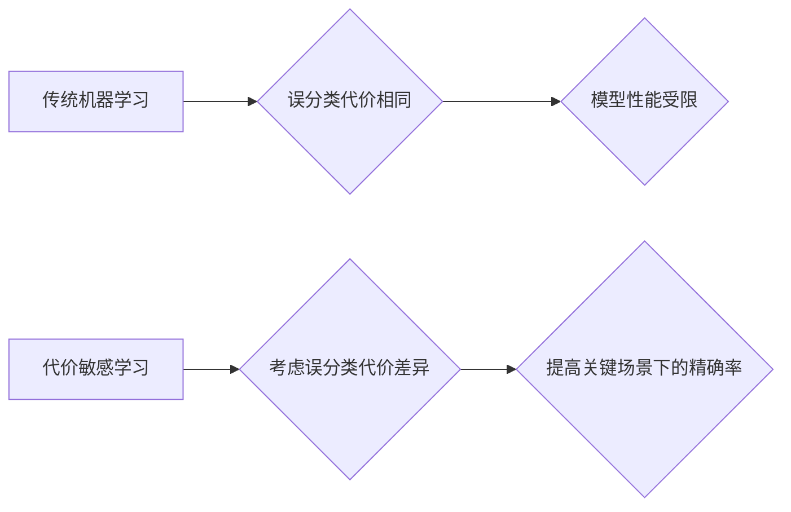

## 提高精确率的秘密武器:代价敏感学习实战指南

作者：禅与计算机程序设计艺术

## 1. 背景介绍

### 1.1 机器学习的局限性

传统的机器学习模型通常假设所有样本的误分类代价相同。然而，在许多实际应用场景中，不同类型错误的代价可能差异巨大。例如，在医疗诊断中，将病人误诊为健康比将健康人误诊为病人带来的后果要严重得多。同样，在垃圾邮件过滤中，将重要邮件误判为垃圾邮件的代价远高于将垃圾邮件误判为重要邮件。

### 1.2 代价敏感学习的优势

代价敏感学习 (Cost-Sensitive Learning) 是一种能够明确地将误分类代价纳入模型训练过程的机器学习范式。通过考虑不同类型错误的代价差异，代价敏感学习能够有效地提高模型在关键场景下的精确率，从而提升模型的整体性能和实用价值。

## 2. 核心概念与联系

### 2.1 代价矩阵

代价矩阵 (Cost Matrix) 是代价敏感学习的核心概念之一。它是一个 N x N 的矩阵，其中 N 代表类别数量。矩阵的每个元素 C(i, j) 表示将真实类别为 i 的样本预测为类别 j 的代价。

#### 2.1.1 代价矩阵示例

以二分类问题为例，我们可以定义如下代价矩阵：

| 真实类别 \ 预测类别 | 正例 | 负例 |
|---|---|---|
| 正例 | 0 | 10 |
| 负例 | 1 | 0 |

在这个代价矩阵中，将正例误判为负例的代价为 10，而将负例误判为正例的代价仅为 1。

### 2.2 代价敏感学习方法

代价敏感学习方法可以分为三大类：

#### 2.2.1 直接方法

直接方法直接修改现有的机器学习算法，使其能够直接优化代价敏感的损失函数。例如，我们可以修改支持向量机 (SVM) 的目标函数，使其最小化总的误分类代价，而不是误分类样本数量。

#### 2.2.2 采样方法

采样方法通过调整训练集的样本分布来间接地引入代价敏感性。例如，我们可以对代价较高的样本进行过采样，或者对代价较低的样本进行欠采样。

#### 2.2.3 元学习方法

元学习方法 (Meta-Learning) 利用多个模型的集成来实现代价敏感学习。例如，我们可以训练多个模型，每个模型针对不同的代价矩阵进行优化，然后将这些模型的预测结果进行集成。

## 3. 核心算法原理具体操作步骤

### 3.1 代价敏感支持向量机 (CS-SVM)

CS-SVM 是一种直接方法，它通过修改 SVM 的目标函数来实现代价敏感学习。

#### 3.1.1 传统的 SVM 目标函数

传统的 SVM 目标函数如下：

$$
\min_{\mathbf{w}, b} \frac{1}{2} ||\mathbf{w}||^2 + C \sum_{i=1}^n \max(0, 1 - y_i(\mathbf{w}^T \mathbf{x}_i + b))
$$

其中，$\mathbf{w}$ 是权重向量，$b$ 是偏置项，$C$ 是正则化参数，$y_i$ 是样本 $i$ 的真实标签，$\mathbf{x}_i$ 是样本 $i$ 的特征向量。

#### 3.1.2 CS-SVM 的目标函数

CS-SVM 的目标函数如下：

$$
\min_{\mathbf{w}, b} \frac{1}{2} ||\mathbf{w}||^2 + C \sum_{i=1}^n C(y_i, \hat{y}_i) \max(0, 1 - y_i(\mathbf{w}^T \mathbf{x}_i + b))
$$

其中，$C(y_i, \hat{y}_i)$ 是将真实类别为 $y_i$ 的样本预测为 $\hat{y}_i$ 的代价。

#### 3.1.3 CS-SVM 的训练步骤

CS-SVM 的训练步骤与传统 SVM 类似，只是需要将代价矩阵作为输入参数。

### 3.2 代价敏感决策树 (CS-DT)

CS-DT 是一种直接方法，它通过修改决策树的节点分裂准则来实现代价敏感学习。

#### 3.2.1 传统的决策树分裂准则

传统的决策树分裂准则通常基于信息增益或基尼系数。

#### 3.2.2 CS-DT 的分裂准则

CS-DT 的分裂准则将误分类代价纳入考虑范围。例如，我们可以使用代价敏感信息增益作为分裂准则。

#### 3.2.3 CS-DT 的训练步骤

CS-DT 的训练步骤与传统决策树类似，只是需要将代价矩阵作为输入参数。

## 4. 数学模型和公式详细讲解举例说明

### 4.1 代价敏感信息增益

代价敏感信息增益 (Cost-Sensitive Information Gain) 是一种用于 CS-DT 的分裂准则。

#### 4.1.1 信息增益

信息增益 (Information Gain) 用于衡量一个特征对数据集的分类能力。

$$
IG(S, A) = H(S) - \sum_{v \in Values(A)} \frac{|S_v|}{|S|} H(S_v)
$$

其中，$S$ 是数据集，$A$ 是特征，$Values(A)$ 是特征 $A$ 的所有可能取值，$S_v$ 是特征 $A$ 取值为 $v$ 的子集，$H(S)$ 是数据集 $S$ 的熵。

#### 4.1.2 代价敏感信息增益

代价敏感信息增益将误分类代价纳入考虑范围。

$$
CSIG(S, A) = IG(S, A) - \sum_{v \in Values(A)} \frac{|S_v|}{|S|} \sum_{i=1}^N \sum_{j=1}^N C(i, j) p(i|S_v) p(j|S_v)
$$

其中，$C(i, j)$ 是将真实类别为 $i$ 的样本预测为 $j$ 的代价，$p(i|S_v)$ 是在子集 $S_v$ 中真实类别为 $i$ 的样本的比例。

### 4.2 代价敏感基尼系数

代价敏感基尼系数 (Cost-Sensitive Gini Index) 是一种用于 CS-DT 的分裂准则。

#### 4.2.1 基尼系数

基尼系数 (Gini Index) 用于衡量数据集的纯度。

$$
Gini(S) = 1 - \sum_{i=1}^N p(i)^2
$$

其中，$p(i)$ 是数据集 $S$ 中真实类别为 $i$ 的样本的比例。

#### 4.2.2 代价敏感基尼系数

代价敏感基尼系数将误分类代价纳入考虑范围。

$$
CSGini(S) = Gini(S) + \sum_{i=1}^N \sum_{j=1}^N C(i, j) p(i) p(j)
$$

其中，$C(i, j)$ 是将真实类别为 $i$ 的样本预测为 $j$ 的代价。

## 5. 项目实践：代码实例和详细解释说明

### 5.1 Python 代码实例

```python
import numpy as np
from sklearn.svm import SVC
from sklearn.tree import DecisionTreeClassifier

# 定义代价矩阵
cost_matrix = np.array([[0, 10], [1, 0]])

# 训练 CS-SVM
cs_svm = SVC(kernel='linear', C=1, class_weight='balanced', cost_matrix=cost_matrix)
cs_svm.fit(X_train, y_train)

# 训练 CS-DT
cs_dt = DecisionTreeClassifier(criterion='gini', splitter='best', class_weight='balanced', cost_matrix=cost_matrix)
cs_dt.fit(X_train, y_train)

# 预测
y_pred_svm = cs_svm.predict(X_test)
y_pred_dt = cs_dt.predict(X_test)

# 评估模型性能
...
```

### 5.2 代码解释

1. 首先，我们定义了代价矩阵 `cost_matrix`。
2. 然后，我们使用 `sklearn` 库中的 `SVC` 和 `DecisionTreeClassifier` 类分别训练了 CS-SVM 和 CS-DT 模型。
3. 在训练过程中，我们将代价矩阵作为 `cost_matrix` 参数传递给模型。
4. 最后，我们使用训练好的模型对测试集进行预测，并评估模型性能。

## 6. 实际应用场景

### 6.1 医疗诊断

在医疗诊断中，将病人误诊为健康比将健康人误诊为病人带来的后果要严重得多。因此，我们可以使用代价敏感学习来训练医疗诊断模型，以提高模型在诊断病人方面的精确率。

### 6.2 垃圾邮件过滤

在垃圾邮件过滤中，将重要邮件误判为垃圾邮件的代价远高于将垃圾邮件误判为重要邮件。因此，我们可以使用代价敏感学习来训练垃圾邮件过滤模型，以降低将重要邮件误判为垃圾邮件的概率。

### 6.3 金融风控

在金融风控中，将欺诈交易误判为正常交易的代价远高于将正常交易误判为欺诈交易。因此，我们可以使用代价敏感学习来训练金融风控模型，以提高模型在识别欺诈交易方面的精确率。

## 7. 工具和资源推荐

### 7.1 scikit-learn

`scikit-learn` 是一个流行的 Python 机器学习库，它提供了丰富的代价敏感学习算法实现。

### 7.2 TensorFlow

`TensorFlow` 是一个流行的机器学习框架，它也提供了代价敏感学习的支持。

### 7.3 Weka

`Weka` 是一个开源的机器学习软件，它也提供了代价敏感学习算法的实现。

## 8. 总结：未来发展趋势与挑战

### 8.1 未来发展趋势

1. **更精细的代价矩阵**: 未来，我们可以使用更精细的代价矩阵来描述不同类型错误的代价差异。
2. **更有效的代价敏感学习算法**: 研究人员正在不断地开发更有效的代价敏感学习算法，以提高模型在关键场景下的精确率。
3. **更广泛的应用**: 代价敏感学习将会应用于更广泛的领域，例如自动驾驶、机器人控制等。

### 8.2 挑战

1. **代价矩阵的确定**: 确定合适的代价矩阵是一个挑战，因为它需要领域专家知识和经验。
2. **模型解释**: 代价敏感学习模型的解释性是一个挑战，因为它需要解释模型如何将代价信息纳入决策过程。

## 9. 附录：常见问题与解答

### 9.1 如何选择合适的代价矩阵？

选择合适的代价矩阵需要考虑以下因素：

1. **不同类型错误的相对重要性**: 例如，在医疗诊断中，将病人误诊为健康比将健康人误诊为病人带来的后果要严重得多。
2. **误分类的实际代价**: 例如，在金融风控中，将欺诈交易误判为正常交易的代价远高于将正常交易误判为欺诈交易。

### 9.2 代价敏感学习与传统机器学习的区别是什么？

传统机器学习模型通常假设所有样本的误分类代价相同，而代价敏感学习模型能够明确地将误分类代价纳入模型训练过程。

### 9.3 代价敏感学习有哪些应用场景？

代价敏感学习可以应用于各种场景，例如医疗诊断、垃圾邮件过滤、金融风控等。


## 10. Mermaid 流程图



**图解:**

* 传统机器学习假设所有样本的误分类代价相同，这可能导致模型性能受限。
* 代价敏感学习考虑误分类代价差异，能够提高关键场景下的精确率。 
