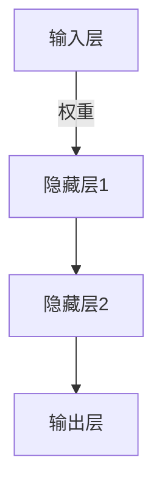
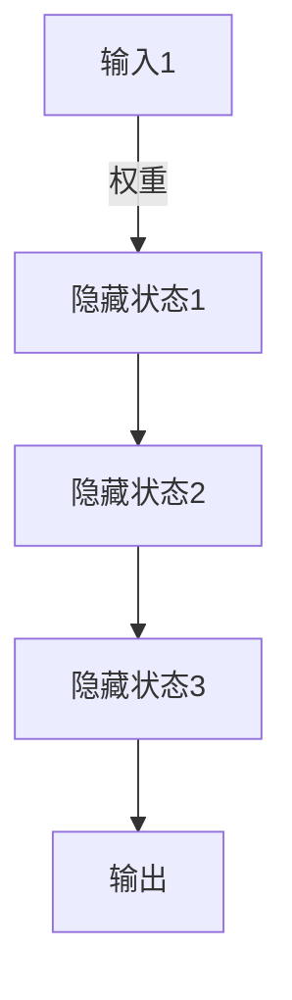

# 揭开神经网络的神秘面纱:深度学习的本质与演进

## 1.背景介绍

### 1.1 人工智能的崛起

人工智能(AI)已经成为当代科技发展的核心驱动力之一。从语音助手到自动驾驶汽车,从医疗诊断到金融预测,AI无所不在地影响着我们的生活。在AI的多个分支中,深度学习(Deep Learning)凭借其强大的模式识别和数据处理能力,正逐渐成为推动人工智能飞跃发展的关键技术。

### 1.2 深度学习的重要性

深度学习是机器学习的一种新兴方法,它源于对大脑神经网络工作原理的研究,旨在使计算机系统能够自主学习和改进。与传统的机器学习算法相比,深度学习更加擅长处理复杂、非结构化的大数据,并从中发现内在模式。这使得深度学习在计算机视觉、自然语言处理、语音识别等领域取得了突破性进展。

### 1.3 神经网络的神秘面纱

尽管深度学习取得了令人瞩目的成就,但神经网络的内在机理仍然存在许多未解之谜。我们对于神经网络是如何学习、推理和决策的过程了解甚少。这使得深度学习系统的可解释性、可靠性和安全性受到质疑。揭开神经网络的神秘面纱,揭示深度学习的本质,对于推动AI技术的发展至关重要。

## 2.核心概念与联系

### 2.1 神经网络的基本结构

神经网络的设计灵感来源于生物神经系统。它由大量互连的节点(神经元)组成,这些节点通过加权连接进行信息传递和处理。神经网络通常包括输入层、隐藏层和输出层,其中隐藏层可能有多个。



### 2.2 前馈神经网络与反向传播

前馈神经网络(Feedforward Neural Network)是最基本的神经网络结构。在这种网络中,信息只能单向传递,从输入层流向输出层。反向传播(Backpropagation)算法则用于调整网络中连接的权重,使输出结果逐步接近期望值。这是神经网络学习的核心机制。

### 2.3 卷积神经网络

卷积神经网络(Convolutional Neural Network, CNN)是一种专门用于处理网格结构数据(如图像)的神经网络。它通过卷积和池化操作提取局部特征,从而对图像进行高效的模式识别。CNN在计算机视觉领域取得了巨大成功,如图像分类、目标检测和语义分割等。

### 2.4 循环神经网络

循环神经网络(Recurrent Neural Network, RNN)是一种适用于序列数据(如文本、语音)的神经网络。它通过内部循环连接,能够捕捉序列中的长期依赖关系。长短期记忆网络(Long Short-Term Memory, LSTM)和门控循环单元(Gated Recurrent Unit, GRU)是RNN的两种常用变体,广泛应用于自然语言处理和时间序列预测等领域。

## 3.核心算法原理具体操作步骤

### 3.1 前馈神经网络的工作原理

前馈神经网络的工作原理可以概括为以下几个步骤:

1. **输入层接收数据**:输入层将输入数据(如图像像素值或文本embedding)传递给下一层。

2. **隐藏层特征提取**:隐藏层通过加权求和和非线性激活函数(如ReLU、Sigmoid等)对输入进行转换,提取出更高级的特征表示。

3. **输出层产生结果**:输出层根据最后一个隐藏层的输出,计算出最终的输出结果(如分类概率或回归值)。

4. **损失函数计算误差**:将输出结果与期望目标值进行比较,通过损失函数(如交叉熵损失、均方误差等)计算出误差。

5. **反向传播调整权重**:利用反向传播算法,沿着神经网络的反方向传播误差梯度,并使用优化算法(如梯度下降)调整每个连接的权重,从而减小损失函数值。

6. **重复训练迭代**:重复上述过程,直到模型在训练数据上达到期望的性能或者达到最大迭代次数。

通过大量的训练数据和迭代,神经网络能够自动学习到从输入到输出的映射关系,并在新的输入数据上进行有效的预测或决策。

### 3.2 卷积神经网络的核心操作

卷积神经网络在前馈神经网络的基础上,引入了卷积(Convolution)和池化(Pooling)等特殊操作,以提高对图像等网格结构数据的处理能力。

1. **卷积层**:卷积层通过滑动卷积核(Kernel)在输入数据上执行卷积操作,提取出局部特征。卷积核的权重在训练过程中被学习得到。

2. **激活函数**:卷积层的输出通常会经过非线性激活函数(如ReLU)处理,增加网络的表达能力。

3. **池化层**:池化层通过下采样操作(如最大池化或平均池化)减小特征图的尺寸,达到降维和提取主要特征的目的。

4. **全连接层**:在CNN的最后几层,通常会将特征图展平并连接到全连接层,对特征进行高层次的组合和处理。

通过多个卷积层、池化层和全连接层的组合,CNN能够自动从原始图像中学习出层次化的特征表示,并最终完成分类、检测或分割等任务。

### 3.3 循环神经网络的时间展开

循环神经网络通过在神经元之间引入循环连接,使网络能够处理序列数据。RNN的核心思想是将序列展开为一系列时间步,并在每个时间步上重复使用相同的网络结构。



在上图中,每个隐藏状态都依赖于当前时间步的输入和上一时间步的隐藏状态。这种递归结构使RNN能够捕捉序列数据中的长期依赖关系。

在实际应用中,为了缓解RNN训练过程中的梯度消失或爆炸问题,通常会使用LSTM或GRU等门控单元结构。这些单元通过精心设计的门机制,能够更好地控制信息的流动,从而提高RNN在长序列任务上的性能。

## 4.数学模型和公式详细讲解举例说明

### 4.1 神经网络中的基本运算

神经网络中的基本运算包括加权求和、激活函数和损失函数等。

1. **加权求和**:对于单个神经元,其输出 $y$ 是通过将输入 $x_i$ 与对应权重 $w_i$ 相乘并求和得到的,即:

$$y = \sum_{i=1}^{n}w_ix_i + b$$

其中 $b$ 是偏置项。

2. **激活函数**:激活函数 $f$ 引入非线性,增强神经网络的表达能力。常用的激活函数包括Sigmoid函数、ReLU函数等:

$$\text{Sigmoid}(x) = \frac{1}{1+e^{-x}}$$

$$\text{ReLU}(x) = \max(0, x)$$

3. **损失函数**:损失函数 $\mathcal{L}$ 用于衡量模型输出与期望目标之间的差异,是优化的目标函数。在分类任务中,常用的是交叉熵损失:

$$\mathcal{L} = -\sum_{i=1}^{C}y_i\log(\hat{y}_i)$$

其中 $y_i$ 是真实标签的one-hot编码, $\hat{y}_i$ 是模型输出的预测概率。

通过梯度下降等优化算法,我们可以最小化损失函数,从而使模型输出逐渐接近期望目标。

### 4.2 卷积神经网络中的卷积操作

卷积操作是CNN的核心,它通过滑动卷积核在输入特征图上进行局部加权求和,从而提取出局部特征。对于二维卷积,卷积操作可以表示为:

$$s(i, j) = (I * K)(i, j) = \sum_{m}\sum_{n}I(i+m, j+n)K(m, n)$$

其中 $I$ 是输入特征图, $K$ 是卷积核, $s(i, j)$ 是输出特征图在位置 $(i, j)$ 处的值。通过对卷积核的权重 $K(m, n)$ 进行学习,CNN可以自动提取出对任务有意义的特征。

### 4.3 循环神经网络中的时间展开

在循环神经网络中,序列数据被展开为一系列时间步。对于每个时间步 $t$,隐藏状态 $h_t$ 的计算公式为:

$$h_t = f_W(x_t, h_{t-1})$$

其中 $x_t$ 是当前时间步的输入, $h_{t-1}$ 是上一时间步的隐藏状态, $f_W$ 是由网络权重 $W$ 参数化的递归函数。

对于LSTM单元,递归函数 $f_W$ 包含了门控机制,用于控制信息的流动:

$$\begin{aligned}
f_t &= \sigma(W_f\cdot[h_{t-1}, x_t] + b_f) & \text{(遗忘门)} \\
i_t &= \sigma(W_i\cdot[h_{t-1}, x_t] + b_i) & \text{(输入门)} \\
\tilde{C}_t &= \tanh(W_C\cdot[h_{t-1}, x_t] + b_C) & \text{(候选状态)} \\
C_t &= f_t \odot C_{t-1} + i_t \odot \tilde{C}_t & \text{(细胞状态)} \\
o_t &= \sigma(W_o\cdot[h_{t-1}, x_t] + b_o) & \text{(输出门)} \\
h_t &= o_t \odot \tanh(C_t) & \text{(隐藏状态)}
\end{aligned}$$

通过门控机制,LSTM能够更好地捕捉长期依赖关系,从而在处理长序列任务时表现出色。

## 4.项目实践:代码实例和详细解释说明

为了帮助读者更好地理解神经网络的实现细节,我们将以Python和PyTorch框架为例,提供一些简单但具有代表性的代码示例。

### 4.1 前馈神经网络实现

以下是一个简单的前馈神经网络实现,用于对MNIST手写数字图像进行分类:

```python
import torch
import torch.nn as nn

# 定义网络结构
class FeedforwardNet(nn.Module):
    def __init__(self):
        super(FeedforwardNet, self).__init__()
        self.fc1 = nn.Linear(28 * 28, 512)  # 输入层到隐藏层
        self.fc2 = nn.Linear(512, 10)  # 隐藏层到输出层

    def forward(self, x):
        x = x.view(-1, 28 * 28)  # 将图像展平为一维向量
        x = torch.relu(self.fc1(x))  # 隐藏层使用ReLU激活函数
        x = self.fc2(x)  # 输出层无激活函数(分类问题)
        return x

# 创建模型实例
model = FeedforwardNet()

# 定义损失函数和优化器
criterion = nn.CrossEntropyLoss()
optimizer = torch.optim.SGD(model.parameters(), lr=0.01)

# 训练循环
for epoch in range(10):
    for data, target in train_loader:
        optimizer.zero_grad()  # 梯度清零
        output = model(data)  # 前向传播
        loss = criterion(output, target)  # 计算损失
        loss.backward()  # 反向传播
        optimizer.step()  # 更新权重
```

在上述代码中,我们首先定义了一个包含两个全连接层的前馈神经网络。在 `forward` 函数中,我们将输入图像展平,然后依次通过隐藏层和输出层进行前向传播。

接下来,我们创建模型实例,并定义交叉熵损失函数和SGD优化器。在训练循环中,我们对