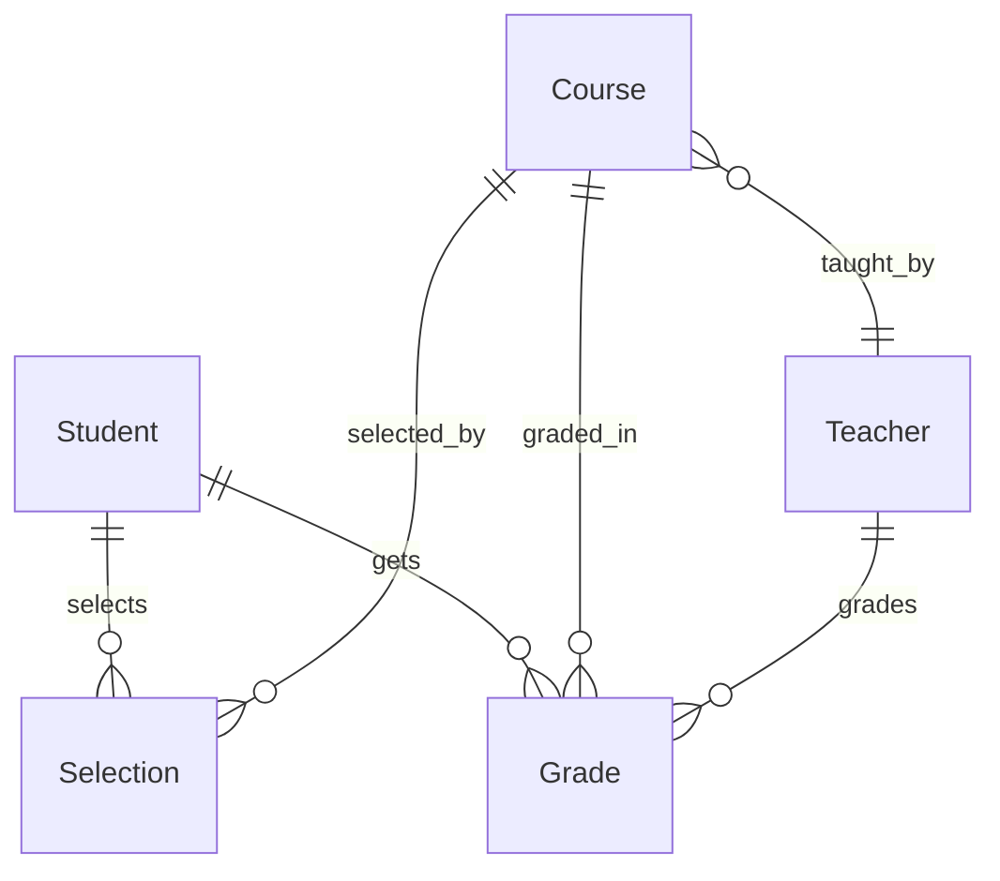

# 教务管理系统详细设计与具体代码实现

作者：禅与计算机程序设计艺术

## 1. 背景介绍

### 1.1 教务管理系统的重要性

在现代化的教育管理中,教务管理系统扮演着至关重要的角色。它可以有效地简化教育机构的日常管理工作,提高工作效率,减少人为错误,并为教学管理提供数据支持。通过教务管理系统,学校可以更好地管理学生信息、课程安排、成绩录入等教学相关事务。

### 1.2 开发教务管理系统面临的挑战 

开发一个功能完善、性能优异、用户体验良好的教务管理系统并非易事。我们需要考虑系统的可扩展性、安全性、易用性等诸多因素。同时,还要满足不同用户角色(如教师、学生、管理员)的差异化需求。此外,教务数据的规模也对系统的性能提出了更高要求。

### 1.3 本文的主要内容

本文将从教务管理系统的需求分析出发,详细阐述系统设计的核心理念,并给出具体的代码实现。我们将重点讨论系统架构、数据库设计、核心功能模块的算法原理等关键内容。同时,也会分享一些开发过程中的经验和最佳实践。希望通过本文的讲解,读者能够对教务管理系统有一个全面而深入的认识。

## 2. 核心概念与联系

### 2.1 教务管理的核心概念

在教务管理系统中,有几个核心概念需要理解:

- **学生**:教育过程的主体,拥有自己的基本信息、所选课程、成绩等数据。 
- **教师**:负责教学和评分,与授课课程和修读学生关联。
- **课程**:学生修读和教师授课的基本单位,包含课程基本信息、上课时间、学分等属性。
- **成绩**:学生修读课程后的评估结果,与学生和课程关联,是教务管理的重要数据。

### 2.2 核心概念间的关系

理清这些核心概念间的关系,对于设计合理的系统架构至关重要。通常学生与课程是多对多的选课关系,教师与课程是一对多的授课关系,成绩则是学生和课程的联系纽带,由教师打分产生。因此,在设计数据库时,我们要合理设计实体间的关联关系。

下面是一个简单的ER图,展示了这些核心概念间的联系:



## 3. 核心算法原理与具体操作步骤

### 3.1 学生选课算法

学生选课是教务管理系统的一个核心功能。我们以学生选课为例,简要说明其核心算法原理和操作步骤。

#### 3.1.1 选课的基本规则

1. 学生在选课开放时间内可以自由选择心仪课程,但需要满足先修课程、课程容量等限制条件。 
2. 一个学生选课数量一般有上限,不能超过规定的最大值。
3. 同一时间上课的课程之间如果有时间冲突则不能同时选修。

#### 3.1.2 选课算法的基本步骤

1. 学生提交选课请求,携带学生ID和待选课程ID。
2. 系统检查学生选课数量是否达到上限,如果达到则拒绝选课请求。
3. 检查学生是否已经选修了待选课程,如果已选则拒绝。
4. 检查待选课程是否已满,如果已满则拒绝。
5. 检查学生是否修读了待选课程的先修课程,如果没有则拒绝。
6. 检查待选课程是否与学生已选其他课程时间冲突,如有冲突则拒绝。
7. 如果通过以上所有检查,则将待选课程加入学生的选课清单。

#### 3.1.3 选课算法的优化思路 

以上是一个基本的选课算法,但在实际高并发场景下可能会遇到一些性能问题,比如多个学生同时抢同一门热门课导致"超卖"等。针对这类问题,我们可以引入一些优化手段:

1. 将热门课程的选课请求放入消息队列异步处理,减轻同步压力。
2. 对于某些课程可以考虑引入"抽签"机制,而非"先到先得"。
3. 对于核心的选课逻辑可以进行进一步的细粒度锁控制,减少锁竞争。
4. 在数据库层面使用事务保证选课操作的原子性,避免出现数据不一致。

## 4. 数学模型和公式详细讲解举例说明

在教务管理系统中,我们经常需要进行一些数据统计和分析工作,这就涉及到一些数学模型的应用。这里我们以学生成绩的统计分析为例进行讲解。

### 4.1 学生成绩的基本数学模型 

我们可以用一个矩阵 $S$ 来表示所有学生的原始成绩,其中 $S_{ij}$ 表示第 $i$ 个学生在第 $j$ 门课程上的成绩。

假设有 $m$ 个学生和 $n$ 门课程,则成绩矩阵 $S$ 可以表示为:

$$
S=\begin{bmatrix}
S_{11} & S_{12} & \cdots & S_{1n} \\
S_{21} & S_{22} & \cdots & S_{2n} \\
\vdots & \vdots & \ddots & \vdots \\
S_{m1} & S_{m2} & \cdots & S_{mn} \\
\end{bmatrix}
$$

### 4.2 学生总成绩与平均成绩的计算

有了原始成绩矩阵,我们可以计算每个学生的总成绩和平均成绩。

第 $i$ 个学生的总成绩 $T_i$ 可以表示为:

$$
T_i=\sum_{j=1}^n S_{ij}
$$

第 $i$ 个学生的平均成绩 $A_i$ 可以表示为:

$$
A_i=\frac{T_i}{n}=\frac{\sum_{j=1}^n S_{ij}}{n}
$$

### 4.3 成绩的标准差计算

为了分析学生成绩的离散程度,我们引入标准差的概念。标准差可以反映成绩数据的波动情况,标准差越大,说明成绩差异越大。

第 $j$ 门课程的成绩标准差 $D_j$ 可以表示为:

$$
D_j=\sqrt{\frac{\sum_{i=1}^m (S_{ij}-\overline{S_j})^2}{m}}
$$

其中 $\overline{S_j}$ 表示第 $j$ 门课程的平均成绩:

$$
\overline{S_j}=\frac{\sum_{i=1}^m S_{ij}}{m}
$$

### 4.4 成绩的正态分布模型

在大样本情况下,成绩数据通常服从正态分布。正态分布可以用两个参数 $\mu$ (均值)和 $\sigma$ (标准差)来描述,其概率密度函数为:

$$
f(x)=\frac{1}{\sqrt{2\pi}\sigma}\exp(-\frac{(x-\mu)^2}{2\sigma^2})
$$

如果我们知道了某门课程的平均成绩 $\mu$ 和标准差 $\sigma$,就可以估计学生在这门课程上获得某个分数区间的概率。

例如,假设"高等数学"课程的平均分为80分,标准差为5分,我们可以计算出一个学生的"高数"成绩落在75~85分区间的概率:

$$
P(75<x<85)=\int_{75}^{85}\frac{1}{\sqrt{2\pi}*5}\exp(-\frac{(x-80)^2}{2*5^2})dx \approx 0.683
$$

这就是著名的"68-95-99.7"规则在教务管理中的一个应用。

## 5. 项目实践:代码实例和详细解释说明

下面我们以Java语言为例,给出教务管理系统中的一些核心代码实现。我们主要展示数据库设计、业务逻辑层和前端控制层的部分代码。

### 5.1 数据库设计和模型定义

首先我们来看数据库表的设计。根据前面提到的核心概念,我们设计了四张表:学生表(Student)、教师表(Teacher)、课程表(Course)和成绩表(Grade)。

```sql
-- 学生表
CREATE TABLE Student (
  id INT PRIMARY KEY AUTO_INCREMENT COMMENT '学号',
  name VARCHAR(50) NOT NULL COMMENT '姓名',
  gender CHAR(1) COMMENT '性别',
  birthday DATE COMMENT '出生日期'
) ENGINE=INNODB DEFAULT CHARSET=utf8;

-- 教师表 
CREATE TABLE Teacher (
  id INT PRIMARY KEY AUTO_INCREMENT COMMENT '教师编号',
  name VARCHAR(50) NOT NULL COMMENT '姓名',
  gender CHAR(1) COMMENT '性别',
  title VARCHAR(20) COMMENT '职称'
) ENGINE=INNODB DEFAULT CHARSET=utf8;

-- 课程表
CREATE TABLE Course (
  id INT PRIMARY KEY AUTO_INCREMENT COMMENT '课程编号',
  name VARCHAR(50) NOT NULL COMMENT '课程名称',
  teacher_id INT COMMENT '授课教师',
  credit FLOAT COMMENT '学分',
  FOREIGN KEY (teacher_id) REFERENCES Teacher(id)
) ENGINE=INNODB DEFAULT CHARSET=utf8;

-- 成绩表
CREATE TABLE Grade (
  student_id INT COMMENT '学号',
  course_id INT COMMENT '课程编号', 
  score FLOAT COMMENT '成绩',
  PRIMARY KEY (student_id, course_id),
  FOREIGN KEY (student_id) REFERENCES Student(id),
  FOREIGN KEY (course_id) REFERENCES Course(id)
) ENGINE=INNODB DEFAULT CHARSET=utf8;
```

然后我们定义与数据库表结构对应的模型类:

```java
public class Student {
    private Integer id;
    private String name;
    private String gender;
    private Date birthday;
    // 省略getter/setter
}

public class Teacher {
    private Integer id;
    private String name;
    private String gender;
    private String title;
    // 省略getter/setter
}

public class Course {
    private Integer id;
    private String name;
    private Integer teacherId;
    private Double credit;
    // 省略getter/setter
}

public class Grade {
    private Integer studentId;
    private Integer courseId;
    private Double score;
    // 省略getter/setter
}
```

### 5.2 业务逻辑层代码

业务逻辑层负责处理核心的业务逻辑,如学生选课、成绩录入等。这里我们以学生选课为例:

```java
@Service
public class CourseService {
    @Autowired
    private CourseDao courseDao;
    
    @Transactional
    public boolean selectCourse(Integer studentId, Integer courseId) {
        // 检查是否已选
        if (courseDao.isSelected(studentId, courseId)) {
            return false;
        }
        // 检查是否已满
        Course course = courseDao.getCourse(courseId);
        if (course.getSelectedCount() >= course.getMaxSize()) {
            return false;
        }
        // 检查是否有先修课程
        if (course.getPrerequisite() != null 
            && !courseDao.isSelected(studentId, course.getPrerequisite())) {
            return false;
        }
        // 检查是否与已选课程时间冲突
        List<Course> selectedCourses = courseDao.getSelectedCourses(studentId);
        for (Course selectedCourse : selectedCourses) {
            if (hasTimeConflict(selectedCourse, course)) {
                return false;
            }
        }
        // 所有检查通过,执行选课操作
        courseDao.selectCourse(studentId, courseId);
        return true;
    }
}
```

这个选课方法基本上实现了前面提到的选课算法。其中的数据访问操作(如检查是否已选、获取已选课程等)由DAO层完成,Service层只关心业务逻辑。

事务注解 `@Transactional` 可以保证选课操作的原子性。如果选课失败,所有相关操作都会回滚。

### 5.3 前端控制层代码

前端控制层负责处理HTTP请求,调用业务逻辑层的服务,并返回结果。这里我们使用SpringMVC框架实现一个简单的选课接口:

```java
@RestController
@RequestMapping("/course")
public class CourseController {
    @Autowired
    private CourseService courseService;

    @PostMapping("/select")
    public ResultVO selectCourse(@RequestParam("studentId") Integer studentId,
                                 @RequestParam("courseId") Integer courseId) {
        boolean success = courseService.selectCourse(studentId, courseId);
        if (success) {
            return ResultVO.success(null);
        } else {
            return ResultVO.