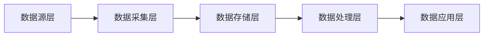

## 1. 背景介绍

### 1.1 数据仓库的起源与发展

随着信息技术的飞速发展，各行各业都积累了海量的数据。如何有效地管理和利用这些数据，成为了企业面临的重大挑战。为了解决这一问题，数据仓库（Data Warehouse）应运而生。

数据仓库的概念最早由 Bill Inmon 在 20 世纪 80 年代提出，他将数据仓库定义为“面向主题的、集成的、非易失的、随时间变化的数据集合，用于支持管理决策”。数据仓库技术经历了从早期关系型数据库到多维数据库，再到今天基于云计算和大数据技术的现代数据仓库的发展历程。

### 1.2 数据仓库的定义与特点

数据仓库是一个面向主题的、集成的、相对稳定的、反映历史变化的数据集合，用于支持管理决策。其主要特点包括：

* **面向主题:** 数据仓库中的数据是按照主题组织的，例如客户、产品、销售等。
* **集成:** 数据仓库中的数据来自不同的业务系统，经过清洗、转换和整合后形成统一的数据视图。
* **相对稳定:** 数据仓库中的数据是相对稳定的，不会像业务系统中的数据那样频繁更新。
* **反映历史变化:** 数据仓库中保存了历史数据，可以用于分析历史趋势和预测未来发展。

### 1.3 数据仓库的价值与意义

数据仓库的建设可以为企业带来巨大的价值，主要体现在以下几个方面：

* **提升决策效率:** 数据仓库可以为企业提供全面、准确、及时的决策支持信息，帮助企业做出更科学、更合理的决策。
* **优化业务流程:** 通过对数据仓库中数据的分析，企业可以发现业务流程中的瓶颈和问题，并进行优化改进。
* **发现新的商业机会:** 数据仓库可以帮助企业发现隐藏在数据背后的商业机会，从而开拓新的市场和业务领域。

## 2. 核心概念与联系

### 2.1 数据仓库架构

数据仓库的架构通常采用分层架构，主要包括以下几层：

* **数据源层:** 数据仓库的数据源于企业的各个业务系统，例如 ERP、CRM、OA 等。
* **数据采集层:** 负责从数据源系统中抽取数据，并进行初步的清洗和转换。
* **数据存储层:** 负责存储数据仓库的数据，通常采用关系型数据库、NoSQL 数据库或云存储等技术。
* **数据处理层:** 负责对数据进行清洗、转换、加载和聚合等操作，以满足数据分析的需求。
* **数据应用层:** 为用户提供数据查询、报表分析、数据挖掘等服务。



### 2.2 数据仓库建模

数据仓库建模是数据仓库建设的核心环节，主要包括以下几种模型：

* **星型模型:** 由一个事实表和多个维度表组成，事实表存储业务度量数据，维度表存储维度信息。
* **雪花模型:** 是星型模型的扩展，维度表可以进一步分解成更小的维度表。
* **星座模型:** 由多个星型模型或雪花模型组成，用于描述多个业务主题之间的关系。

### 2.3 ETL 流程

ETL（Extract, Transform, Load）是指数据仓库的数据抽取、转换和加载过程，是数据仓库建设的重要环节。

* **数据抽取:** 从数据源系统中抽取数据。
* **数据转换:** 对数据进行清洗、转换、整合等操作。
* **数据加载:** 将处理后的数据加载到数据仓库中。

## 3. 核心算法原理具体操作步骤

### 3.1 数据清洗

数据清洗是指对数据进行校验和纠正，以消除数据中的错误和不一致性。常见的数据清洗方法包括：

* **数据类型检查:** 检查数据是否符合预定义的数据类型。
* **空值处理:** 处理数据中的空值，例如填充默认值、删除空值记录等。
* **重复数据处理:** 识别和删除重复数据。
* **数据一致性检查:** 检查数据之间是否一致，例如日期格式、地址信息等。

### 3.2 数据转换

数据转换是指将数据从一种格式转换为另一种格式，以满足数据分析的需求。常见的数据转换方法包括：

* **数据格式转换:** 例如将日期格式从 YYYY-MM-DD 转换为 MM/DD/YYYY。
* **数据编码转换:** 例如将性别代码从 1 和 2 转换为 Male 和 Female。
* **数据计算:** 例如计算销售额、利润率等指标。
* **数据合并:** 将多个数据源的数据合并成一个数据集。

### 3.3 数据加载

数据加载是指将处理后的数据加载到数据仓库中。数据加载的方式取决于数据仓库的类型和数据量的大小，常见的数据加载方式包括：

* **全量加载:** 将所有数据一次性加载到数据仓库中。
* **增量加载:** 只加载自上次加载以来发生变化的数据。

## 4. 数学模型和公式详细讲解举例说明

### 4.1 数据立方体

数据立方体是一种多维数据模型，用于表示多维数据。数据立方体中的每个维度代表一个业务维度，例如时间、产品、地区等，每个维度上的每个值代表一个数据单元，数据单元中存储着相应的业务度量数据。

例如，一个销售数据立方体可以包含以下维度：

* 时间维度：年、季度、月、日
* 产品维度：产品类别、产品名称
* 地区维度：国家、省份、城市

数据立方体中的每个数据单元存储着该时间、该产品、该地区的销售额。

### 4.2 OLAP 操作

OLAP（Online Analytical Processing）是指在线分析处理，是对多维数据进行快速分析的一种技术。常见的 OLAP 操作包括：

* **上卷:** 将数据汇总到更高的维度，例如将日销售额汇总到月销售额。
* **下钻:** 将数据分解到更低的维度，例如将月销售额分解到日销售额。
* **切片:** 选择数据立方体的一个子集，例如查看某个产品的销售情况。
* **切块:** 选择数据立方体的一个子集，并对其进行旋转，例如查看某个地区所有产品的销售情况。

## 5. 项目实践：代码实例和详细解释说明

### 5.1 使用 Python 连接数据库

```python
import pymysql

# 连接数据库
conn = pymysql.connect(
    host="localhost",
    user="root",
    password="password",
    database="sales"
)

# 创建游标对象
cursor = conn.cursor()
```

### 5.2 查询数据

```python
# 查询语句
sql = "SELECT * FROM orders"

# 执行查询
cursor.execute(sql)

# 获取查询结果
results = cursor.fetchall()

# 打印查询结果
for row in results:
    print(row)
```

### 5.3 数据清洗

```python
# 导入 pandas 库
import pandas as pd

# 读取数据
df = pd.read_sql("SELECT * FROM orders", conn)

# 删除重复数据
df.drop_duplicates(inplace=True)

# 填充空值
df.fillna(0, inplace=True)

# 将数据保存到数据库
df.to_sql("cleaned_orders", conn, if_exists="replace", index=False)
```

### 5.4 数据转换

```python
# 创建新列
df["total_price"] = df["quantity"] * df["unit_price"]

# 将日期格式转换为 YYYY-MM-DD
df["order_date"] = pd.to_datetime(df["order_date"]).dt.strftime("%Y-%m-%d")

# 将数据保存到数据库
df.to_sql("transformed_orders", conn, if_exists="replace", index=False)
```

## 6. 实际应用场景

### 6.1 电商行业

* **用户行为分析:** 分析用户浏览、搜索、购买等行为，为用户推荐个性化商品。
* **商品销售分析:** 分析商品销售情况，制定合理的商品采购和营销策略。
* **库存管理:** 预测商品需求量，优化库存管理。

### 6.2 金融行业

* **风险控制:** 分析客户的信用状况，识别和防范金融风险。
* **精准营销:** 为客户推荐合适的金融产品和服务。
* **反欺诈:** 识别和防范金融欺诈行为。

### 6.3 医疗行业

* **疾病预测:** 分析患者的 medical records，预测疾病发生的概率。
* **精准医疗:** 为患者提供个性化的医疗方案。
* **医疗资源优化:** 优化医疗资源配置，提高医疗效率。

## 7. 工具和资源推荐

### 7.1 数据库

* **MySQL:** 开源的关系型数据库管理系统。
* **PostgreSQL:** 开源的对象关系型数据库系统。
* **Oracle Database:** 商用的关系型数据库管理系统。

### 7.2 ETL 工具

* **Apache Kafka:** 分布式流处理平台。
* **Apache Spark:** 快速、通用的集群计算系统。
* **Apache Flink:** 分布式流处理和批处理框架。

### 7.3 数据可视化工具

* **Tableau:** 数据可视化分析软件。
* **Power BI:** 微软开发的数据可视化分析工具。
* **Metabase:** 开源的数据可视化分析工具。

## 8. 总结：未来发展趋势与挑战

### 8.1 未来发展趋势

* **云原生数据仓库:** 越来越多的企业将数据仓库迁移到云平台上。
* **实时数据仓库:** 企业对实时数据的需求越来越高，实时数据仓库应运而生。
* **人工智能与数据仓库:** 人工智能技术将越来越多地应用于数据仓库，例如数据清洗、数据分析等。

### 8.2 面临的挑战

* **数据安全:** 数据仓库中存储着企业的核心数据，数据安全至关重要。
* **数据治理:** 建立完善的数据治理体系，确保数据的质量和一致性。
* **人才培养:** 数据仓库技术发展迅速，需要不断培养数据仓库方面的人才。

## 9. 附录：常见问题与解答

### 9.1 什么是数据仓库？

数据仓库是一个面向主题的、集成的、相对稳定的、反映历史变化的数据集合，用于支持管理决策。

### 9.2 数据仓库和数据库有什么区别？

数据库是面向事务处理的，数据仓库是面向分析处理的。

### 9.3 数据仓库有哪些应用场景？

数据仓库的应用场景非常广泛，例如电商、金融、医疗等行业。