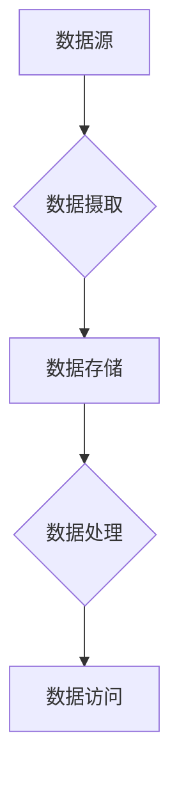

## 1. 背景介绍

### 1.1. 数据科学研究的挑战
数据科学研究正在经历前所未有的快速发展，其应用领域涵盖了从生物医药到金融市场的各个方面。然而，随着数据规模的不断扩大和复杂性的增加，数据科学家们面临着越来越多的挑战：

* **数据孤岛:** 数据通常分散在不同的系统和数据库中，难以整合和分析。
* **数据质量问题:** 数据可能存在缺失值、错误或不一致，需要进行大量的数据清洗和预处理工作。
* **计算资源限制:** 处理大规模数据集需要大量的计算资源，这对于许多研究团队来说是一个瓶颈。

### 1.2. 数据湖的兴起
数据湖的出现为解决这些挑战提供了一种新的思路。数据湖是一个集中存储各种类型数据（结构化、半结构化和非结构化）的存储库，它允许数据科学家以灵活的方式访问和分析数据。

### 1.3. 数据湖的优势
数据湖相比传统的数据仓库具有以下优势：

* **灵活性:** 数据湖可以存储任何类型的数据，无需预先定义模式。
* **可扩展性:** 数据湖可以轻松扩展以适应不断增长的数据量。
* **成本效益:** 数据湖通常基于廉价的存储技术，例如云存储。

## 2. 核心概念与联系

### 2.1. 数据湖架构
一个典型的数据湖架构包括以下组件：

* **数据源:** 数据湖中的数据来自各种来源，例如数据库、日志文件、传感器数据等。
* **数据摄取:** 数据摄取工具负责将数据从数据源导入到数据湖中。
* **数据存储:** 数据湖使用分布式文件系统（例如 HDFS）或云存储（例如 AWS S3）来存储数据。
* **数据处理:** 数据处理工具用于清理、转换和分析数据湖中的数据。
* **数据访问:** 数据科学家可以使用各种工具和接口访问和分析数据湖中的数据。




### 2.2. 数据格式
数据湖支持各种数据格式，包括：

* **结构化数据:** 例如关系数据库中的表格数据。
* **半结构化数据:** 例如 JSON、XML 和 CSV 文件。
* **非结构化数据:** 例如文本、图像和视频。

### 2.3. 数据治理
数据治理对于确保数据湖中的数据质量和安全性至关重要。数据治理包括以下方面：

* **数据质量管理:** 确保数据准确、完整和一致。
* **数据安全:** 保护数据免遭未经授权的访问和使用。
* **数据合规性:** 遵守相关的数据隐私法规。

## 3. 核心算法原理具体操作步骤

### 3.1 数据清洗

数据清洗是数据科学研究中一个重要的步骤，它可以提高数据的质量和可靠性。以下是一些常见的数据清洗技术：

* **缺失值处理:** 使用均值、中位数或模型预测来填充缺失值。
* **异常值检测:** 使用统计方法或机器学习算法识别和处理异常值。
* **数据格式转换:** 将数据转换为一致的格式，例如日期、时间和货币。

### 3.2 数据转换

数据转换是指将数据从一种形式转换为另一种形式，以便于分析。以下是一些常见的数据转换技术：

* **数据聚合:** 将多个数据点合并成一个汇总值，例如计算平均值或总和。
* **数据标准化:** 将数据缩放到相同的范围，例如使用 z-score 标准化。
* **特征工程:** 从现有数据中创建新的特征，例如计算比率或组合变量。

### 3.3 数据分析

数据分析是利用统计方法和机器学习算法从数据中提取洞察力的过程。以下是一些常见的数据分析技术：

* **描述性分析:** 总结数据的基本特征，例如均值、标准差和频率分布。
* **探索性分析:** 发现数据中的模式和关系，例如使用散点图和直方图。
* **预测性分析:** 使用历史数据构建模型来预测未来结果，例如使用回归分析或时间序列分析。

## 4. 数学模型和公式详细讲解举例说明

### 4.1 线性回归

线性回归是一种用于建立变量之间线性关系的统计方法。它假设自变量和因变量之间存在线性关系，并使用最小二乘法估计模型参数。

线性回归模型的公式如下：

$$
y = \beta_0 + \beta_1 x_1 + \beta_2 x_2 + ... + \beta_n x_n + \epsilon
$$

其中：

* $y$ 是因变量。
* $x_1, x_2, ..., x_n$ 是自变量。
* $\beta_0, \beta_1, \beta_2, ..., \beta_n$ 是模型参数。
* $\epsilon$ 是误差项。

**例子：**

假设我们想建立一个模型来预测房价，并使用房屋面积和卧室数量作为自变量。我们可以使用线性回归模型来建立这个模型。

### 4.2 逻辑回归

逻辑回归是一种用于预测二元结果的统计方法。它使用逻辑函数将线性回归模型的输出转换为 0 到 1 之间的概率。

逻辑回归模型的公式如下：

$$
p = \frac{1}{1 + e^{-(\beta_0 + \beta_1 x_1 + \beta_2 x_2 + ... + \beta_n x_n)}}
$$

其中：

* $p$ 是事件发生的概率。
* $x_1, x_2, ..., x_n$ 是自变量。
* $\beta_0, \beta_1, \beta_2, ..., \beta_n$ 是模型参数。

**例子：**

假设我们想建立一个模型来预测客户是否会购买产品，并使用客户年龄和收入作为自变量。我们可以使用逻辑回归模型来建立这个模型。

## 5. 项目实践：代码实例和详细解释说明

### 5.1 Python 代码示例

以下是一个使用 Python Pandas 和 Scikit-learn 库进行数据分析的示例代码：

```python
import pandas as pd
from sklearn.model_selection import train_test_split
from sklearn.linear_model import LinearRegression

# 加载数据
data = pd.read_csv('housing_data.csv')

# 准备数据
X = data[['house_area', 'bedrooms']]
y = data['price']

# 将数据分成训练集和测试集
X_train, X_test, y_train, y_test = train_test_split(X, y, test_size=0.2)

# 创建线性回归模型
model = LinearRegression()

# 训练模型
model.fit(X_train, y_train)

# 评估模型
score = model.score(X_test, y_test)
print('模型准确率：', score)

# 预测新数据
new_data = pd.DataFrame({'house_area': [1500], 'bedrooms': [3]})
predicted_price = model.predict(new_data)
print('预测房价：', predicted_price)
```

### 5.2 代码解释

* **加载数据:** 使用 Pandas 库加载 CSV 文件中的数据。
* **准备数据:** 选择用于预测的自变量和因变量。
* **将数据分成训练集和测试集:** 将数据分成两部分，用于训练和评估模型。
* **创建线性回归模型:** 使用 Scikit-learn 库创建线性回归模型。
* **训练模型:** 使用训练数据训练模型。
* **评估模型:** 使用测试数据评估模型的准确率。
* **预测新数据:** 使用训练好的模型预测新数据的房价。


## 6. 实际应用场景

数据湖在各个行业都有广泛的应用，包括：

* **金融:** 风险管理、欺诈检测、客户细分
* **医疗保健:** 疾病预测、药物研发、个性化医疗
* **零售:** 供应链优化、客户关系管理、市场分析
* **制造:** 预测性维护、质量控制、生产优化

## 7. 工具和资源推荐

以下是一些常用的数据湖工具和资源：

* **云平台:** AWS、Azure、GCP
* **数据湖平台:** Databricks、Cloudera、Hortonworks
* **数据处理工具:** Spark、Hadoop、Hive
* **数据可视化工具:** Tableau、Power BI、Qlik Sense

## 8. 总结：未来发展趋势与挑战

数据湖技术正在快速发展，未来将朝着以下方向发展：

* **云原生数据湖:** 更加紧密地集成云计算技术，提供更高的可扩展性和弹性。
* **数据湖的自动化:** 使用机器学习和人工智能技术自动化数据湖的管理和优化。
* **数据湖的安全性:** 更加重视数据安全和隐私保护，防止数据泄露和滥用。

数据湖也面临着一些挑战：

* **数据治理:** 确保数据湖中的数据质量和安全性仍然是一个挑战。
* **数据孤岛:** 将数据湖与其他系统和应用程序集成仍然是一个挑战。
* **技能差距:** 缺乏具备数据湖技术的人才。


## 9. 附录：常见问题与解答

### 9.1 什么是数据湖？

数据湖是一个集中存储各种类型数据的存储库，它允许数据科学家以灵活的方式访问和分析数据。

### 9.2 数据湖与数据仓库有什么区别？

数据仓库是用于存储结构化数据的数据库，而数据湖可以存储任何类型的数据，包括结构化、半结构化和非结构化数据。

### 9.3 数据湖的优势是什么？

数据湖的优势包括灵活性、可扩展性和成本效益。

### 9.4 数据湖的应用场景有哪些？

数据湖在各个行业都有广泛的应用，包括金融、医疗保健、零售和制造。

### 9.5 数据湖的未来发展趋势是什么？

数据湖的未来发展趋势包括云原生数据湖、数据湖的自动化和数据湖的安全性。