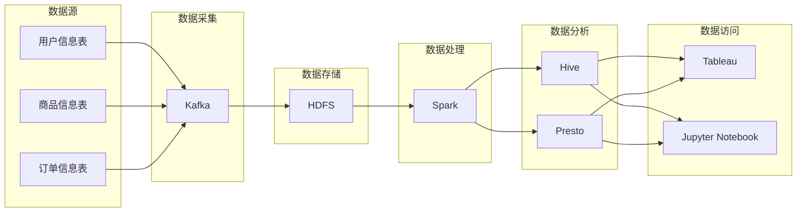

# 数据湖相关技术博客推荐

作者：禅与计算机程序设计艺术

## 1. 背景介绍

### 1.1 数据爆炸式增长与数据价值挖掘的挑战

近年来，随着互联网、物联网、移动互联网等技术的快速发展，全球数据量呈现爆炸式增长趋势。海量数据的积累为企业带来了前所未有的机遇，同时也带来了巨大的挑战。如何有效地存储、管理、分析和利用这些数据，从中挖掘出潜在的商业价值，已成为企业数字化转型的重要课题。

### 1.2 数据湖应运而生

为了应对海量数据的存储、管理和分析需求，数据湖的概念应运而生。数据湖是一个集中式存储库，可以存储任何类型、任何格式的原始数据，包括结构化数据、半结构化数据和非结构化数据。与传统的数据仓库不同，数据湖采用 Schema-on-Read 的方式，即在数据入湖时不需要预先定义数据结构，而是在使用时根据需要进行解析和处理。

### 1.3 数据湖的优势

数据湖的出现为企业带来了诸多优势，主要体现在以下几个方面：

* **高可扩展性:** 数据湖可以根据数据量的增长进行弹性扩展，满足企业不断增长的数据存储需求。
* **灵活性:** 数据湖支持多种数据格式，可以存储来自不同数据源的数据，为企业提供更全面的数据视图。
* **成本效益:** 相比于传统的数据仓库，数据湖的存储成本更低，可以帮助企业降低数据管理成本。
* **支持多种分析场景:** 数据湖可以支持多种数据分析场景，包括批处理、实时分析、机器学习等，帮助企业从数据中获得更深入的洞察。

## 2. 核心概念与联系

### 2.1 数据湖架构

一个典型的数据湖架构通常包含以下几个核心组件：

* **数据源:** 数据湖的数据来源可以是多种多样的，包括关系型数据库、NoSQL 数据库、日志文件、传感器数据、社交媒体数据等。
* **数据采集:** 数据采集是指将数据从不同的数据源收集到数据湖中的过程。常见的数据采集工具包括 Flume、Kafka、Logstash 等。
* **数据存储:** 数据湖通常使用分布式文件系统来存储数据，例如 Hadoop HDFS、Amazon S3、Azure Blob Storage 等。
* **数据处理:** 数据处理是指对数据进行清洗、转换、聚合等操作，使其更易于分析和使用。常见的数据处理工具包括 Spark、Hive、Pig 等。
* **数据分析:** 数据分析是指利用各种分析工具和技术，从数据中提取有价值的信息。常见的数据分析工具包括 Tableau、Power BI、Python 等。
* **数据访问:** 数据访问是指为用户提供访问数据湖中数据的接口，例如 SQL 查询、API 接口等。

### 2.2 数据湖相关技术

构建和管理数据湖需要使用多种技术，以下列举了一些常用的数据湖相关技术：

* **Hadoop:** Hadoop 是一个开源的分布式计算框架，可以用于存储和处理大规模数据集。
* **Spark:** Spark 是一个快速、通用的集群计算系统，可以用于批处理、实时数据处理、机器学习等场景。
* **Hive:** Hive 是一个基于 Hadoop 的数据仓库工具，提供类似 SQL 的查询语言，方便用户对数据进行分析。
* **Presto:** Presto 是一个开源的分布式 SQL 查询引擎，可以用于查询存储在不同数据源中的数据，例如 Hive、HDFS、MySQL 等。
* **Kafka:** Kafka 是一个高吞吐量的分布式消息队列系统，可以用于实时数据流的采集和处理。
* **Flume:** Flume 是一个分布式的、可靠的、可用的系统，用于高效地收集、聚合和移动大量的日志数据。
* **Airflow:** Airflow 是一个开源的任务调度和编排平台，可以用于构建、调度和监控数据管道。

### 2.3 数据湖与数据仓库的区别

数据湖和数据仓库都是用于存储和管理数据的技术，但它们之间存在一些重要的区别：

| 特性 | 数据湖 | 数据仓库 |
|---|---|---|
| 数据结构 | Schema-on-Read | Schema-on-Write |
| 数据类型 | 各种类型，包括结构化、半结构化和非结构化数据 | 主要存储结构化数据 |
| 数据处理 | 在查询时进行处理 | 在数据入库前进行处理 |
| 数据分析 | 支持多种分析场景，包括批处理、实时分析、机器学习等 | 主要用于报表和 BI 分析 |
| 可扩展性 | 高度可扩展 | 扩展性相对较低 |

## 3. 核心算法原理具体操作步骤

### 3.1 数据采集

数据采集是数据湖建设的第一步，也是至关重要的一步。数据采集的效率和质量直接影响到后续的数据处理和分析。

#### 3.1.1 数据源类型

数据湖的数据来源可以是多种多样的，包括：

* **关系型数据库:** 例如 MySQL、Oracle、PostgreSQL 等。
* **NoSQL 数据库:** 例如 MongoDB、Cassandra、Redis 等。
* **日志文件:** 例如 Web 服务器日志、应用程序日志等。
* **传感器数据:** 例如温度传感器、湿度传感器、压力传感器等。
* **社交媒体数据:** 例如 Twitter、Facebook、微博等。

#### 3.1.2 数据采集工具

常见的数据采集工具包括：

* **Flume:** Flume 是一个分布式的、可靠的、可用的系统，用于高效地收集、聚合和移动大量的日志数据。
* **Kafka:** Kafka 是一个高吞吐量的分布式消息队列系统，可以用于实时数据流的采集和处理。
* **Logstash:** Logstash 是一个开源的数据收集引擎，可以用于收集、解析和传输各种类型的数据。

#### 3.1.3 数据采集步骤

数据采集的一般步骤如下：

1. **确定数据源:** 确定需要采集的数据源类型和数据格式。
2. **选择采集工具:** 根据数据源类型和数据量选择合适的采集工具。
3. **配置采集任务:** 配置采集任务，包括数据源地址、数据格式、采集频率等。
4. **监控采集过程:** 监控数据采集过程，确保数据采集的及时性和准确性。

### 3.2 数据存储

数据存储是数据湖的另一个核心组件，数据湖通常使用分布式文件系统来存储数据。

#### 3.2.1 分布式文件系统

常见的分布式文件系统包括：

* **Hadoop HDFS:** Hadoop HDFS 是 Hadoop 生态系统中的一个分布式文件系统，具有高容错性、高吞吐量等特点。
* **Amazon S3:** Amazon S3 是 Amazon Web Services 提供的对象存储服务，具有高可用性、高可扩展性等特点。
* **Azure Blob Storage:** Azure Blob Storage 是 Microsoft Azure 提供的对象存储服务，具有高性能、低成本等特点。

#### 3.2.2 数据存储格式

数据湖支持多种数据存储格式，包括：

* **文本格式:** 例如 CSV、JSON、XML 等。
* **二进制格式:** 例如 Avro、Parquet、ORC 等。

#### 3.2.3 数据分区

为了提高数据查询效率，通常需要对数据进行分区。数据分区是指根据数据的某些特征将数据存储在不同的目录中。例如，可以根据日期对数据进行分区，将每天的数据存储在不同的目录中。

### 3.3 数据处理

数据处理是指对数据进行清洗、转换、聚合等操作，使其更易于分析和使用。

#### 3.3.1 数据清洗

数据清洗是指识别和修正数据中的错误数据，例如缺失值、异常值、重复值等。

#### 3.3.2 数据转换

数据转换是指将数据从一种格式转换为另一种格式，例如将 CSV 格式的数据转换为 Parquet 格式的数据。

#### 3.3.3 数据聚合

数据聚合是指将多个数据记录合并成一个数据记录，例如计算某个时间段内的销售总额。

#### 3.3.4 数据处理工具

常见的数据处理工具包括：

* **Spark:** Spark 是一个快速、通用的集群计算系统，可以用于批处理、实时数据处理、机器学习等场景。
* **Hive:** Hive 是一个基于 Hadoop 的数据仓库工具，提供类似 SQL 的查询语言，方便用户对数据进行分析。
* **Pig:** Pig 是一种高级数据流语言和执行框架，用于处理海量数据集。

### 3.4 数据分析

数据分析是指利用各种分析工具和技术，从数据中提取有价值的信息。

#### 3.4.1 数据可视化

数据可视化是指将数据以图形的方式展示出来，例如图表、地图等，以便于用户理解数据。

#### 3.4.2 数据挖掘

数据挖掘是指利用机器学习等技术，从数据中发现隐藏的模式和规律。

#### 3.4.3 数据分析工具

常见的数据分析工具包括：

* **Tableau:** Tableau 是一款数据可视化工具，可以用于创建交互式的仪表盘和报表。
* **Power BI:** Power BI 是 Microsoft 提供的商业智能工具，可以用于连接、建模和可视化数据。
* **Python:** Python 是一种流行的编程语言，拥有丰富的数据分析库，例如 Pandas、NumPy、Scikit-learn 等。

## 4. 数学模型和公式详细讲解举例说明

本节将介绍一些常用的数据湖相关算法和模型，并结合具体案例进行讲解。

### 4.1 数据清洗算法

#### 4.1.1 缺失值处理

缺失值是指数据集中某些字段的值为空的情况。处理缺失值的方法有很多种，例如：

* **删除缺失值:** 对于包含缺失值的记录，直接删除整条记录。
* **填充缺失值:** 使用平均值、中位数、众数等统计量填充缺失值。
* **使用模型预测缺失值:** 使用机器学习模型预测缺失值。

**案例:**

假设我们有一个包含用户信息的数据集，其中某些用户的年龄信息缺失。我们可以使用以下方法处理缺失值：

* **删除缺失值:** 删除年龄信息缺失的用户记录。
* **填充缺失值:** 使用所有用户的平均年龄填充缺失值。
* **使用模型预测缺失值:** 使用线性回归模型，根据用户的性别、职业等信息预测用户的年龄。

#### 4.1.2 异常值处理

异常值是指数据集中明显偏离其他数据的值。处理异常值的方法有很多种，例如：

* **删除异常值:** 对于异常值，直接删除整条记录。
* **替换异常值:** 使用平均值、中位数等统计量替换异常值。
* **将异常值视为特殊情况:** 将异常值视为特殊情况进行单独处理。

**案例:**

假设我们有一个包含商品销售记录的数据集，其中某些商品的销售量明显高于其他商品。我们可以使用以下方法处理异常值：

* **删除异常值:** 删除销售量异常高的商品记录。
* **替换异常值:** 使用所有商品的平均销售量替换异常值。
* **将异常值视为特殊情况:** 将销售量异常高的商品视为热销商品进行单独分析。

### 4.2 数据聚合算法

#### 4.2.1 分组聚合

分组聚合是指根据某个字段对数据进行分组，然后对每个分组应用聚合函数。

**案例:**

假设我们有一个包含订单信息的数据集，我们可以根据用户 ID 对订单进行分组，然后计算每个用户的订单总额。

```sql
SELECT user_id, SUM(order_amount) AS total_order_amount
FROM orders
GROUP BY user_id;
```

#### 4.2.2 窗口函数

窗口函数是指对一组数据进行计算，这组数据由一个窗口定义。窗口函数可以用于计算移动平均值、累计和等。

**案例:**

假设我们有一个包含股票价格的数据集，我们可以使用窗口函数计算每只股票的 5 日移动平均价格。

```sql
SELECT
    stock_id,
    date,
    price,
    AVG(price) OVER (PARTITION BY stock_id ORDER BY date ASC ROWS BETWEEN 4 PRECEDING AND CURRENT ROW) AS moving_average_price
FROM stock_prices;
```

## 5. 项目实践：代码实例和详细解释说明

本节将结合一个具体的项目案例，讲解如何使用数据湖相关技术构建一个数据分析平台。

### 5.1 项目背景

假设我们是一家电商公司，我们希望构建一个数据分析平台，用于分析用户的购买行为、商品的销售情况等，以便于我们制定更精准的营销策略和商品推荐策略。

### 5.2 数据源

我们的数据源包括：

* 用户信息表: 包含用户的基本信息，例如用户 ID、用户名、性别、年龄等。
* 商品信息表: 包含商品的基本信息，例如商品 ID、商品名称、商品分类、商品价格等。
* 订单信息表: 包含用户的订单信息，例如订单 ID、用户 ID、商品 ID、订单金额、下单时间等。

### 5.3 数据湖架构

我们使用以下架构构建数据湖：



* **数据采集:** 使用 Kafka 将用户信息表、商品信息表和订单信息表中的数据实时采集到数据湖中。
* **数据存储:** 使用 HDFS 存储采集到的数据。
* **数据处理:** 使用 Spark 对数据进行清洗、转换和聚合操作。
* **数据分析:** 使用 Hive 和 Presto 对数据进行分析。
* **数据访问:** 使用 Tableau 和 Jupyter Notebook 访问数据湖中的数据，进行数据可视化和数据分析。

### 5.4 代码实例

#### 5.4.1 数据采集

```python
# Kafka 生产者配置
producer_config = {
    'bootstrap.servers': 'kafka:9092',
    'acks': 'all',
    'retries': 0,
    'batch.size': 16384,
    'linger.ms': 1,
    'buffer.memory': 33554432,
    'key.serializer': 'org.apache.kafka.common.serialization.StringSerializer',
    'value.serializer': 'org.apache.kafka.common.serialization.StringSerializer'
}

# 创建 Kafka 生产者
producer = KafkaProducer(producer_config)

# 读取用户信息表数据
with open('user_info.csv', 'r') as f:
    reader = csv.reader(f)
    next(reader)  # 跳过表头
    for row in reader:
        user_id, username, gender, age = row
        # 发送用户信息到 Kafka
        producer.send('user_info', key=user_id, value={'username': username, 'gender': gender, 'age': age})

# 读取商品信息表数据
# ...

# 读取订单信息表数据
# ...
```

#### 5.4.2 数据处理

```python
# 读取 Kafka 中的用户信息
user_info_df = spark.readStream \
    .format("kafka") \
    .option("kafka.bootstrap.servers", "kafka:9092") \
    .option("subscribe", "user_info") \
    .load() \
    .selectExpr("CAST(key AS STRING)", "CAST(value AS STRING)") \
    .select(col("key").alias("user_id"), from_json(col("value"), schema).alias("user_info"))

# 读取 Kafka 中的商品信息
# ...

# 读取 Kafka 中的订单信息
# ...

# 将用户信息、商品信息和订单信息关联起来
joined_df = order_info_df \
    .join(user_info_df, on="user_id") \
    .join(product_info_df, on="product_id")

# 计算每个用户的订单总额
user_order_amount_df = joined_df \
    .groupBy("user_id") \
    .agg(sum("order_amount").alias("total_order_amount"))

# 将结果写入 Hive 表
user_order_amount_df.writeStream \
    .format("parquet") \
    .option("path", "hdfs://namenode:9000/user_order_amount") \
    .option("checkpointLocation", "hdfs://namenode:9000/user_order_amount_checkpoint") \
    .start()
```

#### 5.4.3 数据分析

```sql
-- 查询每个用户的订单总额
SELECT * FROM user_order_amount;

-- 查询每个商品的销售额
SELECT product_id, SUM(order_amount) AS total_sales_amount
FROM order_info
GROUP BY product_id;

-- 查询每个年龄段用户的平均订单金额
SELECT
    CASE
        WHEN age BETWEEN 18 AND 25 THEN '18-25'
        WHEN age BETWEEN 26 AND 35 THEN '26-35'
        ELSE '36+'
    END AS age_group,
    AVG(order_amount) AS avg_order_amount
FROM order_info oi
JOIN user_info ui ON oi.user_id = ui.user_id
GROUP BY age_group;
```

## 6. 工具和资源推荐

### 6.1 数据湖平台

* **Amazon Web Services (AWS):** Amazon S3、Amazon EMR、Amazon Athena、Amazon Redshift 等。
* **Microsoft Azure:** Azure Data Lake Storage、Azure HD