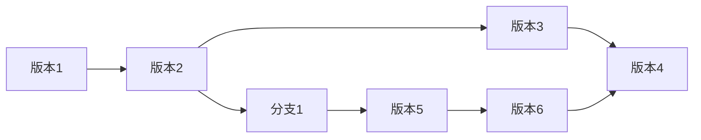

# 数据版本控制与数据管理原理与代码实战案例讲解

作者：禅与计算机程序设计艺术

## 1. 背景介绍

### 1.1 数据为王的时代，数据管理挑战重重

当今社会，数据已成为推动科技进步和社会发展的核心驱动力。从社交媒体的海量用户数据到金融行业的交易记录，从电商平台的商品信息到医疗领域的病历资料，各行各业都在不断产生和积累着海量的数据。这些数据蕴藏着巨大的价值，但也给数据管理带来了前所未有的挑战。

传统的数据管理方式已经难以满足日益增长的数据规模和复杂性需求。数据孤岛、数据一致性问题、数据安全风险等问题日益突出，严重制约着企业和组织对数据的有效利用。

### 1.2 数据版本控制与数据管理的联系

数据版本控制，顾名思义，就是对数据的不同版本进行管理，类似于代码版本控制系统（如Git）对代码的管理。通过数据版本控制，我们可以追踪数据的变化历史，回滚到之前的版本，比较不同版本之间的差异，协同多人对数据的修改等等。

数据版本控制是现代数据管理体系中不可或缺的一环，它能够有效解决传统数据管理方式面临的诸多挑战。

## 2. 核心概念与联系

### 2.1 数据版本控制的核心概念

* **版本:** 数据在某个时间点的状态，可以理解为数据的快照。
* **提交:** 将数据的修改保存为一个新的版本。
* **分支:** 从主线版本分离出来的一条独立的开发线，用于进行新功能开发、bug修复等工作，最终可以合并回主线版本。
* **合并:** 将不同分支上的修改合并到一起。
* **冲突:** 当多个分支对同一部分数据进行修改时，就会发生冲突，需要手动解决冲突才能继续合并。

### 2.2 数据版本控制与数据管理的联系

数据版本控制是数据管理的重要组成部分，它为数据管理提供了以下关键能力：

* **数据溯源:** 追踪数据的变化历史，了解数据的来源、修改时间、修改人等信息。
* **数据恢复:** 可以回滚到之前的任意版本，避免数据丢失或损坏。
* **数据协作:** 支持多人协同修改数据，避免版本冲突和数据覆盖。
* **数据审计:** 方便进行数据审计，追踪数据的修改记录，确保数据的安全性和合规性。

## 3. 核心算法原理具体操作步骤

数据版本控制系统通常采用以下几种算法来实现版本控制：

* **基于差异的版本控制:**  只存储每个版本与前一个版本之间的差异，节省存储空间。例如，Git就采用了这种算法。
* **基于状态的版本控制:** 存储每个版本的完整状态，方便进行版本比较和回滚。
* **混合式版本控制:** 结合了以上两种算法的优点。

以Git为例，介绍一下基于差异的版本控制算法的具体操作步骤：

1. **初始化仓库:** 创建一个新的Git仓库，用于存储数据。
2. **添加文件:** 将需要进行版本控制的文件添加到Git仓库中。
3. **提交修改:**  将文件的修改提交到Git仓库，生成一个新的版本。
4. **查看历史:** 查看文件的修改历史，包括每个版本的修改时间、修改人、修改内容等信息。
5. **回滚版本:** 将文件回滚到之前的某个版本。
6. **创建分支:**  从主线版本分离出一条新的分支，用于进行新功能开发或bug修复。
7. **合并分支:** 将分支上的修改合并到主线版本中。
8. **解决冲突:** 当多个分支对同一部分数据进行修改时，需要手动解决冲突。

## 4. 数学模型和公式详细讲解举例说明

数据版本控制系统中常用的数学模型和公式包括：

* **有向无环图（DAG）:** 用于表示版本之间的关系，每个节点代表一个版本，边代表版本之间的演进关系。
* **哈希算法:** 用于生成每个版本的唯一标识符，确保数据的完整性。
* **差异算法:** 用于计算两个版本之间的差异，例如，`diff`命令就使用了差异算法。

### 4.1  有向无环图（DAG）

下图是一个简单的Git版本历史图，它是一个有向无环图：



图中，每个节点代表一个版本，箭头表示版本之间的演进关系。例如，版本2是从版本1演进而来，版本4是从版本3和版本6演进而来。

### 4.2 哈希算法

哈希算法用于生成每个版本的唯一标识符，也称为版本号。版本号通常是一个长度固定的字符串，例如，Git的版本号是40位的SHA-1哈希值。

哈希算法的特点是：

* 不同的输入数据会生成不同的哈希值。
* 相同的输入数据会生成相同的哈希值。

通过版本号，可以唯一地标识一个版本，确保数据的完整性。

### 4.3 差异算法

差异算法用于计算两个版本之间的差异。例如，`diff`命令就使用了差异算法。

差异算法通常会比较两个版本的每一行代码，找出不同的行，并标记出来。例如，下面的代码展示了两个版本的差异：

```diff
--- a/test.txt
+++ b/test.txt
@@ -1,3 +1,4 @@
 This is a test file.
 
 This is the second line.
+This is a new line.
```

## 5. 项目实践：代码实例和详细解释说明

### 5.1 使用Git进行数据版本控制

```python
# 初始化一个新的Git仓库
git init

# 添加文件到Git仓库
git add data.csv

# 提交修改
git commit -m "Initial commit"

# 查看历史记录
git log

# 回滚到上一个版本
git revert HEAD^

# 创建一个新的分支
git checkout -b feature/new-feature

# 在分支上进行开发...

# 合并分支到主线版本
git checkout main
git merge feature/new-feature

# 解决冲突（如果存在）
# ...

# 提交合并后的代码
git commit -m "Merge feature/new-feature"
```

### 5.2 使用DVC进行机器学习模型版本控制

```python
# 初始化DVC
dvc init

# 追踪数据文件
dvc add data/

# 提交修改
git add .
git commit -m "Add data"

# 定义一个机器学习pipeline
dvc run -n train \
        -d data/ \
        -o model.pkl \
        python train.py

# 提交pipeline和模型
git add .
git commit -m "Train model"

# 查看实验记录
dvc exp show

# 切换到最佳模型版本
dvc checkout model.pkl@best
```

## 6. 实际应用场景

### 6.1 代码版本控制

* 软件开发：记录代码的修改历史，方便团队协作开发，回滚到之前的版本等。
* 文档管理：管理文档的不同版本，方便追踪文档的修改历史，恢复到之前的版本等。

### 6.2 数据版本控制

* 机器学习：管理机器学习模型的训练数据、模型参数、模型代码等，方便复现实验结果，比较不同模型的性能等。
* 数据分析：管理数据分析过程中的数据清洗、数据转换、数据可视化等代码，方便复现分析结果，追踪数据来源等。
* 数据仓库：管理数据仓库中的数据表、数据视图、ETL脚本等，方便追踪数据的变化历史，回滚到之前的版本等。

## 7. 工具和资源推荐

### 7.1 代码版本控制工具

* **Git:** 分布式版本控制系统，功能强大，使用广泛。
* **SVN:** 集中式版本控制系统，使用简单，适合小型项目。

### 7.2 数据版本控制工具

* **DVC:**  专门为机器学习设计的开源版本控制系统，可以追踪数据文件、模型文件、代码等。
* **LakeFS:**  开源的数据湖版本控制系统，可以管理云存储上的数据，提供类似于Git的版本控制功能。
* **Delta Lake:**  由Databricks开源的数据湖格式，提供了 ACID 事务、数据版本控制等功能。


## 8. 总结：未来发展趋势与挑战

### 8.1 未来发展趋势

* **数据版本控制与数据管理一体化:** 数据版本控制将更加紧密地与数据管理系统集成，提供更加便捷的数据版本控制功能。
* **云原生数据版本控制:**  随着云计算的普及，云原生数据版本控制系统将成为主流，提供更高的可扩展性和更低的成本。
* **人工智能驱动的版本控制:** 人工智能技术将被应用于数据版本控制，例如，自动解决版本冲突、智能推荐版本等。

### 8.2 面临的挑战

* **海量数据的版本控制:** 随着数据规模的不断增长，如何高效地管理海量数据的版本是一个巨大的挑战。
* **异构数据的版本控制:**  不同类型的数据（例如，结构化数据、非结构化数据）的版本控制方式存在差异，如何统一管理异构数据的版本是一个挑战。
* **数据安全与隐私保护:** 数据版本控制需要保障数据的安全性和隐私，防止数据泄露和滥用。

## 9. 附录：常见问题与解答

### 9.1  数据版本控制与代码版本控制有什么区别？

数据版本控制和代码版本控制有很多相似之处，但也有一些区别：

* **管理对象不同:** 代码版本控制主要管理代码文件，而数据版本控制可以管理各种类型的数据，例如，文本文件、数据库、机器学习模型等。
* **版本控制粒度不同:** 代码版本控制通常以行为单位进行版本控制，而数据版本控制可以以更细的粒度进行版本控制，例如，以数据表中的行、列为单位进行版本控制。
* **版本控制算法不同:** 代码版本控制通常采用基于差异的版本控制算法，而数据版本控制可以采用基于差异的版本控制算法、基于状态的版本控制算法或混合式版本控制算法。

### 9.2 如何选择适合自己的数据版本控制工具？

选择数据版本控制工具时，需要考虑以下因素：

* **数据类型:**  不同的数据版本控制工具支持的数据类型不同，例如，DVC主要用于管理机器学习模型，LakeFS主要用于管理云存储上的数据。
* **数据规模:**  不同的数据版本控制工具的性能和可扩展性不同，需要根据数据规模选择合适的工具。
* **成本:**  不同的数据版本控制工具的成本不同，需要根据预算选择合适的工具。

### 9.3  如何学习数据版本控制？

学习数据版本控制，可以参考以下资源：

* **Git官方文档:** https://git-scm.com/doc
* **DVC官方文档:** https://dvc.org/doc
* **LakeFS官方文档:** https://lakefs.io/docs/latest/
