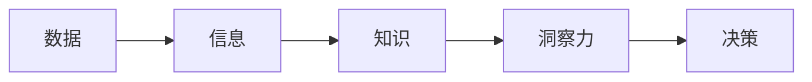

##  "数据驱动的决策体系：从数据到洞察力"

作者：禅与计算机程序设计艺术

## 1. 背景介绍

### 1.1. 信息时代的决策挑战

在当今信息爆炸的时代，企业和组织面临着前所未有的决策挑战。海量的数据、快速变化的市场环境以及日益激烈的竞争，使得传统的基于经验和直觉的决策方式难以适应。为了在复杂多变的环境中保持竞争优势，企业需要一种更加科学、高效的决策体系，而数据驱动的决策体系正是应对这一挑战的关键。

### 1.2. 数据驱动决策的兴起

数据驱动决策是指利用数据分析和挖掘技术，从海量数据中提取有价值的信息，并将其应用于决策过程。这种决策方式强调以数据为基础，以客观事实为依据，避免主观臆断和片面性，从而提高决策的准确性和科学性。

### 1.3. 数据驱动决策的优势

数据驱动决策体系相比传统决策方式具有以下显著优势：

* **提高决策的准确性**: 通过对数据的深入分析，可以揭示隐藏在数据背后的规律和趋势，从而避免主观臆断，提高决策的准确性。
* **增强决策的科学性**: 数据分析可以提供客观、量化的决策依据，避免决策过程中的主观性和随意性，增强决策的科学性。
* **提升决策的效率**: 数据分析可以帮助决策者快速识别关键问题，并提供相应的解决方案，从而提高决策的效率。
* **促进业务的持续改进**: 通过对数据的持续跟踪和分析，可以及时发现问题，并采取相应的措施进行改进，从而促进业务的持续改进。


## 2. 核心概念与联系

### 2.1. 数据、信息、知识和洞察力的关系

数据、信息、知识和洞察力是数据驱动决策体系中的四个核心概念，它们之间存在着密切的联系：

* **数据**:  是未经处理的原始素材，例如交易记录、用户行为数据、传感器数据等。
* **信息**: 是经过加工和整理的数据，具有一定的意义和价值，例如销售额、用户转化率、设备运行状态等。
* **知识**: 是从信息中提炼出来的规律、模式和规则，例如用户行为模式、市场趋势、产品性能规律等。
* **洞察力**: 是对知识的深入理解和应用，能够帮助决策者洞察问题的本质，并制定有效的解决方案。

数据是信息、知识和洞察力的基础，信息是知识和洞察力的来源，知识是洞察力的基础，而洞察力则是数据驱动决策的最终目标。

### 2.2. 数据驱动决策体系的构成要素

数据驱动决策体系通常由以下几个关键要素构成：

* **数据源**:  包括内部数据源（例如企业内部数据库、业务系统数据）和外部数据源（例如市场调研数据、社交媒体数据）。
* **数据仓库**:  用于存储和管理来自不同数据源的数据，并提供数据清洗、转换和整合等功能。
* **数据分析工具**:  用于对数据进行分析和挖掘，例如统计分析软件、机器学习平台、数据可视化工具等。
* **决策支持系统**:  用于将数据分析结果转化为可操作的决策建议，并提供决策模拟、风险评估等功能。
* **组织文化**:  数据驱动决策需要企业内部建立起数据驱动的文化，鼓励员工利用数据进行决策，并建立相应的激励机制。

### 2.3. 核心概念间关系图



## 3. 核心算法原理具体操作步骤

### 3.1. 数据收集与预处理

#### 3.1.1. 数据收集

数据收集是数据驱动决策的第一步，也是至关重要的一步。数据收集的目的是获取与决策问题相关的数据，并确保数据的完整性、准确性和一致性。数据收集可以通过多种方式进行，例如：

* **数据库**: 从企业内部数据库中获取相关数据。
* **API**: 通过应用程序接口从外部系统获取数据。
* **爬虫**:  使用网络爬虫从网站上抓取数据。
* **传感器**:  通过传感器收集物理世界的数据。
* **问卷调查**:  通过问卷调查收集用户反馈数据。

#### 3.1.2. 数据预处理

数据预处理是指对收集到的原始数据进行清洗、转换和整合，以便于后续的分析和挖掘。数据预处理包括以下几个步骤：

* **数据清洗**:  去除数据中的错误、缺失和重复值。
* **数据转换**:  将数据转换为适合分析的格式，例如将日期格式转换为标准格式。
* **数据整合**:  将来自不同数据源的数据整合到一起。

### 3.2. 数据分析与挖掘

数据分析与挖掘是数据驱动决策的核心环节，其目的是从数据中提取有价值的信息和知识，并将其应用于决策过程。数据分析与挖掘包括以下几个步骤：

#### 3.2.1. 描述性分析

描述性分析是指对数据进行汇总和描述，例如计算平均值、标准差、频率分布等统计指标，并使用图表和图形展示数据的特征。

#### 3.2.2. 探索性分析

探索性分析是指通过数据可视化、统计建模等方法，探索数据中隐藏的规律和模式，并提出假设和猜想。

#### 3.2.3. 预测性分析

预测性分析是指利用历史数据构建模型，预测未来趋势和行为，例如预测销售额、用户流失率等。

#### 3.2.4.  规范性分析

规范性分析是指根据预测结果，制定最佳行动方案，以优化决策结果。

### 3.3. 数据可视化

数据可视化是指将数据以图形化的方式展示出来，以便于理解和分析。数据可视化可以帮助决策者更直观地了解数据的特征和规律，并从中发现潜在的洞察力。常用的数据可视化工具包括：

* **Tableau**
* **Power BI**
* **Qlik Sense**
* **D3.js**

### 3.4. 决策支持系统

决策支持系统是数据驱动决策体系的重要组成部分，其目的是将数据分析结果转化为可操作的决策建议，并提供决策模拟、风险评估等功能。决策支持系统可以帮助决策者更好地理解数据分析结果，并做出更科学、更合理的决策。

## 4. 数学模型和公式详细讲解举例说明

### 4.1. 线性回归

线性回归是一种常用的预测性分析方法，其目的是建立一个线性模型，用于预测一个连续变量的值。线性回归模型的公式如下：

$$
y = \beta_0 + \beta_1 x_1 + \beta_2 x_2 + ... + \beta_n x_n + \epsilon
$$

其中：

* $y$ 是被预测的变量
* $x_1, x_2, ..., x_n$ 是预测变量
* $\beta_0, \beta_1, \beta_2, ..., \beta_n$ 是模型参数
* $\epsilon$ 是误差项

**举例说明**:

假设我们想要预测一家公司的销售额，我们可以使用线性回归模型，将公司的广告支出、员工数量和市场份额作为预测变量。通过收集历史数据，并使用线性回归模型进行训练，我们可以得到一个预测模型，用于预测未来的销售额。

### 4.2. 逻辑回归

逻辑回归是一种常用的分类算法，其目的是建立一个模型，用于预测一个二元变量的值（例如是/否、成功/失败）。逻辑回归模型的公式如下：

$$
p = \frac{1}{1 + e^{-(\beta_0 + \beta_1 x_1 + \beta_2 x_2 + ... + \beta_n x_n)}}
$$

其中：

* $p$ 是事件发生的概率
* $x_1, x_2, ..., x_n$ 是预测变量
* $\beta_0, \beta_1, \beta_2, ..., \beta_n$ 是模型参数

**举例说明**:

假设我们想要预测一个用户是否会点击一个广告，我们可以使用逻辑回归模型，将用户的年龄、性别、兴趣爱好和浏览历史作为预测变量。通过收集历史数据，并使用逻辑回归模型进行训练，我们可以得到一个预测模型，用于预测用户点击广告的概率。

## 5. 项目实践：代码实例和详细解释说明

### 5.1. Python数据分析库

Python是一种常用的数据分析编程语言，拥有丰富的第三方库，可以用于数据收集、预处理、分析和可视化。以下是一些常用的Python数据分析库：

* **Pandas**: 用于数据处理和分析，提供DataFrame数据结构，方便进行数据清洗、转换和整合。
* **NumPy**: 用于科学计算，提供多维数组对象和高性能的数学函数库。
* **Scikit-learn**: 用于机器学习，提供各种机器学习算法的实现，例如线性回归、逻辑回归、决策树等。
* **Matplotlib**: 用于数据可视化，提供各种图表和图形的绘制函数。

### 5.2. 代码实例：使用Pandas和Scikit-learn进行线性回归分析

```python
import pandas as pd
from sklearn.linear_model import LinearRegression

# 读取数据
data = pd.read_csv('sales_data.csv')

# 选择预测变量和目标变量
X = data[['advertising_spending', 'employee_count', 'market_share']]
y = data['sales']

# 创建线性回归模型
model = LinearRegression()

# 训练模型
model.fit(X, y)

# 打印模型参数
print(model.coef_)
print(model.intercept_)

# 预测未来销售额
future_data = pd.DataFrame({'advertising_spending': [10000], 'employee_count': [100], 'market_share': [0.1]})
future_sales = model.predict(future_data)

# 打印预测结果
print(future_sales)
```

**代码解释**:

* 首先，我们使用Pandas库读取销售数据。
* 然后，我们选择广告支出、员工数量和市场份额作为预测变量，并将销售额作为目标变量。
* 接下来，我们创建线性回归模型，并使用历史数据训练模型。
* 训练完成后，我们可以打印模型参数，包括系数和截距。
* 最后，我们可以使用训练好的模型预测未来销售额。

## 6. 实际应用场景

### 6.1. 金融行业

* **风险管理**: 利用数据分析技术，评估借款人的信用风险，预测贷款违约概率。
* **欺诈检测**: 利用机器学习算法，识别异常交易行为，预防信用卡欺诈。
* **投资决策**: 利用数据挖掘技术，分析市场趋势，预测股票价格走势。

### 6.2. 电商行业

* **精准营销**: 利用用户行为数据，进行用户画像分析，实现精准广告投放。
* **商品推荐**: 利用协同过滤算法，根据用户历史购买记录，推荐用户可能感兴趣的商品。
* **库存管理**: 利用预测性分析技术，预测商品需求量，优化库存管理策略。

### 6.3. 医疗行业

* **疾病诊断**: 利用机器学习算法，分析患者的病历数据，辅助医生进行疾病诊断。
* **药物研发**: 利用数据挖掘技术，分析药物研发数据，加速新药研发进程。
* **健康管理**: 利用可穿戴设备数据，监测用户的健康状况，提供个性化的健康管理建议。

## 7. 总结：未来发展趋势与挑战

### 7.1. 未来发展趋势

* **人工智能技术的深度融合**: 人工智能技术将与数据驱动决策体系深度融合，例如利用深度学习算法进行更精准的预测和分析。
* **大数据技术的不断发展**: 大数据技术将为数据驱动决策提供更强大的数据存储、处理和分析能力。
* **数据安全和隐私保护**: 随着数据量的不断增加，数据安全和隐私保护将成为数据驱动决策体系面临的重要挑战。

### 7.2. 面临的挑战

* **数据质量问题**: 数据质量是数据驱动决策的基础，低质量的数据会导致分析结果的偏差，影响决策的准确性。
* **数据孤岛问题**: 数据孤岛是指数据分散在不同的系统中，难以进行整合和分析。
* **人才缺乏问题**: 数据驱动决策需要具备数据分析、机器学习等专业技能的人才，而目前这类人才较为缺乏。

## 8. 附录：常见问题与解答

### 8.1.  数据驱动决策体系的实施步骤是什么？

数据驱动决策体系的实施通常包括以下步骤：

1. **明确目标**: 确定数据驱动决策的目标，例如提高销售额、降低成本、优化运营效率等。
2. **数据收集**: 收集与目标相关的数据，并确保数据的完整性、准确性和一致性。
3. **数据预处理**: 对收集到的数据进行清洗、转换和整合，以便于后续的分析和挖掘。
4. **数据分析**: 利用数据分析工具，对数据进行分析和挖掘，提取有价值的信息和知识。
5. **决策制定**: 根据数据分析结果，制定决策方案，并进行决策模拟和风险评估。
6. **决策执行**: 执行决策方案，并对决策结果进行跟踪和评估。
7. **持续改进**: 根据决策结果和数据分析结果，对决策体系进行持续改进。

### 8.2.  如何评估数据驱动决策体系的有效性？

评估数据驱动决策体系的有效性可以从以下几个方面进行：

* **决策的准确性**: 评估决策方案是否能够有效地解决问题，并达到预期目标。
* **决策的效率**: 评估决策过程的效率，例如决策制定和执行的时间成本。
* **决策的效益**: 评估决策方案带来的经济效益，例如销售额的增长、成本的降低等。
* **用户满意度**: 评估决策方案对用户的影响，例如用户对产品或服务的满意度。


### 8.3.  如何解决数据孤岛问题？

解决数据孤岛问题可以采取以下措施：

* **建立数据仓库**: 将分散在不同系统中的数据整合到数据仓库中，方便进行统一的分析和挖掘。
* **使用数据虚拟化技术**: 通过数据虚拟化技术，将不同数据源的数据虚拟化成一个统一的视图，方便进行跨数据源的分析。
* **加强数据治理**: 建立数据治理体系，制定数据标准和规范，确保数据的 consistency 和 accuracy。
