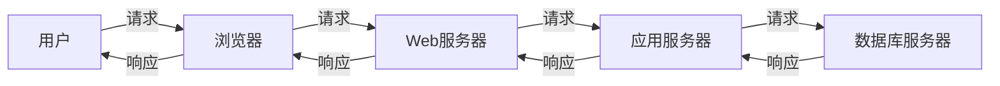

## 1. 背景介绍

### 1.1 新闻信息化的重要性

随着互联网技术的飞速发展和普及，信息传播的速度和广度都发生了翻天覆地的变化。新闻作为信息传播的重要载体，其时效性和覆盖面都对社会发展起着至关重要的作用。传统的新闻传播方式已经难以满足人们日益增长的信息需求，因此，新闻信息化成为了必然趋势。

### 1.2 新闻管理系统的需求分析

新闻管理系统应运而生，它能够高效地管理新闻信息，并通过多种渠道进行发布。一个完善的新闻管理系统需要具备以下功能：

*   **新闻采集:**  支持多种新闻来源，例如手动添加、网络爬虫等；
*   **新闻编辑:**  提供丰富的文本编辑功能，例如排版、插入图片、视频等；
*   **新闻审核:**  对新闻内容进行审核，确保新闻的真实性和准确性；
*   **新闻发布:**  支持将新闻发布到网站、APP、公众号等多个平台；
*   **新闻检索:**  提供便捷的新闻检索功能，方便用户快速找到所需信息；
*   **用户管理:**  对用户进行权限管理，例如管理员、编辑、普通用户等；
*   **数据统计:**  对新闻的浏览量、评论量等数据进行统计分析。

## 2. 核心概念与联系

### 2.1 系统架构

新闻管理系统通常采用B/S架构，即浏览器/服务器架构。用户通过浏览器访问系统，服务器端负责处理用户请求、存储和管理数据。



### 2.2 数据库设计

新闻管理系统的数据存储通常采用关系型数据库，例如MySQL、Oracle等。以下是新闻管理系统中常用的数据表：

*   **新闻表:**  存储新闻标题、内容、作者、发布时间等信息；
*   **用户表:**  存储用户名、密码、权限等信息；
*   **栏目表:**  存储新闻栏目名称、层级关系等信息；
*   **评论表:**  存储用户对新闻的评论信息。

## 3. 核心算法原理具体操作步骤

### 3.1 新闻发布流程

1.  用户登录系统，选择发布新闻；
2.  填写新闻标题、内容、选择栏目等信息；
3.  提交新闻，系统自动将新闻保存到数据库中；
4.  管理员审核新闻，审核通过后发布到网站、APP等平台。

### 3.2 新闻检索算法

新闻管理系统通常采用全文检索技术实现新闻检索功能，例如Lucene、Elasticsearch等。全文检索技术可以根据用户输入的关键词，快速从海量数据中检索出相关新闻。

### 3.3 用户权限管理

新闻管理系统通常采用基于角色的访问控制（RBAC）模型进行用户权限管理。RBAC模型将用户、角色和权限三者关联起来，用户通过被赋予不同的角色获得相应的权限。

## 4. 数学模型和公式详细讲解举例说明

新闻管理系统中涉及的数学模型和公式相对较少，主要是一些数据统计分析方面的算法，例如：

*   **平均浏览量:**  统计一段时间内所有新闻的总浏览量，并除以新闻数量，得到平均每篇新闻的浏览量；
*   **热度指数:**  根据新闻的浏览量、评论量、发布时间等因素，计算出新闻的热度指数，用于对新闻进行排序和推荐。

## 5. 项目实践：代码实例和详细解释说明

### 5.1 技术选型

本项目采用以下技术栈进行开发：

*   **后端:**  Spring Boot
*   **数据库:**  MySQL
*   **前端:**  Vue.js

### 5.2 代码实例

#### 5.2.1 新闻发布接口

```java
@RestController
@RequestMapping("/news")
public class NewsController {

    @Autowired
    private NewsService newsService;

    @PostMapping("/publish")
    public Result publishNews(@RequestBody News news) {
        newsService.publishNews(news);
        return Result.success();
    }
}
```

#### 5.2.2 新闻检索接口

```java
@RestController
@RequestMapping("/news")
public class NewsController {

    @Autowired
    private NewsService newsService;

    @GetMapping("/search")
    public Result searchNews(@RequestParam String keyword) {
        List<News> newsList = newsService.searchNews(keyword);
        return Result.success(newsList);
    }
}
```

## 6. 实际应用场景

新闻管理系统可以应用于各种需要发布和管理新闻信息的场景，例如：

*   **新闻网站:**  例如新浪、网易等新闻门户网站；
*   **政府机构:**  用于发布政府公告、政策法规等信息；
*   **企业官网:**  用于发布企业新闻、产品动态等信息；
*   **学校网站:**  用于发布学校新闻、通知公告等信息。

## 7. 总结：未来发展趋势与挑战

### 7.1 未来发展趋势

*   **人工智能:**  人工智能技术可以应用于新闻采集、编辑、审核等环节，提高新闻生产效率和质量；
*   **大数据:**  通过对海量新闻数据的分析，可以挖掘出新闻热点、用户兴趣等 valuable 信息；
*   **移动互联网:**  移动互联网的普及，对新闻管理系统的移动端体验提出了更高的要求。

### 7.2 面临的挑战

*   **信息安全:**  新闻管理系统存储着大量的敏感信息，需要做好信息安全防护工作；
*   **技术更新:**  互联网技术发展迅速，新闻管理系统需要不断更新迭代，才能适应新的技术环境；
*   **用户需求:**  用户对新闻信息的需求不断变化，新闻管理系统需要不断优化功能，才能满足用户需求。

## 8. 附录：常见问题与解答

### 8.1 如何保证新闻的真实性和准确性？

*   建立完善的新闻审核机制，对新闻内容进行严格审核；
*   使用可靠的新闻来源，例如官方网站、权威媒体等；
*   鼓励用户举报虚假新闻。

### 8.2 如何提高新闻的传播效果？

*   选择合适的新闻发布平台；
*   优化新闻标题和内容，提高新闻的吸引力；
*   利用社交媒体等渠道进行推广。

### 8.3 如何做好新闻管理系统的信息安全工作？

*   对用户进行权限管理，限制用户对敏感信息的访问；
*   对系统进行安全加固，防止黑客攻击；
*   定期备份数据，防止数据丢失。
