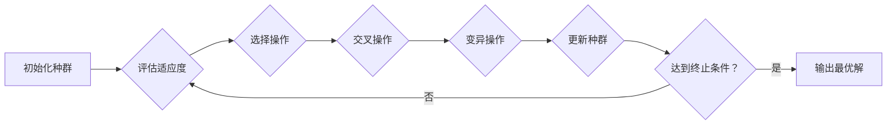

##  智能控制系统中的遗传算法应用

作者：禅与计算机程序设计艺术

## 1. 背景介绍

### 1.1 智能控制系统概述

智能控制系统是一种能够模拟人类智能，实现自主学习、推理、决策和控制的复杂系统。它融合了人工智能、自动控制、传感器技术、计算机技术等多个学科的最新成果，广泛应用于机器人、航空航天、工业自动化、智能交通等领域。

### 1.2 遗传算法的兴起与发展

遗传算法（Genetic Algorithm, GA）是一种模拟自然界生物进化过程的优化算法，其基本思想是将问题的解表示为染色体，通过模拟自然选择、交叉和变异等操作，不断迭代进化出更优的解。自20世纪60年代提出以来，遗传算法凭借其全局搜索能力强、鲁棒性好、易于并行化等优点，在函数优化、机器学习、组合优化等领域得到了广泛应用。

### 1.3 遗传算法在智能控制系统中的应用价值

智能控制系统通常面临着高维、非线性、多目标等复杂优化问题，传统控制方法难以有效解决。遗传算法作为一种全局优化算法，能够有效克服传统方法的局限性，为智能控制系统的设计和优化提供了新的思路和方法。


## 2. 核心概念与联系

### 2.1 遗传算法基本概念

* **个体(Individual):** 问题解的一种编码表示，通常为一个向量，每个元素代表一个决策变量。
* **种群(Population):** 由多个个体组成的集合，代表了搜索空间中的一组候选解。
* **适应度函数(Fitness function):** 用于评价个体优劣的指标，反映了个体对环境的适应程度。
* **选择算子(Selection operator):** 根据个体的适应度值，选择优良个体进入下一代。
* **交叉算子(Crossover operator):** 将两个父代个体的部分基因进行交换，产生新的子代个体。
* **变异算子(Mutation operator):** 对个体的某些基因进行随机改变，增加种群多样性。

### 2.2 智能控制系统基本结构

* **感知层:** 通过各种传感器感知外部环境信息。
* **决策层:** 根据感知到的信息进行分析、推理和决策，制定控制策略。
* **执行层:** 根据决策层的指令，控制执行机构完成相应的动作。

### 2.3 遗传算法与智能控制系统的联系

遗传算法可以应用于智能控制系统的各个环节，例如：

* **控制器参数优化:** 利用遗传算法优化PID控制器、模糊控制器等参数，提高控制精度和响应速度。
* **路径规划:** 利用遗传算法搜索最优路径，避开障碍物，实现机器人导航、无人驾驶等功能。
* **任务调度:** 利用遗传算法优化任务分配方案，提高资源利用率和系统效率。

## 3. 核心算法原理具体操作步骤

### 3.1 遗传算法流程图



### 3.2 具体操作步骤

1. **初始化种群:** 随机生成一定数量的个体，构成初始种群。
2. **评估适应度:** 计算每个个体的适应度值，评价其优劣。
3. **选择操作:** 根据个体的适应度值，选择优良个体进入下一代。常用的选择算子有轮盘赌选择、锦标赛选择等。
4. **交叉操作:** 将两个父代个体的部分基因进行交换，产生新的子代个体。常用的交叉算子有单点交叉、多点交叉等。
5. **变异操作:** 对个体的某些基因进行随机改变，增加种群多样性。常用的变异算子有位翻转变异、高斯变异等。
6. **更新种群:** 用新生成的子代个体替换部分或全部父代个体，形成新的种群。
7. **判断终止条件:** 判断是否达到预设的终止条件，例如达到最大迭代次数、找到满足要求的解等。如果达到终止条件，则输出最优解；否则，返回步骤2继续迭代。

## 4. 数学模型和公式详细讲解举例说明

### 4.1 适应度函数设计

适应度函数是遗传算法的核心，其设计直接影响算法的收敛速度和解的质量。适应度函数的设计需要根据具体问题进行，通常需要考虑以下因素：

* **目标函数:** 优化问题的目标函数，例如最小化路径长度、最大化利润等。
* **约束条件:** 优化问题需要满足的约束条件，例如机器人运动范围、资源限制等。
* **惩罚函数:** 对违反约束条件的解进行惩罚，引导算法搜索可行解。

**举例说明:**

假设我们要优化一个二维函数 $f(x,y) = x^2 + y^2$，约束条件为 $0 \le x \le 10$，$0 \le y \le 10$。我们可以设计如下适应度函数：

$$
Fitness(x,y) = \begin{cases}
-f(x,y), & 0 \le x \le 10, 0 \le y \le 10 \\
-f(x,y) - 1000(x-10)^2, & x > 10 \\
-f(x,y) - 1000(y-10)^2, & y > 10
\end{cases}
$$

其中，$-f(x,y)$ 表示目标函数值，$-1000(x-10)^2$ 和 $-1000(y-10)^2$ 表示对违反约束条件的惩罚项。

### 4.2 选择算子

**轮盘赌选择:**

1. 计算每个个体的选择概率：$P_i = \frac{Fitness_i}{\sum_{j=1}^{N} Fitness_j}$，其中 $Fitness_i$ 表示第 $i$ 个个体的适应度值，$N$ 表示种群大小。
2. 生成一个随机数 $r \in [0,1]$。
3. 选择轮盘上指针指向的个体，即满足 $\sum_{j=1}^{i-1} P_j < r \le \sum_{j=1}^{i} P_j$ 的个体。

**锦标赛选择:**

1. 从种群中随机选择 $k$ 个个体。
2. 选择适应度值最高的个体进入下一代。

### 4.3 交叉算子

**单点交叉:**

1. 随机选择一个交叉点 $pos$。
2. 将两个父代个体在交叉点处断裂，交换两部分基因片段，生成两个子代个体。

**多点交叉:**

1. 随机选择多个交叉点。
2. 将两个父代个体在交叉点处断裂，交换两部分基因片段，生成两个子代个体。

### 4.4 变异算子

**位翻转变异:**

1. 随机选择一个个体。
2. 将该个体的某个基因位的值取反。

**高斯变异:**

1. 随机选择一个个体。
2. 将该个体的某个基因值加上一个服从高斯分布的随机数。

## 5. 项目实践：代码实例和详细解释说明

### 5.1 Python代码实现

```python
import random
import numpy as np

# 定义问题参数
POPULATION_SIZE = 100  # 种群大小
CHROMOSOME_LENGTH = 2  # 染色体长度
MAX_GENERATION = 100  # 最大迭代次数
CROSSOVER_RATE = 0.8  # 交叉概率
MUTATION_RATE = 0.1  # 变异概率

# 定义适应度函数
def fitness_function(x):
    return x[0]**2 + x[1]**2

# 初始化种群
def initialize_population():
    population = []
    for i in range(POPULATION_SIZE):
        chromosome = [random.uniform(0, 10) for j in range(CHROMOSOME_LENGTH)]
        population.append(chromosome)
    return population

# 选择操作
def selection(population):
    fitness_values = [fitness_function(chromosome) for chromosome in population]
    total_fitness = sum(fitness_values)
    probabilities = [fitness / total_fitness for fitness in fitness_values]
    selected_indices = np.random.choice(
        POPULATION_SIZE, size=POPULATION_SIZE, p=probabilities
    )
    selected_population = [population[i] for i in selected_indices]
    return selected_population

# 交叉操作
def crossover(population):
    new_population = []
    for i in range(0, POPULATION_SIZE, 2):
        parent1 = population[i]
        parent2 = population[i + 1]
        if random.random() < CROSSOVER_RATE:
            crossover_point = random.randint(1, CHROMOSOME_LENGTH - 1)
            child1 = parent1[:crossover_point] + parent2[crossover_point:]
            child2 = parent2[:crossover_point] + parent1[crossover_point:]
            new_population.append(child1)
            new_population.append(child2)
        else:
            new_population.append(parent1)
            new_population.append(parent2)
    return new_population

# 变异操作
def mutation(population):
    for i in range(POPULATION_SIZE):
        for j in range(CHROMOSOME_LENGTH):
            if random.random() < MUTATION_RATE:
                population[i][j] += random.gauss(0, 1)
    return population

# 主函数
def main():
    # 初始化种群
    population = initialize_population()

    # 迭代进化
    for generation in range(MAX_GENERATION):
        # 选择操作
        population = selection(population)

        # 交叉操作
        population = crossover(population)

        # 变异操作
        population = mutation(population)

        # 输出当前最优解
        best_chromosome = min(population, key=fitness_function)
        best_fitness = fitness_function(best_chromosome)
        print(
            f"Generation {generation + 1}: Best fitness = {best_fitness}, Best chromosome = {best_chromosome}"
        )

    # 输出最终最优解
    best_chromosome = min(population, key=fitness_function)
    best_fitness = fitness_function(best_chromosome)
    print(
        f"\nFinal best fitness = {best_fitness}, Final best chromosome = {best_chromosome}"
    )


if __name__ == "__main__":
    main()
```

### 5.2 代码解释

* **问题参数定义:** 定义了种群大小、染色体长度、最大迭代次数、交叉概率和变异概率等参数。
* **适应度函数定义:** 定义了适应度函数，用于评价个体的优劣。
* **初始化种群:** 随机生成一定数量的个体，构成初始种群。
* **选择操作:** 使用轮盘赌选择方法，根据个体的适应度值，选择优良个体进入下一代。
* **交叉操作:** 使用单点交叉方法，将两个父代个体的部分基因进行交换，产生新的子代个体。
* **变异操作:** 使用高斯变异方法，对个体的某些基因进行随机改变，增加种群多样性。
* **主函数:** 迭代执行选择、交叉和变异操作，直到达到最大迭代次数，输出最终最优解。

## 6. 实际应用场景

### 6.1 机器人控制

* **路径规划:** 利用遗传算法搜索最优路径，避开障碍物，实现机器人导航。
* **运动控制:** 利用遗传算法优化机器人关节运动轨迹，实现平滑、高效的运动控制。
* **行为控制:** 利用遗传算法优化机器人行为策略，实现复杂任务的自主完成。

### 6.2 工业过程控制

* **参数优化:** 利用遗传算法优化PID控制器、模糊控制器等参数，提高控制精度和响应速度。
* **系统辨识:** 利用遗传算法辨识工业过程的数学模型，为控制器设计提供依据。
* **故障诊断:** 利用遗传算法分析传感器数据，识别系统故障，提高系统可靠性。

### 6.3 其他应用场景

* **金融领域:** 投资组合优化、风险管理等。
* **交通领域:** 交通信号灯控制、车辆调度等。
* **医疗领域:** 药物设计、基因分析等。

## 7. 工具和资源推荐

* **遗传算法工具箱:** MATLAB、Python等编程语言都提供了遗传算法工具箱，方便用户快速实现遗传算法。
* **开源遗传算法库:** DEAP、PyGMO等开源库提供了丰富的遗传算法算子、数据结构和可视化工具。
* **在线资源:** 网上有很多关于遗传算法的教程、博客和论坛，可以帮助用户学习和交流。

## 8. 总结：未来发展趋势与挑战

### 8.1 未来发展趋势

* **与其他人工智能技术的融合:** 将遗传算法与深度学习、强化学习等技术相结合，构建更加智能的控制系统。
* **多目标优化:** 研究多目标遗传算法，解决多目标优化问题。
* **并行计算:** 利用GPU等并行计算技术，提高遗传算法的运行效率。

### 8.2 面临的挑战

* **算法参数设置:** 遗传算法的性能对参数设置比较敏感，需要根据具体问题进行调整。
* **早熟收敛:** 遗传算法容易陷入局部最优解，需要采取措施避免早熟收敛。
* **计算复杂度:** 对于大规模问题，遗传算法的计算复杂度较高，需要开发高效的算法。

## 9.  附录：常见问题与解答

### 9.1  如何选择合适的遗传算法参数？

遗传算法的参数设置对算法的性能影响很大，需要根据具体问题进行调整。一般来说，可以采用以下方法：

* **经验法:** 根据以往经验设置参数。
* **实验法:** 通过实验测试不同参数组合的性能，选择最优参数。
* **自适应方法:** 利用算法自身的信息动态调整参数。

### 9.2 如何避免遗传算法早熟收敛？

遗传算法容易陷入局部最优解，可以采取以下措施避免早熟收敛：

* **增加种群多样性:**  采用多种交叉和变异算子，增加种群多样性。
* **引入精英策略:**  将每一代最优个体直接复制到下一代，避免丢失优秀基因。
* **采用小生境技术:**  将种群划分为多个子种群，每个子种群独立进化，避免种群过早收敛。

### 9.3 遗传算法有哪些优缺点？

**优点:**

* 全局搜索能力强。
* 鲁棒性好，对噪声不敏感。
* 易于并行化。

**缺点:**

*  参数设置困难。
*  容易早熟收敛。
*  计算复杂度高。
