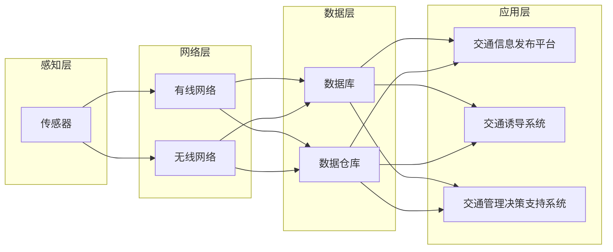

## 1. 背景介绍

### 1.1 交通信息化发展现状

随着城市化进程的加快和机动车保有量的迅速增长，交通拥堵、交通事故、环境污染等问题日益突出，传统的交通管理模式已经难以满足现代化城市交通管理的需求。智能交通系统（Intelligent Transportation System，ITS）作为一种先进的交通管理模式，利用现代信息技术和通信技术，能够有效地缓解交通拥堵、提高道路通行能力、保障交通安全、减少环境污染。

### 1.2 智能道路交通信息管理系统的需求分析

智能道路交通信息管理系统是智能交通系统的重要组成部分，其主要目标是通过采集、处理、发布道路交通信息，为交通管理者和出行者提供实时、准确、全面的交通信息服务，从而提高道路交通管理水平和出行效率。

具体来说，智能道路交通信息管理系统需要满足以下需求：

- **实时性：** 交通信息具有很强的时效性，系统需要能够实时采集、处理和发布交通信息，保证信息的及时性和有效性。
- **准确性：** 交通信息必须准确可靠，才能为交通管理和出行决策提供有效支持。系统需要采用可靠的技术手段，确保信息的准确性和完整性。
- **全面性：** 系统需要采集和处理多种类型的交通信息，包括道路交通流量、车速、占有率、交通事件、气象条件等，以便全面掌握道路交通状况。
- **易用性：** 系统需要提供友好的人机交互界面，方便用户查询和使用交通信息。
- **可扩展性：** 随着交通信息化建设的不断发展，系统需要具备良好的可扩展性，能够方便地进行功能升级和扩展。

## 2. 核心概念与联系

### 2.1 系统架构

智能道路交通信息管理系统通常采用分层架构，主要包括以下几个层次：

- **感知层：** 负责采集道路交通信息，主要包括各种传感器、视频监控设备、车载终端等。
- **网络层：** 负责传输交通信息，主要包括有线网络、无线网络等。
- **数据层：** 负责存储和管理交通信息，主要包括数据库、数据仓库等。
- **应用层：** 负责提供交通信息服务，主要包括交通信息发布平台、交通诱导系统、交通管理决策支持系统等。

### 2.2 关键技术

智能道路交通信息管理系统涉及的关键技术包括：

- **传感器技术：** 用于采集道路交通流量、车速、占有率等信息。常用的传感器包括地磁传感器、视频检测器、微波雷达等。
- **通信技术：** 用于传输交通信息，常用的通信技术包括光纤通信、无线通信等。
- **数据库技术：** 用于存储和管理海量的交通信息，常用的数据库管理系统包括Oracle、MySQL、PostgreSQL等。
- **数据挖掘技术：** 用于分析和挖掘交通信息，发现交通规律和趋势，为交通管理和决策提供支持。
- **人工智能技术：** 用于实现交通信息智能化处理，例如交通事件自动检测、交通流量预测等。

### 2.3 概念联系

下图展示了智能道路交通信息管理系统中各个核心概念之间的联系：



## 3. 核心算法原理具体操作步骤

### 3.1 交通流量检测算法

交通流量检测是智能道路交通信息管理系统的基础功能之一。常用的交通流量检测算法包括：

#### 3.1.1 视频图像处理算法

- **步骤 1：** 对视频图像进行预处理，包括去噪、增强等操作。
- **步骤 2：** 对预处理后的图像进行目标检测，识别出车辆目标。
- **步骤 3：** 对车辆目标进行跟踪，统计车辆数量和速度等信息。

#### 3.1.2 地磁感应线圈算法

- **步骤 1：** 在道路上埋设地磁感应线圈。
- **步骤 2：** 当车辆经过线圈上方时，会引起线圈磁场的变化。
- **步骤 3：** 通过检测线圈磁场的变化，可以统计车辆数量和速度等信息。

### 3.2 交通事件检测算法

交通事件检测是指自动识别道路上发生的交通事故、拥堵、道路施工等异常事件。常用的交通事件检测算法包括：

#### 3.2.1 基于视频图像处理的交通事件检测算法

- **步骤 1：** 对视频图像进行预处理，包括去噪、增强等操作。
- **步骤 2：** 对预处理后的图像进行目标检测，识别出车辆、行人等目标。
- **步骤 3：** 对目标进行跟踪，分析目标的行为特征，例如速度、轨迹、姿态等。
- **步骤 4：** 根据目标的行为特征，判断是否发生交通事件。

#### 3.2.2 基于交通流参数的交通事件检测算法

- **步骤 1：** 采集道路交通流量、车速、占有率等参数。
- **步骤 2：** 对交通流参数进行分析，例如计算交通流密度、速度方差等指标。
- **步骤 3：** 根据交通流参数的变化趋势，判断是否发生交通事件。

## 4. 数学模型和公式详细讲解举例说明

### 4.1 交通流模型

交通流模型用于描述道路交通流的运动规律，常用的交通流模型包括：

#### 4.1.1 格林希尔治模型（Greenshields Model）

格林希尔治模型是最简单的交通流模型之一，它假设车辆的速度与交通流密度成线性关系：

$$
v = v_f (1 - \frac{k}{k_j})
$$

其中：

- $v$ 表示车辆速度
- $v_f$ 表示自由流速度（即道路畅通时的速度）
- $k$ 表示交通流密度（即单位长度道路上的车辆数量）
- $k_j$ 表示道路拥堵时的交通流密度

#### 4.1.2 Greenberg模型

Greenberg模型是对格林希尔治模型的一种改进，它考虑了驾驶员反应时间的影响：

$$
v = v_f \ln(1 + \frac{k_j - k}{k_c})
$$

其中：

- $k_c$ 表示临界交通流密度，当交通流密度超过临界值时，交通流速度会急剧下降

#### 4.1.3 交通波模型

交通波模型用于描述交通流中的波动现象，例如交通拥堵的形成和消散。交通波模型通常采用偏微分方程来描述交通流的运动规律。

### 4.2 交通流参数计算公式

#### 4.2.1 交通流密度

交通流密度表示单位长度道路上的车辆数量，计算公式如下：

$$
k = \frac{N}{L}
$$

其中：

- $N$ 表示道路上的车辆数量
- $L$ 表示道路长度

#### 4.2.2 车速

车速表示车辆在单位时间内行驶的距离，计算公式如下：

$$
v = \frac{d}{t}
$$

其中：

- $d$ 表示车辆行驶的距离
- $t$ 表示车辆行驶的时间

#### 4.2.3 占有率

占有率表示车辆占据道路的比例，计算公式如下：

$$
O = \frac{l \times N}{L}
$$

其中：

- $l$ 表示车辆的平均长度

## 5. 项目实践：代码实例和详细解释说明

### 5.1 交通流量检测代码实例

```python
import cv2

# 加载视频文件
video_capture = cv2.VideoCapture("traffic.mp4")

# 初始化车辆计数器
vehicle_count = 0

# 定义车辆检测函数
def detect_vehicles(frame):
    # 将图像转换为灰度图像
    gray = cv2.cvtColor(frame, cv2.COLOR_BGR2GRAY)

    # 进行高斯模糊
    blur = cv2.GaussianBlur(gray, (5, 5), 0)

    # 进行边缘检测
    edges = cv2.Canny(blur, 50, 150)

    # 进行形态学操作
    kernel = cv2.getStructuringElement(cv2.MORPH_RECT, (5, 5))
    dilation = cv2.dilate(edges, kernel, iterations=2)

    # 查找轮廓
    contours, hierarchy = cv2.findContours(dilation, cv2.RETR_EXTERNAL, cv2.CHAIN_APPROX_SIMPLE)

    # 遍历所有轮廓
    for contour in contours:
        # 计算轮廓面积
        area = cv2.contourArea(contour)

        # 如果轮廓面积大于阈值，则认为是车辆
        if area > 1000:
            # 绘制车辆边界框
            x, y, w, h = cv2.boundingRect(contour)
            cv2.rectangle(frame, (x, y), (x + w, y + h), (0, 255, 0), 2)

            # 车辆计数器加 1
            global vehicle_count
            vehicle_count += 1

    # 返回处理后的图像和车辆数量
    return frame, vehicle_count

# 处理视频帧
while True:
    # 读取视频帧
    ret, frame = video_capture.read()

    # 如果读取到视频帧，则进行处理
    if ret:
        # 进行车辆检测
        processed_frame, vehicle_count = detect_vehicles(frame)

        # 显示处理后的图像和车辆数量
        cv2.putText(processed_frame, "Vehicle Count: {}".format(vehicle_count), (10, 30), cv2.FONT_HERSHEY_SIMPLEX, 1, (0, 0, 255), 2)
        cv2.imshow("Traffic Flow Detection", processed_frame)

        # 按下 'q' 键退出
        if cv2.waitKey(1) & 0xFF == ord('q'):
            break
    else:
        break

# 释放资源
video_capture.release()
cv2.destroyAllWindows()
```

**代码解释：**

- 首先，加载视频文件并初始化车辆计数器。
- 然后，定义一个 `detect_vehicles` 函数，用于检测视频帧中的车辆。
- 在 `detect_vehicles` 函数中，首先对视频帧进行预处理，包括转换为灰度图像、高斯模糊、边缘检测、形态学操作等。
- 然后，查找图像中的轮廓，并计算每个轮廓的面积。
- 如果轮廓面积大于阈值，则认为是车辆，并绘制车辆边界框，同时车辆计数器加 1。
- 最后，返回处理后的图像和车辆数量。
- 在主循环中，读取视频帧，并调用 `detect_vehicles` 函数进行车辆检测。
- 将处理后的图像和车辆数量显示在窗口中，按下 'q' 键退出。
- 最后，释放资源。

### 5.2 交通事件检测代码实例

```python
import cv2
import numpy as np

# 加载视频文件
video_capture = cv2.VideoCapture("traffic.mp4")

# 初始化背景模型
fgbg = cv2.createBackgroundSubtractorMOG2()

# 定义交通事件检测函数
def detect_traffic_events(frame):
    # 进行背景差分
    fgmask = fgbg.apply(frame)

    # 进行形态学操作
    kernel = cv2.getStructuringElement(cv2.MORPH_ELLIPSE, (5, 5))
    opening = cv2.morphologyEx(fgmask, cv2.MORPH_OPEN, kernel, iterations=2)
    closing = cv2.morphologyEx(opening, cv2.MORPH_CLOSE, kernel, iterations=2)

    # 查找轮廓
    contours, hierarchy = cv2.findContours(closing, cv2.RETR_EXTERNAL, cv2.CHAIN_APPROX_SIMPLE)

    # 遍历所有轮廓
    for contour in contours:
        # 计算轮廓面积
        area = cv2.contourArea(contour)

        # 如果轮廓面积大于阈值，则认为是交通事件
        if area > 1000:
            # 绘制交通事件边界框
            x, y, w, h = cv2.boundingRect(contour)
            cv2.rectangle(frame, (x, y), (x + w, y + h), (0, 0, 255), 2)

    # 返回处理后的图像
    return frame

# 处理视频帧
while True:
    # 读取视频帧
    ret, frame = video_capture.read()

    # 如果读取到视频帧，则进行处理
    if ret:
        # 进行交通事件检测
        processed_frame = detect_traffic_events(frame)

        # 显示处理后的图像
        cv2.imshow("Traffic Event Detection", processed_frame)

        # 按下 'q' 键退出
        if cv2.waitKey(1) & 0xFF == ord('q'):
            break
    else:
        break

# 释放资源
video_capture.release()
cv2.destroyAllWindows()
```

**代码解释：**

- 首先，加载视频文件并初始化背景模型。
- 然后，定义一个 `detect_traffic_events` 函数，用于检测视频帧中的交通事件。
- 在 `detect_traffic_events` 函数中，首先使用背景差分法提取前景目标。
- 然后，对前景目标进行形态学操作，去除噪声和填充孔洞。
- 然后，查找图像中的轮廓，并计算每个轮廓的面积。
- 如果轮廓面积大于阈值，则认为是交通事件，并绘制交通事件边界框。
- 最后，返回处理后的图像。
- 在主循环中，读取视频帧，并调用 `detect_traffic_events` 函数进行交通事件检测。
- 将处理后的图像显示在窗口中，按下 'q' 键退出。
- 最后，释放资源。

## 6. 实际应用场景

智能道路交通信息管理系统已广泛应用于城市交通管理、高速公路管理、交通诱导、交通安全等领域，具体应用场景包括：

- **城市交通管理：** 通过实时监控道路交通状况，及时发现和处理交通拥堵、交通事故等问题，提高城市道路通行效率和交通安全水平。
- **高速公路管理：** 通过实时监测高速公路交通流量、车速、气象条件等信息，为高速公路管理者提供决策支持，保障高速公路安全畅通。
- **交通诱导：** 通过发布实时路况信息，引导车辆合理选择出行路线，避开拥堵路段，提高出行效率。
- **交通安全：** 通过分析交通事故数据，识别交通事故多发路段和时段，制定交通安全措施，减少交通事故的发生。

## 7. 工具和资源推荐

- **OpenCV：** 开源计算机视觉库，提供了丰富的图像处理和计算机视觉算法，可用于交通流量检测、交通事件检测等功能的开发。
- **TensorFlow：** 开源机器学习平台，提供了丰富的机器学习算法和工具，可用于交通流量预测、交通事件预测等功能的开发。
- **百度地图API：** 提供了丰富的交通信息服务，包括实时路况、路线规划、导航等，可用于开发交通信息发布平台、交通诱导系统等应用。
- **高德地图API：** 提供了丰富的交通信息服务，包括实时路况、路线规划、导航等，可用于开发交通信息发布平台、交通诱导系统等应用。

## 8. 总结：未来发展趋势与挑战

智能道路交通信息管理系统是智能交通系统的重要组成部分，随着人工智能、大数据、物联网等技术的不断发展，智能道路交通信息管理系统将朝着更加智能化、精细化、人性化的方向发展。

未来发展趋势：

- **智能化：** 利用人工智能技术，实现交通信息智能化处理，例如交通事件自动检测、交通流量预测等。
- **精细化：** 提高交通信息采集和处理的精度，例如实现车道级交通流检测、交通事件精确定位等。
- **人性化：** 提供更加人性化的交通信息服务，例如个性化路线推荐、交通出行安全提示等。

挑战：

- **数据安全和隐私保护：** 智能道路交通信息管理系统涉及大量的交通数据，如何保障数据安全和用户隐私是一个重要的挑战。
- **系统可靠性和稳定性：** 智能道路交通信息管理系统需要 7×24 小时不间断运行，如何保障系统的可靠性和稳定性是一个重要的挑战。
- **技术标准和规范：** 智能道路交通信息管理系统涉及多个领域的技术，需要制定统一的技术标准和规范，促进系统的互联互通。

## 9. 附录：常见问题与解答

### 9.1 交通流量检测的精度如何保证？

交通流量检测的精度受多种因素影响，例如传感器精度、算法性能、环境因素等。为了提高交通流量检测的精度，可以采取以下措施：

- 使用高精度的传感器，例如高分辨率的视频摄像头、高灵敏度的雷达等。
- 采用先进的算法，例如基于深度学习的车辆检测算法。
- 优化算法参数，例如根据实际情况调整车辆检测的阈值。
- 排除环境因素的影响，例如雨雪天气、光照变化等。

### 9.2 交通事件检测的误报率如何降低？

