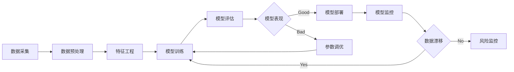

# 智能风控:大数据驱动的风险管控

作者：禅与计算机程序设计艺术

## 1.背景介绍
### 1.1 智能风控的概念
#### 1.1.1 风控的定义
#### 1.1.2 智能风控的定义
#### 1.1.3 智能风控的特点
### 1.2 智能风控的发展历程  
#### 1.2.1 传统风控模式
#### 1.2.2 大数据风控模式
#### 1.2.3 智能风控模式
### 1.3 智能风控的价值
#### 1.3.1 降低风险
#### 1.3.2 提高效率
#### 1.3.3 改善用户体验

## 2.核心概念与联系
### 2.1 大数据
#### 2.1.1 大数据的定义
#### 2.1.2 大数据的特点
#### 2.1.3 大数据在风控中的应用
### 2.2 机器学习
#### 2.2.1 机器学习的定义
#### 2.2.2 机器学习的分类
#### 2.2.3 机器学习在风控中的应用
### 2.3 人工智能
#### 2.3.1 人工智能的定义  
#### 2.3.2 人工智能的发展历程
#### 2.3.3 人工智能在风控中的应用
### 2.4 风控模型
#### 2.4.1 传统风控模型 
#### 2.4.2 机器学习风控模型
#### 2.4.3 深度学习风控模型

## 3.核心算法原理与具体操作步骤
### 3.1 逻辑回归(Logistic Regression)
#### 3.1.1 逻辑回归的原理
#### 3.1.2 逻辑回归的优缺点
#### 3.1.3 逻辑回归在风控中的应用 
### 3.2 决策树(Decision Tree)
#### 3.2.1 决策树的原理
#### 3.2.2 决策树的优缺点
#### 3.2.3 决策树在风控中的应用
### 3.3 随机森林(Random Forest) 
#### 3.3.1 随机森林的原理
#### 3.3.2 随机森林的优缺点 
#### 3.3.3 随机森林在风控中的应用
### 3.4 支持向量机(SVM)
#### 3.4.1 支持向量机的原理
#### 3.4.2 支持向量机的优缺点
#### 3.4.3 支持向量机在风控中的应用
### 3.5 神经网络(Neural Network)
#### 3.5.1 神经网络的原理
#### 3.5.2 神经网络的优缺点
#### 3.5.3 神经网络在风控中的应用

## 4.数学模型和公式详细讲解举例说明
### 4.1 逻辑回归模型
### 4.2 决策树模型  
### 4.3 随机森林模型
### 4.4 支持向量机模型
### 4.5 神经网络模型

## 5.项目实践：代码实例和详细解释说明
### 5.1 数据预处理
#### 5.1.1 数据清洗
#### 5.1.2 特征选择
#### 5.1.3 数据标准化
### 5.2 模型训练
#### 5.2.1 逻辑回归模型训练
#### 5.2.2 决策树模型训练
#### 5.2.3 随机森林模型训练 
#### 5.2.4 支持向量机模型训练
#### 5.2.5 神经网络模型训练
### 5.3 模型评估
#### 5.3.1 混淆矩阵
#### 5.3.2 ROC曲线
#### 5.3.3 KS曲线
### 5.4 模型优化
#### 5.4.1 参数调优
#### 5.4.2 特征工程 
#### 5.4.3 集成学习

## 6.实际应用场景 
### 6.1 银行信贷风控
### 6.2 保险欺诈识别
### 6.3 电商平台反作弊
### 6.4 互联网小贷风控
### 6.5 供应链金融风控

## 7.工具和资源推荐
### 7.1 Python库
#### 7.1.1 scikit-learn
#### 7.1.2 TensorFlow
#### 7.1.3 PyTorch
### 7.2 大数据平台
#### 7.2.1 Hadoop
#### 7.2.2 Spark 
#### 7.2.3 Flink
### 7.3 开源风控系统
#### 7.3.1 Apache Griffin
#### 7.3.2 Pulse
### 7.4 风控数据源
#### 7.4.1 企业工商数据
#### 7.4.2 司法诉讼数据
#### 7.4.3 个人信用数据

## 8.总结：未来发展趋势与挑战
### 8.1 智能风控的发展趋势
#### 8.1.1 模型深度化
#### 8.1.2 数据多元化 
#### 8.1.3 场景垂直化
### 8.2 智能风控面临的挑战
#### 8.2.1 数据安全与隐私保护
#### 8.2.2 模型公平性
#### 8.2.3 模型可解释性

## 9.附录：常见问题与解答 
### 9.1 如何解决数据不平衡问题？
### 9.2 如何缓解过拟合问题？
### 9.3 如何处理缺失值？
### 9.4 如何进行特征选择？ 
### 9.5 如何选择合适的模型？

风控是金融科技的核心领域之一,随着人工智能和大数据技术的快速发展,智能风控正在成为风险管理的新范式。智能风控利用大数据和机器学习技术,从海量异构数据中挖掘有效信息,构建高效准确的风险识别和评估模型,实现对风险的主动识别、量化评估和动态监控,大幅提升风控效率和风险防范能力。

智能风控的核心是风控模型,它决定了风控系统的性能。目前,逻辑回归、决策树、随机森林、支持向量机、神经网络等经典机器学习算法被广泛应用于风控建模。以逻辑回归为例,其数学模型可表示为:

$$
P(Y=1|X)=\frac{1}{1+e^{-(\beta_0+\sum_{i=1}^n\beta_iX_i)}}
$$

其中,$Y$表示风险事件是否发生,$X=(X_1,X_2,...,X_n)$为特征向量,$\beta=(\beta_0,\beta_1,...,\beta_n)$为模型参数。通过最大似然估计等方法,我们可以求解出最优参数,得到风险评分模型。逻辑回归模型简单高效,具有很好的可解释性,但其线性假设在处理复杂数据时捉襟见肘。

决策树通过递归地构建包含判断规则的树形结构,将样本从根结点分流到叶结点,叶结点对应着最终的分类或预测。决策树模型直观易懂,可解释性强,但容易产生过拟合。随机森林通过集成多棵决策树,在提高精度的同时降低了过拟合风险。

支持向量机通过寻找最优分类超平面,将不同类别的样本划分到超平面两侧的空间中,并最大化类间间隔。优化目标可描述为:

$$
\min_{w,b} \frac{1}{2}||w||^2 \\
s.t. \quad y_i(w^Tx_i+b) \geq 1, \quad i=1,2,...,m
$$

其中,$w$为超平面法向量,$b$为超平面截距,$y_i \in \{+1,-1\}$表示样本标签。支持向量机可以通过核技巧处理非线性问题,但对参数和核函数敏感,计算复杂度高。

神经网络受人脑神经元连接启发,通过多层感知器逐层提取特征并建立复杂映射关系。以两层神经网络为例:

$$
\begin{aligned}
z_j &= \sum_{i=1}^n w_{ji}^{(1)} x_i + b_j^{(1)} \\
a_j &= \sigma(z_j) \\
y_k &= \sum_{j=1}^m w_{kj}^{(2)} a_j + b_k^{(2)}
\end{aligned}
$$

其中,$x_i$为输入层神经元,$z_j$和$a_j$分别为隐藏层神经元的加权输入和激活值,$y_k$为输出层神经元,$w$和$b$为权重和偏置参数,$\sigma$为激活函数(如sigmoid)。通过反向传播算法,神经网络可以学习到高度非线性的特征组合。近年来,以卷积神经网络、循环神经网络为代表的深度学习模型在风控领域崭露头角,进一步释放了数据价值。

风控模型在应用落地时,还需要经过严谨的实验验证和迭代优化。以信用评分为例,整个建模流程可总结为:

在数据预处理阶段,我们需要进行数据清洗、缺失值处理、异常值检测等操作,提升数据质量。接着,通过特征选择、特征组合、特征降维等手段进行特征工程,挖掘数据价值。然后利用处理后的数据训练风控模型,并通过混淆矩阵、ROC曲线、KS曲线等指标评估模型性能。如果模型表现不佳,则需要返回上一步进行参数调优,直至达到预期效果。将训练好的模型部署到生产环境后,还需持续监控其性能,当出现数据分布漂移时及时重训练模型。模型监控与风险监控通过发现异常风险事件,形成风险防控的闭环。

智能风控在金融行业有着广泛应用,如银行信贷、保险反欺诈、消费金融、供应链金融等。以互联网小贷风控为例,业务流程涉及贷前审核、贷中管理、贷后催收等环节,在每个环节引入智能风控系统,可有效控制坏账风险,提高放款效率,改善资金周转。
 
未来,智能风控将朝着模型深度化、数据多元化、场景垂直化的方向发展。随着算法的不断突破,风控模型将进一步挖掘非结构化数据(如文本、图像)的价值。多源异构数据的融合利用,将极大拓宽风控模型的视野。针对不同业务场景定制专用风控模型,将成为提升风控价值的利器。

与此同时,智能风控也面临诸多挑战:海量数据的管理存储、数据隐私与安全、模型的公平性与可解释性等。随着《个人信息保护法》等法律法规的出台,合规将成为风控系统的底线要求。如何在保护隐私的前提下开展数据利用,是一大挑战。此外,由于训练数据和算法的偏差,模型可能产生歧视性结果,亟需从技术和伦理层面消除偏见。对于拒绝用户,还需给出可解释的原因,这对模型透明度提出了更高要求。

智能风控代表着风险管理的未来,但其健康可持续发展有赖于技术创新与行业规范的有机结合。在大数据时代,风控不仅是一项技术活,更是一门管理学问。唯有从数据治理、模型研发、流程优化、合规内控等方面系统发力,智能风控才能为行业赋能护航,实现降本增效、促进普惠的目标。

附录,就风控实践中的常见问题,提供一些经验之谈:

1. 如何解决数据不平衡问题?
可以采用过采样(如SMOTE)、欠采样(如EasyEnsemble)、代价敏感学习等策略,将正负样本的比例调整到合理水平,避免模型偏向多数类。

2. 如何缓解过拟合问题?
可以通过交叉验证、正则化、提前停止等方法控制模型复杂度;在特征工程中,使用嵌入式特征选择、L1正则化等方法,削减冗余特征;在模型集成时,通过Bagging、Boosting等方法,降低方差。

3. 如何处理缺失值?