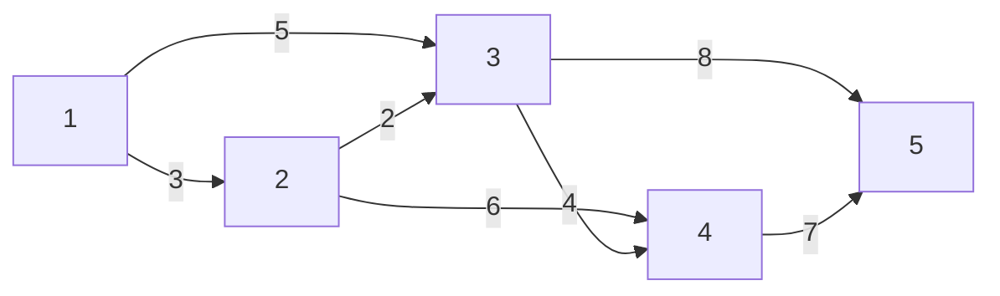

# 最短路径 原理与代码实例讲解

作者：禅与计算机程序设计艺术

## 1. 背景介绍

在实际生活和计算机应用中,我们经常会遇到寻找最短路径的问题。例如导航系统中找到从起点到终点的最短路线,网络中寻找两个节点之间的最短路径等。最短路径问题是图论和算法领域的经典问题之一,具有广泛的应用价值。

### 1.1 最短路径问题定义
最短路径问题可以这样定义:在一个加权有向图 $G=(V,E)$ 中,每条边 $(u,v)$ 都有一个非负的权值 $w(u,v)$,求解从起点 $s$ 到终点 $t$ 的所有路径中权值和最小的路径。

### 1.2 最短路径问题分类
最短路径问题主要分为以下几类:

- 单源最短路径(Single-Source Shortest Path,SSSP):求图中某一个源点到其他所有顶点的最短路径。
- 单对最短路径(Single-Pair Shortest Path):求图中某一对顶点之间的最短路径。
- 全源最短路径(All-Pairs Shortest Path,APSP):求图中任意两个顶点之间的最短路径。

### 1.3 最短路径的应用场景
最短路径算法在实际应用中有着广泛的应用,主要包括:

- 导航系统:如 Google Maps,高德地图等,利用最短路径算法为用户规划从起点到终点的最优路线。
- 网络路由:在计算机网络中,最短路径算法用于寻找网络节点之间传输数据的最优路径,如 OSPF 路由协议。
- 运输物流:在运输网络中,最短路径算法可用于寻找货物从源地到目的地的最优运输路线,以降低运输成本和时间。
- 社交网络:在社交网络中,最短路径算法可用于分析用户之间的最短关系链,预测潜在的社交关系等。

## 2. 核心概念与联系

本节我们将介绍与最短路径问题相关的一些核心概念,理解这些概念有助于更好地掌握最短路径算法。

### 2.1 图的基本概念
在讨论最短路径算法之前,我们首先回顾一下图论中的一些基本概念:

- 顶点(Vertex):图中的基本元素,通常用圆圈表示。
- 边(Edge):连接两个顶点,表示它们之间的关系。在有向图中用有向箭头表示,在无向图中用直线表示。
- 权重(Weight):边上的数值,表示从一个顶点到另一个顶点的代价。
- 路径(Path):由一系列顶点和边首尾相连构成的序列。
- 距离(Distance):从一个顶点到另一个顶点的最短路径长度。

### 2.2 最短路径的数学表示
设 $G=(V,E)$ 是一个加权有向图,其中 $V$ 表示顶点集合,$E$ 表示边集合。定义 $w(u,v)$ 为边 $(u,v)$ 的权值,表示从顶点 $u$ 到 $v$ 的代价。

对于顶点 $s$ 和 $t$,如果存在一条从 $s$ 到 $t$ 的路径 $p=\langle v_0,v_1,\cdots,v_k \rangle$,其中 $v_0=s,v_k=t$,则路径 $p$ 的长度定义为:

$$
length(p) = \sum_{i=1}^{k} w(v_{i-1},v_i)
$$

从顶点 $s$ 到 $t$ 的最短路径定义为:

$$
dist(s,t) = \min\{length(p) | p \text{ 是从 } s \text{ 到 } t \text{ 的路径}\}
$$

如果不存在从 $s$ 到 $t$ 的路径,则 $dist(s,t)=\infty$。

### 2.3 最短路径的性质
最短路径问题具有以下几个重要性质:

1. 无负环性质:如果图中不存在权值和为负的环,则图中任意两点间的最短路径必定存在。若存在负环,则最短路径不一定存在。

2. 最优子结构性质:最短路径问题满足最优子结构性质,即一条最短路径的子路径也必定是最短路径。利用这个性质,许多最短路径算法都使用了动态规划的思想。

3. 三角不等式:对于图中任意三个顶点 $u,v,w$,有 $dist(u,w) \leq dist(u,v) + dist(v,w)$。这个性质保证了许多最短路径算法的正确性。

## 3. 核心算法原理与具体操作步骤

最短路径问题是图论中的经典问题,历史上众多算法大师都对此问题进行了深入研究,提出了许多高效的算法。本节我们将重点介绍几种常见的最短路径算法,并分析其原理和操作步骤。

### 3.1 Dijkstra算法

Dijkstra算法是由荷兰计算机科学家狄克斯特拉(Edsger Dijkstra)于1956年提出的,是一种用于求解单源最短路径问题的贪心算法。

#### 3.1.1 基本思想
Dijkstra算法的基本思想是维护一个距离数组 $dist[]$,表示源点到每个顶点的最短距离。初始时,$dist[s]=0$,其余顶点的 $dist$ 值为无穷大。算法从源点开始,每次选择 $dist$ 值最小的未访问顶点 $u$,并将 $u$ 加入到最短路径树中。然后以 $u$ 为中介点,更新其邻居顶点 $v$ 的最短距离,即若 $dist[u]+w(u,v)<dist[v]$ 则更新 $dist[v]$。重复上述过程直到所有顶点都加入到最短路径树中。

#### 3.1.2 算法步骤
设 $G=(V,E)$ 是一个加权有向图,源点为 $s$。Dijkstra算法步骤如下:

1. 初始化距离数组 $dist[]$:

$$
dist[v] = \begin{cases} 
0 & v=s \\
\infty & v \neq s
\end{cases}
$$

2. 初始化最短路径树 $S=\emptyset$。

3. 重复以下步骤,直到所有顶点都加入到 $S$ 中:
   
   a. 从 $V-S$ 中选择 $dist$ 值最小的顶点 $u$,即:

   $$
   u = \arg\min_{v \in V-S} dist[v]
   $$
   
   b. 将顶点 $u$ 加入 $S$。
   
   c. 对 $u$ 的每个邻居顶点 $v \in V-S$,若 $dist[u]+w(u,v)<dist[v]$,则更新 $dist[v]$:

   $$
   dist[v] = dist[u] + w(u,v)
   $$

4. 算法结束,此时 $dist[v]$ 即为从源点 $s$ 到顶点 $v$ 的最短距离。

#### 3.1.3 算法分析
Dijkstra算法的时间复杂度取决于寻找 $dist$ 最小值的方式:

- 若使用线性查找,则时间复杂度为 $O(V^2+E)$。
- 若使用最小堆优化,则时间复杂度可降低至 $O((V+E)\log V)$。

算法的空间复杂度为 $O(V)$。

需要注意的是,Dijkstra算法要求图中不存在负权边。若存在负权边,则需要使用其他算法如 Bellman-Ford 算法。

### 3.2 Floyd算法

Floyd算法是一种用于求解全源最短路径问题的动态规划算法,由美国计算机科学家弗洛伊德(Robert Floyd)于1962年提出。

#### 3.2.1 基本思想
Floyd算法的基本思想是动态规划。设 $dist(i,j,k)$ 表示从顶点 $i$ 到顶点 $j$ 的只以编号不超过 $k$ 的点为中间顶点的最短路径长度。则 $dist(i,j,k)$ 可以从 $dist(i,j,k-1)$、$dist(i,k,k-1)$ 和 $dist(k,j,k-1)$ 递推而来。状态转移方程为:

$$
dist(i,j,k) = \min\{dist(i,j,k-1),dist(i,k,k-1) + dist(k,j,k-1)\}
$$

其中 $dist(i,j,0) = w(i,j)$。

#### 3.2.2 算法步骤

设 $G$ 是一个有 $n$ 个顶点的加权有向图,算法步骤如下:

1. 初始化距离矩阵 $dist[1..n][1..n]$:

$$
dist[i][j] = \begin{cases} 
w(i,j) & \text{if } i \neq j \text{ and } (i,j) \in E \\
0 & \text{if } i=j \\
\infty & \text{otherwise} 
\end{cases}
$$

2. 进行 $n$ 轮松弛操作。第 $k$ 轮松弛操作对所有顶点对 $(i,j)$ 进行如下松弛:
   
$$
dist[i][j] = \min\{dist[i][j],dist[i][k]+dist[k][j]\}
$$
   
3. 算法结束,此时 $dist[i][j]$ 即为顶点 $i$ 到 $j$ 的最短距离。若 $dist[i][i]<0$,则图中存在负环。

#### 3.2.3 算法分析
Floyd算法的时间复杂度为 $O(n^3)$,空间复杂度为 $O(n^2)$。Floyd算法可以处理带负权边的图,但不能处理带负环的图。

## 4. 数学模型与公式详解

本节我们将对最短路径问题建立数学模型,并详细解释相关的数学公式,通过实例帮助读者加深理解。

### 4.1 最短路径的线性规划模型
最短路径问题可以用线性规划来建模求解。设 $x_{ij}$ 为边 $(i,j)$ 的流量,即是否选择边 $(i,j)$ 作为最短路径的一部分。目标函数为最短路径的总长度,约束条件为流量平衡条件和变量取值范围。

$$
\begin{align}
\min & \sum_{(i,j)\in E} w(i,j)x_{ij} \\
\text{s.t.} & \sum_{j:(i,j)\in E} x_{ij} - \sum_{j:(j,i)\in E} x_{ji} = \begin{cases} 
1 & i=s \\
-1 & i=t \\
0 & \text{otherwise}
\end{cases} & \forall i \in V \\
& 0 \leq x_{ij} \leq 1 & \forall (i,j) \in E
\end{align}
$$

在此模型中,第一个约束条件表示流量平衡,即流入等于流出;第二个约束条件表示 $x$ 变量为0-1变量。求解该线性规划即可得到最短路径。

### 4.2 Bellman-Ford 算法的数学推导
Bellman-Ford 算法是一种基于松弛操作的单源最短路径算法,可以处理带负权边的情况。设 $dist(i,k)$ 表示从源点到顶点 $i$ 的经过不超过 $k$ 条边的最短路径长度。则 $dist(i,k)$ 满足以下递推关系:

$$
dist(i,k) = \min\{dist(i,k-1), \min_{(j,i)\in E}(dist(j,k-1)+w(j,i)) \}
$$

其中初始条件为:

$$
dist(i,0) = \begin{cases}
0 & i=s \\
\infty & i \neq s 
\end{cases}
$$

根据上述递推关系,可以证明算法在 $k=n-1$ 轮松弛后得到最短路径,若第 $n$ 轮松弛仍然有 $dist$ 值改变,则图中存在负环。

### 4.3 实例解释
下面我们通过一个具体例子来说明最短路径的数学模型和公式。考虑如下加权有向图,求顶点1到其他顶点的最短路径。

对应的线性规划模型为:

$$
\begin{align}
\min & 3x_{12}+5x_{13}+2x_{23}+6x_{24}+4x_{34}+8x_{35