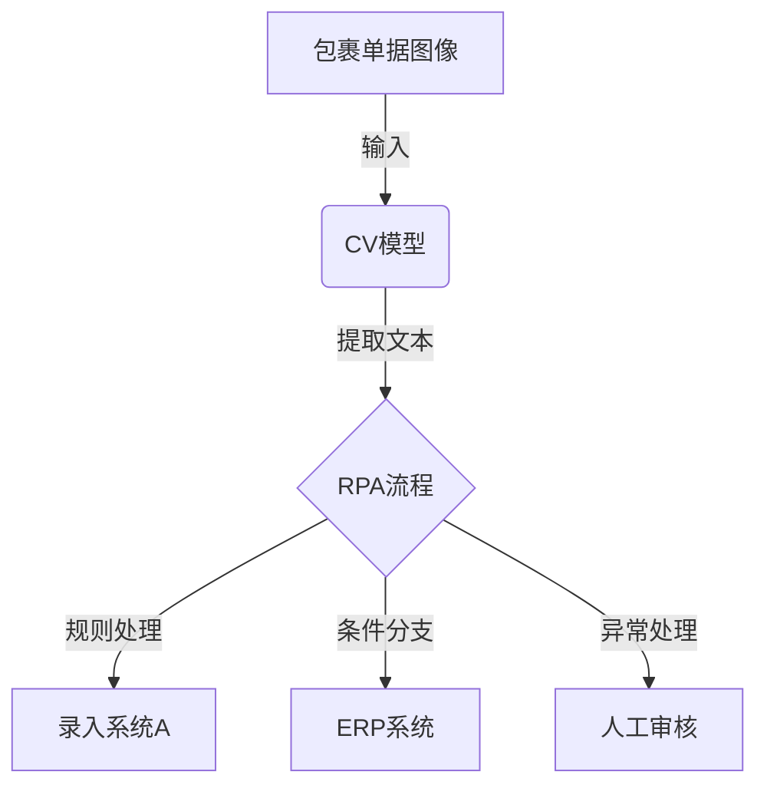

# 机器人进程自动化(RPA)与AI代理工作流的融合

## 1.背景介绍

### 1.1 机器人流程自动化(RPA)概述

机器人流程自动化(Robotic Process Automation, RPA)是一种利用软件机器人或人工智能工作手自动化完成一些传统由人工操作的规则驱动的重复性任务的技术。RPA可以捕获和解释应用程序的数据源,操作化应用程序的用户界面,连接应用程序等,从而实现流程自动化。

RPA主要应用于一些高度规则化、结构化的重复性工作,如数据录入、数据迁移、系统集成等。它可以模拟人工操作,从而减轻人工劳动强度,提高工作效率,降低人为操作失误的风险。

### 1.2 AI工作流自动化概述

AI工作流自动化是指利用人工智能技术,如机器学习、自然语言处理、计算机视觉等,对复杂、非结构化的业务流程进行智能化自动化处理。与RPA侧重于结构化重复性任务不同,AI工作流自动化主要关注非结构化、认知密集型的任务。

AI工作流自动化可应用于诸如文档处理、客户服务、决策支持等领域。它能够理解和处理非结构化数据,并基于机器学习算法做出智能决策,从而大幅提高工作效率和准确性。

### 1.3 RPA与AI工作流融合的必要性

单一的RPA或AI工作流自动化都存在一定局限性。RPA擅长处理高度结构化的重复性任务,但对于需要认知判断的复杂任务则力有未逮。而AI工作流自动化虽然可处理非结构化任务,但对于规则明确的重复性工作则相对低效。

将RPA与AI工作流技术相结合,可以发挥两者的互补优势,从而实现真正的智能化端到端自动化。RPA可以高效处理规则化流程,而AI则为非结构化环节提供认知智能支持,使整个自动化过程更加智能化、无缝化。

## 2.核心概念与联系  

### 2.1 RPA核心概念

**软件机器人**

RPA的核心是软件机器人(Software Robot),它可以模拟人的操作,执行各种应用程序的用户界面操作,如键盘输入、鼠标点击、数据抓取、系统集成等,从而实现流程自动化。

**流程建模与编排**

RPA需要先对业务流程进行建模,将整个流程拆解为一系列可执行的活动步骤,并对步骤进行编排和配置,最终生成可执行的自动化流程。

**触发器与规则引擎**

RPA流程可通过各种预定义的触发器(如文件夹监控、计划任务等)启动。规则引擎用于指导流程执行,根据预设条件和规则决定后续操作。

### 2.2 AI工作流核心概念 

**机器学习与深度学习**

AI工作流自动化的核心是机器学习和深度学习算法,用于从数据中学习,对非结构化输入做出智能判断和决策。常用算法包括监督学习、非监督学习、强化学习等。

**自然语言处理(NLP)** 

NLP技术能够让计算机理解和生成人类语言,在AI工作流中常用于文本理解、文本生成、情感分析等任务。

**计算机视觉(CV)**

CV技术赋予计算机理解和处理图像、视频等视觉信息的能力,在AI工作流中可用于图像识别、物体检测等。

### 2.3 RPA与AI工作流融合

RPA与AI工作流的融合,实际上是在传统RPA流程中嵌入AI能力,使流程能够处理非结构化输入并做出智能决策。

具体来说,可以在RPA流程中集成NLP、CV等AI组件,从而赋予流程理解非结构化数据的能力。同时,机器学习算法可驱动决策,指导后续的自动化操作。

通过RPA与AI的紧密结合,可实现真正的智能化自动化,不仅提高了自动化覆盖面,而且大幅提升了自动化质量和决策能力。

## 3.核心算法原理具体操作步骤

### 3.1 RPA流程建模

RPA流程建模是将业务流程抽象为一系列可执行的活动步骤的过程,主要包括以下步骤:

1. **流程分析**:深入分析业务流程,识别关键活动、决策点、数据流等要素。
2. **流程拆解**:将整个流程按功能或者逻辑拆解为一系列可执行的活动步骤。
3. **活动定义**:为每个活动步骤定义具体的操作,如应用程序操作、数据处理等。
4. **规则配置**:根据业务规则配置活动的执行条件和分支逻辑。
5. **数据映射**:定义活动之间的数据流转和映射关系。
6. **异常处理**:设计异常情况下的处理策略。

流程建模通常使用专用的流程设计工具,并基于可视化模型进行开发,从而提高流程的可维护性和可重用性。

### 3.2 AI组件集成

要将AI能力集成到RPA流程中,关键步骤包括:

1. **AI需求分析**:确定流程中需要AI支持的环节,如文本处理、图像识别等。
2. **AI模型选择**:根据需求选择合适的AI模型,如NLP模型、CV模型等。
3. **模型训练**:使用标注数据训练AI模型,以获得所需的预测能力。
4. **模型集成**:将训练好的AI模型以API或其他形式集成到RPA流程中。
5. **数据输入输出**:设计AI组件的输入输出接口,与上下游活动对接。
6. **结果处理**:对AI组件的预测结果进行后续处理,如规则匹配、决策执行等。

AI组件的集成需要RPA平台提供相应的支持和扩展能力。同时,也需要数据科学家和开发人员的紧密协作。

### 3.3 流程测试和优化

在上线之前,需要对融合了AI能力的RPA流程进行全面测试,包括功能测试、压力测试、异常测试等,以发现和修复潜在问题。

测试过程中需要:

1. **准备测试数据**:包括结构化和非结构化数据,覆盖各种可能的输入场景。
2. **制定测试用例**:设计不同的测试用例,模拟各种正常和异常情况。
3. **执行测试**:运行自动化测试,收集日志和结果数据。
4. **分析测试结果**:检查测试覆盖率,分析失败用例的根本原因。
5. **流程优化**:根据测试发现的问题,优化流程设计和AI模型。

测试和优化是一个迭代的过程,需要不断改进流程,以确保其稳定高效运行。

## 4.数学模型和公式详细讲解举例说明

在RPA与AI工作流的融合中,常常需要使用各种数学模型和算法,下面将详细介绍其中的一些核心模型。

### 4.1 监督学习

监督学习是机器学习的一种重要范式,其目标是从标注的训练数据中学习一个模型,对新的输入数据做出准确的预测。在AI工作流中,监督学习常用于文本分类、图像识别等任务。

**逻辑回归**

逻辑回归是一种经典的监督学习算法,常用于二分类问题。其数学模型为:

$$
P(Y=1|X) = \sigma(w^TX+b)
$$

其中:
- $X$为输入特征向量
- $w$为权重向量
- $b$为偏置项
- $\sigma(z)=\frac{1}{1+e^{-z}}$为Sigmoid函数

通过最大似然估计,可以学习得到最优参数$w$和$b$。预测时,若$P(Y=1|X)>0.5$,则预测为正类,否则为负类。

逻辑回归简单易用,常作为文本分类的基线模型。在AI工作流中,可用于自动化场景的文档分类等。

### 4.2 非监督学习

非监督学习旨在从未标注的数据中发现潜在模式和规律,在AI工作流中可用于数据聚类、异常检测等。

**K-Means聚类**

K-Means是一种常用的聚类算法,其目标是将$n$个样本数据划分为$k$个簇,使得簇内数据点之间的平方距离之和最小。算法步骤如下:

1) 随机选取$k$个聚类中心$\mu_1,\mu_2,...,\mu_k$
2) 对每个数据点$x_i$,计算其与$k$个聚类中心的距离,将其分配给最近的那一个聚类
3) 重新计算每个聚类的均值作为新的聚类中心
4) 重复2)、3)直至聚类中心不再变化

K-Means聚类简单高效,可用于AI工作流中的客户细分、异常检测等场景。

### 4.3 强化学习

强化学习是一种基于环境交互的学习范式,其目标是通过试错不断更新策略,以获得最大的累积奖励。在AI工作流自动化中,可用于决策优化等任务。

**Q-Learning**

Q-Learning是一种常用的无模型强化学习算法,能够从环境交互中直接学习一个最优的状态-行为值函数$Q(s,a)$,用于指导后续的决策。算法步骤如下:

1) 初始化$Q(s,a)$为任意值
2) 对每个episode:
    - 初始化状态$s$
    - 对每个时间步:
        - 选择一个行为$a$,通常使用$\epsilon$-贪婪策略
        - 执行行为$a$,获得奖励$r$,进入新状态$s'$
        - 根据贝尔曼方程更新$Q(s,a)$:
          $$Q(s,a) \leftarrow Q(s,a) + \alpha[r + \gamma\max_{a'}Q(s',a')-Q(s,a)]$$
        - 令$s \leftarrow s'$

通过上述迭代,Q函数将收敛到最优状态-行为值函数。在AI工作流中,可用于优化决策流程、路径规划等。

以上仅是数学模型的一个简单示例,在实际应用中还有许多其他复杂模型,需要根据具体场景和需求进行选择和设计。

## 5.项目实践:代码实例和详细解释说明

为了更好地理解RPA与AI工作流的融合,我们将通过一个实际项目案例进行代码级别的讲解。

### 5.1 项目背景

某物流公司需要自动化处理每日从多个渠道收到的快递包裹单据。传统流程是人工逐一识别和录入包裹信息,费时费力且容易出错。我们的目标是开发一个智能自动化系统,能够自动从包裹单据图像中提取关键信息,并与其他系统集成,实现高效、准确的包裹处理。

### 5.2 整体架构

该项目采用RPA与AI工作流相结合的架构,如下图所示:



我们首先使用计算机视觉(CV)模型从包裹单据图像中提取出文本信息,然后将提取结果输入到RPA流程中。RPA流程根据一系列预定义的规则和条件,执行不同的后续操作,如录入系统A、更新ERP系统、人工审核等。

### 5.3 CV模型

CV模型的任务是从包裹单据图像中准确提取出文本内容,作为RPA流程的输入。我们使用深度学习的OCR(Optical Character Recognition)模型来完成这一任务。

以下是使用Python和Keras框架实现的简化版OCR模型代码:

```python
from keras.models import Sequential
from keras.layers import Conv2D, MaxPooling2D, Flatten, Dense

# 构建CNN模型
model = Sequential()
model.add(Conv2D(32, (3, 3), activation='relu', input_shape=(64, 64, 1)))
model.add(MaxPooling2D((2, 2)))
model.add(Conv2D(64, (3, 3), activation='relu'))
model